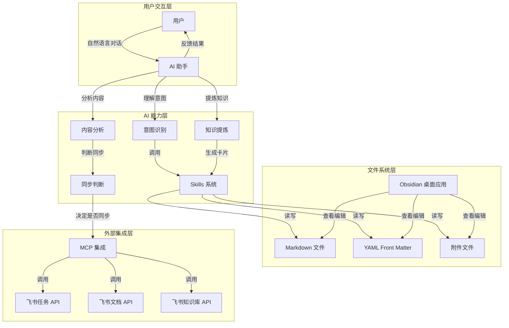

# 设计文档

## 概述

本设计文档描述了一个基于 Obsidian 的知识管理工作流程系统的实现方案。该系统采用 PARA + Zettelkasten 混合方法，专为程序员设计，支持技术知识管理、项目管理、日常记录和生活管理的统一工作流程。

系统的核心特点是通过 AI 对话驱动所有操作，用户只需与 AI 助手对话即可完成笔记创建、内容记录和飞书同步，无需手动操作文件系统或运行脚本。

### 核心设计原则

1. **对话驱动的交互模式**：所有操作通过与 AI 助手的自然语言对话完成，无需手动操作文件或运行脚本
2. **智能意图识别**：AI 助手理解用户意图，自动判断内容类型、选择模板、确定存储位置
3. **自动同步判断**：AI 助手根据内容特征智能判断是否需要同步到飞书，不确定时主动询问用户
4. **纯文件系统组织**：使用文件夹结构和文件命名规范实现内容组织，保持数据的可移植性
5. **Markdown 标准化**：使用标准 Markdown 语法和 YAML front matter 存储元数据
6. **Skills 系统集成**：使用 Skills 系统实现笔记操作、内容生成、知识提炼等功能
7. **MCP 集成**：通过 MCP (Model Context Protocol) 访问飞书 API，实现任务和文档的双向同步

### 系统边界

**包含的功能**：
- AI 对话驱动的笔记创建和管理
- 智能内容类型识别和模板选择
- 自动同步判断和飞书集成
- 任务中心的自动聚合和展示
- 知识卡片的智能提炼
- 飞书任务和文档的双向同步
- 同步冲突检测和处理

**不包含的功能**：
- Obsidian 插件开发
- 实时协作编辑
- 复杂的工作流引擎
- 移动端原生应用
- 独立的命令行工具或脚本

## 架构

### 系统架构图



### 架构分层说明

#### 1. 用户交互层
- **用户**：通过自然语言与 AI 助手对话，描述需要记录的内容或执行的操作
- **AI 助手**：理解用户意图，协调各层组件完成操作，向用户反馈结果和询问确认

#### 2. 文件系统层
- **Markdown 文件**：所有笔记内容以标准 Markdown 格式存储
- **YAML Front Matter**：存储元数据（标签、日期、同步状态等）
- **附件文件**：图片、PDF 等资源文件统一存储在 Attachments 文件夹
- **Obsidian 桌面应用**：作为 Markdown 查看器和编辑器，用户可以直接查看和编辑 AI 创建的笔记

#### 3. AI 能力层
- **Skills 系统**：提供文件操作、笔记创建、模板应用等基础能力
- **意图识别**：分析用户对话，识别用户想要执行的操作（创建笔记、记录任务、同步等）
- **内容分析**：提取关键信息（标题、日期、标签、优先级等），判断内容类型
- **同步判断**：根据内容特征智能判断是否需要同步到飞书，不确定时询问用户
- **知识提炼**：从日常笔记中提炼知识点，生成知识卡片，建立链接关系

#### 4. 外部集成层
- **MCP 集成**：通过 MCP (Model Context Protocol) 提供统一的飞书 API 访问接口
- **飞书任务 API**：创建、更新、查询飞书任务清单中的任务
- **飞书文档 API**：创建、更新、查询飞书文档
- **飞书知识库 API**：创建、更新、查询飞书知识库中的文档

### 技术栈选择

| 组件 | 技术选择 | 理由 |
|------|---------|------|
| 笔记编辑器 | Obsidian | 强大的 Markdown 支持、双向链接、图形视图 |
| AI 助手 | 支持 Skills 和 MCP 的 AI 工具 | 自然语言理解、对话管理、上下文记忆（如 Kiro、Claude Desktop 等） |
| 文件操作 | Skills 系统 | 笔记创建、文件读写、模板应用 |
| 飞书集成 | MCP (Model Context Protocol) | 统一的飞书 API 访问接口（如 lark-mcp） |
| 元数据格式 | YAML Front Matter | Markdown 标准、Obsidian 原生支持 |
| 配置格式 | JSON | 简单、易于解析、支持嵌套结构 |

**说明**：本系统设计为通用架构，可以与任何支持 Skills 系统和 MCP 集成的 AI 工具配合使用。推荐使用 Kiro 或 Claude Desktop，但不限于这些工具。

## 组件和接口

### 核心组件

系统采用 AI 对话驱动架构，所有组件通过 AI 助手协调工作。用户通过自然语言对话触发操作，AI 助手理解意图后调用相应组件完成任务。

#### 1. 对话理解引擎 (ConversationUnderstandingEngine)

**职责**：
- 理解用户的自然语言输入
- 识别用户意图（创建笔记、记录任务、同步、查询等）
- 提取关键信息（标题、日期、标签、优先级等）
- 管理对话上下文和状态

**核心能力**：
```
意图识别：
- 创建日常笔记
- 创建项目文档
- 记录会议内容
- 添加任务
- 创建知识卡片
- 同步到飞书
- 查询笔记或任务
- 生成回顾

信息提取：
- 标题和内容
- 日期和时间
- 标签和分类
- 优先级和负责人
- 项目和领域关联

上下文管理：
- 记住当前正在操作的笔记
- 记住用户的同步偏好
- 记住项目和领域信息
```

**交互示例**：
```
用户: "今天开了个会，讨论了新项目的技术方案"
AI 识别: 意图=创建会议记录, 日期=今天, 主题=技术方案讨论, 关联=新项目

用户: "这个任务很重要，下周五前要完成，让张三负责"
AI 提取: 优先级=#重要, 截止日期=下周五, 负责人=@张三

用户: "这个需要同步到飞书"
AI 识别: 意图=同步到飞书, 目标=当前笔记/任务
```

#### 2. 智能同步判断器 (SmartSyncDecisionMaker)

**职责**：
- 分析笔记内容特征
- 判断是否为工作相关内容
- 决定是否需要同步到飞书
- 不确定时询问用户确认

**判断规则**：
```
自动判断为工作内容（自动同步）：
- 包含项目标签 #project/工作项目名
- 包含工作领域标签 #area/工作领域
- 包含工作任务标签 #task/work
- 包含会议记录关键词
- 包含团队协作关键词
- 技术决策记录（ADR）

自动判断为私有内容（不同步）：
- 包含个人任务标签 #task/personal
- 包含生活领域标签 #area/生活领域
- 位于 1-Projects/Personal 路径下
- 包含敏感个人信息关键词

需要询问用户：
- 无明确特征的技术笔记
- 无明确特征的日常记录
- 混合工作和生活内容
```

**交互示例**：
```
场景1 - 自动判断：
用户: "记录一下今天的项目进展 #project/电商系统"
AI: "好的，我已经创建了项目进展记录。这是工作内容，我会自动同步到飞书。"

场景2 - 询问确认：
用户: "学习了 React Hooks 的使用"
AI: "我已经创建了学习笔记。这个内容是否需要同步到飞书？"
用户: "不用，这是个人学习"
AI: "好的，已标记为私有内容。"

场景3 - 自动排除：
用户: "记录一下今天的健身计划 #area/健康"
AI: "好的，我已经创建了健身计划记录。这是私有内容，不会同步到飞书。"
```

#### 3. 笔记创建器 (NoteCreator)

**职责**：
- 根据内容类型选择合适的模板
- 填充模板变量
- 确定存储位置
- 创建笔记文件
- 添加元数据和标签

**支持的笔记类型**：
```
- 日常笔记 (Daily Note)
- 项目文档 (Project Document)
- 会议记录 (Meeting Note)
- 技术知识卡片 (Knowledge Card)
- 代码片段 (Code Snippet)
- 技术决策记录 (ADR)
- 问题解决记录 (Problem Solving)
- 周回顾 (Weekly Review)
- 月回顾 (Monthly Review)
```

**创建流程**：
```
1. AI 识别内容类型
2. 选择对应模板
3. 提取关键信息填充模板
4. 确定存储路径
5. 创建文件并写入内容
6. 添加 YAML front matter
7. 添加标签和链接
8. 向用户确认创建结果
```

**交互示例**：
```
用户: "今天开会讨论了数据库迁移方案，参与者有张三、李四，决定使用 PostgreSQL"
AI: "我已经创建了会议记录：
- 标题：数据库迁移方案讨论
- 时间：2024-01-15 14:00
- 参与者：张三、李四
- 决策：使用 PostgreSQL
- 位置：0-Daily/2024/01/2024-01-15.md
是否需要补充其他信息？"
```

#### 4. 任务管理器 (TaskManager)

**职责**：
- 扫描所有 Markdown 文件中的任务
- 按类型和状态分类任务
- 生成任务中心文档
- 支持通过对话查询任务

**任务操作**：
```
创建任务：
用户: "添加一个任务：完成设计文档，下周五前，重要"
AI: 创建任务并添加到当前笔记或任务中心

查询任务：
用户: "今天有哪些任务？"
AI: 列出今日任务列表

更新任务：
用户: "把刚才那个任务标记为完成"
AI: 更新任务状态

分类任务：
- 个人任务 (#task/personal)
- 工作任务 (#task/work)
- 项目任务 (#task/project/项目名)
```

**Task 数据结构**：
```python
@dataclass
class Task:
    content: str              # 任务内容
    completed: bool           # 是否完成
    file_path: str           # 所在文件路径
    line_number: int         # 行号
    due_date: Optional[str]  # 截止日期
    assignee: Optional[str]  # 负责人
    priority: List[str]      # 优先级标签
    tags: List[str]          # 所有标签
    category: str            # 任务类型：personal/work/project
    project_name: Optional[str]  # 项目名称（如果是项目任务）
```

#### 5. 飞书同步引擎 (FeishuSyncEngine)

**职责**：
- 管理与飞书平台的双向同步
- 通过 MCP 调用飞书 API
- 处理同步冲突
- 维护同步状态
- 支持通过对话触发同步

**同步操作**：
```
同步任务到飞书：
- 创建飞书任务
- 更新任务元数据（feishu_task_id、last_sync等）
- 更新同步状态标签

同步文档到飞书：
- 转换 Markdown 为飞书格式
- 上传图片到飞书
- 创建飞书文档
- 更新文档元数据

从飞书同步：
- 查询飞书任务/文档变更
- 更新 Obsidian 中的对应内容
- 检测冲突

冲突处理：
- 比较修改时间
- 标记冲突状态
- 询问用户选择解决方案
```

**交互示例**：
```
用户: "把这个任务同步到飞书"
AI: "好的，我已经将任务同步到飞书任务清单。
飞书链接：https://feishu.cn/task/12345
同步时间：2024-01-15 15:30"

用户: "飞书上的任务有更新吗？"
AI: "我检查了一下，有 2 个任务在飞书上被更新了：
1. '完成设计文档' 已标记为完成
2. '代码审查' 的截止日期改为明天
是否同步这些更新到 Obsidian？"
```

**SyncResult 数据结构**：
```python
@dataclass
class SyncResult:
    success: bool
    message: str
    feishu_id: Optional[str]
    feishu_url: Optional[str]
    sync_time: datetime
    error: Optional[str]
```

#### 6. 知识卡片提炼器 (KnowledgeExtractor)

**职责**：
- 从日常笔记中识别值得保留的知识点
- 生成知识卡片
- 建立知识卡片之间的链接
- 支持通过对话触发提炼

**提炼流程**：
```
1. 分析日常笔记内容
2. 识别独立的知识点
3. 为每个知识点生成卡片
4. 建议相关卡片链接
5. 在原笔记中添加卡片链接
```

**交互示例**：
```
用户: "从今天的笔记中提炼知识卡片"
AI: "我分析了今天的笔记，发现 3 个值得保留的知识点：
1. React Hooks 闭包陷阱
2. useEffect 依赖数组的最佳实践
3. 自定义 Hook 的设计模式
是否为这些知识点创建卡片？"

用户: "创建前两个"
AI: "好的，我已经创建了 2 个知识卡片：
- React-Hooks-闭包陷阱.md
- useEffect-依赖数组最佳实践.md
并在今天的笔记中添加了链接。"
```

#### 7. 回顾生成器 (ReviewGenerator)

**职责**：
- 生成周回顾和月回顾
- 聚合相关日常笔记
- 使用 AI 生成总结
- 支持通过对话触发生成

**生成流程**：
```
1. 收集时间范围内的日常笔记
2. 提取关键内容和任务
3. 使用 AI 生成总结
4. 创建回顾文档
5. 添加链接到原始笔记
```

**交互示例**：
```
用户: "生成本周的周回顾"
AI: "我已经收集了本周的 5 篇日常笔记，正在生成周回顾...
完成！本周回顾已创建：
- 完成了 3 个项目任务
- 学习了 React 高级特性
- 参加了 2 次技术会议
- 解决了 5 个技术问题
详细内容已保存到：0-Daily/Weekly-Reviews/2024-W03.md"
```

#### 8. 自我改进管理器 (SelfImprovementManager)

**职责**：
- 记录用户指出的问题和正确做法
- 存储用户偏好和习惯
- 在后续操作中应用改进记录
- 支持查询、修改和删除改进记录

**改进记录类型**：
```
1. 同步判断偏好
   - 特定类型内容的同步规则
   - 关键词识别规则

2. 笔记创建习惯
   - 模板选择偏好
   - 文件命名规范
   - 标签使用习惯

3. 任务管理偏好
   - 任务分类规则
   - 默认负责人
   - 优先级判断标准

4. 知识提炼偏好
   - 知识点识别标准
   - 卡片创建时机
   - 链接建立规则

5. 工作流程偏好
   - 特定操作的默认行为
   - 确认询问的频率
```

**改进记录格式**：
```markdown
## 改进记录

### 2024-01-15: 技术学习笔记的同步规则

**问题描述**：
AI 询问"学习了 React Hooks"是否需要同步到飞书，但这类个人学习内容不应该同步。

**正确做法**：
- 所有标记为"学习"的技术笔记默认为私有内容
- 除非明确包含项目标签或工作领域标签
- 不再询问用户，直接标记为 #private

**适用场景**：
- 技术学习笔记
- 个人技能提升相关内容

**示例**：
- "学习了 React Hooks" → 私有
- "学习了 React Hooks 用于项目 A" → 询问用户
```

**交互示例**：
```
场景1 - 用户指出问题：
用户: "你刚才问我技术学习笔记是否要同步到飞书，这类内容都是私有的，以后不用问了"
AI: "明白了！我已经记录下来：
    - 技术学习笔记默认为私有内容
    - 不再询问是否同步
    以后遇到类似内容会自动标记为私有。"

场景2 - 用户提供偏好：
用户: "创建项目任务时，如果没有指定负责人，默认分配给我"
AI: "好的，已记录你的偏好。以后创建项目任务时，如果没有明确负责人，会自动分配给你。"

场景3 - 查询改进记录：
用户: "查看我的改进记录"
AI: "你有 5 条改进记录：
    1. 技术学习笔记默认私有（2024-01-15）
    2. 项目任务默认负责人（2024-01-16）
    3. 会议记录自动同步到飞书（2024-01-17）
    4. 知识卡片使用中文标题（2024-01-18）
    5. 任务截止日期默认为本周五（2024-01-19）"

场景4 - 修改改进记录：
用户: "修改第 2 条记录，改为默认分配给张三"
AI: "已更新：项目任务默认负责人改为张三。"

场景5 - 应用改进记录：
用户: "学习了 TypeScript 泛型"
AI: "已记录到学习板块。根据你的偏好，技术学习笔记已自动标记为私有。"
```

**存储位置**：
- **主流程文件**：`.kiro/steering/obsidian-km-workflow.md`
  - 包含核心工作流程说明
  - 包含 PARA 结构规范
  - 包含交互规范和标签系统
  - 引用改进记录文件
- **改进记录文件**：`.kiro/steering/obsidian-km-improvements.md`
  - 只包含用户的改进记录
  - 由 AI 自动维护
  - 用户可以手动编辑
- **文件引用**：主流程文件通过 `#[[file:.kiro/steering/obsidian-km-improvements.md]]` 引用改进记录
- **自动加载**：AI 助手启动时自动读取两个文件

**文件职责分离**：

| 文件 | 内容 | 更新频率 | 作用 |
|------|------|---------|------|
| workflow.md | 通用流程说明 | 很少 | 指导 AI 的基本行为 |
| improvements.md | 用户偏好记录 | 频繁 | 个性化 AI 的行为 |

**ImprovementRecord 数据结构**：
```python
@dataclass
class ImprovementRecord:
    id: str                      # 唯一标识
    date: datetime               # 记录日期
    category: str                # 类型：sync/note/task/knowledge/workflow
    problem: str                 # 问题描述
    solution: str                # 正确做法
    context: str                 # 适用场景
    examples: List[str]          # 示例
    enabled: bool                # 是否启用
```

### 对话式交互接口

所有功能通过与 AI 助手的自然语言对话触发，无需记忆命令或参数。

**交互模式**：
```
创建笔记：
"记录一下今天的工作"
"开了个会，讨论了..."
"学习了 React Hooks"

管理任务：
"添加任务：完成设计文档"
"今天有哪些任务？"
"把这个任务标记为完成"

同步操作：
"这个需要同步到飞书"
"检查飞书上的更新"
"把所有待同步的内容同步到飞书"

查询操作：
"查找关于 React 的笔记"
"最近一周的会议记录"
"项目 A 的所有任务"

知识管理：
"从今天的笔记中提炼知识卡片"
"生成本周的周回顾"
"归档已完成的项目"

自我改进：
"记住这个偏好：技术学习笔记都是私有的"
"以后创建任务时默认分配给我"
"查看我的改进记录"
"修改第 3 条改进记录"
```

## 数据模型

### 文件夹结构

```
vault-root/
├── 0-Daily/                    # 日常笔记
│   ├── 2024/
│   │   ├── 01/
│   │   │   ├── 2024-01-01.md
│   │   │   ├── 2024-01-02.md
│   │   │   └── ...
│   │   ├── 02/
│   │   └── ...
│   ├── Weekly-Reviews/
│   │   └── 2024-W01.md
│   └── Monthly-Reviews/
│       └── 2024-01.md
├── 1-Projects/                 # 项目
│   ├── Work/
│   │   ├── ProjectA/
│   │   │   ├── README.md
│   │   │   ├── .feishu-sync.json
│   │   │   └── tasks.md
│   │   └── ProjectB/
│   └── Personal/
│       ├── 买房计划/
│       └── 装修项目/
├── 2-Areas/                    # 领域
│   ├── Work/
│   │   ├── 技术管理/
│   │   └── 团队协作/
│   └── Life/
│       ├── 健康/
│       └── 财务/
├── 3-Resources/                # 资源
│   ├── Tech/
│   │   ├── Knowledge-Cards/
│   │   │   ├── React-Hooks-闭包陷阱.md
│   │   │   └── ...
│   │   ├── Code-Snippets/
│   │   │   ├── Python-装饰器模式.md
│   │   │   └── ...
│   │   ├── ADR/
│   │   │   ├── ADR-0001-选择React作为前端框架.md
│   │   │   └── ...
│   │   └── Problem-Solving/
│   │       ├── 解决CORS跨域问题.md
│   │       └── ...
│   └── Life/
│       ├── 理财知识/
│       └── 健康管理/
├── 4-Archives/                 # 归档
│   ├── 2023/
│   │   ├── ProjectX/
│   │   └── ProjectY/
│   └── 2024/
├── Attachments/                # 附件
│   ├── images/
│   ├── pdfs/
│   └── others/
├── Templates/                  # 模板文件夹
│   ├── daily-note.md
│   ├── project.md
│   ├── meeting.md
│   └── ...
├── 任务中心.md                 # 任务中心
├── 飞书同步中心.md             # 飞书同步中心
└── .obsidian-km/              # 配置文件夹
    ├── config.json
    └── feishu-credentials.json
```

### YAML Front Matter 规范

#### 日常笔记

```yaml
---
date: 2024-01-15
day_of_week: 星期一
tags:
  - daily
prev: "[[2024-01-14]]"
next: "[[2024-01-16]]"
---
```

#### 项目文档

```yaml
---
title: 项目名称
type: project
category: work  # work 或 personal
status: 进行中  # 进行中/已完成/暂停
start_date: 2024-01-01
due_date: 2024-03-31
tags:
  - project/项目名称
  - 重要
created: 2024-01-01
modified: 2024-01-15
---
```

#### 知识卡片

```yaml
---
title: React Hooks 闭包陷阱
type: knowledge-card
tags:
  - 技术/前端/React
  - 技术/JavaScript
created: 2024-01-15
source: "[[2024-01-15]]"
related:
  - "[[React-Hooks-最佳实践]]"
  - "[[JavaScript-闭包原理]]"
---
```

#### 飞书同步文档

```yaml
---
title: 技术方案文档
feishu_sync:
  platform: feishu
  doc_type: doc  # doc/wiki/sheet
  feishu_doc_id: "doccnXXXXXXXXXXXXXXXXXXXXXX"
  feishu_folder: "/技术文档/方案设计"
  sync_mode: bidirectional  # bidirectional/obsidian_to_feishu/feishu_to_obsidian
  auto_sync: true
  last_sync: 2024-01-15T10:30:00
  sync_status: synced  # synced/pending/error/conflict
tags:
  - sync/feishu-doc
  - 技术
---
```

#### 任务元数据（在任务行内）

```markdown
- [ ] 完成技术方案设计 📅 2024-01-20 @张三 #重要 #project/ProjectA #sync/feishu
  - feishu_task_id: task_xxxxx
  - last_sync: 2024-01-15T10:00:00
  - sync_status: synced
```

### 飞书同步配置文件

#### 项目级配置 (.feishu-sync.json)

```json
{
  "project_name": "ProjectA",
  "feishu_tasklist_id": "tasklist_xxxxx",
  "feishu_tasklist_url": "https://feishu.cn/...",
  "sync_enabled": true,
  "sync_mode": "bidirectional",
  "grouping_mode": "custom",
  "custom_groups": [
    {
      "name": "需求分析",
      "feishu_group_id": "group_001"
    },
    {
      "name": "开发任务",
      "feishu_group_id": "group_002"
    },
    {
      "name": "测试任务",
      "feishu_group_id": "group_003"
    }
  ],
  "default_group": "未分组",
  "field_mapping": {
    "title": "任务标题",
    "description": "任务描述",
    "due_date": "截止日期",
    "assignee": "负责人",
    "priority": "优先级",
    "status": "状态"
  },
  "last_sync": "2024-01-15T10:00:00",
  "created": "2024-01-01T00:00:00"
}
```

#### 全局配置 (.obsidian-km/config.json)

```json
{
  "vault_path": "/path/to/vault",
  "templates_path": "Templates",
  "daily_notes_path": "0-Daily",
  "projects_path": "1-Projects",
  "areas_path": "2-Areas",
  "resources_path": "3-Resources",
  "archives_path": "4-Archives",
  "attachments_path": "Attachments",
  "task_center_path": "任务中心.md",
  "feishu_sync_center_path": "飞书同步中心.md",
  "auto_sync_interval": 300,
  "date_format": "YYYY-MM-DD",
  "time_format": "HH:mm:ss"
}
```

#### 飞书凭证配置 (.obsidian-km/feishu-credentials.json)

```json
{
  "app_id": "cli_xxxxxxxxxxxxx",
  "app_secret": "xxxxxxxxxxxxxxxxxxxxx",
  "tenant_access_token": "",
  "token_expires_at": "",
  "api_base_url": "https://open.feishu.cn/open-apis"
}
```

### 标签系统规范

#### 主题标签
- `#技术`：技术相关内容
  - `#技术/前端`、`#技术/后端`、`#技术/DevOps`
  - `#技术/前端/React`、`#技术/前端/Vue`
- `#工作`：工作相关内容
- `#生活`：生活相关内容
- `#学习`：学习相关内容

#### 状态标签
- `#进行中`：正在进行的任务或项目
- `#已完成`：已完成的任务或项目
- `#待办`：待办事项

#### 优先级标签
- `#重要`：重要事项
- `#紧急`：紧急事项

#### 项目和领域标签
- `#project/项目名称`：关联到特定项目
- `#area/领域名称`：关联到特定领域

#### 任务分类标签
- `#task/personal`：个人任务
- `#task/work`：工作任务
- `#task/project/项目名称`：项目任务

#### 同步标签
- `#sync/feishu`：需要同步到飞书任务
- `#sync/feishu-doc`：需要同步到飞书文档
- `#sync/feishu-wiki`：需要同步到飞书知识库
- `#synced/feishu`：已同步
- `#sync-error/feishu`：同步失败
- `#sync-conflict/feishu`：同步冲突
- `#private`：私有内容，不同步

#### 分组标签
- `#group/分组名称`：任务所属的自定义分组

### 文件命名规范

#### 日常笔记
- 格式：`YYYY-MM-DD.md`
- 示例：`2024-01-15.md`

#### 周回顾
- 格式：`YYYY-Wnn.md`（nn 为周数）
- 示例：`2024-W03.md`

#### 月回顾
- 格式：`YYYY-MM.md`
- 示例：`2024-01.md`

#### 项目文档
- 主文档：`README.md`
- 任务文档：`tasks.md`
- 会议记录：`meetings/YYYY-MM-DD-会议主题.md`

#### 知识卡片
- 格式：描述性标题（中文或英文）
- 示例：`React-Hooks-闭包陷阱.md`、`Python-装饰器模式.md`

#### 代码片段
- 格式：`语言-功能描述.md`
- 示例：`Python-文件批量重命名.md`

#### ADR
- 格式：`ADR-NNNN-决策标题.md`
- 示例：`ADR-0001-选择React作为前端框架.md`

#### 问题解决记录
- 格式：`解决-问题简述.md`
- 示例：`解决-CORS跨域问题.md`


## 正确性属性

*属性是一个特征或行为，应该在系统的所有有效执行中保持为真——本质上是关于系统应该做什么的形式化陈述。属性作为人类可读规范和机器可验证正确性保证之间的桥梁。*

基于需求文档中的验收标准，我们识别出以下可通过属性测试验证的正确性属性。这些属性使用通用量化（"对于任意"或"对于所有"），确保系统在各种输入下的正确行为。

### 属性 1: AI 意图识别准确性

*对于任意*包含明确操作意图的用户输入（如"创建笔记"、"添加任务"、"同步到飞书"），AI 助手应该正确识别用户意图并选择对应的操作类型

**验证需求: 18.1, 18.2**

### 属性 2: 内容类型自动判断

*对于任意*用户描述的内容，AI 助手应该根据内容特征自动判断类型（日常笔记、项目任务、会议记录、技术笔记等）并选择合适的模板

**验证需求: 18.2, 18.3**

### 属性 3: 关键信息提取完整性

*对于任意*包含结构化信息的用户输入（标题、日期、标签、优先级、负责人），AI 助手应该正确提取所有明确提及的关键信息

**验证需求: 18.4**

### 属性 4: 工作内容自动识别

*对于任意*包含明确工作特征的内容（项目标签、工作领域标签、工作任务标签、会议记录关键词），AI 助手应该自动识别为工作相关内容并标记为需要同步

**验证需求: 19.2, 19.3**

### 属性 5: 私有内容自动识别

*对于任意*包含明确私有特征的内容（个人任务标签、生活领域标签、个人项目路径、敏感个人信息），AI 助手应该自动识别为私有内容并标记为 #private

**验证需求: 19.7**

### 属性 6: 不确定内容询问机制

*对于任意*无明确工作或私有特征的内容，AI 助手应该主动询问用户是否需要同步到飞书

**验证需求: 19.4**

### 属性 7: 用户确认后的同步标记

*对于任意*用户确认需要同步的内容，AI 助手应该标记为需要同步（#sync/feishu 或 #sync/feishu-doc）并执行同步操作

**验证需求: 19.5**

### 属性 8: 日期文件夹路径生成

*对于任意*日期，当创建日常笔记时，生成的文件路径应该遵循 `0-Daily/YYYY/MM/YYYY-MM-DD.md` 格式

**验证需求: 1.5, 2.1**

### 属性 9: 日常笔记导航链接

*对于任意*日期的日常笔记，应该包含指向前一天和后一天笔记的正确导航链接

**验证需求: 2.6**

### 属性 10: 项目文件夹创建

*对于任意*项目名称和项目类型（work/personal），创建项目文件夹后应该在正确的路径下存在该文件夹

**验证需求: 3.4, 3.5**

### 属性 11: 周回顾日期范围链接聚合

*对于任意*周的开始日期，生成的周回顾应该包含该周所有存在的日常笔记的链接

**验证需求: 12.3**

### 属性 12: 月回顾日期范围链接聚合

*对于任意*年份和月份，生成的月回顾应该包含该月所有存在的周回顾的链接

**验证需求: 12.4**

### 属性 13: 回顾文件路径生成

*对于任意*周回顾或月回顾，生成的文件应该存储在 `0-Daily` 文件夹的相应子文件夹中

**验证需求: 12.5**

### 属性 14: 项目归档路径生成

*对于任意*项目，当归档时，项目文件夹应该移动到 `4-Archives/YYYY/` 路径下（YYYY 为当前年份）

**验证需求: 13.1, 13.4**

### 属性 15: 归档保持内容完整性

*对于任意*项目，归档前后的文件内容（包括链接和标签）应该保持完全一致

**验证需求: 13.2**

### 属性 16: 归档添加元数据

*对于任意*归档的项目，其 YAML front matter 应该包含归档日期字段

**验证需求: 13.3**

### 属性 17: 任务分类和统计

*对于任意*任务集合，任务中心应该正确地将任务分类为个人任务、工作任务和项目任务，并计算每个类别的数量

**验证需求: 17.6, 17.7, 17.8**

### 属性 18: 飞书任务同步数据完整性

*对于任意*标记为 `#sync/feishu` 的任务，通过 MCP 同步到飞书后，飞书任务应该包含所有指定的字段（标题、描述、截止日期、负责人、优先级、完成状态）

**验证需求: 20.4**

### 属性 19: 飞书任务双向同步一致性

*对于任意*已同步的任务，当在 Obsidian 中更新后，通过 MCP 同步到飞书的对应任务应该反映相同的更新；当在飞书中更新后，同步回 Obsidian 的对应任务也应该反映相同的更新

**验证需求: 21.2, 21.3**

### 属性 20: 同步元数据记录

*对于任意*同步的任务或文档，应该在 YAML front matter 或任务行内记录完整的同步元数据（feishu_id、last_sync、sync_status、feishu_url）

**验证需求: 20.6, 21.4**

### 属性 21: 项目任务清单关联

*对于任意*项目，该项目下所有标记为 `#sync/feishu` 的任务应该同步到同一个飞书任务清单（由项目配置文件中的 feishu_tasklist_id 指定）

**验证需求: 21.9, 21.10**

### 属性 22: 任务分组同步

*对于任意*带有 `#group/分组名` 标签的任务，同步到飞书后应该出现在对应的自定义分组中

**验证需求: 21.14**

### 属性 23: Markdown 到飞书格式转换

*对于任意*包含标准 Markdown 元素（标题、列表、代码块、表格、链接）的文档，通过 MCP 转换为飞书格式后应该保持内容的语义等价性

**验证需求: 22.2**

### 属性 24: 飞书文档双向同步一致性

*对于任意*配置为双向同步的文档，当在任一端更新后，另一端应该反映相同的内容更新

**验证需求: 22.8, 22.9**

### 属性 25: 同步冲突检测

*对于任意*已同步的任务或文档，当 Obsidian 和飞书两端都有修改时，系统应该检测到冲突并标记为 `#sync-conflict/feishu`

**验证需求: 22.10, 22.11, 22.12**

### 属性 26: 同步中心状态聚合

*对于任意*时刻，飞书同步中心应该正确地聚合和分类所有同步项（待同步、已同步、同步失败），并计算准确的统计数量

**验证需求: 23.2, 23.3, 23.4, 23.5, 23.7**

### 属性 27: AI 对话中的笔记创建确认

*对于任意*通过 AI 对话创建的笔记，AI 助手应该向用户确认笔记内容和位置

**验证需求: 18.7**

### 属性 28: AI 对话中的同步前说明

*对于任意*即将执行的同步操作，AI 助手应该在执行前向用户说明将要同步的内容和目标位置

**验证需求: 19.10**

## 错误处理

### 文件系统错误

**场景**: 文件或文件夹操作失败（权限不足、磁盘空间不足、路径不存在等）

**处理策略**:
- AI 助手捕获文件系统异常
- 向用户说明错误原因和建议的解决方案
- 不修改任何文件状态，保持原子性
- 记录详细的错误日志用于调试

**交互示例**:
```
AI: "抱歉，无法创建笔记文件。原因：磁盘空间不足。
建议：请清理一些磁盘空间后重试。"

AI: "无法访问项目文件夹。原因：权限不足。
建议：请检查文件夹权限设置。"
```

### 飞书 API 错误

**场景**: 通过 MCP 调用飞书 API 失败（网络错误、认证失败、限流、数据格式错误等）

**处理策略**:
- AI 助手实现自动重试机制（最多 3 次）
- 区分可重试错误（网络超时、限流）和不可重试错误（认证失败、数据格式错误）
- 向用户说明错误原因和建议的解决方案
- 更新同步状态为 `sync-error` 并记录错误信息
- 对于认证错误，提示用户检查 MCP 配置

**交互示例**:
```
AI: "同步到飞书时遇到网络超时，正在重试...（第 1 次）"

AI: "抱歉，无法同步到飞书。原因：飞书 API 认证失败。
建议：请检查 MCP 的 app_id 和 app_secret 配置是否正确。"

AI: "飞书 API 限流中，将在 30 秒后自动重试。"
```

### 同步冲突

**场景**: Obsidian 和飞书两端同时修改了同一内容

**处理策略**:
- AI 助手检测到冲突后立即通知用户
- 向用户说明冲突的具体内容和修改时间
- 提供三种解决方案供用户选择
- 标记为 `#sync-conflict/feishu` 并暂停自动同步
- 在飞书同步中心显示冲突项

**交互示例**:
```
AI: "检测到同步冲突：任务'完成设计文档'在 Obsidian 和飞书上都被修改了。

Obsidian 版本（2024-01-15 14:30）：
- 状态：进行中
- 截止日期：2024-01-20

飞书版本（2024-01-15 14:35）：
- 状态：已完成
- 截止日期：2024-01-22

请选择：
1. 保留 Obsidian 版本（覆盖飞书）
2. 保留飞书版本（覆盖 Obsidian）
3. 手动合并（我会创建冲突副本供你处理）"

用户: "保留飞书版本"
AI: "好的，已使用飞书版本更新 Obsidian 中的任务。"
```

### 意图识别失败

**场景**: AI 助手无法理解用户的输入或识别用户意图

**处理策略**:
- 向用户说明无法理解的原因
- 询问用户更多细节或换一种方式描述
- 提供可能的操作建议
- 保持对话上下文，避免用户重复输入

**交互示例**:
```
用户: "那个东西需要改一下"
AI: "抱歉，我不太确定你指的是哪个内容。你是想：
1. 修改刚才创建的笔记？
2. 更新某个任务？
3. 修改项目信息？
请告诉我更多细节。"

用户: "刚才的会议记录"
AI: "明白了，你想修改刚才创建的会议记录。请告诉我需要修改什么内容。"
```

### 信息提取不完整

**场景**: 用户提供的信息不足以完成操作

**处理策略**:
- AI 助手识别缺失的关键信息
- 主动询问用户补充信息
- 提供默认值或建议
- 允许用户稍后补充信息

**交互示例**:
```
用户: "添加一个任务"
AI: "好的，请告诉我任务的内容。"

用户: "完成设计文档"
AI: "任务已创建：'完成设计文档'
是否需要设置截止日期和负责人？"

用户: "下周五，张三负责"
AI: "好的，已更新任务：
- 内容：完成设计文档
- 截止日期：2024-01-19
- 负责人：@张三"
```

### 同步判断不确定

**场景**: AI 助手无法确定内容是否需要同步到飞书

**处理策略**:
- 向用户说明无法确定的原因
- 询问用户是否需要同步
- 记住用户的选择，学习用户偏好
- 提供修改同步设置的选项

**交互示例**:
```
AI: "我已经创建了技术学习笔记：'React Hooks 使用技巧'
这个内容是否需要同步到飞书？我不太确定这是工作相关还是个人学习。"

用户: "不用，这是个人学习"
AI: "好的，已标记为私有内容。以后类似的个人学习笔记我会自动标记为私有。"
```

### lark-mcp 连接错误

**场景**: 无法连接到 MCP 服务或 MCP 服务异常

**处理策略**:
- AI 助手检测 MCP 连接状态
- 向用户说明连接问题
- 提供诊断建议
- 将需要同步的内容标记为待同步，等待连接恢复

**交互示例**:
```
AI: "无法连接到 MCP 服务。原因：服务未启动。
建议：请检查 MCP 服务是否正常运行。
我已将这个任务标记为待同步，连接恢复后会自动同步。"

AI: "MCP 连接已恢复，正在同步 3 个待同步项..."
```

### 模板应用错误

**场景**: 模板文件不存在或模板变量缺失

**处理策略**:
- AI 助手检测模板可用性
- 使用默认模板或最小化模板作为回退
- 向用户说明使用的是回退方案
- 建议用户检查模板配置

**交互示例**:
```
AI: "找不到会议记录模板，我使用了默认格式创建了会议记录。
建议：你可以稍后在 Templates 文件夹中添加自定义模板。"
```

### 数据验证错误

**场景**: 用户输入或文件内容不符合预期格式

**处理策略**:
- AI 助手验证数据格式
- 向用户说明验证失败的原因
- 提供正确格式的示例
- 允许用户修正输入

**交互示例**:
```
用户: "截止日期是明天后天"
AI: "抱歉，我无法理解这个日期。请使用以下格式之一：
- 明天
- 下周五
- 2024-01-20
- 1月20日"

用户: "1月20日"
AI: "好的，截止日期已设置为 2024-01-20。"
```

## 测试策略

### 双重测试方法

本系统采用单元测试和基于属性的测试（Property-Based Testing, PBT）相结合的方法，确保全面的测试覆盖：

- **单元测试**：验证特定示例、边缘情况和错误条件
- **属性测试**：验证跨所有输入的通用属性
- 两者互补：单元测试捕获具体的 bug，属性测试验证通用正确性

### 单元测试

单元测试专注于：
- 特定示例：验证典型使用场景的正确行为
- 边缘情况：空输入、特殊字符、极端日期等
- 错误条件：文件不存在、权限错误、API 失败等
- 集成点：组件之间的交互
- AI 对话交互：意图识别、信息提取、同步判断等

**测试框架**: pytest

**示例单元测试**:
```python
def test_ai_intent_recognition_create_note():
    """测试 AI 识别创建笔记意图"""
    user_input = "记录一下今天的工作进展"
    
    intent = ai_assistant.recognize_intent(user_input)
    
    assert intent.type == "create_note"
    assert intent.note_type == "daily"

def test_ai_extract_task_information():
    """测试 AI 提取任务信息"""
    user_input = "添加任务：完成设计文档，下周五前，张三负责，重要"
    
    task_info = ai_assistant.extract_task_info(user_input)
    
    assert task_info.content == "完成设计文档"
    assert task_info.due_date == "下周五"
    assert task_info.assignee == "张三"
    assert "#重要" in task_info.tags

def test_smart_sync_decision_work_content():
    """测试智能同步判断 - 工作内容"""
    content = "今天的项目进展 #project/电商系统"
    
    decision = sync_decision_maker.should_sync(content)
    
    assert decision.should_sync == True
    assert decision.reason == "包含工作项目标签"
    assert decision.confidence == "high"

def test_smart_sync_decision_private_content():
    """测试智能同步判断 - 私有内容"""
    content = "今天的健身计划 #area/健康"
    
    decision = sync_decision_maker.should_sync(content)
    
    assert decision.should_sync == False
    assert decision.reason == "包含生活领域标签"
    assert decision.confidence == "high"

def test_create_daily_note_with_specific_date():
    """测试创建特定日期的日常笔记"""
    date = datetime.date(2024, 1, 15)
    
    note_path = note_creator.create_daily_note(date)
    
    assert os.path.exists(note_path)
    assert note_path == "vault/0-Daily/2024/01/2024-01-15.md"
    
    with open(note_path, 'r') as f:
        content = f.read()
        assert "2024-01-15" in content
        assert "[[2024-01-14]]" in content  # 前一天链接
        assert "[[2024-01-16]]" in content  # 后一天链接

def test_sync_task_via_mcp():
    """测试通过 MCP 同步任务"""
    task = Task(content="测试任务", tags=["#sync/feishu"])
    
    with mock.patch('mcp_client.create_task') as mock_create:
        mock_create.return_value = {
            'task_id': 'task_12345',
            'url': 'https://feishu.cn/task/12345'
        }
        
        result = sync_engine.sync_task_to_feishu(task)
        
        assert result.success
        assert result.feishu_id == 'task_12345'
```

### 基于属性的测试

属性测试使用 Hypothesis 库生成随机输入，验证系统属性在所有情况下都成立。

**测试框架**: pytest + Hypothesis

**配置**: 每个属性测试运行最少 100 次迭代

**标签格式**: 每个属性测试必须使用注释引用设计文档中的属性

```python
# Feature: obsidian-knowledge-management-workflow, Property 1: AI 意图识别准确性
```

**示例属性测试**:

```python
from hypothesis import given, strategies as st
import datetime

# Feature: obsidian-knowledge-management-workflow, Property 2: 内容类型自动判断
@given(content_type=st.sampled_from(['daily', 'meeting', 'project', 'knowledge_card']),
       content=st.text(min_size=10, max_size=200))
@settings(max_examples=100)
def test_ai_content_type_detection(content_type, content):
    """对于任意内容类型和内容，AI 应该选择合适的模板"""
    content_with_features = add_type_features(content, content_type)
    
    detected_type = ai_assistant.detect_content_type(content_with_features)
    
    assert detected_type == content_type

# Feature: obsidian-knowledge-management-workflow, Property 4: 工作内容自动识别
@given(work_feature=st.sampled_from([
    '#project/工作项目',
    '#area/技术管理',
    '#task/work',
    '会议记录',
    '团队协作'
]))
@settings(max_examples=100)
def test_smart_sync_work_content_detection(work_feature):
    """对于任意包含工作特征的内容，应该自动识别为工作内容"""
    content = f"今天的工作内容 {work_feature}"
    
    decision = sync_decision_maker.should_sync(content)
    
    assert decision.should_sync == True
    assert decision.confidence == "high"

# Feature: obsidian-knowledge-management-workflow, Property 8: 日期文件夹路径生成
@given(date=st.dates(min_value=datetime.date(2000, 1, 1), 
                     max_value=datetime.date(2099, 12, 31)))
@settings(max_examples=100)
def test_daily_note_path_format(date):
    """对于任意日期，日常笔记路径应该遵循正确格式"""
    note_path = note_creator.get_daily_note_path(date)
    
    expected_path = f"0-Daily/{date.year}/{date.month:02d}/{date.strftime('%Y-%m-%d')}.md"
    assert note_path.endswith(expected_path)
```

### 集成测试

集成测试验证多个组件协同工作的场景，特别是 AI 对话驱动的完整流程：

```python
def test_end_to_end_conversation_driven_workflow():
    """测试完整的对话驱动工作流程"""
    # 1. 用户通过对话创建日常笔记
    user_input = "记录一下今天的工作"
    response = ai_assistant.process_input(user_input)
    
    assert "已创建日常笔记" in response
    assert os.path.exists(response.note_path)
    
    # 2. 用户添加任务
    user_input = "添加任务：完成设计文档，下周五前，重要"
    response = ai_assistant.process_input(user_input)
    
    assert "任务已创建" in response
    
    # 3. AI 判断是否需要同步
    assert "是否需要同步到飞书" in response or "已自动同步" in response

def test_ai_smart_sync_decision_workflow():
    """测试 AI 智能同步判断工作流程"""
    # 场景1：明确的工作内容，自动同步
    user_input = "今天的项目进展 #project/电商系统"
    response = ai_assistant.process_input(user_input)
    
    assert "已自动同步到飞书" in response
    
    # 场景2：明确的私有内容，不同步
    user_input = "今天的健身计划 #area/健康"
    response = ai_assistant.process_input(user_input)
    
    assert "私有内容" in response
    assert "不会同步" in response
```

### 测试数据管理

- 使用临时目录进行测试，避免污染实际 vault
- 每个测试前创建干净的测试环境
- 每个测试后清理测试数据
- 使用 fixture 提供可重用的测试数据
- Mock lark-mcp 调用，避免实际调用飞书 API

```python
@pytest.fixture
def test_vault(tmp_path):
    """创建测试 vault"""
    vault_path = tmp_path / "test-vault"
    vault_path.mkdir()
    
    # 初始化 PARA 结构
    initialize_para_structure(str(vault_path))
    
    yield str(vault_path)

@pytest.fixture
def mock_mcp():
    """模拟 MCP 客户端"""
    with mock.patch('mcp_client') as mock_mcp:
        mock_mcp.create_task.return_value = {
            'task_id': 'task_12345',
            'url': 'https://feishu.cn/task/12345'
        }
        yield mock_mcp
```

### 测试覆盖率目标

- 代码覆盖率：>= 80%
- 属性测试覆盖所有核心正确性属性
- 单元测试覆盖所有错误处理路径
- 集成测试覆盖主要对话驱动工作流程
- AI 意图识别和同步判断的准确率测试

### 持续集成

- 使用 GitHub Actions 或类似 CI 工具
- 每次提交自动运行所有测试
- 测试失败时阻止合并
- 生成测试覆盖率报告
- Mock 所有外部依赖（MCP、文件系统等）

