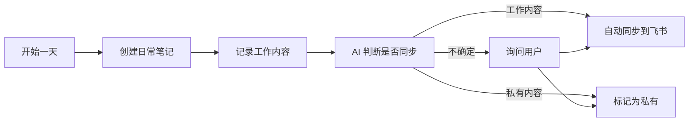
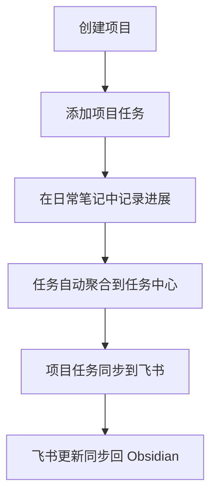
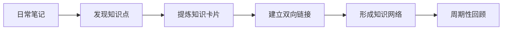
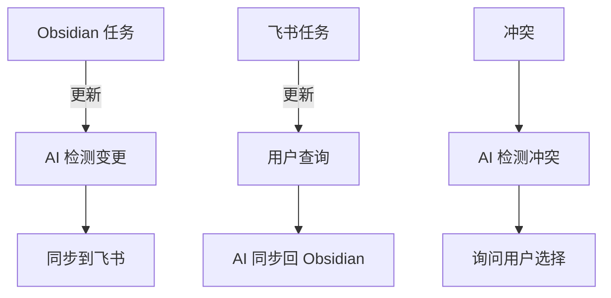

# Obsidian 知识管理工作流程 - 使用指南

## 目录

1. [系统概述](#系统概述)
2. [快速开始](#快速开始)
3. [核心工作流程](#核心工作流程)
4. [使用示例](#使用示例)
5. [最佳实践](#最佳实践)
6. [常见问题](#常见问题)

---

## 系统概述

### 什么是这个系统？

这是一个基于 Obsidian 的智能知识管理系统，采用 PARA + Zettelkasten 混合方法，通过与 AI 助手对话来管理你的笔记、任务和知识。

### 核心特点

- **对话驱动**：通过自然语言对话完成所有操作，无需手动创建文件
- **智能同步**：AI 自动判断哪些内容需要同步到飞书，不确定时会询问你
- **PARA 组织**：清晰的文件夹结构（Projects/Areas/Resources/Archives）
- **知识网络**：通过双向链接和知识卡片构建个人知识库
- **任务管理**：自动聚合和分类所有任务

### 系统架构

```
你 ←→ AI 助手 ←→ Obsidian 笔记
              ↓
           飞书平台（工作内容自动同步）
```

---

## 快速开始

### 前置条件

1. **安装 Obsidian**：从 [obsidian.md](https://obsidian.md) 下载并安装
2. **配置 AI 工具**：使用支持 Skills 和 MCP 的 AI 工具（如 Kiro、Claude Desktop）
3. **安装必要的 Skills**：
   - `obsidian-markdown`（GitHub）
   - `json-canvas`（GitHub）
4. **配置 lark-mcp**（如果需要飞书同步）：
   - 安装 lark-mcp 服务器
   - 配置飞书应用凭证

### 初始化 Vault

第一次使用时，与 AI 助手对话：

```
你: "初始化 Obsidian 知识管理系统"

AI: "好的，我会为你创建 PARA 文件夹结构。请告诉我 vault 的路径。"

你: "/Users/yourname/Documents/MyVault"

AI: "已创建以下文件夹结构：
- 0-Daily（日常笔记）
- 1-Projects（项目）
  - Work（工作项目）
  - Personal（个人项目）
- 2-Areas（领域）
  - Work（工作领域）
  - Life（生活领域）
- 3-Resources（资源）
  - Tech（技术知识库）
  - Life（生活知识库）
- 4-Archives（归档）
- Attachments（附件）
- Templates（模板）

系统已准备就绪！"
```

---

## 核心工作流程

### 工作流程 1：日常记录

#### 流程图



#### 详细步骤

1. **创建日常笔记**
   ```
   你: "记录今天的工作"
   AI: 创建 2024-01-15.md，包含工作、学习、生活三个板块
   ```

2. **记录内容**
   ```
   你: "今天开了个会，讨论了新项目的技术方案，参与者有张三、李四"
   AI: 在日常笔记中添加会议记录，自动提取关键信息
   ```

3. **智能同步判断**
   ```
   AI: "这是工作相关内容，我会自动同步到飞书。"
   或
   AI: "这个内容是否需要同步到飞书？"
   ```

### 工作流程 2：项目管理

#### 流程图



#### 详细步骤

1. **创建项目**
   ```
   你: "创建一个新项目：电商系统重构"
   AI: "这是工作项目还是个人项目？"
   你: "工作项目"
   AI: "已创建项目文件夹：1-Projects/Work/电商系统重构/
       包含：README.md, tasks.md
       是否需要同步到飞书？"
   你: "需要"
   AI: "已在飞书创建任务清单，并生成配置文件。"
   ```

2. **添加任务**
   ```
   你: "添加任务：完成数据库设计，下周五前，张三负责，重要"
   AI: "任务已添加到项目中：
       - 内容：完成数据库设计
       - 截止日期：2024-01-19
       - 负责人：@张三
       - 优先级：#重要
       已同步到飞书任务清单。"
   ```

3. **查看任务**
   ```
   你: "今天有哪些任务？"
   AI: "今天的任务：
       工作任务（2个）：
       - [ ] 完成数据库设计 📅 2024-01-19 @张三 #重要
       - [ ] 代码审查 📅 2024-01-15 @你
       
       项目任务（1个）：
       - [ ] 更新技术文档 #project/电商系统重构"
   ```

### 工作流程 3：知识管理

#### 流程图



#### 详细步骤

1. **记录学习内容**
   ```
   你: "今天学习了 React Hooks 的闭包陷阱问题"
   AI: "已记录到今天的日常笔记中。这是个人学习内容，标记为私有。"
   ```

2. **提炼知识卡片**
   ```
   你: "从今天的笔记中提炼知识卡片"
   AI: "我发现了 2 个值得保留的知识点：
       1. React Hooks 闭包陷阱
       2. useEffect 依赖数组最佳实践
       是否创建知识卡片？"
   你: "创建"
   AI: "已创建知识卡片：
       - 3-Resources/Tech/Knowledge-Cards/React-Hooks-闭包陷阱.md
       - 3-Resources/Tech/Knowledge-Cards/useEffect-依赖数组最佳实践.md
       并在今天的笔记中添加了链接。"
   ```

3. **周期性回顾**
   ```
   你: "生成本周的周回顾"
   AI: "正在收集本周的 5 篇日常笔记...
       已生成周回顾：0-Daily/Weekly-Reviews/2024-W03.md
       本周亮点：
       - 完成了 3 个项目任务
       - 学习了 React 高级特性
       - 参加了 2 次技术会议"
   ```

### 工作流程 4：飞书双向同步

#### 流程图



#### 详细步骤

1. **Obsidian → 飞书**
   ```
   你: "把'完成设计文档'这个任务标记为完成"
   AI: "已更新任务状态，正在同步到飞书..."
       "同步完成！飞书任务也已标记为完成。"
   ```

2. **飞书 → Obsidian**
   ```
   你: "检查飞书上的任务更新"
   AI: "我检查了一下，有 2 个任务在飞书上被更新了：
       1. '代码审查' 已标记为完成
       2. '技术方案评审' 的截止日期改为明天
       是否同步这些更新到 Obsidian？"
   你: "同步"
   AI: "已同步完成。"
   ```

3. **冲突处理**
   ```
   AI: "检测到同步冲突：任务'完成设计文档'在两端都被修改了。
       
       Obsidian 版本（14:30）：
       - 状态：进行中
       - 截止日期：2024-01-20
       
       飞书版本（14:35）：
       - 状态：已完成
       - 截止日期：2024-01-22
       
       请选择：
       1. 保留 Obsidian 版本
       2. 保留飞书版本
       3. 手动合并"
   
   你: "保留飞书版本"
   AI: "好的，已使用飞书版本更新 Obsidian。"
   ```

---

## 使用示例

### 示例 1：程序员的一天

#### 早上 9:00 - 开始工作

```
你: "记录今天的工作"

AI: "已创建今天的日常笔记：0-Daily/2024/01/2024-01-15.md
    包含工作、学习、生活三个板块。"

你: "今天的主要任务是完成用户认证模块的开发"

AI: "已记录到工作板块。这是工作内容，已自动同步到飞书。"
```

#### 上午 10:30 - 站会

```
你: "刚开了站会，讨论了以下内容：
    - 昨天完成了数据库设计
    - 今天要开始写认证接口
    - 遇到了一个 Redis 连接池的问题"

AI: "已创建会议记录并添加到今天的日常笔记中。
    检测到一个问题，是否创建问题解决记录？"

你: "是的"

AI: "已创建：3-Resources/Tech/Problem-Solving/解决-Redis连接池问题.md
    请补充问题的详细信息。"
```

#### 下午 2:00 - 技术学习

```
你: "学习了 JWT 的实现原理和最佳实践"

AI: "已记录到学习板块。这个内容是否需要同步到飞书？"

你: "不用，这是个人学习"

AI: "好的，已标记为私有内容。"
```

#### 下午 4:00 - 代码审查

```
你: "审查了张三的代码，发现了几个问题：
    1. 缺少输入验证
    2. 错误处理不完整
    3. 需要添加单元测试"

AI: "已记录到工作板块。是否为这些问题创建任务？"

你: "是的，都分配给张三，明天前完成"

AI: "已创建 3 个任务并同步到飞书：
    - [ ] 添加输入验证 📅 2024-01-16 @张三
    - [ ] 完善错误处理 📅 2024-01-16 @张三
    - [ ] 编写单元测试 📅 2024-01-16 @张三"
```

#### 晚上 6:00 - 下班前

```
你: "从今天的笔记中提炼知识卡片"

AI: "我发现了 2 个值得保留的知识点：
    1. JWT 实现原理
    2. Redis 连接池配置最佳实践
    是否创建知识卡片？"

你: "创建"

AI: "已创建 2 个知识卡片并建立了链接。"
```

### 示例 2：项目经理的工作流

#### 创建新项目

```
你: "创建新项目：移动端 App 开发"

AI: "这是工作项目还是个人项目？"

你: "工作项目"

AI: "已创建项目：1-Projects/Work/移动端App开发/
    是否需要同步到飞书？"

你: "需要，并且创建以下分组：需求分析、UI设计、开发任务、测试任务"

AI: "已在飞书创建任务清单，包含 4 个自定义分组。
    配置已保存到 .feishu-sync.json"
```

#### 添加项目任务

```
你: "添加以下任务到'需求分析'分组：
    1. 用户需求调研，下周一前，李四负责
    2. 竞品分析，下周三前，王五负责
    3. 需求文档编写，下周五前，我负责"

AI: "已创建 3 个任务并同步到飞书的'需求分析'分组：
    - [ ] 用户需求调研 📅 2024-01-22 @李四 #group/需求分析
    - [ ] 竞品分析 📅 2024-01-24 @王五 #group/需求分析
    - [ ] 需求文档编写 📅 2024-01-26 @你 #group/需求分析"
```

#### 项目进展跟踪

```
你: "查看移动端App开发项目的任务进度"

AI: "项目：移动端App开发
    
    需求分析（3个任务）：
    - [x] 用户需求调研 @李四 ✅ 已完成
    - [ ] 竞品分析 @王五 ⏰ 明天截止
    - [ ] 需求文档编写 @你 ⏰ 本周五截止
    
    UI设计（0个任务）
    开发任务（0个任务）
    测试任务（0个任务）
    
    总体进度：33% (1/3)"
```

### 示例 3：技术决策记录

```
你: "记录一个技术决策：选择 React Native 作为移动端开发框架"

AI: "我会创建一个 ADR 文档。请提供以下信息：
    - 背景（为什么需要做这个决策？）
    - 考虑的方案
    - 决策理由
    - 预期后果"

你: "背景：需要快速开发跨平台移动应用
    考虑的方案：React Native、Flutter、原生开发
    决策理由：团队熟悉 React，开发效率高，社区成熟
    预期后果：开发周期缩短 30%，但性能可能不如原生"

AI: "已创建 ADR：3-Resources/Tech/ADR/ADR-0001-选择ReactNative作为移动端框架.md
    这是技术决策文档，已自动同步到飞书知识库。"
```

### 示例 4：个人生活管理

```
你: "记录一下今天的个人事项"

AI: "好的，我会记录到今天日常笔记的生活板块。"

你: "早上跑步 5 公里，晚上要去看牙医"

AI: "已记录。这是私有内容，不会同步到飞书。
    是否为'看牙医'创建提醒任务？"

你: "是的，今晚 7 点"

AI: "已创建个人任务：
    - [ ] 看牙医 📅 2024-01-15 19:00 #task/personal"
```

---

## 最佳实践

### 1. 日常笔记习惯

**推荐做法**：
- ✅ 每天开始工作时创建日常笔记
- ✅ 随时记录想法和进展，不要等到下班
- ✅ 使用标签关联项目和领域
- ✅ 每周五生成周回顾

**避免**：
- ❌ 不要在日常笔记中写长篇大论（应该提炼成知识卡片）
- ❌ 不要忘记添加标签（影响搜索和分类）

### 2. 项目管理

**推荐做法**：
- ✅ 为每个项目创建独立文件夹
- ✅ 使用项目标签关联日常记录
- ✅ 定期更新项目状态
- ✅ 项目完成后及时归档

**避免**：
- ❌ 不要把所有任务都放在日常笔记中
- ❌ 不要忘记同步飞书（如果是工作项目）

### 3. 知识管理

**推荐做法**：
- ✅ 知识卡片保持原子化（一个卡片一个概念）
- ✅ 使用描述性标题
- ✅ 建立双向链接形成知识网络
- ✅ 定期回顾和更新知识卡片

**避免**：
- ❌ 不要创建过大的知识卡片
- ❌ 不要使用编号命名（如"卡片001"）

### 4. 飞书同步

**推荐做法**：
- ✅ 让 AI 自动判断是否同步
- ✅ 明确标记私有内容
- ✅ 定期检查同步状态
- ✅ 及时处理同步冲突

**避免**：
- ❌ 不要手动修改同步元数据
- ❌ 不要在两端同时编辑同一内容

### 5. 标签使用

**推荐的标签体系**：

```
主题标签：
#技术、#工作、#生活、#学习

状态标签：
#进行中、#已完成、#待办

优先级标签：
#重要、#紧急

项目标签：
#project/项目名

领域标签：
#area/领域名

任务分类：
#task/personal、#task/work、#task/project/项目名

同步标签：
#sync/feishu、#synced/feishu、#private
```

---

## 常见问题

### Q1: AI 如何判断内容是否需要同步到飞书？

**A**: AI 会分析内容特征：

**自动同步（工作内容）**：
- 包含项目标签 `#project/工作项目名`
- 包含工作领域标签 `#area/工作领域`
- 包含工作任务标签 `#task/work`
- 会议记录、技术决策记录（ADR）

**自动排除（私有内容）**：
- 包含个人任务标签 `#task/personal`
- 包含生活领域标签 `#area/生活领域`
- 位于 `1-Projects/Personal` 路径下

**询问用户**：
- 无明确特征的技术笔记
- 混合工作和生活内容

### Q2: 如何处理同步冲突？

**A**: 当 Obsidian 和飞书两端都修改了同一内容时：

1. AI 会检测到冲突并通知你
2. 显示两端的修改内容和时间
3. 提供三个选项：
   - 保留 Obsidian 版本
   - 保留飞书版本
   - 手动合并（AI 会创建冲突副本）

**建议**：
- 尽量避免在两端同时编辑
- 定期同步，减少冲突概率

### Q3: 可以不使用飞书同步吗？

**A**: 可以！飞书同步是可选功能。

如果不需要飞书同步：
- 不配置 lark-mcp
- AI 不会询问同步相关问题
- 所有功能正常使用（笔记、任务、知识管理等）

### Q4: 如何查看所有任务？

**A**: 有两种方式：

1. **通过对话**：
   ```
   你: "今天有哪些任务？"
   你: "本周的任务列表"
   你: "项目 A 的所有任务"
   ```

2. **查看任务中心**：
   打开 `任务中心.md` 文件，自动聚合所有任务

### Q5: 知识卡片和日常笔记有什么区别？

**A**: 

**日常笔记**：
- 按时间组织
- 记录当天的所有内容
- 临时性、流水账式

**知识卡片**：
- 按主题组织
- 专注单一概念
- 永久性、可复用

**工作流**：
日常笔记 → 提炼 → 知识卡片 → 知识网络

### Q6: 如何归档已完成的项目？

**A**: 

```
你: "归档'电商系统重构'项目"

AI: "已将项目移动到：4-Archives/2024/电商系统重构/
    - 保留了所有链接和标签
    - 添加了归档日期
    - 项目内容仍然可以搜索和访问"
```

### Q7: 可以自定义模板吗？

**A**: 可以！

1. 在 `Templates/` 文件夹中创建或修改模板
2. 使用变量占位符（如 `{{date}}`, `{{title}}`）
3. AI 会自动使用你的自定义模板

### Q8: 如何备份数据？

**A**: 

Obsidian vault 就是普通的文件夹，包含：
- Markdown 文件（笔记内容）
- 附件文件（图片、PDF 等）
- 配置文件（JSON）

**备份方式**：
- 使用 Git 版本控制
- 云同步（iCloud、Dropbox 等）
- 定期复制整个文件夹

### Q9: 支持移动端吗？

**A**: 

- Obsidian 有官方移动端 App（iOS/Android）
- 可以查看和编辑笔记
- AI 对话功能取决于你使用的 AI 工具是否支持移动端

### Q10: 如何搜索笔记？

**A**: 

1. **通过 AI 对话**：
   ```
   你: "查找关于 React 的笔记"
   你: "最近一周的会议记录"
   ```

2. **使用 Obsidian 搜索**：
   - 全文搜索
   - 按标签筛选
   - 按文件夹筛选

### Q11: AI 如何学习我的偏好？

**A**: 

系统内置了自我改进机制，AI 会记住你的偏好和纠正：

**记录方式**：
```
你: "以后技术学习笔记都不要问我是否同步，直接标记为私有"
AI: "明白了！已记录你的偏好。"

你: "创建任务时如果没有指定负责人，默认分配给我"
AI: "好的，已记录。"
```

**查看记录**：
```
你: "查看我的改进记录"
AI: "你有 3 条改进记录：
    1. 技术学习笔记默认私有
    2. 任务默认负责人为你
    3. 会议记录自动同步到飞书"
```

**修改记录**：
```
你: "修改第 2 条，改为默认分配给张三"
AI: "已更新。"
```

AI 会在后续操作中自动应用这些偏好，让系统越用越智能。

---

## 进阶技巧

### 技巧 1：使用别名快速创建笔记

```
你: "会议"
AI: "要创建会议记录吗？请告诉我会议主题。"

你: "技术方案评审"
AI: "已创建会议记录，请补充参与者和讨论内容。"
```

### 技巧 2：批量操作

```
你: "把所有标记为 #待办 的任务改为 #进行中"
AI: "找到 5 个待办任务，已全部更新为进行中。"
```

### 技巧 3：智能提醒

```
你: "提醒我每周五生成周回顾"
AI: "已设置提醒，每周五下午 5 点我会提醒你生成周回顾。"
```

### 技巧 4：模板变量

在自定义模板中使用变量：

```markdown
---
title: {{title}}
date: {{date}}
tags: {{tags}}
---

# {{title}}

创建时间：{{datetime}}
```

### 技巧 5：快速链接

```
你: "链接到昨天的笔记"
AI: "已在当前位置添加链接：[[2024-01-14]]"
```

### 技巧 6：自我改进

**教 AI 学习你的习惯**：

```
场景1 - 同步偏好：
你: "所有标记为'学习'的内容都是私有的，不要再问我了"
AI: "明白！已记录。以后会自动标记为私有。"

场景2 - 任务管理：
你: "创建任务时，如果是工作任务且没有指定负责人，默认分配给我"
AI: "好的，已记录你的偏好。"

场景3 - 笔记创建：
你: "会议记录的标题格式应该是：YYYY-MM-DD-会议主题"
AI: "明白了，以后会按这个格式创建会议记录标题。"

场景4 - 知识提炼：
你: "只有超过 200 字的技术内容才提炼成知识卡片"
AI: "好的，已记录这个标准。"
```

**查看和管理改进记录**：

```
你: "查看我的所有改进记录"
AI: "你有 5 条改进记录：
    1. 技术学习笔记默认私有（2024-01-15）
    2. 工作任务默认负责人（2024-01-16）
    3. 会议记录标题格式（2024-01-17）
    4. 知识卡片提炼标准（2024-01-18）
    5. 项目任务自动同步（2024-01-19）"

你: "删除第 3 条记录"
AI: "已删除会议记录标题格式的改进记录。"

你: "修改第 2 条，改为默认分配给张三"
AI: "已更新：工作任务默认负责人改为张三。"
```

**AI 自动应用改进**：

```
你: "学习了 Python 装饰器"
AI: "已记录到学习板块。根据你的偏好，已自动标记为私有。"
（不再询问是否同步）

你: "添加任务：完成代码审查"
AI: "任务已创建并分配给张三（根据你的偏好）。"
（自动应用默认负责人）
```

---

## 总结

这个系统的核心理念是：

1. **对话驱动**：用自然语言完成所有操作
2. **智能协助**：AI 帮你判断、分类、同步
3. **灵活组织**：PARA 结构 + 标签 + 链接
4. **知识沉淀**：从日常记录到知识网络
5. **自我学习**：系统会记住你的偏好，越用越智能

**开始使用**：
1. 初始化 vault
2. 创建第一篇日常笔记
3. 让 AI 帮你管理一切
4. 教 AI 学习你的习惯

**记住**：
- 不要担心做错，AI 会引导你
- 不要过度组织，让系统自然生长
- 不要忘记定期回顾，知识需要沉淀
- 不要吝啬纠正 AI，它会记住并改进

祝你使用愉快！🎉
