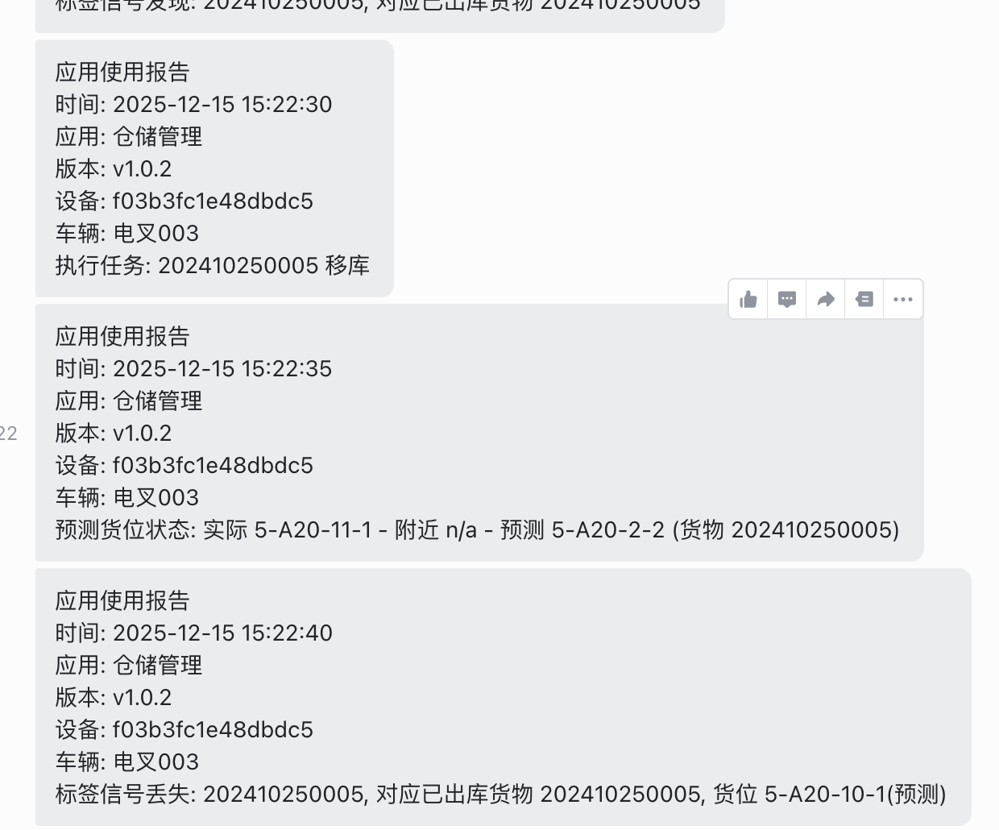

# 2025-12-15 蓝牙测试



设备编号: 202410250005

测试结果: 只触发了一次附近或为

## API 测试

```json
'{"default":{"spaceId":1,"mapId":0,"floor":1,"longitude":119.2842735522845,"latitude":119.2842735522845,"altitude":0, "degree": -31}}
```

```bash
curl 'http://localhost:8080/api/positions' \
  -H 'accept: application/json' \
  -H 'accept-language: en' \
  -H 'apikey: shwl_gzhft' \
  -H 'apisecret: 4966ddc0-4a51-4ab4-be9a-b714b0e645c4'
```
