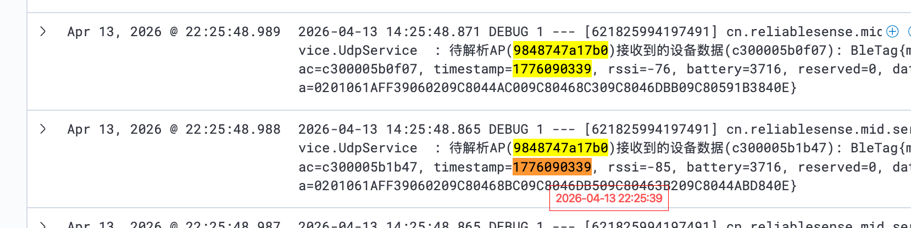
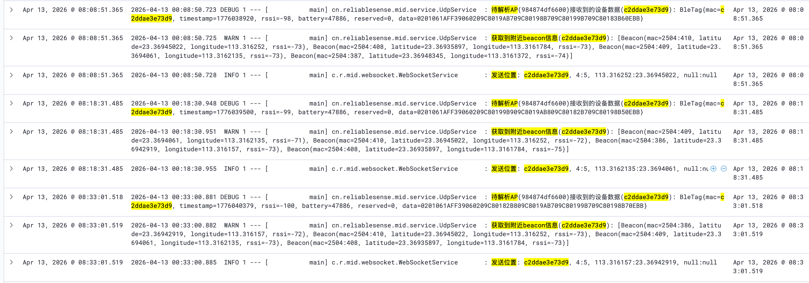
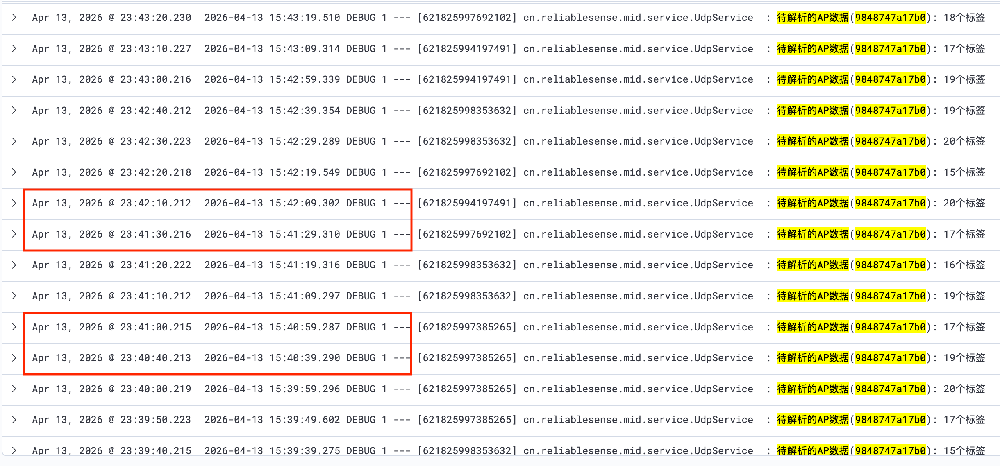

# Beacon定位问题分析报告

## 排查背景

针对广州机场T3航站楼Beacon定位系统的定位异常问题，通过AP原始抓包、服务端日志、数据库记录等多维度数据进行排查分析。

排查时间：2026-04-12 ~ 2026-04-13
涉及AP：`9848747a17b0`（2F-DCRO2-SNSC009）、`9848747a2a90`、`98487479eb50`、`98487479cb70` 等
测试设备：`c300005b2294`（蓝牙标签）、`c2ddae3e73d9`

### 数据流链路

```
定位Beacon广播 → 定位工牌扫描周围Beacon → 工牌BLE广播（携带Beacon数据）
→ AP接收工牌广播（10s汇聚） → AP透传上报（UDP）
→ 服务端接收解析（~2ms） → Beacon匹配（~1ms） → 位置计算与发送（~2ms）
```

---

## 现象一：广播数据在上传周期内，广播包时间在10秒以内

### 观察

从同时间段日志中可以看到，设备 `c300005b2294` 的 BleTag 数据中 `timestamp` 字段的变化规律：



| 时间 | AP | timestamp | 差值 |
|------|-----|-----------|------|
| 15:49:09 | 9848747a17b0 | 1776095340 | - |
| 15:49:19 | 9848747a17b0 | 1776095349 | +9 |
| 15:49:29 | 9848747a17b0 | 1776095359 | +10 |
| 15:50:29 | 9848747a17b0 | 1776095419 | +60 |
| 15:50:39 | 9848747a17b0 | 1776095430 | +11 |
| 15:51:09 | 9848747a17b0 | 1776095459 | +29 |
| 15:51:19 | 9848747a17b0 | 1776095469 | +10 |
| 15:51:39 | 9848747a17b0 | 1776095490 | +21 |

> 📎 原始数据：[同时间段日志.csv](Attachments/同时间段日志.csv)

### 结论

设备广播的 timestamp 与服务端接收时间基本吻合，广播包中的时间戳都在当前上传周期的10秒窗口内。AP每10秒汇聚一次广播数据上报，收到的数据确实是该周期内采集到的新鲜广播包，不存在缓存旧数据上报的情况。

---

## 现象二：从收到AP包到发出位置，延迟在毫秒级

### 观察

从单设备日志（设备 `c2ddae3e73d9`，AP `984874df6600`）中可以看到完整的处理链路：



```
00:00:00.829 DEBUG  待解析AP(984874df6600)接收到的设备数据(c2ddae3e73d9): BleTag{...}
00:00:00.831  WARN  获取到附近beacon信息(c2ddae3e73d9): [Beacon(...), ...]
00:00:00.834  INFO  发送位置: c2ddae3e73d9, 4:5, 113.316157:23.36942919
```

处理耗时分析：
- 接收AP数据 → 解析beacon信息：约 2ms（00:00:00.829 → 00:00:00.831）
- 解析beacon信息 → 发送位置：约 3ms（00:00:00.831 → 00:00:00.834）
- 全链路（接收 → 发送）：约 5ms

再看同时间段日志中的另一个例子：
```
15:48:34.233 DEBUG  待解析AP(9848747a2a90)接收到的设备数据(c300005b2294): BleTag{...}
15:48:34.235 DEBUG  获取到附近beacon信息(c300005b2294): [Beacon(...), ...]
15:48:34.237  INFO  发送位置: c300005b2294, 4:2, 113.3170546:23.3680337
```

全链路耗时仅 4ms。

> 📎 原始数据：[单设备从AP到位置发送日志.csv](Attachments/单设备从AP到位置发送日志.csv)

### 结论

服务端处理效率很高，从收到AP上报的数据包到计算出位置并发送，整个过程在几毫秒以内完成。定位延迟的瓶颈不在服务端处理环节，而在AP的数据上报频率（10秒周期）。


---

## 现象四：存在漏报现象

### 观察

从同一AP（`9848747a17b0`）连续接收数据日志中，可以明显看到数据间隔不均匀：



按时间排列分析数据间隔：

| 时间 | 标签数 | 与上一条间隔 | 是否正常 |
|------|--------|-------------|---------|
| 15:24:20 | 15 | - | ✅ |
| 15:24:30 | 18 | 10s | ✅ |
| 15:24:40 | 20 | 10s | ✅ |
| 15:24:50 | 17 | 10s | ✅ |
| 15:25:00 | 17 | 10s | ✅ |
| 15:25:10 | 15 | 10s | ✅ |
| 15:25:20 | 21 | 10s | ✅ |
| 15:25:30 | 21 | 10s | ✅ |
| **15:25:40** | 21 | 10s | ✅ |
| **15:26:00** | 24 | **20s** | ⚠️ 漏了 15:25:50 |
| 15:26:10 | 21 | 10s | ✅ |
| 15:26:20 | 23 | 10s | ✅ |
| 15:26:30 | 21 | 10s | ✅ |
| 15:26:40 | 21 | 10s | ✅ |
| 15:26:50 | 20 | 10s | ✅ |
| 15:27:00 | 19 | 10s | ✅ |
| 15:27:10 | 23 | 10s | ✅ |
| **15:27:20** | 20 | 10s | ✅ |
| **15:27:39** | 19 | **19s** | ⚠️ 漏了 15:27:30 |
| **15:27:50** | 19 | 11s | ✅ |
| **15:28:10** | 21 | **20s** | ⚠️ 漏了 15:28:00 |
| 15:28:20 | 18 | 10s | ✅ |
| 15:28:30 | 19 | 10s | ✅ |
| **15:28:50** | 20 | **20s** | ⚠️ 漏了 15:28:40 |
| **15:29:10** | 24 | **20s** | ⚠️ 漏了 15:29:00 |

继续往后看，更大的间隔也存在：

| 时间段 | 间隔 | 说明 |
|--------|------|------|
| 15:33:20 → 15:33:40 | 20s | 漏1个周期 |
| 15:37:10 → 15:37:30 | 20s | 漏1个周期 |
| 15:37:30 → 15:38:40 | **70s** | 漏6个周期 |
| 15:38:40 → 15:39:20 | **40s** | 漏3个周期 |
| 15:39:40 → 15:39:50 | 10s | 正常 |
| 15:40:00 → 15:40:40 | **40s** | 漏3个周期 |
| 15:40:40 → 15:41:00 | 20s | 漏1个周期 |
| 15:41:30 → 15:42:10 | **40s** | 漏3个周期 |
| 15:42:20 → 15:42:40 | 20s | 漏1个周期 |
| 15:42:40 → 15:43:00 | 20s | 漏1个周期 |

### 统计

在约20分钟的观察窗口（15:24 ~ 15:43）内，共约120个预期周期，实际收到约90条数据，漏报率约 **25%**。其中：
- 单周期漏报（20s间隔）最常见
- 偶尔出现连续多周期漏报（最长70s，即连续漏6个周期）

> 📎 原始数据：[同一AP连续接收数据日志.csv](Attachments/同一AP连续接收数据日志.csv)

### 结论

AP存在明显的漏报现象，约四分之一的上报周期数据丢失。漏报可能原因：
1. AP与AC之间的网络传输偶尔丢包
2. AP内部BLE扫描与数据上报的调度冲突
3. AP负载较高时优先处理WiFi业务，BLE数据上报被延迟或丢弃

---

## 现象五：AP原始抓包发送间隔每10秒一个包，正确

### 观察

从AP原始数据（2F-DCRO2-SNSC009 的诊断日志）中可以看到 `WCOM_SocketSendPkt` 的发送时间：

```
Apr 12 2026 16:54:05  Send pkt ... Len: 1081
Apr 12 2026 16:54:15  Send pkt ... Len: 1215
Apr 12 2026 16:54:25  Send pkt ... Len: 983
Apr 12 2026 16:54:35  Send pkt ... Len: 893
Apr 12 2026 16:54:45  Send pkt ... Len: 967
Apr 12 2026 16:54:55  Send pkt ... Len: 1090
Apr 12 2026 16:55:05  Send pkt ... Len: 956
Apr 12 2026 16:55:15  Send pkt ... Len: 1088
Apr 12 2026 16:55:25  Send pkt ... Len: 1000
```

每条发送记录间隔严格为 **10秒**，且每个包的长度在 893~1215 字节之间波动（取决于该周期内扫描到的BLE设备数量）。

包头中可以看到 AP MAC `98 48 74 7A 17 B0`，与服务端日志中的 `9848747a17b0` 一致。

> 📎 原始数据：[AP原始数据.txt](Attachments/AP原始数据.txt)

### 结论

AP侧的数据发送间隔配置正确，严格按照10秒一个周期上报BLE扫描数据。AP本身的发送行为没有问题，漏报发生在AP到服务端之间的传输链路上。

---

## 综合分析

### 问题定位

| 环节       | 状态     | 说明                       |
| -------- | ------ | ------------------------ |
| Beacon广播 | ✅ 正常   | 广播数据在10秒窗口内，时间戳正确        |
| AP数据发送   | ✅ 正常   | 严格10秒间隔，原始抓包确认           |
| AP→服务端传输 | ⚠️ 有丢包 | 约25%的周期数据未到达服务端          |
| 服务端处理    | ✅ 正常   | 毫秒级处理延迟                  |

### 建议

1. **排查网络链路**：AP到服务端之间的UDP传输存在约25%的丢包率，需要检查中间网络设备（交换机、防火墙）的负载和丢包情况
2. **考虑多AP冗余**：从同时间段日志可以看到，同一设备被多个AP（`9848747a17b0`、`9848747a2a90`、`98487479eb50`）同时接收到，多AP冗余可以在一定程度上弥补单AP漏报的问题
3. **监控告警**：建议增加AP上报数据连续性的监控，当某AP连续多个周期无数据时触发告警

---

## 附件清单

| 文件                                                                           | 说明                   |
| ---------------------------------------------------------------------------- | -------------------- |
| [设备广播时间与数据接收时间对比截图.png](Attachments/设备广播时间与数据接收时间对比截图.png)                   | 现象一：广播时间与接收时间对比      |
| [单设备从AP到位置发送截图.png](Attachments/单设备从AP到位置发送截图.png)                           | 现象二：服务端处理延迟截图        |
| [同一AP连续接收数据截图.png](Attachments/同一AP连续接收数据截图.png)                             | 现象四：漏报现象截图           |
| [同时间段日志.csv](Attachments/同时间段日志.csv)                                         | 同一设备在同时间段的完整日志       |
| [同时间段数据.csv](Attachments/同时间段数据.csv)                                         | 同一设备在同时间段的数据库记录      |
| [单设备从AP到位置发送日志.csv](Attachments/单设备从AP到位置发送日志.csv)                           | 单设备完整处理链路日志          |
| [同一AP连续接收数据日志.csv](Attachments/同一AP连续接收数据日志.csv)                             | 同一AP连续接收数据日志         |
| [AP原始数据.txt](Attachments/AP原始数据.txt)                                         | AP侧原始抓包诊断日志          |
