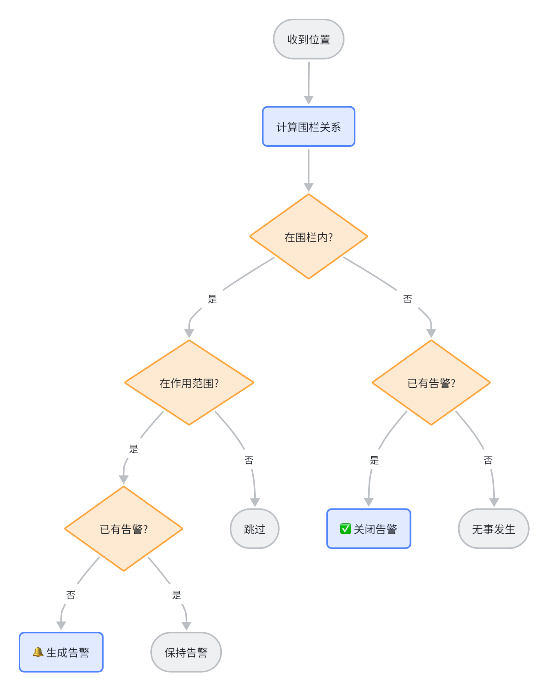
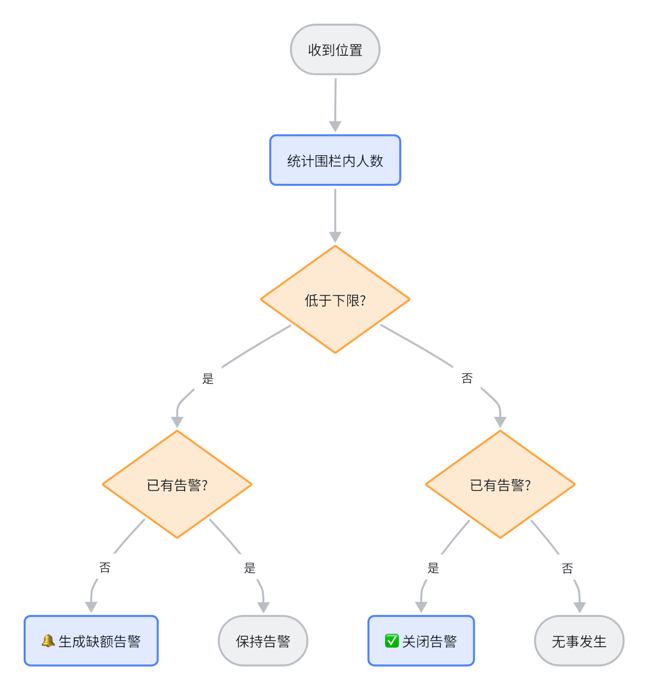
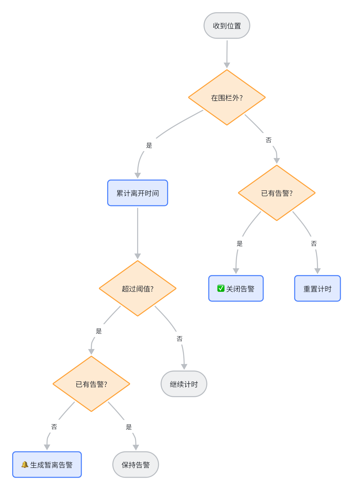
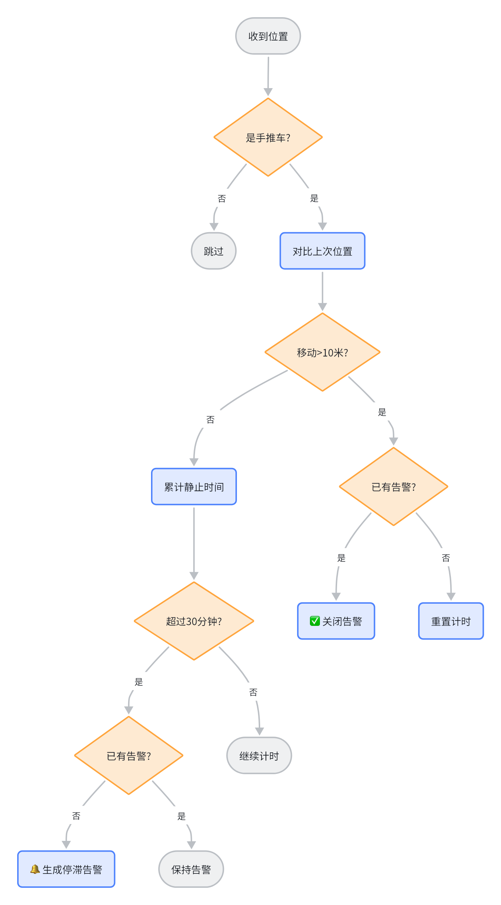
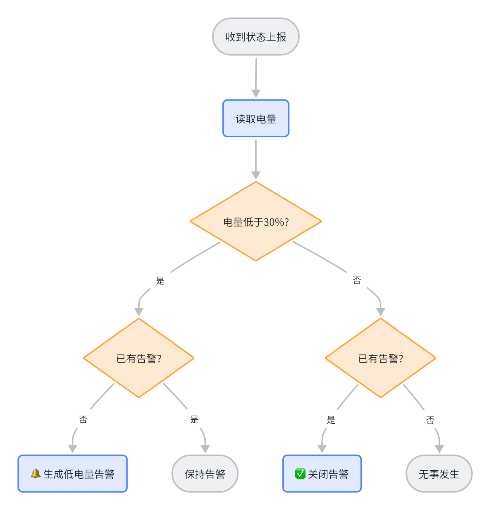
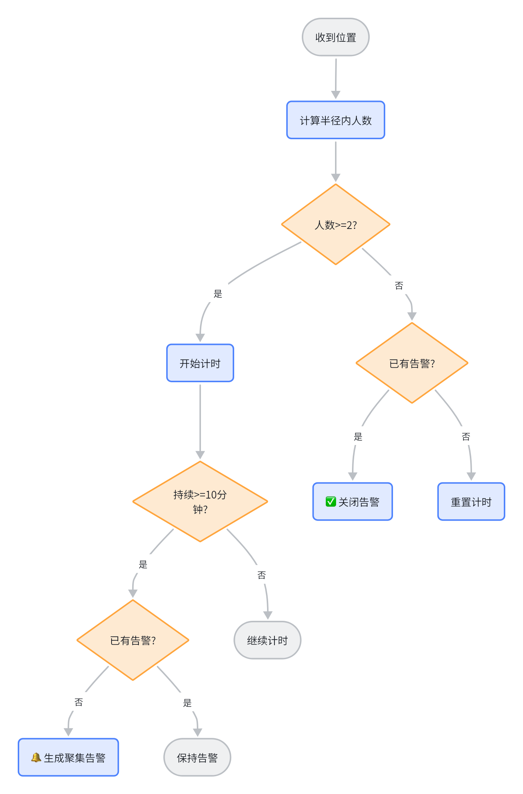
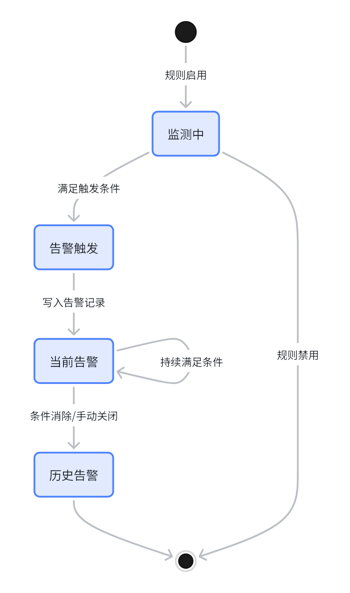

# 告警规则说明

## 告警类型总览

平台支持 9 种告警规则，按触发机制可分为三大类：

| 分类 | 告警类型 | 触发对象 | 核心判断依据 |
|------|---------|---------|-------------|
| **围栏类** | 违规进入 | 定位对象 | 进入禁止区域 |
| | 违规离开 | 定位对象 | 离开限定区域 |
| | 超额 | 围栏区域 | 区域内人数超过上限 |
| | 缺额 | 围栏区域 | 区域内人数低于下限 |
| **时间类** | 滞留超时 | 定位对象 | 在某区域停留超过阈值 |
| | 暂离超时 | 定位对象 | 离开指定区域超过阈值 |
| | 手推车停滞超时 | 定位对象 | 手推车静止超过阈值 |
| **状态类** | 低电量 | 定位标签 | 电量低于阈值 |
| | 聚集 | 定位对象群体 | 短时间内多人聚集 |

---

## 围栏类告警

### 1. 违规进入

| 属性   | 说明                 |
| ---- | ------------------ |
| 触发条件 | 定位对象进入设定的围栏区域      |
| 关联配置 | 围栏 + 作用范围（标签/分组过滤） |
| 告警生成 | 对象位置落入围栏多边形内时触发    |
| 告警关闭 | 对象离开围栏区域后自动关闭      |

---

### 2. 违规离开

| 属性   | 说明                 |
| ---- | ------------------ |
| 触发条件 | 定位对象离开设定的围栏区域      |
| 关联配置 | 围栏 + 作用范围（标签/分组过滤） |
| 告警生成 | 对象位置离开围栏多边形时触发     |
| 告警关闭 | 对象回到围栏区域内后自动关闭     |

---

### 3. 超额

| 属性 | 说明 |
|------|------|
| 触发条件 | 围栏区域内定位对象数量超过设定上限 |
| 关联配置 | 围栏 + 人数上限阈值 |
| 告警生成 | 区域内对象计数 > 上限时触发 |
| 告警关闭 | 区域内对象计数 ≤ 上限时自动关闭 |

---

### 4. 缺额

| 属性 | 说明 |
|------|------|
| 触发条件 | 围栏区域内定位对象数量低于设定下限 |
| 关联配置 | 围栏 + 人数下限阈值 |
| 告警生成 | 区域内对象计数 < 下限时触发 |
| 告警关闭 | 区域内对象计数 ≥ 下限时自动关闭 |

---

## 时间类告警

### 5. 滞留超时

| 属性   | 说明                  |
| ---- | ------------------- |
| 触发条件 | 定位对象在某围栏区域内停留时间超过阈值 |
| 关联配置 | 围栏 + 滞留时间阈值         |
| 告警生成 | 对象在围栏内持续时间 > 阈值时触发  |
| 告警关闭 | 对象离开围栏区域后自动关闭       |

---

### 6. 暂离超时

| 属性   | 说明                  |
| ---- | ------------------- |
| 触发条件 | 定位对象离开指定围栏区域的时间超过阈值 |
| 关联配置 | 围栏 + 暂离时间阈值         |
| 告警生成 | 对象离开围栏持续时间 > 阈值时触发  |
| 告警关闭 | 对象回到围栏区域内后自动关闭      |

---

### 7. 手推车停滞超时

| 属性   | 说明                          |
| ---- | --------------------------- |
| 触发条件 | 手推车类定位对象在某位置静止超过阈值          |
| 关联配置 | 停滞时间阈值（30 分钟）+ 移动距离阈值（10 米） |
| 告警生成 | 手推车位置无变化持续时间 > 阈值时触发        |
| 告警关闭 | 手推车开始移动后自动关闭                |

---

## 状态类告警

### 8. 低电量

| 属性 | 说明 |
|------|------|
| 触发条件 | 定位标签上报电量低于设定阈值 |
| 关联配置 | 电量阈值（30%） |
| 告警生成 | 标签电量 < 阈值时触发 |
| 告警关闭 | 标签电量恢复到阈值以上 / 手动关闭 |

---

### 9. 聚集

| 属性 | 说明 |
|------|------|
| 触发条件 | 短时间内多个定位对象在小范围内聚集 |
| 关联配置 | 聚集半径 + 人数阈值（2人）+ 持续时间（10 分钟） |
| 告警生成 | 指定半径内对象数量 ≥ 2 且持续时间 ≥ 10 分钟时触发 |
| 告警关闭 | 聚集人数降至阈值以下后自动关闭 |

---

## 告警生命周期

---

## 关键设计要点

1. **去重机制** — 同一对象对同一规则，在告警未关闭前不重复生成新告警
2. **实时位置驱动** — 围栏类告警必须基于实时位置判断，不可根据历史位置生成
3. **自动关闭** — 大部分告警在条件消除后自动关闭，低电量可手动关闭
4. **作用范围过滤** — 围栏类告警（违规进入/离开）支持按标签/分组过滤，只对指定对象生效
5. **告警排队** — 大量告警同时触发时需排队处理，避免阻塞系统
6. **计时器管理** — 时间类告警（滞留/暂离/停滞）在条件消除后重置计时器
