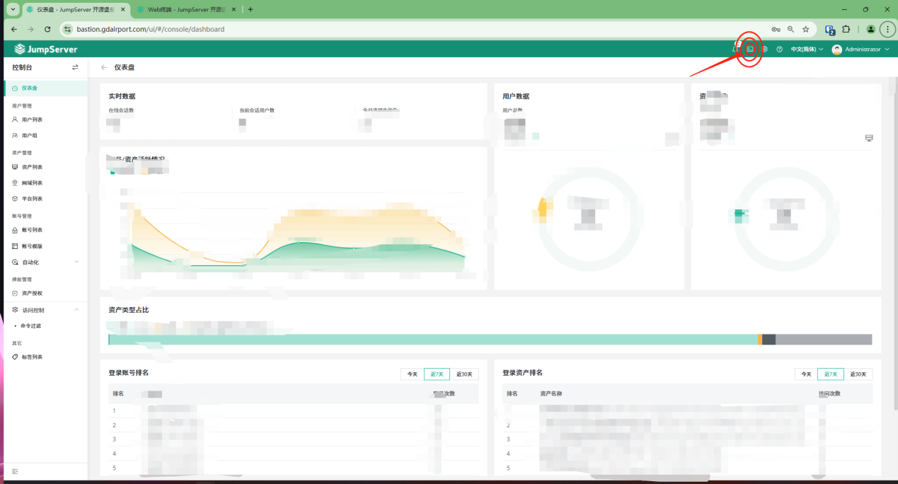
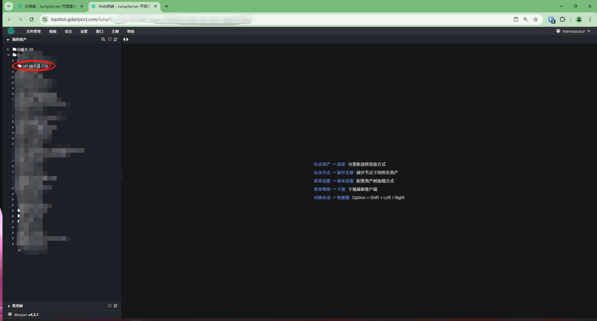
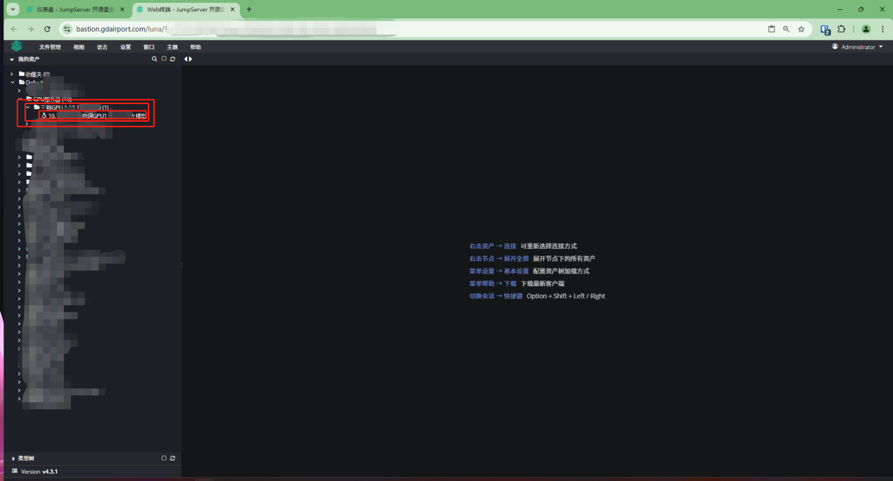
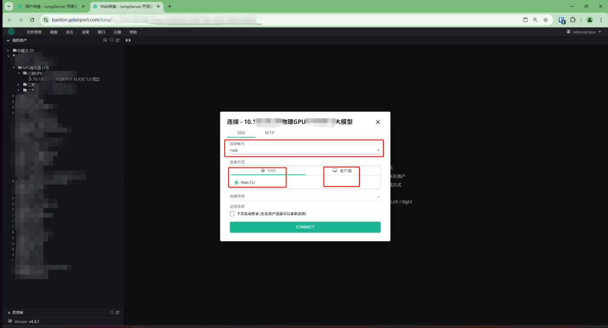

1. 登录堡垒机首页

2. 点击上图红圈内的按钮，即可进入下图所示界面；

3. 点击上图红圈所示字符（<text color="red">登录账户根据授权不同，资源名称会不一样</text>），即可看到各自获得授权使用的服务器、数据库等资源；

4. 如上图所示，看到自己获取授权登使用的资源名称（通常会包含服务器名称、用途、弹性IP，<text color="red">确认服务器授权无误后再行使用，如果授权错误，请向资源管理员200202102反馈，谢谢</text>）；<text color="red">鼠标右键点击</text>服务器资源名称，会让选择登录选项>>其中就包含已经堡垒机授权使用的账户或者手动账户，或者选择本地客户端登录>>推荐<text color="red">web登录即可</text>，没有难度；也可自行配置本地客户端登录（就不要问具体怎么做，自行百度摸索，不复杂）；

