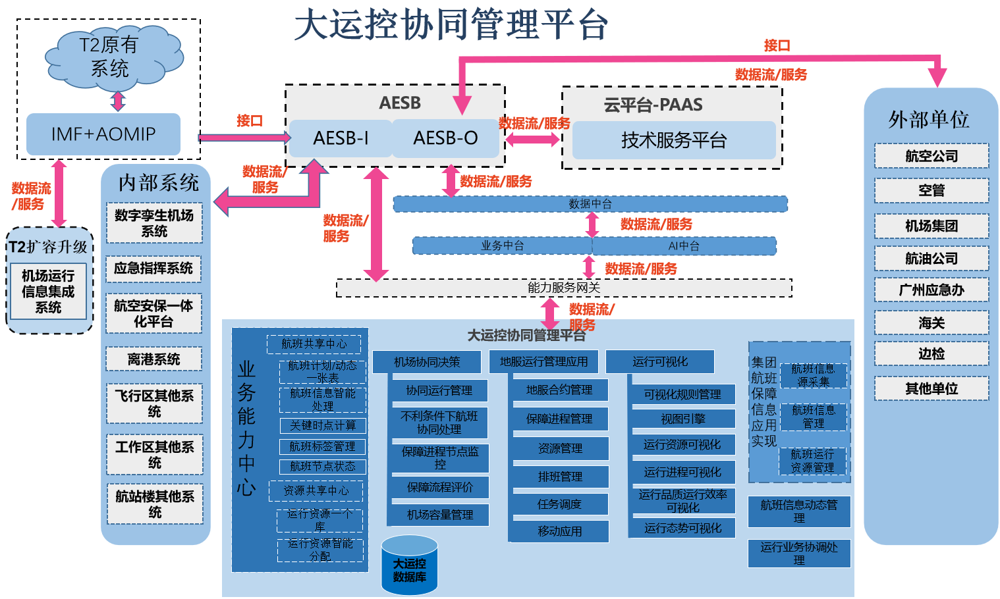
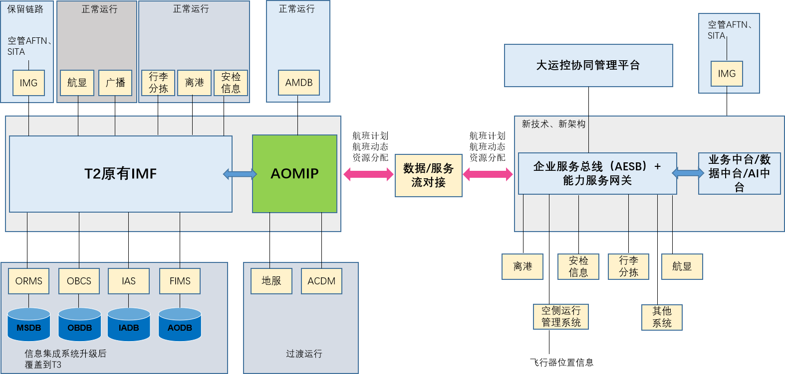

**6大运控协同管理平台技术要求**
**6.1系统总则**
6.1.1系统概况
大运控协同管理平台定位于航班运行控制领域，全面涵盖航班计划制作、航班信息管理、航班资源分配、地服运行监控、地空协同运行、业务统计分析等业务场景。
本次大运控协同管理平台采用领域驱动设计思想，对航班运行控制业务领域的共性能力进行识别、提取和抽象，并进一步基于“高内聚、低耦合”的设计原则，对共性能力进行边界切割及封装，构建能力中心集群。平台应采用微服务技术实现，将能力中心集群拆分为多个不同的服务，并运用服务编排技术实现前台解决方案的快速组装和构建。每个微服务都能独立部署、独立运维、独立拓展，通过API（应用程序编程接口）的方式实现通信和调用。
大运控协同管理平台应具备“可持续”、“易复用”、“利创新”3大显著特性，能够帮助机场很好的解决IT发展断代、业务支撑不足、跨域协同困难、重复建设等一系列重大痛点。
●可持续：沉淀到业务中台上的业务能力可以随着机场业务流程、管理模式、资源供给的变化而持续迭代优化，实现业务能力的资产化管理，杜绝IT规划建设断代的现象。
●易复用：沉淀到业务中台上的业务能力具备高内聚、低耦合的特性，能够通过诸如事件驱动、RPC等方式供多个前端业务系统快速调用，避免重复造轮子的问题。
●利创新：业务中台应构建服务编排和服务组合能力，能够实现共性业务能力的快速组装，以及前台解决方案和产品的快速构建。
6.1.2系统工作内容
本章节技术规格书所指出的系统工作内容仅指要求承包商为完成广州白云国际机场三期扩建工程大运控协同管理平台所需的主要工作。承包商必须按照本标段技术文件的要求在规定的工程进度计划期限内完成以下工作内容(包括但不限于)：
6.1.2.1需求分析
根据招标人所提供的系统建设内容，对所有与本系统有关的用户进行详细的需求调研。调研前需要编写调研提纲，制定调研计划，提交招标人审阅和确定。调研完毕后形成《大运控协同管理平台用户需求说明书》和《大运控协同管理平台用户需求分析报告》，并提交招标人审批，审批后的文档将作为系统深化设计、开发、实施、测试、最终验收的主要依据。
6.1.2.2深化设计
依据广州白云国际机场所提供的大运控协同管理平台的施工设计图纸，结合《大运控协同管理平台用户需求说明书》和《大运控协同管理平台用户需求分析报告》进行深化设计。深化设计应主要包括但不限于以下内容：
6.1.2.2.1大运控协同管理平台对网络、计算、存储等硬件基础设施的需求；
6.1.2.2.2大运控协同管理平台对AOC终端部署及实施方案（含过渡方案）；
6.1.2.2.3对测试环境的硬件平台及软件平台要求；
6.1.2.2.4其他如安全性、性能、不停航实施方案等内容。
6.1.2.2.5完成与其他系统的深化设计配合与对接，包括本系统需要向其它系统如监控系统（保障节点前端摄像机）、机场企业服务总线等等提供技术要求和需求，同时接收其它系统对本系统的技术要求和需求等等。
6.1.2.2.6大运控协同管理平台接口技术规范设计；
大运控协同管理平台集成与接口方案设计包括但不限于以下内容： 
6.1.2.2.6.1大运控协同管理平台内部相关应用系统、产品之间数据交互关系和方式。 
6.1.2.2.6.2大运控协同管理平台与其他应用系统之间的数据交互关系和方式。 
6.1.2.2.6.3深化设计过程中须详细描述集成关系及接口实现方案，过渡实施方案。
6.1.2.2.7大运控协同管理平台支持多航站楼运控业务流程深化。
6.1.2.2.8大运控协同管理平台支持多航站楼详细功能深化。
6.1.2.2.9按照业主（或三期工程BIM咨询）提供的BIM模型要求，完成本系统的BIM深化设计，完成BIM施工模型和竣工模型，并提交机场智能建造审核，审图通过才可进行施工。
6.1.2.2.10系统软硬件产品/材料的配置设计
本项目承包商应根据系统详细设计方案，基于基础云平台的设计方案，对本系统应配置的所有设备材料进行详细配置说明，提交《系统软硬件产品/材料配置说明书》，包括详细的软硬件产品/材料清单、功能性能说明和技术指标描述等。
6.1.2.2.11系统信息功能及流程设计
在《系统业务流程调研书》的基础上，结合本技术规范的功能需求说明和《用户需求说明书》、《系统详细设计方案》等资料，形成《系统信息功能及流程图》。这些文档须提交招标人并由招标人确认。
6.1.2.2.12系统接口设计
对本项目内各个系统之间、以及本项目内各系统与其它相关系统之间的接口进行准确的定义设计，制定相关的要求、标准和规范，提交《系统接口文档和实施方案》。
6.1.2.2.13系统测试设计
承包商应明确定义测试项目，最主要的例如：功能测试、性能测试、稳定性测试、可恢复性、压力测试等软件工程理论中所定义的关键性测试项目。
系统测试中心模拟测试设计。
6.1.2.2.13.1基础测试环境的需求设计
1)系统测试中心的系统功能定义、方案设计；
2)系统测试中心软硬件产品/材料的配置需求描述；
要求系统测试中心的基础测试环境和现场生产系统的系统支撑软件运行环境完全一致。
6.1.2.2.13.2系统测试中心的模拟测试方案设计
1)单元/单机测试设计
承包商对本项目软硬件产品/材料现场安装前在系统测试中心实施单元/单机测试和检验认证进行技术方案的设计。
2)单系统模拟测试设计
承包商对其提供和开发的应用软件产品在系统测试中心实施单系统模拟测试进行技术方案的设计。
3)集成模拟测试
对本项目内各系统与企业服务总线及其他相关系统接口测试、交换数据项测试、数据服务测试等进行技术方案的设计。
6.1.2.2.13.3现场测试设计
1)承包商对其提供和开发的应用软件产品安装在生产现场环境实施单系统测试进行技术方案的设计。
2)承包商对本项目系统在生产现场环境连接实施集成测试（包括接口测试、系统联调），进行技术方案的设计。
3)承包商应提交《测试计划报告》和《系统集成测试实施技术方案》
本项目承包商设计制定详细的测试方案，包括但不限于：单系统性能测试、系统集成测试、故障恢复测试等。 
测试方案设计包括调试环境测试设计和现场测试设计，本承包商需充分考虑现场测试可能涉及到的工程协调、现场安全保障、高空作业等问题，确保测试过程顺利。
6.1.2.2.14其它所需要的设计
提交《系统软硬件资源需求分析报告》
至少包括：计算资源需求、网络资源需求、存储资源需求、基础云平台提供的通用支撑软件需求、信息安全需求、综合布线需求、电源需求、机房环境需求等。
6.1.2.2.15系统测试方案设计
本项目承包人设计制定详细的系统测试方案，包括但不限于：单系统性能测试、系统集成测试、故障恢复测试等。 
测试方案设计包括调试环境测试设计和现场测试设计，本承包人需充分考虑现场测试可能涉及到的工程协调、现场安全保障、高空作业等问题，确保测试过程顺利。
6.1.2.2.16其它实现系统集成所需要的设计。
6.1.2.2.17以上内容均须提交正式的书面文档供招标人审批。
6.1.2.3产品供应及客户化开发
6.1.2.3.1软硬件产品与材料的工厂测试及检验；
6.1.2.3.2设备及产品运输包装、到货开箱及仓储。
6.1.2.4系统实施
6.1.2.4.1大运控协同管理平台在现白云机场AOC的部署、切换方案、系统调试等工作。
6.1.2.4.2编制系统测试方案及测试脚本（包括但不限于单系统测试和联调测试），并提交招标人审批。
6.1.2.4.3检测系统通用软硬件运行环境的安装完成情况。
6.1.2.4.4进行大运控协同管理平台在机房及生产现场的安装和调试，完成现场测试，包括单系统测试以及联调测试等。
6.1.2.4.5编制竣工图及竣工资料（说明：按招标人竣工验收和行业验收要求提供完整的竣工验收归档资料）。
6.1.2.4.6参与并保障大运控协同管理平台验收（包括但不限于：初验、竣工验收、行业验收等）。
6.1.2.4.7负责技术培训和验收移交后的技术服务与支持。
6.1.2.4.8提供完成系统范围内所有工作所需的人力资源、附件、工具、备品、备件、资料、档案等；
6.1.2.4.9为完成本工程所需的其他系统集成服务工作。
6.1.3项目工程界面
6.1.3.1投标人必须认真阅读本招标文件，以明确本系统（本工程）与其它系统（工程）的界面，如投标人在投标前的澄清答疑中未做询问的，以招标人所做的解释为准。
6.1.3.2集成商须从项目实施整体角度，对与其接口的其它系统方提出相关要求，提交招标人。同招标人一起，参加与这些系统的协调工作。预见工程实施工作中和其它系统工作中可能发生的问题和困难，并向招标人提出解决的办法或建议。
6.1.3.3集成商有责任处理好所有与本工程有关的界面，并完成相关任务，提交相关产品。如必需的产品、材料未在本技术规格书中描述，集成商应予以补充相应的详细要求和设备配置，所有费用计入投标总价。工程实施过程中，集成商不得藉此要求增加费用。
6.1.3.4投标人中标后，如与其它系统供应商发生争议，集成商必须服从招标人的裁决，无条件执行对此发出的指令，并不得以此为借口要求招标人增加费用和延长工期。
6.1.3.5与集团业务中台及航班应用的工程界面
航班业务中台能力中心是对民航机场航班运行业务中具备通用性、复用性的业务能力进行提取、抽象和封装，形成可被前台解决方案复用的能力集群。
能力中心应为前台解决方案提供公共API，允许前台解决方案通过API调用其共性业务能力，实现业务能力的复用。
本项目大运控协同管理平台航班共享中心、资源共享中心中各功能通过调用集团航班业务中台能力中心功能实现，也必须补充实现其它相关的业务中台能力。
大运控协同管理平台与集团航班保障信息应用应进行密切对接和配合，形成统一的运控协同管理功能运行，并对外提供航班业务中台能力服务。
6.1.3.6与数据中台（大数据平台）系统的工程界面
本系统承包人须积极参与配合数据中台（大数据平台）系统承包人制定本项目系统与数据中台（大数据平台）系统相关的主数据和元数据抽取，并按该标准提供数据。本系统承包人必须配合大数据中心系统承包人进行数据抽取相关工作。
本系统承包人有责任对数据中台（大数据平台）系统承包人提出针对本系统在数据中心中的数据挖掘、分析等相关业务应用需求；本系统承包人有责任提供业务分析模型并配合数据中台（大数据平台）系统承包人完成相关业务分析等软件开发。
本系统承包人能够在数据中台（大数据平台）系统承包人的密切配合下基于数据中台（大数据平台）系统承包人提供的开放的、标准的大数据分析处理平台、复杂事件处理引擎、数据仓库、商业智能和数据挖掘工具等支撑软件和技术能力以及其运行计算环境完成本项目的应用开发。
6.1.3.7与云平台的工程界面
云平台承包人为本系统提供IT基础资源的服务，包括服务器、计算、存储、云内网络、数据库服务器等。本系统承包人须负责计算资源、存储资源需求的提出。云计算平台承包人将充分考虑本系统承包人所提出的计算资源、存储资源要求进行云计算平台的深化设计、设备采购及安装部署等工作。在此期间，本系统承包人应充分指导并协调云计算平台承包人的各项工作，遇到问题，应积极协助解决问题，并服从招标人的协调，而不得进行任何责任推卸及藉此要求增加任何费用。
本系统承包人必须于合同签署后两个月内在调研的基础上书面提出支持系统运作的计算资源、存储资源需求分析报告，供招标人审批。系统承包人应与云平台承包人密切联系、协调与配合，共同构建好系统运作的云平台环境。系统承包人需与云平台紧密配合，在配合过程中如出现分歧和矛盾，必须服从招标人的协调，并不得以此为借口拖延工期、增加费用。
本系统承包人提供IT支撑软件资源的服务，包括操作系统、商用数据库、备份系统、商用负载均衡等的统一安装、部署、管理、监控；提供应用管理服务，包括应用软件的统一安装、部署、管理、监控。
6.1.3.8与数字孪生机场系统的工程界面
本系统需数字孪生机场系统提供的数据采集、数据获取的标准和要求，通过融合集成平台或接口方式，开放并提供数据中台和数字孪生机场系统要求的相关数据等。
本系统需基于数字孪生机场系统提供的标准的二维、三维可视化服务等平台能力，来完成本系统的相关三维场景展示等应用需求，接口标准以数字孪生机场系统为基准。
6.1.3.9与运控相关的已建系统的工程界面
系统承包人须充分调研现有运行的相关系统，确保大运控统一运行的基础之上，对接这些系统，获取这些系统的数据，以及整合该类系统的流程。具体的大运控协同管理平台数据接口实现方案由大运控协同管理平台承包人制定，同时，系统承包人须负责大运控协同管理平台数据接口的开发，并负责实施连接、调试、测试和开通，所有的费用包含在投标总价中。
6.1.3.10与机场运行信息集成系统工程界面
机场运行信息集成系统采用由T2延伸升级覆盖T3的方案，采用的原有的传统架构。本次大运控协同管理平台应基于机场企业服务总线与信息集成系统进行对接，T2/T1的运行以信息集成系统为主，但需要本系统进行统一的界面和功能集成。本系统需要按新的业务中台架构进行开发，T3的所有运控业务应基于新的架构和功能以及流程来实现，运控相关业务部门优先使用本系统进行航班保障及运控业务操作，只有在本系统故障时，T3/T2/T1的运行才启用集成运行信息集成系统。
6.1.3.11与机场其他相关系统工程界面
系统承包人须在机场企业服务总线承包人制定的数据交换标准下负责组织与大运控协同管理平台的数据交换接口谈判，并签署IDD。具体的大运控协同管理平台数据接口实现方案由大运控协同管理平台承包人制定，同时，系统承包人须负责大运控协同管理平台数据接口的开发，并负责实施连接、调试、测试和开通。
系统承包人应把涉及到本系统的数据接口技术规范文档，例如短信转发数据标准，提供给需要参与大运控协同管理平台接口的各系统承包人，并负责解释。同时，系统承包人须负责大运控协同管理平台数据接口的开发，并负责实施连接、调试、测试和开通。
**6.2总体技术要求**
6.2.1系统总体要求
6.2.1.1业务指标及性能要求
6.2.1.1.1业务指标要求
6.2.1.1.1.1大运控协同管理平台处理能力须满足广州白云机场2030年的业务处理要求，即系统处理能力能支持年12000万人次，高峰小时33120人次的旅客吞吐量和高峰小时141起降架次航班。且大运控协同管理平台的处理能力能够通过增加后台数据库服务器的CPU核数和内存容量及增加应用服务器数量的方式满足将来广州白云国际机场增加的运行需求。
6.2.1.1.1.2大运控协同管理平台的所有应用和功能应支持T3航站楼及T1、T2航站楼的业务处理要求，满足多航站楼、多跑道的处理要求。在同一类型数据，若出现T1、T2、T3采集方式或准确度不一致时，应能按照航站楼进行区分并应用。
6.2.1.1.1.3本系统需完成运控终端在现白云机场AOC的部署、切换方案、系统调试等工作。
6.2.1.1.2性能指标要求
在上述业务要求的情况下，系统性能要求须满足：
6.2.1.1.2.1系统应能够7*24小时连续正常运行，使用寿命不低于10年。
6.2.1.1.2.2按照本技术规范中的系统运行环境的资源需求，系统终端负载并发容量至少为300台PC工作站及3000台APP终端以上，并可以通过增加后台服务器的方式横向扩展，提高并发容量。
6.2.1.1.2.3系统所有数据的处理应实时、准确。终端操作界面平均每次响应时间应不超过1s。
6.2.1.1.2.4系统从冷启动开始到正常运行时间应小于3min。系统的双机热备平均每次切换时间应小于3min。系统的主运行系统与备份运行系统的每次切换时间应小于3min。当系统发生故障时，利用离线备份数据恢复系统时间应小于30min。
6.2.1.1.2.5系统数据存储时长不低于10年。
6.2.1.1.2.6系统的运行需支持高可用性模式，A、B域数据同步、应用双活。
6.2.1.1.2.7以上性能要求在实施时如果出现矛盾和冲突，承包人必须提出妥善的解决方案，报招标人确认后实施，由此带来的任何损失和费用由承包人承担。
6.2.1.1.3系统安全要求
6.2.1.1.3.1系统应具备的安全要求包括：用户认证、授权、管理、审计，通信及连接安全，安全配置，代码开发安全，客户端/web访问安全等。系统的安全建设须按等保2.0的二级安全标准进行建设，并须通过相应的安全等级测评。
6.2.1.1.3.2系统应用用户应与统一用户管理系统进行对接获取用户相关信息并与之同步，同时按规范存储用户相关信息。
6.2.1.1.3.3所有用户在可以对本系统进行操作和访问之前都必须进行注册。每一个用户都将会获得一个系统内唯一的标识和一个加了密的密码。
6.2.1.1.3.4系统应结合统一用户管理系统提供配置密码及策略的功能。包括：密码生成、强制密码历史、密码最长使用期限、密码最短使用期限、密码长度最小值、密码必须符合复杂性等要求。
6.2.1.1.3.5系统用户登录认证应结合统一用户管理系统实现系统内认证并支持第三方认证系统，应能确保只有注册用户才可以登录系统，且登录认证过程不能被绕过，如果用户登录失败，系统需根据配置策略，采取结束会话、限制非法登录次数和自动退出等措施，来保证用户帐号及鉴别信息不会被猜解以及系统资源不会被恶意占用。
6.2.1.1.3.6系统应采用基于角色的授权机制，对于不同的角色分配不同应用系统的访问权限，且权限可灵活分配。
6.2.1.1.3.7系统应能够记录系统用户的访问过程，同时可将系统日志提供于第三方的日志审计工具以备后续出现问题进行事后追溯和责任追究提供实证。
6.2.1.1.3.8系统应具有静止时限管理功能,能够传输一个“静止时限”参数给系统。由应用系统控制各个工作站的静止时限。这样如果任何工作站如在静止时限内没有执行任何输入/输出则被确认为静止，工作站应自动地退出使用的应用。时限参数的设置可以由系统管理员设定。
6.2.1.1.3.9系统开发阶段，应满足开发编码的安全要求，降低编码不当而产生的安全漏洞或隐患。包括：避免使用程序以外的嵌入在代码中的SQL语句调用；避免跨站脚本攻击(也称为XSS)：避免攻击者通过在网站链接中插入恶意代码，盗取用户信息。正式运行之前，必须删除所有开发的注释代码；所有为用户显示的错误信息都不应该暴露任何关于系统、网络或应用程序的敏感信息；对于web应用，不得在URL上暴露任何重要信息，例如密码、服务器名称、IP地址或者文件系统路径。
6.2.1.1.3.10在工程实施过程中，对系统安全体系的整体评估将由第三方负责，承包人需要负责自己所提供软件的安全性，并需要根据第三方提出的安全评估和改进意见，对软件的安全性进行改善。
6.2.1.2系统可靠性要求
6.2.1.2.1系统需在满足业务指标和性能要求的条件下完成相应的系统可靠性要求。系统的可靠性要求包括但不限于：
6.2.1.2.2系统的业务和数据处理流程之间应相对独立，但某一流程发生故障时不会影响系统的整体运行；
6.2.1.2.3系统在遇到业务和数据的处理异常时能进行回退处理，同时将错误信息记录并显示，且不影响正常业务和数据的处理；
6.2.1.2.4系统应具备良好的并行处理机制，对存取冲突的竞争具有有效的仲裁和加锁机制，充分保障事务处理的完整性，并降低系统I/O开销，提高并发用户和存取的性能。
6.2.1.3系统可扩展性要求
6.2.1.3.1应用软件应具有模块化架构设计，能按新增业务需求增加相应功能模块。
6.2.1.3.2系统通过增加硬件设备方式即可实现系统容量和处理能力的提升，能有效保护买方已有的投资。
6.2.1.4系统管理的要求
6.2.1.4.1大运控协同管理平台能将不同应用程序的菜单、按钮、鼠标键功能、快捷键功能、字段、显示信息（不同的用户登陆，只可以查看或操作相应权限内的记录）编号分组，形成权限组。
6.2.1.4.2大运控协同管理平台能灵活定义及管理系统各项操作的权限，通过权限组分配用户权限。
6.2.1.4.3大运控协同管理平台能灵活定义及管理系统安全策略，对用户的各项操作记录日志，并管理系统各项日志。
6.2.1.4.4系统具有远程诊断和维护功能。遵循机场统一的安全策略，可以在远程登录本系统，进行一些必要的维护和监控。该功能只能进行系统配置的诊断，而不能对系统配置进行修改和对运营数据进行操作。
6.2.1.4.5承包人需将系统安装配置文件及维护管理文件完整提交给招标人。
6.2.1.4.6要求建立系统的用户操作手册、系统维护手册、安装/调试手册、故障解决流程的管理和发布手段，并应在系统投入运营前完成以上所有的大运控协同管理平台相关文档（包括软件分步安装方法和步骤的手册），并在系统试运行期间由承包人按照手册实施系统维护，该手册可以供机场IT维护部门实际使用。
6.2.1.4.7要求维护手册中对于操作系统、数据库、中间件软件、应用系统的日常检查包含但不限于具体命令、操作顺序、系统的界面反馈。
6.2.1.4.8系统能够支持机场统一运营及运维管理平台对大运控协同管理平台服务器、数据库和PC工作站的管理。
6.2.1.5系统灵活性要求
6.2.1.5.1应用软件应具有足够灵活性，满足不同用户的业务需求。
6.2.1.5.2修改业务调度规则、页面显示内容无需修改系统代码，通过交互式页面定制进行配置修改即能实现。
6.2.1.5.3修改网页模板支持模板编辑器和手动修改网页前端代码两种模式。
6.2.1.5.4系统应具有灵活的系统集成接口能力、航班数据编辑维护能力、显示页面发布逻辑、页面布局和生成手段以及航班显示数据调度能力。
6.2.1.5.5系统应采用开放结构，能灵活地增加、减少、移动显示设备，而无需修改应用软件。
6.2.1.5.6系统与其它系统之间的接口，应建立在开放标准之上，能灵活的进行修改。
6.2.1.5.7显示设备的配置、显示内容、状态都能通过应用进行灵活配置、修改和监控。
6.2.2系统总体架构
广州白云机场大运控协同管理平台总体功能架构图如下：

一、大运控协同管理平台架构及接口要求：
1、通过API接口，对接数据中台、业务中台及AI中台，共享和交换中台相关数据能力及服务、业务能力及付、AI能力及服务。
2、通过对接T2 AOMIP及IMF中间件，实现与T2/T1的运行信息集成系统（包含如ORMS、OBCS等子系统）、T2 ACDM系统、T2地服系统、OC等运控相关系统对接。
3、通过新建机场企业服务总线AESB或接口，实现与T3新建的系统对接，如数字孪生机场系统等系统对接，以及与外部如航空公司、空管等系统对接。
4、通过上述三类对接，实现大运控业务在统一的界面上实现运控的航班保障业务能力和功能。同时实现T3、T2、T1相同功能的多航站楼处理。
5、上述对接应包含在投标总价中。
二、大运控协同管理平台实施要求：
大运控协同管理平台与T2既有系统对接图如下：

根据上述架构图及对接图，实施基础步骤如下：
1、大运控协同管理平台通过几类接口对接，实现完整的本技术规格要求的“系统功能要求”，所有的功能应能覆盖T3、T2及T1，实现多航站楼的功能集成。
2、实现T3航站楼及相关区域功能的上线运行，大运控协同平台通过T2/T1 TAG对接，实现对T2/T1系统相同功能的界面集成对接。
3、过渡期T2/T1系统保留现状运行，T2/T1可通过原系统进行现有区域的运行及保障。但需要通过TAG对接大运控协同管理平台，实现如全场的统一资源分配，航班保障等相关业务功能。
4、过渡期结束后，T2/T1ACDM系统、地服系统等成为大运控协同管理平台的支持系统，实现相关功能在T2/T1的采集与触达能力。
5、本系统需要按新的业务中台架构定制开发，T3的所有运控业务应基于新的架构和功能以及流程来实现，运控相关业务部门优先使用本系统进行航班保障及运控业务操作，只有在本系统故障时，运行控制切换至信息集成系统。本系统正常运行时，信息集成系统作为本系统的支撑系统运行。
6、大运控协同管理平台故障模式下，与原T2/T1信息集成系统的切换：
1）大运控协同管理平台启用后，原T2/T1信息集成系统将作为其应急备份系统。
2）大运控协同管理平台正常运行时，原T2/T1信息集成系统ORMS关闭；
FIMS、OMMS在备份模式下运行，前端处于关闭状态，后端通过信息集成系统的IMF中间件、AOMIP对接T3新建的企业服务总线AESB实时同步大运控协同管理平台产生的生产数据并写入信息集成系统的AODB和OMMS-DB，确保航班数据的完整性、连续性和一致性，但FIMS、OMMS不再向IMF发送消息。
3）大运控协同管理平台故障期间，原T2/T1信息集成系统的FIMS、OMMS切换为运行模式，恢复向IMF发送消息的能力。同时启用ORMS，并向IMF和AOMIP请求同步最新的动态类数据。
4）大运控协同管理平台恢复后，向数据中台请求同步最新数据。
5）完成数据同步后，大运控协同管理平台恢复至运行状态，原T2/T1信息集成系统切回备份模式。
中标人应根据需求调研情况，进行如接口、功能及实施方案等进行深化设计，并形成完整的深化设计方案，不停航施工方案等，由业主和用户单位确认后方可实施。投标人应充分考虑系统对接的复杂性，并将可能涉及的定制开发和对接工作包含在投标总价中。
6.2.3系统功能要求
6.2.3.1大运控数据库
大运控数据库是大运控协同管理平台的重要组件，应具备管理、存储航班数据的能力，包括航班数据、资源数据、运营数据、基础数据、业务数据和历史数据等，存储的核心数据至少包括：航班信息（计划/动态/历史）、资源计划及动态信息（资源包括：值机柜台、登机口、廊桥、机位、行李转盘等）、基础数据（包括：航空公司、通航机场、航班任务、飞机注册号、机型等）、地面服务环节配置和使用信息（例如：开客舱、关客舱、上轮挡、下轮挡、客舱清洁、牵引车、清水车等）,这些数据能够被授权的系统用户、内部系统和外部系统使用，并需要发送给数据中台。
6.2.3.1.1数据要求
1.数据库存储的数据应包括航班运行及保障业务相关数据、旅客相关数据、资源相关数据、用户管理相关数据等，具体数据类型以数据治理及用户需求调研为准。
2.通过企业服务总线、API或SDK等数据接口，数据源从数据中台（大数据平台），机场已建系统（如T2 AOMIP等）、本次三期项目新建设系统等，实现运控数据库主要的数据接入，其它数据或信息应根据完成系统功能所需要的数据、需求调研，数据治理标准要求、用户需求等进行补充完善数据库内容，并包含在投标总价中。
3.将统一负责多航站楼的全局运行基础数据的管理。其它需要的基础数据，应由投标人根据自己系统的需要提出并增加。承包商应根据应用系统和详细的需求调研确定大运控数据库的数据需求。
4.数据库具备至少3年历史数据的在线存储能力，并支持把历史数据导出的功能。
6.2.3.1.2数据处理
1.应提供为完成本项目数据处理而必须的相关工具，数据处理工具不单独报价，包含在投标总体报价中；
2.可对不同数据内容、数据格式和数据质量的数据进行抽取及转换、装载，可自定义数据源格式、要转换的源列和目的列，并可对数据质量进行检查，设置转换规则；
3.数据转换，可按照从源数据源获取的数据按照业务需求，转换成目的数据源要求的形式，并对错误、不一致的数据进行清洗和加工；
4.数据装载，可将转换后的数据装载到目的数据源。
5.应监测数据变更，能根据业务规则定义要求，发送相应的数据报文，更新或通知机场用户以及其它连接系统。其主要目的是分发数据变更内容，同时就无效或错误变更对用户发出警告。
6.可以采用主动发布的方式，手动或定期自动向各个子系统或指定子系统发送数据。
7.同时应具备接收和处理其它系统向大运控数据库发送的更新信息报文的能力。当大运控数据库接收到其它系统发送的更新信息要求时，可以根据业务需要在大运控数据库的相关数据表中查询到相应的记录，并修改相应记录的内容。大运控数据库的这种数据更新的机制应是开放的、可配置的，用户可以根据需要进行定制，并可以根据业务处理量要求，配置多个互不干扰的处理进程独立地、并行地处理不同的消息。
8.大运控数据库应具有根据机场的运营需求，灵活配置信息源数据的阻塞的功能，从而实现人工确认再发布的流程。
9.大运控数据库应具有根据机场的运营需求，灵活配置信息源数据的自动删除的功能，从而将操作员从无用信息中解脱出来，专注于需要人工干预的信息。
10.当确定其它系统为主要数据信息源时，大运控数据库应可以通过自动/手工方式从这些系统导入并更新数据，并在大运控数据库内部应用。
11.大运控数据库将保留所有数据交易的日志记录，并对所有的数据元素变更生成审计追踪记录。这要求系统对日志存储进行有效的优化处理、以降低其对系统负载和性能的影响，并提供便利的查询、统计分析工具。要求能手工配置日志记录的存储时间。
12.大运控数据库应调用相关的关键数据校验规则，以对各数据元素的有效性进行检验。同时，大运控数据库应包含运营流程规则，这些规则用来处理与航班运作相关的事件。
13.大运控数据库中的所有数据应可以被独立的用户或部门所拥有和操作。大运控数据库可以按照航站楼、航空公司、定义的业务范围进行划分，在这种情况下，每个使用者只有数据库局部的视图，并只能对视图内的数据进行操作。
6.2.3.1.3技术要求
1、鉴于数据库所需完成的诸多关键任务，因此应具备极高的可用性和可靠性。
2、所选择的技术解决方案从系统构架层次，以及软件和硬件角度均必须具备较高的容错能力，支持冗余备份和实时切换的功能。
3、需要通过系统向数据库访问数据信息的用户数目将会增长，因此所选择的技术方案应具有扩充性，必须支持由于机场吞吐量的增长或其他业务革新所引发的系统负载增长。
4、系统应有很强的安全控制机制，必须防止任何未经认证的用户访问机要或保密信息数据；敏感数据，如口令、帐户等须加密传输和存储；
5、数据库中所有数据项应易于对应负责人或负责组织；
6、数据库的数据元素均可按不同操作人员或组织单位进行访问权限控制；
7、数据库中的“组织机构”应是可配置的单位，以反映机场运行保障业务机构或部门；
8、数据库拥有访问权的所有用户都应有控制文件，这些控制文件决定用户能看到哪些数据及拥有何种修改权限；
9、数据库应具备数据接收处理能力，并在数据变化时，准确的生成事件信息，通知各相关系统。对所有的数据变更提供完备的日志追踪记录，对数据进行有效的校验等。
10、数据库能提供数据服务功能，使各应用系统不仅能依赖于消息，也能主动地向ESB发出访问数据库的服务请求，并获得回应。
11、数据库通过机场企业服务总线所发送的数据项应可配置。所发布的消息格式、事件种类应全面完备，以满足应用系统的数据要求。
12、系统必须保证任意级别的数据的安全性。
6.2.3.1.4数据质量
由于大运控数据来源较多，且大运控对业务数据质量要求非常高，为保障数据质量，系统应提供数据质量校核等，在集团数据治理的统一标准之下，保障运控数据质量符合业务需求。
（一）提供数据质量校核模型及规则
质量规则管理主要负责管理系统的质量校验规则，包括对数据质量规则的新建、删除、修改、导入导出等，同时提供质量规则分组管理功能，便于对数据质量规则进行分类。在技术质量规则建设的同时，需要支持业务流程及业务规则的相关校验逻辑，以便通过质量监控，发掘业务流程中的薄弱点，反哺业务实现数据中台及业务中台价值。
1)质量规则扩展
支持质量规则的自定义扩展能力。允许用户依据具体的行业特性自定义扩展校验规则，具体扩展方式包括常规校验规则，正则表达式校验规则和JavaScript表达式校验规则等。
2)规则权重
提供规则权重设置功能。在度量规则中，用户可以针对具体的校验规则设置其权重值，该值将被作为所有评估方案中该规则的默认权重值。
3)校验维度
提供完全基于web方式的管理和配置，可以提供多种校验维度，包括表间校验、表级校验和字段级校验三种。以上三种不同的校验维度均需内置大量常用的校验规则，满足日常的数据校验需求。
4)质量控制
支持数据质量控制模型的新增删除、修改更新、查询检索、测试验证、导入导出功能，系统应提供与如航班运行数据的质量检查规则，并可以支持动态扩展，需包括业务规则以及技术规则的修改。
支持以可视化手动控制或者预设条件编程控制等方式进行大数据治理控制。
（二）数据质量校核指标
数据质量指标定义应包含上传航班量、航班覆盖率、及时率、错误率、可靠率。
根据广州白云机场数据质量校核需求，建立数据质量检查规则库，提供一套数据质量检查规则体系，规则可配置内容包括两部分：航班范围、校验规则。
具体数据质量指标定义在深化设计中，应经过用户部门确认后方可实施，具体质量指标数量和类型包括但不限于上传航班量、航班覆盖率、及时率、错误率、可靠率及数字化能力指数，具体定义如下：
上传航班量：运行单位上传数据中包含的航班班次，属于同一航班的不同数据项在统计班次时不做重复计算。
航班覆盖率：用于衡量上传数据项覆盖航班的情况。某数据项的航班覆盖率指运行单位上传数据中该数据项覆盖的航班数量与该运行单位应上传的数据项覆盖的航班数量的比值。
（三）质量管理及追溯
支持对质量核查问题分类、统计、查询、导出等功能，支持质量问题记录的查询、问题定位、优化改进方案关联等功能；
支持质量告警的查询、定位、管理等功能。
系统应能在数据质量校核过程中支持对数据进行解析、校核等过程中的数据追溯。
（四）问题航班分析
提供进出港问题航班分析服务，基于已提供的质量规则检查的结果，提供每个核心数据项、每条质量规则对应的问题航班列表，并标注出问题原因。
（五）质量检查作业管理
数据质量校核服务应提供质量检查作业管理能力，支持质量校核任务的调度，包括日、周、月三个粒度的任务定时调度，支持指定任意机场、日、周、月任务的重跑。
（六）数据质量报告
针对数据质量校验结果，系统可以出具质量校验报告，按照报告模板自动生成对数据的完整性、覆盖率、及时率质量的评估的质量报告，支持质量检查报告的自动生成、导出和查询等功能。
报告可以提供在线查阅的功能，能够详细展示每次校核任务的执行结果，判断数据质量问题的具体细节。同时，可以下载所有的错误数据，便于业务人员进行数据修正。在质量报告中，除对技术层面的描述外，还需要业务逻辑及业务流程视角下的质量校验结果。
（七）数据质量监控告警
依据采集的运行数据，对数据平均覆盖率、及时率、错误率指标进行分析，趋势分析展现最近7日的数据分析结果。分别以机场角度和指标角度进行分析，系统可对数据的质量趋势进行监控及展示，并在数据质量发生明显异常的时候进行主动告警。

6.2.3.2能力中心
能力中心是对民航机场航班运行业务中具备通用性、复用性的业务能力进行提取、抽象和封装，形成可被前台解决方案复用的能力集群。能力中心分为通用能力中心、业务能力中心。本次大运控协同管理平台能力中心通过调用业务中台航班能力中心功能实现。
能力中心应为前台解决方案提供公共API，允许前台解决方案通过API调用其共性业务能力，实现业务能力的复用。
本系统业务中台能力中心需密切与广东省机场集团中台密切配合和对接，本系统要充分调研、了解和使用集团中台已有的业务能力，同时，需将本系统的业务能力可以按照集团中台建设标准及要求进行标准化和装载，并统一对外提供航班业务能力。
6.2.3.2.1业务能力中心
本次大运控协同管理平台所使用业务能力中心涉及航班共享中心、资源共享中心。本项目需要实现的基础业务能力，需基于业务中台通用能力服务中心，包含认证中心、用户中心、门户中心、流程中心、工单中心、表单中心等实现。
6.2.3.2.1.1航班共享中心
航班共享中心包括航班计划/动态一个表和航班信息智能处理。
航班计划/动态一个表包括季度计划、日计划、短期临时计划、次日计划、营运计划、VVIP计划、历史计划以及当日动态等。
航班信息智能处理提供航班信息数据质量提升服务，对航班信息数据源进行全面数据标准和质量治理，包括航班数据质量稽核、检查分析、评估和提升处理。
通过航班共享中心，可提供的航班共享服务主要包含关键时点计算、航班计划、航班动态、航班标签管理、航班节点状态等服务。其中航班计划、航班动态功能通过航班计划/动态一个表来实现，关键时点计算、航班标签管理、航班节点状态功能通过本系统进行沉淀。
1）关键时点计算
梳理并统一关键业务数据的价值观和方法论，完成包括ETA、AVTT、In、TOBT、Out、DVTT、ETD等关键时点的计算，实现面向前台业务的数据赋能。
2）航班标签管理
通过对机场的实体对象数据进行加工、抽象、拓展，通过自动规则定义或人工标识两种方式，形成基于航班、资源、任务、人员等实体的标签体系，为航班保障、任务调度等各项工作提供数据支撑。
1、标签中心包括对航班、资源、任务、人员等实体进行标签定义、生成、存储、分析。
2、标签中心通过自动或人工模式进行标签定义
自动模式：基于实体属性数据，当实体数据生成时，首次生成该实体对象的标签；数据更新时，重新计算该实体对象标签；
人工模式：根据实际需求人工为实体对象编辑标签体系范围的标签。
3、标签中心分析标签的群体趋势。
3）航班节点状态
对航班生命周期内的各个节点进行定义，提供航班节点配置、节点预警、节点汇报等业务能力。
1、节点定义与配置，设置节点名称、节点所适用的航班类型、节点的先后顺序等
2、节点汇报与预警要求配置，设置航班保障的节点范围、保障标准、预告警标准等。
3、基于节点配置数据和节点动态数据，实现节点的预警和告警功能，包括保障时间不足、超时未报、超时上报等。
4、提供节点汇报服务，包括人工汇报和数据接口两类来源。
6.2.3.2.1.2资源共享中心
资源共享中心包括运行一个库和运行资源智能分配。
运行一个库是负责运行资源的管理、分配、调整、发布与回收，运行资源主要包括：值机柜台、机位、廊桥/登机口、行李转盘、保障车辆/相关保障人员、保障设备等主要机场保障资源。
运行资源智能分配提供机场运行资源优化分配服务和机场运行保障人员/车辆/设备最优排班/派工服务，完成机场运行资源的智能分配和实时调整以及机场运行保障人员/车辆/设备最优排班/派工和实时调整。
6.2.3.3应用功能要求
大运控协同管理平台主要包含航班信息源采集、航班信息管理、航班运行资源管理、航班信息动态管理、机场协同决策、地服运行管理应用、运行可视化。其中航班信息源采集、航班信息管理、航班运行资源管理在集团航班保障信息应用实现，然后统一整合到大运控协同管理平台的管理呈现界面，对外提供服务。
协同管理平台所有功能，均应覆盖白云机场三个航站楼运行，针对T3航班运行在本系统处理，T2/T1航班运行通过与既有系统对接来处理，能根据运控业务需求进行分楼处理及覆盖。
6.2.3.3.1航班信息源采集
航班信息源采集通过集团航班保障信息应用实现，全面采集汇聚空管、航司和全集团机场航班计划/动态信息，应提供以下功能：航班信息接收、变更报警、航班信息库管理、历史航班数据管理、故障处理、日志管理、监视查询。
6.2.3.3.2航班信息管理
6.2.3.3.2.1航班信息管理通过集团航班保障信息应用实现，本功能支持对本机场相关的航班数据进行创建和维护，为业务前台提供航班信息管理领域的相关功能。
6.2.3.3.2.2航班信息管理应覆盖白云机场三个航站楼运行航班信息，并能根据运控业务需求进行分楼处理及覆盖。
6.2.3.3.2.3本功能主要面向AOC航班信息管理岗，应提供以下功能：季度计划维护、日计划维护、VVIP计划维护、数据发布、日志审计、基础数据管理。
6.2.3.3.3航班信息动态管理
6.2.3.3.3.1航班信息动态管理主要面向AOC航班信息管理岗，应提供以下功能：规则配置、航班机号更换、航班总则配置、航班协同方案推演、航班拼接、航班调时、航班状态更新、航班信息查询、航班详情展示。
6.2.3.3.3.2规则配置：包括航班关注个人/部门级配置、调时原因属性配置、航班状态填充色配置、航班排序规则、航班视图配置、报文人工二次确认规则等。
6.2.3.3.3.3航班机号更换：航班更换飞机时，可以人工选择机号。若需换飞机的航班处于拼接完成状态，但只有其中一段更换飞机，则需自动触发断开拼接，并重新计算拼接关系。
6.2.3.3.3.4航班拼接：支持自动拼接和人工拼接两种方式，以自动拼接为主，人工拼接为辅。当数据不满足自动拼接逻辑时，由人工实施航班拼接操作。
6.2.3.3.3.5航班总则配置
1)航班总则功能模块用于机场运管委配置受限航班或豁免航班的限制条件，以用于方案推演时，对受影响时段内的受限航班范围和非受限航班范围进行区分。
2)支持航班总则的增删改查和导出操作。
6.2.3.3.3.6航班协同方案推演
(1)单机场或多机场协同航班查询：
支持单机场或多机场协同场景，在可预知航班受限情况下进行空域或机场容量与航班流量的平衡1、选择本机场或参与本次方案协同的多个机场，进行通行能力限制配置。配置通行能力限制有如下几个维度：
来向（进港），来向机场（如广州/白云、深圳/宝安）
去向（离港）、去向机场（如珠海/金湾）
途经（航路点或航路段）
时间间隔（60分钟、30分钟、15分钟）
受限时段（受影响时间范围）
条件预设（可执行量多少架次，或计划量调减百分之多少）
根据配置的通行能力限制分别统计各机场在各受影响时段下的航班量，支持下钻并导出各机场航班明细。调配，提前推演并制定保障预报。
(2)机场分量方案推演
1)基于通行能力限制条件统计的各机场航班量，推演机场分量方案。
2)机场的“可执行量”由系统自动分配一个值，用户可根据实际需要对该值进行手工调整。
3)手工调整完成后，可保存机场分量方案，并将方案共享给参与本方案的单位。
(3)航司分量方案推演
4)推演完机场分量方案后，各机场可分别推演本场相关的航司分量方案。
5)根据通行能力限制条件和航班总则，获取本机场各航空公司的可调量（受限航班量）和不可调量（非受限航班量）。
6)各航空公司的【可执行量】由系统自动分配一个值，用户可根据实际需要对该值进行手工调整。手工调整完成后，可保存航司分量方案。
7)保存航司分量方案后，可将该方案上报民航局运行监控中心审批，批复后可生成航班计划调整通知单，包括运行影响、调整原则、各航空公司分量调整方案要求等内容。
(4)航班时刻方案推演
1)基于通行能力限制条件和航班总则，查询该受影响时段下各协同机场的航班明细。
2)根据通行能力的条件预设值推算每架次间隔时间，基于该时间间隔推算各航班新计划离港时间。
3)针对豁免航班，新计划离港时间会重置为原计划离港时间。
4)基于以上步骤推算完成新计划离港时间后，生成各机场分时刻方案，并保存分时刻方案。
5)保存航司分量方案后，可将该方案上报民航局运行监控中心审批，批复后可生成航班计划调整通知单，包括运行影响、调整原则、各航空公司分时刻调整方案要求等内容。
(5)方案查询
1)各机场和航空公司可在方案查询功能模块查询已保存的方案清单。
2)各机场可通过方案详情，展示方案推演过程信息。
3)各机场和航空公司可通过方案执行情况和通过拖拽航班进行航班调时，或者通过选择航班进行航班时刻调减。
###### 6.2.3.3.3.7航班调时
1)本功能模块用于支持机场和航空公司查询调时航班记录，同时，支持通过Excel模板直接导入需要调时的航班进行航班调时。
2)机场运管委确认航空公司航班调时符合要求后，可将该调时航班进行确认并发布至民航局，流转运行监控中心进行航班调时审批操作，运行监控中心批复后该航班即完成调时。
3)航班调时：根据调时信息设置调时后计划时间，并保留原计划时间，下游可根据需求获取任意计划时刻，同时生成调时标签。
6.2.3.3.3.8航班状态更新
6.2.3.3.3.8.1状态自动更新：接收到外部数据源的节点更新时，能够自动更新相关的航班节点。
6.2.3.3.3.8.2状态二次确认更新：部分状态需要在接收到外部数据源的基础上人工二次确认，并补充一些额外信息，如航班延误、备降、返航等。
6.2.3.3.3.8.3状态手动更新：部分状态无外部数据源可以直接触发，需手动进行操作编辑。
6.2.3.3.3.8.4状态撤销：对状态更新的逆向回滚，当状态更新出错时，可手动在系统中根据节点逻辑进行可执行的状态撤销，撤销后状态回到更新前的状态。
6.2.3.3.3.8.5数据更新标记：针对航班动态中数值更新的数据项，进行标记，引导信息管理人员留意与复核，及时处理潜在的问题。
6.2.3.3.3.9航班信息查询
6.2.3.3.3.9.1旅客信息查询：能够展示各航班的旅客数量信息，如：各舱位旅客数量、当前完成值机人数、当前通过安检人数、当前登机人数、旅客类型（成人、儿童、婴儿等）及数量、特殊旅客（无陪、轮椅、担架等）类型及数量等。
6.2.3.3.3.9.2配载信息查询：能够分航段显示各航班的配载情况，如总人数、成人数、儿童数、婴儿数、货物数、邮件数、行李数、货物重量、邮件重量、行李重量等信息。
6.2.3.3.3.9.3航班动态查询：航班计划列表需展示航班号、共享航班、飞行任务、进出标识、机号、机型、属性、航线、计划/预计/实际起降时间、异常状态及原因、TOBT、WTOT、TSAT、COBT、CTOT、跑道、机位、登机口、行李提取转盘、旅客人数、航站楼、航班日期、备注等信息，用户可以根据自身需要对显示列进行排序、左侧冻结、删除、添加等，也可通过对各字段的搜索组合进行查询。
6.2.3.3.3.10航班详情展示：针对航班动态的航班，提供一套多维度的信息集合做展示，包含航班信息、保障信息、航线气象、数据审计等信息。
6.2.3.3.4航班运行资源管理
6.2.3.3.4.1航班运行资源管理通过集团航班保障信息应用实现，本功能支持航班设施类资源的管理、分配、调整、发布与回收，航班设施类资源主要包括值机柜台、机位、登机口、行李提取转盘等。应支持不同部门能够按照约定的协同原则共同分配资源，但要遵循相应访问控制。
6.2.3.3.4.2本功能主要面向AOC航班资源管理岗，应提供以下功能：规则管理、值机柜台分配与管理、机位分配与管理、登机口分配与管理、行李提取转盘分配与管理。
6.2.3.3.5地服运行管理应用
地服运行管理应用通过对接已有的地服管理系统，实现在大运控协同平台中统一展示与地服调度，并将地服业务功能覆盖T3、T2、T1三个航站楼。实现在业务需要时，实现运控中心对地服保障调度与指令。
所有功能集成均应根据用户权限，实现基于角色的访问控制（RBAC）能力。具体用户权限划分根据需求调研确定。
6.2.3.3.5.1合约管理
地服合约管理是为了对航班、保障服务、任务节点各项业务进行标准化管理而建立的一套业务流程控制系统。该管理是整个地服管理应用的基础，依靠合约把保障服务流程有机的结合在一起。各类合约一旦签订，系统会按照保障业务各环节的划分标准把合约分解为独立的保障服务单元进行统一的管理。主要包括：合约编辑与录入、合约维护、合约的生效与履行管理、结算数据管理功能。
6.2.3.3.5.1.1合约编辑与录入
用户从签订的合约信息中提取与保障流程、保障服务项目相关的内容，明确各保障服务项目的保障航班范围以及对应的保障节点、任务完成标准。将这些内容录入到地服运行管理应用数据库中形成保障合约中的各项条款进行统一化管理。
应用支持基于航空公司、航站楼、机型、飞行任务、机位、登机口、机坪等甚至是某一个航班号进行合约航班范围的配置。也支持参考航班时间、保障时间配置合约中保障服务节点、任务完成标准和告警标准。
6.2.3.3.5.1.2合约维护
合约条款变化时，只需根据条款的变化实时调整合约数据库的相关保障服务项目。这些信息的变更会立刻反映到应用中，使相关人员按照新的合约规定进行保障服务工作。
6.2.3.3.5.1.3合约的生效与履行管理
合约的生效和过期可以自由设定。在生产保障服务过程中合约管理系统对合约各项目的实施情况进行记录，并设置有关的警告功能，提示机场工作人员应该按照合约规定的内容进行生产。合约履行情况将作为财务部门收益管理的原始依据，同时也是明确责任和利益的重要证明。
6.2.3.3.5.1.4结算数据管理
地服运行管理应用可根据合约和财务结算要求把签单和收费信息生成符合机场财务结算要求的文件并定期发送给机场财务管理部门。
6.2.3.3.5.2保障进程管理
航班进程保障管理是地服管理应用的一个重要组件，它主要是用来管理和监控航班保障进程。主要包括：保障计划处理、航班进程监控、电子化签单功能。
6.2.3.3.5.2.1保障计划处理
应用可根据合约管理中预设的保障流程及服务标准，结合航班计划，自动生成并发布航班保障计划。航班保障计划明确了各部门保障服务范围及完成时间要求。同时应用支持根据航班动态、作业保障情况和资源的状况实时变化信息来更新航班保障计划，如果更新后的计划有冲突，系统会向用户给予预警。
6.2.3.3.5.2.2航班进程监控
应用提供保障数据记录，为保障计划执行监控、航班保障过程监管、保障异常信息传输、生产保障数据记录、资源使用确认等原始数据支持。提供了可灵活配置的监控界面，方便用户指挥调度和监控保障活动。同时在日常运作时，应用会自动向地服运行管理中心和实施部门发布动态消息，当发现保障环节有问题时，提供相应的告警信息。
6.2.3.3.5.2.3电子化签单
应用根据各航班保障服务项目及航班信息产生保障作业任务签单。现场人员完成作业后，支持在PC和移动终端上进行作业确认并形成电子签单。财务人员可通过终端调取签字后的单据进行财务结算，减少传统的纸质单据传递过程，提高整个签单流程的工作效率。
6.2.3.3.5.3资源管理
6.2.3.3.5.3.1人员管理：应用实现对地服作业人员的基本信息管理。
6.2.3.3.5.3.2班组管理：可将部门人员划分为若干班组，按班组统一维护人员的工作状态。可方便的将人员在班组之间调配，可以以班组为单位进行排班和调度。
6.2.3.3.5.3.3设施设备管理：应用实现地服作业中各类设备的管理，包括加油车、平台车、行李传送带等等。设备信息包括设备类型、设备编号、设备状态等。调度员可快速了解当前设备使用情况，合理调配资源。
6.2.3.3.5.3.4其他资源管理：应用实现其他地服资源的管理，资源包括但不限于地服设备设施资源、反光背心资源等。
6.2.3.3.5.4排班管理
排班管理是地服运行管理应用的子模块，主要是对地服各部门人员每天上下班时间进行统一化管理，编制排班表，实现无纸化排班。主要包括：排班规则配置、人员排班管理功能。
6.2.3.3.5.4.1排班规则配置
应用可支持配置基本的用工规则，比如轮班规则（固定、弹性、做几休几），上下班时间规则，休假规则等。通过不同规则组合来形成排班策略。
应用支持结合人员的基本信息、资质技能、合同要素、培训情况、考勤情况、休假情况、业务能力、工作偏好进行灵活排班。
6.2.3.3.5.4.2人员排班管理
应用支持根据不同排班规则、排班周期生成排班明细表。排班人员可通过交叉对比及人工调整，选择最佳排班计划进行发布。
6.2.3.3.5.5任务调度
任务调度是协助地服调度人员更高效、合理、智能的派发任务。应用基于每日人员排班情况和设备设施可用情况，结合航班动态、航班任务实现智能调度。将调度员的工作由繁琐的任务派发为主、监控为辅转变为任务监控为主、任务派发为辅。主要包括：资质管理、人员动态管理、保障区域管理、实时调度、智能调度、任务甘特图与冲突预警。
6.2.3.3.5.5.1资质管理
实现对地服人员能做的任务的资质的设定。在实际调度的过程中，应用可针对航班找到合适的人参与任务保障，做到精细化调度。
6.2.3.3.5.5.2人员动态管理
应用支持对当日上班人员的管理。该模块作用于实时调度，在实施派工的过程中，系统便从人员动态管理里找到对应的符合条件的人参与保障。
应用支持当日的上班人员数据从排班管理中的发布的排班计划自动获取也支持用户手动添加。
应用支持人员保障区域调整，人员状态变更以及人员工作量实时监控，便于调度员在调派人员时更合理的安排保障人员，提高调度效率。
6.2.3.3.5.5.3保障区域管理
应用支持各保障部门根据登机口、机位、行李转盘等划分不同的保障区域。
6.2.3.3.5.5.4实时调度
地服日常运营的主要模块，根据人员动态管理和设备设施管理，对航班保障所需的人员和资源进行实时调配。通过信息发布系统，向作业人员发布工作任务单。作业人员通过手持终端或报告等方式反馈作业执行情况。
用户可手工调整任务分配结果。
6.2.3.3.5.5.5智能调度
应用可结合航空器预达时间、预起时间和内置的调度策略，实现地服人员的自动派工。调度员可参考派工结果进行调整，进一步提高工作效率。
6.2.3.3.5.5.6任务甘特图与冲突预警
应用支持以人员、时间为维度，以甘特图的方式展示每个人任务情况，直观了解可能存在冲突的任务，并可对任务进行再分配、审批、取消等操作。在任务甘特图上会实时任务预警，查看任务处理进度；并实时显示冲突的人员、任务给操作员，以便及时进行调整。
任务甘特图将根据保障服务范围呈现需要保障的航班，将任务以图形块的形式展示了该任务的任务状态（未发布、已发布、已领受、已到位、进行中、已完成、已取消和告警），机位，登机口，机型，机类，客坐数，航班号，拼接航班号，飞机号，航线，计划到达时间，预计到达时间，前站起飞时间，登机时间，自动或手动，是否是VIP航班，是否延误，任务状态（前飞，登机，已飞），是否备降，备降机场，是否快速过站，是否返航，拼接航线，计划离港时间，预计离港时间，实际落地时间。
6.2.3.3.6机场协同决策应用
机场协同决策应用通过航班全流程数据整合共享，对航空器地面运行保障节点进行有效管控，优化地面资源配置，保障航班空地全程无缝协同，实现广州白云国际机场的协同决策，实现机场地面运行效率的全面提升。
6.2.3.3.6.1协同运行管理
6.2.3.3.6.1.1协同运行
6.2.3.3.6.1.1.1TOBT管理
系统需要提供TOBT管理功能，整体查看航班的TOBT以及TOBT的申请与确认情况，实现地面保障的无缝协同作业。
需要支持查看TOBT申请列表以及TOBT申请的确认或拒绝功能，需要支持按照客运、货机、公务机任务，TOBT确认、是否锁定TOBT、代理、走廊口、流控、航空公司等条件进行筛选过滤，需要支持本场出港航班数量、已确认TOBT航班数量、保障中航班数量的统计。
6.2.3.3.6.1.1.2进程管控
进程管控的目标是使地服各生产和管理部门能准确、及时的掌握航班的TODT、COBT、CTOT、WTOT起飞、WTOT放行、TSAT、保障进程等信息，系统需要提供TODT变更申请、确认流程相关功能，实现TODT数据对航班信息管理系统、航班资源管理系统的赋能，系统需要提供延误原因的录入与判定功能，提升机场资源的利用率。
进程管控负责机场与航空公司、空管之间的航班协同，为业务前台提供地空协同运行领域的相关服务。实现对机场运控、地勤、航服、空管、航司数据的精细化控制；在航班时刻协调上具备机场运控、地勤、航服、空管、航司等单位间的实时的交互式通知提醒和处理，实现各航司间的航班数据查看和操作可灵活配置，以达到通知提醒和处理可根据预定的权限定向流转。
TODT变更申请、确认流程功能需要实现各单位/部门的协同，例如地面保障部门、航空公司、运控。地面保障单位或各航空公司结合航班的实际情况，如航班保障异常、要客航班等，可以申请新的TODT。TODT申请需提供不同标准的计算结果，如航空公司标准、快速保障标准等，也支持用户自定义输入，用户可以快速选择或自行输入其他时间，申请的TOBT需要相关部门（例如运控）审批后方可生效。
延误原因录入：实现对当日航班起飞不正常和放行不正常航班延误原因的记录，对航班异常做一个初步判定。
特殊航班标记：系统应通过对特殊航班进行标记，包含标记临界航班、快速航班、流控航班，提醒用户及时安排相关工作，提升航班放行正常率。
6.2.3.3.6.1.1.3航班计划调整
通过MDRS预警评估机场的通行能力，需提供发布、维护指定时段的MDRS信息功能，用户可设置通行能力的下降比例或指定具体的通行能力，影响范围可根据进出标识、走廊口、航站、航路点等维度进行设置。发布MDRS预警后，系统输出否需要调整以及需要调整的比例。
6.2.3.3.6.1.1.4航线维护
系统需要提供航线的维护功能，实现航站、进出港、航路集合关联关系的维护，提供查询、新增、修改、删除功能，可以通过航站、进出港、航路集合等条件进行过滤查询。
6.2.3.3.6.1.1.5基础通行能力维护
系统需要提供基础通行能力维护功能，可维护各小时按进港、出港或全部维度的通行能力维护，以实现发布MDRS预警后根据设置的通行能力的下降比例或指定的具体通行能力，系统能够根据维护的通行能力自动计算机场/走廊口的通行能力。
6.2.3.3.6.1.1.6保障服务标准配置
系统需要提供保障流程及服务标准配置功能，机场可根据自身需求对保障服务项目和服务流程进行灵活配置。系统应提供节点关系与保障范围及保障时长配置功能。
节点关系与保障范围及保障时长配置：可对保障服务设置其保障范围规则，可以设置某一节点关系的保障模式（普通/快速）、机型等级、座位等级、航空公司、航班任务、航班属性、代理、保障类型（过夜、过站、始发）、机位类型（近机位/远机位）；系统需要根据这些预设的规则，结合航班动态信息，自动计算并在界面上区分出需要保障和不需要保障的航班，给予用户提示。以及可以设置节点关系的保障时长：最小保障时间、最大保障时间、标准保障时长、优先顺序；系统需要根据保障时长的设置、航班动态和保障数据自动计算，当保障超时或即将超时，自动进行预警提示。
6.2.3.3.6.1.1.7网络图模板配置
系统需要提供图形化的模板配置功能，实现网络图模板的灵活、高效配置，不同属性的航班关注不同的保障节点，所以系统需要提供不同模板配置不同的保障节点以及各保障节点前后顺序配置功能，可通过拖拽实现各保障节点前后顺序配置操作。配置后结合各航班属性，显示不同节点的网络图。
6.2.3.3.6.1.1.8航路计划管理
系统需要提供空管航路计划导入和查询功能，以便各部门可快速查看日期、任务、航班号、机型、机号、进出标识、起站、目的站、计起、计落、SSR、FPL航路等信息。
6.2.3.3.6.1.2航班管理
6.2.3.3.6.1.2.1延误原因分析
系统需要提供延误航班的汇总展示及分析功能，协助机场工作人员深入分析延误原因，在后续工作中可尽量避免相同情况，为后续提高工作效率提供有利保障。需要展示延误航班的航班号、航线、执行日期、计划进港时间、预计/实际落地时间、计划离港时间、异常、异常原因和异常原因分析， 需要根据航班号、航空公司、进出港、属性、执行日期进行查询过滤，需要提供导出功能。
6.2.3.3.6.1.2.2电子进程单
系统需提供电子进程单功能，整合空管的相关数据，将航班根据进出港、保障状态等维度进行分组显示，主要包括航班号、航线、机位、机型、跑道、走廊口、计划起飞、预计起飞、实际起飞、计划到达、预计到达、CTOT、LTOT、实际撤轮挡时间、预计放行延误、预计航班延误、放行情况、保障状态、流控信息等，支持按需对电子进程单自定义分组显示。
6.2.3.3.6.1.3机场运行态势
6.2.3.3.6.1.3.1机场实况
机场实况宏观反映广州白云国际机场整体运营情况，实现对机场整体运行状态的监控，应包含天气、进出港流量、进出港航班架次、全国特情，VIP、返航、备降、延误、机上等待及未按时执行等重点航班、放行率、走廊口放行率、出港积压情况、出港方向积压分布、月放行率、机位占用情况、机位空闲情况等，使机场决策层能够及时了解并把握生产运营的最新整体情况，从而准确高效进行科学分析和决策。
系统应提供特情信息、机场除冰能力的编辑，可以人工录入特情信息和机场除冰能力，方便数据的发布与展示。
6.2.3.3.6.1.3.2天气报文
系统应提供天气报文查询功能，需要查看接收并解析各机场的天气报文数据，以便了解各机场天气实时情况，需要包含原文报文以及报文解析后的机场、开始时间、结束时间、能见度、风向、风速、气象类型、云高类型、云高、高温情况、低温情况。
6.2.3.3.6.1.3.3流控信息
系统应提供流控信息查询功能，需要查看空管发布的流控信息数据，以便了解流控实时情况，需要包含发布单位、发布时间、开始时间、预计结束时间、影响航班、原因、是否生效。
6.2.3.3.6.1.3.4机位占用监控
系统应提供机位占用监控功能，以便机场工作人员及时了解机位占用情况，需要展示当天机位的占用率、停场航班数量、空闲机位数量以及各类机型等级的占用情况、近机位、远机位的占用情况以及当天各时段的航班进出港航班架次，具体可查看计划出港航班架次、计划进港航班架次、实际出港航班架次、实际进港航班架次。
6.2.3.3.6.1.3.5旅客密度监控
系统应提供旅客密度监控功能，以便机场工作人员及时了解航站楼内旅客情况，需要展示航站楼的各个值机办票大厅，指廊和登机口的旅客滞留人数，需要展示具体人数以及以热力图的形式展示。
6.2.3.3.6.1.3.6日航班流量分析
系统应提供日航班流量分析功能，以便机场工作人员及时了解当日航班流量情况，需要展示当天各时段的航班出港架次，需要展示实际执行和预计数据，需要根据延误时间的不同对航班做分类，通过颜色区分。将鼠标移动在相应的航班延误区域中时需要列出延误的所有航班。
6.2.3.3.6.1.3.7放行正常性监控
系统应提供放行正常性监控功能，以便机场工作人员及时了解航班的放行正常性情况，需要显示当天不同时段的放行数据，放行正常航班和放行不正常航班需要通过不同颜色区分。还需要展示不正常航班数量最多的地区以及放行不支持其他地区；还需要统计当日累计执行航班数量，显示各个地区总数和所占比例，以及统计各个地区的执行班次、正常班次、不正常班次、正常率。
6.2.3.3.6.1.4统计分析
6.2.3.3.6.1.4.1航班统计
系统需提供航班数据的查询和导出功能，可查看昨日或今日航班整体数据：航班基础信息和各类时间，航班数据应该包含航班号、飞机号、机型、航线、机位、计划进港时间、预计进港时间、实际落地时间、计划出港时间、实际起飞时间、TOBT、Delta（预计保障持续时间）、TOBT确认用户、delta确认用户、TOBT异常原因、TAST、COBT、CTOT、TTOT、WTOT、走廊口、目标保障完成时刻、目标保障异常原因、放行正常、关货舱、关客舱、代理等。
6.2.3.3.6.1.4.2每小时航班分布统计
系统需要提供每小时航班分布统计功能，可对航班进行整体监控，以便用户快速查看每小时的各类航班数量及各类正常率。
系统需要按客机/货机/公务机任务，走廊口、航空公司、国内/国际、航站等筛选条件对昨天、今天、明天每小时的实际进港航班数量、实际出港航班数量、预计进港航班数量、预计出港航班数量、计划进港航班数量、计划出港航班数量、取消进港航班数量、取消出港航班数量进行统计并展示。系统需要按航空公司、航站对每小时的各类正常率，例如进港正常率、放行正常率、各走廊口进港正常率、各走廊口放行正常率、关舱门正常率、加权正常率、起飞正常率、进出港穿越率进行统计并展示。
6.2.3.3.6.1.4.3延误原因判定
系统需要提供延误原因判定功能，实现对航班起飞不正常和放行不正常航班延误原因的记录与判定。进程管控界面提供异常原因录入功能，对航班异常做一个初步判定。
延误原因判定界面实现对航班异常延误进行汇总展示，并对属于机场的原因进行深入挖掘，展示造成延误的关键节点和责任部门。需要提供时间段、走廊口、航班号、航空公司、代理、任务、延误类别、原因填报情况等条件进行筛选过滤功能，需要提供数据导出功能，显示的数据需要包含延误类别（保障异常、放行延误）、航班号、飞机号、机型、停机位、起飞跑道、计划离港时间、关客舱门、关货舱门、撤轮挡、实际起飞时间、TODT、WTOT、WTOT起飞、航线、目标保障完成、放行正常WTOT、航线、关客舱门异常填报情况、关货舱门异常填报情况；可查询航班详情以及TODT的审计数据。
6.2.3.3.6.1.4.4分时段航班统计
系统需要提供分时段航班统计功能，可对航班进行整体监控，以便用户快速查看各时段的各类航班数量统计。
系统需要提供设置统计时间区间间隔功能，例如1小时，30分钟，15分钟等。需要提供按时间范围、走廊口、航空公司、目的站/前方站、航路点等条件进行筛选过滤，可展示各时间段按进出港、货机/客机、国内/国际维度展示航班总量和溢出数量。
6.2.3.3.6.1.4.5航班保障KPI
系统需提供航班保障KPI的查询和导出功能，可查看某一天所有航班各保障节点的达标情况，使机场决策层能够及时了解并把握生产保障的最新整体情况。系统需要根据固定评价规则对航班的保障节点进行评价级别判定（达标或不达标），可航班日期显示航班的各保障节点的评价级别；可按航班计划/实际时刻筛选，可按地服代理（CZ、CA、MU、HU、ZH、AQ、其他）进行条件查询。
6.2.3.3.6.1.4.6放行航班明细
系统需提供放行航班明细的查询和导出功能，可查看某一天的放行航班明细数据，明细数据应该包含航班日期、进港航班号、出港航班号、机号、下站、STA、ATA、STD、ATD、放行正常时间、机位、登机口、跑道、保障延误、机型、代理、航站楼。
6.2.3.3.6.2不利条件下的航班协同处理
除正常情况外，机场的运行会受到本场以及外围运行环境的变化而发生重大变化。这些不利条件主要会影响信息共享、可变滑行时间、过站流程、离港或进港航班排序等要素，因此，针对不利条件下的航班协同处理是必不可少的。
6.2.3.3.6.2.1大面积航班延误处置
由于外围天气、军事活动、容量等原因可能造成某些机场某一方向或者某些方向航班大面积延误，这些外围的变化对于本场过站流程的执行并无太大影响，但随着相关方的干预与协调，外围的情况也会发生变化，比如限制减少。
系统应对机场大面积延误的情况，根据本场及前场起降数据，实现预警功能，本场延误航班数量达到一定阈值则进行预警，以便用户及时发布大面积航班延误预警信息，各部门能及时看到信息并及时安排和调整相关的保障工作。
6.2.3.3.6.2.2雷雨处置
若遇雷雨天气，本场大量航班延误，系统应支持在时间段内根据一定规则对航班进行出港排序，例如登机状态、临界航班、旅客人数、关舱等待等优先级进行自动排序，同时应支持手动拖动航班修改排序。
6.2.3.3.6.2.3流量控制协同工作
通常情况下，流量管理单位应该预测某受限元未来一段时间的容量，但这种预测的准确性是有一定概率的，且会随着时间的推移，预测的准确率会越来越高，此时，航班会发生提前或者延误的可能，流量管理系统会根据此变化与A-CDM应用之间协调工作。
系统应支持对流控航班进行特殊显示，例如底色变更、字体颜色变更，各部门能及时看到信息并及时安排和调整相关的保障工作。
6.2.3.3.6.3保障进程节点监控
6.2.3.3.6.3.1进程保障节点要求
保障进程节点监控的里程碑节点包括《机场协同决策（A-CDM）技术规范》提及的45个地面保障节点，同时也支持用户(包括机场、空管、航空公司、地服等用户)自定义的里程碑节点，如地面保障中某些重要节点。
通过对关键节点的监控和管理，能够更好地计划和使用资源，充分挖掘机场资源提供服务的能力，提高运营效率，及时掌握运营动态，进而降低成本，提高旅客满意度，为旅客提供良好体验，提高航空和非航收入。
由于前期建设项目针对规范进行了28个航班节点的航班保障进程监控，因此，本次建设主要实现除前期建设项目中已设置的28个节点以外的新增节点的进程监控，同时加大原有节点的监控范围。具体节点包括但不限于下表：

<lark-table rows="46" cols="5" column-widths="146,146,146,146,146">

  <lark-tr>
    <lark-td>
      序号 {align="center"}
    </lark-td>
    <lark-td>
      时间节点事件 {align="center"}
    </lark-td>
    <lark-td>
      支持人工采集上报 {align="center"}
    </lark-td>
    <lark-td>
      支持视频自动采集 {align="center"}
    </lark-td>
    <lark-td>
      支持对接系统数据采集 {align="center"}
    </lark-td>
  </lark-tr>
  <lark-tr>
    <lark-td>
      1 {align="center"}
    </lark-td>
    <lark-td>
      前站起飞 {align="center"}
    </lark-td>
    <lark-td>
    </lark-td>
    <lark-td>
    </lark-td>
    <lark-td>
      空管系统 {align="center"}
    </lark-td>
  </lark-tr>
  <lark-tr>
    <lark-td>
      2 {align="center"}
    </lark-td>
    <lark-td>
      落地 {align="center"}
    </lark-td>
    <lark-td>
    </lark-td>
    <lark-td>
    </lark-td>
    <lark-td>
      空管系统 {align="center"}
    </lark-td>
  </lark-tr>
  <lark-tr>
    <lark-td>
      3 {align="center"}
    </lark-td>
    <lark-td>
      发布目标撤轮挡时间 {align="center"}
    </lark-td>
    <lark-td>
    </lark-td>
    <lark-td>
    </lark-td>
    <lark-td>
      大运控管理平台自动计算 {align="center"}
    </lark-td>
  </lark-tr>
  <lark-tr>
    <lark-td>
      4 {align="center"}
    </lark-td>
    <lark-td>
      到港航班地面移交 {align="center"}
    </lark-td>
    <lark-td>
    </lark-td>
    <lark-td>
    </lark-td>
    <lark-td>
      电子进程单系统 {align="center"}
    </lark-td>
  </lark-tr>
  <lark-tr>
    <lark-td>
      5 {align="center"}
    </lark-td>
    <lark-td>
      监护到位 {align="center"}
    </lark-td>
    <lark-td>
      支持 {align="center"}
    </lark-td>
    <lark-td>
    </lark-td>
    <lark-td>
    </lark-td>
  </lark-tr>
  <lark-tr>
    <lark-td>
      6 {align="center"}
    </lark-td>
    <lark-td>
      勤务到位 {align="center"}
    </lark-td>
    <lark-td>
      支持 {align="center"}
    </lark-td>
    <lark-td>
    </lark-td>
    <lark-td>
    </lark-td>
  </lark-tr>
  <lark-tr>
    <lark-td>
      7 {align="center"}
    </lark-td>
    <lark-td>
      到港摆渡车到位 {align="center"}
    </lark-td>
    <lark-td>
      支持 {align="center"}
    </lark-td>
    <lark-td>
      支持 {align="center"}
    </lark-td>
    <lark-td>
    </lark-td>
  </lark-tr>
  <lark-tr>
    <lark-td>
      8 {align="center"}
    </lark-td>
    <lark-td>
      航空器入位 {align="center"}
    </lark-td>
    <lark-td>
      支持 {align="center"}
    </lark-td>
    <lark-td>
      支持 {align="center"}
    </lark-td>
    <lark-td>
      电子进程单系统/泊位系统 {align="center"}
    </lark-td>
  </lark-tr>
  <lark-tr>
    <lark-td>
      9 {align="center"}
    </lark-td>
    <lark-td>
      上轮挡 {align="center"}
    </lark-td>
    <lark-td>
      支持 {align="center"}
    </lark-td>
    <lark-td>
      支持 {align="center"}
    </lark-td>
    <lark-td>
    </lark-td>
  </lark-tr>
  <lark-tr>
    <lark-td>
      10 {align="center"}
    </lark-td>
    <lark-td>
      靠桥/客梯车对接 {align="center"}
    </lark-td>
    <lark-td>
      支持 {align="center"}
    </lark-td>
    <lark-td>
      支持 {align="center"}
    </lark-td>
    <lark-td>
    </lark-td>
  </lark-tr>
  <lark-tr>
    <lark-td>
      11 {align="center"}
    </lark-td>
    <lark-td>
      开客舱门 {align="center"}
    </lark-td>
    <lark-td>
      支持 {align="center"}
    </lark-td>
    <lark-td>
      支持 {align="center"}
    </lark-td>
    <lark-td>
    </lark-td>
  </lark-tr>
  <lark-tr>
    <lark-td>
      12 {align="center"}
    </lark-td>
    <lark-td>
      开货舱门 {align="center"}
    </lark-td>
    <lark-td>
      支持 {align="center"}
    </lark-td>
    <lark-td>
      支持 {align="center"}
    </lark-td>
    <lark-td>
    </lark-td>
  </lark-tr>
  <lark-tr>
    <lark-td>
      13 {align="center"}
    </lark-td>
    <lark-td>
      开始下客 {align="center"}
    </lark-td>
    <lark-td>
      支持 {align="center"}
    </lark-td>
    <lark-td>
    </lark-td>
    <lark-td>
    </lark-td>
  </lark-tr>
  <lark-tr>
    <lark-td>
      14 {align="center"}
    </lark-td>
    <lark-td>
      完成下客 {align="center"}
    </lark-td>
    <lark-td>
      支持 {align="center"}
    </lark-td>
    <lark-td>
    </lark-td>
    <lark-td>
    </lark-td>
  </lark-tr>
  <lark-tr>
    <lark-td>
      15 {align="center"}
    </lark-td>
    <lark-td>
      货邮行李开始卸载 {align="center"}
    </lark-td>
    <lark-td>
      支持 {align="center"}
    </lark-td>
    <lark-td>
    </lark-td>
    <lark-td>
      行李全流程跟踪系统 {align="center"}
    </lark-td>
  </lark-tr>
  <lark-tr>
    <lark-td>
      16 {align="center"}
    </lark-td>
    <lark-td>
      货邮行李完成卸载 {align="center"}
    </lark-td>
    <lark-td>
      支持 {align="center"}
    </lark-td>
    <lark-td>
    </lark-td>
    <lark-td>
      行李全流程跟踪系统 {align="center"}
    </lark-td>
  </lark-tr>
  <lark-tr>
    <lark-td>
      17 {align="center"}
    </lark-td>
    <lark-td>
      机组到位 {align="center"}
    </lark-td>
    <lark-td>
      支持 {align="center"}
    </lark-td>
    <lark-td>
    </lark-td>
    <lark-td>
    </lark-td>
  </lark-tr>
  <lark-tr>
    <lark-td>
      18 {align="center"}
    </lark-td>
    <lark-td>
      开始保洁 {align="center"}
    </lark-td>
    <lark-td>
      支持 {align="center"}
    </lark-td>
    <lark-td>
    </lark-td>
    <lark-td>
    </lark-td>
  </lark-tr>
  <lark-tr>
    <lark-td>
      19 {align="center"}
    </lark-td>
    <lark-td>
      完成保洁 {align="center"}
    </lark-td>
    <lark-td>
      支持 {align="center"}
    </lark-td>
    <lark-td>
    </lark-td>
    <lark-td>
    </lark-td>
  </lark-tr>
  <lark-tr>
    <lark-td>
      20 {align="center"}
    </lark-td>
    <lark-td>
      开始加清水 {align="center"}
    </lark-td>
    <lark-td>
      支持 {align="center"}
    </lark-td>
    <lark-td>
      支持 {align="center"}
    </lark-td>
    <lark-td>
    </lark-td>
  </lark-tr>
  <lark-tr>
    <lark-td>
      21 {align="center"}
    </lark-td>
    <lark-td>
      完成加清水 {align="center"}
    </lark-td>
    <lark-td>
      支持 {align="center"}
    </lark-td>
    <lark-td>
      支持 {align="center"}
    </lark-td>
    <lark-td>
    </lark-td>
  </lark-tr>
  <lark-tr>
    <lark-td>
      22 {align="center"}
    </lark-td>
    <lark-td>
      开始排污 {align="center"}
    </lark-td>
    <lark-td>
      支持 {align="center"}
    </lark-td>
    <lark-td>
      支持 {align="center"}
    </lark-td>
    <lark-td>
    </lark-td>
  </lark-tr>
  <lark-tr>
    <lark-td>
      23 {align="center"}
    </lark-td>
    <lark-td>
      完成排污 {align="center"}
    </lark-td>
    <lark-td>
      支持 {align="center"}
    </lark-td>
    <lark-td>
      支持 {align="center"}
    </lark-td>
    <lark-td>
    </lark-td>
  </lark-tr>
  <lark-tr>
    <lark-td>
      24 {align="center"}
    </lark-td>
    <lark-td>
      开始加油 {align="center"}
    </lark-td>
    <lark-td>
      支持 {align="center"}
    </lark-td>
    <lark-td>
      支持 {align="center"}
    </lark-td>
    <lark-td>
    </lark-td>
  </lark-tr>
  <lark-tr>
    <lark-td>
      25 {align="center"}
    </lark-td>
    <lark-td>
      完成加油 {align="center"}
    </lark-td>
    <lark-td>
      支持 {align="center"}
    </lark-td>
    <lark-td>
      支持 {align="center"}
    </lark-td>
    <lark-td>
    </lark-td>
  </lark-tr>
  <lark-tr>
    <lark-td>
      26 {align="center"}
    </lark-td>
    <lark-td>
      开始配餐 {align="center"}
    </lark-td>
    <lark-td>
      支持 {align="center"}
    </lark-td>
    <lark-td>
      支持 {align="center"}
    </lark-td>
    <lark-td>
    </lark-td>
  </lark-tr>
  <lark-tr>
    <lark-td>
      27 {align="center"}
    </lark-td>
    <lark-td>
      完成配餐 {align="center"}
    </lark-td>
    <lark-td>
      支持 {align="center"}
    </lark-td>
    <lark-td>
      支持 {align="center"}
    </lark-td>
    <lark-td>
    </lark-td>
  </lark-tr>
  <lark-tr>
    <lark-td>
      28 {align="center"}
    </lark-td>
    <lark-td>
      货邮行李开始装载 {align="center"}
    </lark-td>
    <lark-td>
      支持 {align="center"}
    </lark-td>
    <lark-td>
    </lark-td>
    <lark-td>
      行李全流程跟踪系统 {align="center"}
    </lark-td>
  </lark-tr>
  <lark-tr>
    <lark-td>
      29 {align="center"}
    </lark-td>
    <lark-td>
      货邮行李完成装载 {align="center"}
    </lark-td>
    <lark-td>
      支持 {align="center"}
    </lark-td>
    <lark-td>
    </lark-td>
    <lark-td>
      行李全流程跟踪系统 {align="center"}
    </lark-td>
  </lark-tr>
  <lark-tr>
    <lark-td>
      30 {align="center"}
    </lark-td>
    <lark-td>
      开始登机 {align="center"}
    </lark-td>
    <lark-td>
      支持 {align="center"}
    </lark-td>
    <lark-td>
    </lark-td>
    <lark-td>
      离港系统 {align="center"}
    </lark-td>
  </lark-tr>
  <lark-tr>
    <lark-td>
      31 {align="center"}
    </lark-td>
    <lark-td>
      完成登机 {align="center"}
    </lark-td>
    <lark-td>
      支持 {align="center"}
    </lark-td>
    <lark-td>
    </lark-td>
    <lark-td>
      离港系统 {align="center"}
    </lark-td>
  </lark-tr>
  <lark-tr>
    <lark-td>
      32 {align="center"}
    </lark-td>
    <lark-td>
      开始除冰 {align="center"}
    </lark-td>
    <lark-td>
      支持 {align="center"}
    </lark-td>
    <lark-td>
    </lark-td>
    <lark-td>
    </lark-td>
  </lark-tr>
  <lark-tr>
    <lark-td>
      33 {align="center"}
    </lark-td>
    <lark-td>
      完成除冰 {align="center"}
    </lark-td>
    <lark-td>
      支持 {align="center"}
    </lark-td>
    <lark-td>
    </lark-td>
    <lark-td>
    </lark-td>
  </lark-tr>
  <lark-tr>
    <lark-td>
      34 {align="center"}
    </lark-td>
    <lark-td>
      关客舱门 {align="center"}
    </lark-td>
    <lark-td>
      支持 {align="center"}
    </lark-td>
    <lark-td>
      支持 {align="center"}
    </lark-td>
    <lark-td>
    </lark-td>
  </lark-tr>
  <lark-tr>
    <lark-td>
      35 {align="center"}
    </lark-td>
    <lark-td>
      关货舱门 {align="center"}
    </lark-td>
    <lark-td>
      支持 {align="center"}
    </lark-td>
    <lark-td>
      支持 {align="center"}
    </lark-td>
    <lark-td>
    </lark-td>
  </lark-tr>
  <lark-tr>
    <lark-td>
      36 {align="center"}
    </lark-td>
    <lark-td>
      发布目标许可开车时间 {align="center"}
    </lark-td>
    <lark-td>
      支持 {align="center"}
    </lark-td>
    <lark-td>
    </lark-td>
    <lark-td>
    </lark-td>
  </lark-tr>
  <lark-tr>
    <lark-td>
      37 {align="center"}
    </lark-td>
    <lark-td>
      机务放行 {align="center"}
    </lark-td>
    <lark-td>
      支持 {align="center"}
    </lark-td>
    <lark-td>
    </lark-td>
    <lark-td>
    </lark-td>
  </lark-tr>
  <lark-tr>
    <lark-td>
      38 {align="center"}
    </lark-td>
    <lark-td>
      离港摆渡车到位 {align="center"}
    </lark-td>
    <lark-td>
      支持 {align="center"}
    </lark-td>
    <lark-td>
      支持 {align="center"}
    </lark-td>
    <lark-td>
    </lark-td>
  </lark-tr>
  <lark-tr>
    <lark-td>
      39 {align="center"}
    </lark-td>
    <lark-td>
      离桥/客梯车撤离 {align="center"}
    </lark-td>
    <lark-td>
      支持 {align="center"}
    </lark-td>
    <lark-td>
      支持 {align="center"}
    </lark-td>
    <lark-td>
    </lark-td>
  </lark-tr>
  <lark-tr>
    <lark-td>
      40 {align="center"}
    </lark-td>
    <lark-td>
      监护撤离 {align="center"}
    </lark-td>
    <lark-td>
      支持 {align="center"}
    </lark-td>
    <lark-td>
    </lark-td>
    <lark-td>
    </lark-td>
  </lark-tr>
  <lark-tr>
    <lark-td>
      41 {align="center"}
    </lark-td>
    <lark-td>
      勤务撤离 {align="center"}
    </lark-td>
    <lark-td>
      支持 {align="center"}
    </lark-td>
    <lark-td>
    </lark-td>
    <lark-td>
    </lark-td>
  </lark-tr>
  <lark-tr>
    <lark-td>
      42 {align="center"}
    </lark-td>
    <lark-td>
      撤轮挡 {align="center"}
    </lark-td>
    <lark-td>
      支持 {align="center"}
    </lark-td>
    <lark-td>
      支持 {align="center"}
    </lark-td>
    <lark-td>
    </lark-td>
  </lark-tr>
  <lark-tr>
    <lark-td>
      43 {align="center"}
    </lark-td>
    <lark-td>
      航空器推出 {align="center"}
    </lark-td>
    <lark-td>
      支持 {align="center"}
    </lark-td>
    <lark-td>
      支持 {align="center"}
    </lark-td>
    <lark-td>
      电子进程单系统/泊位系统 {align="center"}
    </lark-td>
  </lark-tr>
  <lark-tr>
    <lark-td>
      44 {align="center"}
    </lark-td>
    <lark-td>
      离港航班地面移交 {align="center"}
    </lark-td>
    <lark-td>
      支持 {align="center"}
    </lark-td>
    <lark-td>
    </lark-td>
    <lark-td>
      电子进程单系统 {align="center"}
    </lark-td>
  </lark-tr>
  <lark-tr>
    <lark-td>
      45 {align="center"}
    </lark-td>
    <lark-td>
      起飞 {align="center"}
    </lark-td>
    <lark-td>
      支持 {align="center"}
    </lark-td>
    <lark-td>
    </lark-td>
    <lark-td>
      空管系统 {align="center"}
    </lark-td>
  </lark-tr>
</lark-table>

上表的节点采集可能根据局方要求和业务需求发生变化或新增，中标人应根据需求进行定制开发。
6.2.3.3.6.3.2视频采集节点要求
基于AI中台的智能视频分析算法对采集到航班保障节点的视频监控数据及位置的三维数据进行训练、推理及分析应用。
支持对停机坪航空器保障作业过程的地面保障里程碑事件节点进行智能监测识别，运用智能视频分析、机坪全要素检测识别、连续轨迹跟踪等技术分析航班保障作业流程中的保障车辆、保障设施、保障人员及航空器等，可以有效采集并输出各保障节点的进程信息。
采用视频自动采集的保障节点包括：到港摆渡车到位、航空器入位、上轮挡、靠桥/客梯车对接、开客舱门、开货舱门、开始加清水、完成加清水、开始排污、完成排污、开始加油、完成加油、开始配餐、完成配餐、关客舱门、关货舱门、离港摆渡车到位、离桥/客梯车撤离、撤轮挡、航空器推出等。保障节点名称和节点定义与局方要求有冲突时，投标人应承诺按局方要求进行修正和调整。
各保障节点的技术指标要求如下：

<lark-table rows="26" cols="5" column-widths="146,146,146,146,146">

  <lark-tr>
    <lark-td>
      **序号** {align="center"}
    </lark-td>
    <lark-td>
      **保障节点名称** {align="center"}
    </lark-td>
    <lark-td>
      **节点定义** {align="center"}
    </lark-td>
    <lark-td>
      **正常天气** {align="center"}
      **指标** {align="center"}
    </lark-td>
    <lark-td>
      **平均误差时间绝对值** {align="center"}
    </lark-td>
  </lark-tr>
  <lark-tr>
    <lark-td>
      1 {align="center"}
    </lark-td>
    <lark-td>
      引导车入位 {align="center"}
    </lark-td>
    <lark-td>
      进港航班引导车进入机位安全线的时间 {align="center"}
    </lark-td>
    <lark-td>
      召回率≥95%，准确率≥98% {align="center"}
    </lark-td>
    <lark-td>
      ≤30秒 {align="center"}
    </lark-td>
  </lark-tr>
  <lark-tr>
    <lark-td>
      2 {align="center"}
    </lark-td>
    <lark-td>
      引导车离位 {align="center"}
    </lark-td>
    <lark-td>
      进港航班引导车驶出机位安全线的时间 {align="center"}
    </lark-td>
    <lark-td>
      召回率≥95%，准确率≥98% {align="center"}
    </lark-td>
    <lark-td>
      ≤30秒 {align="center"}
    </lark-td>
  </lark-tr>
  <lark-tr>
    <lark-td>
      3 {align="center"}
    </lark-td>
    <lark-td>
      飞机入位开始/结束 {align="center"}
    </lark-td>
    <lark-td>
      飞机进入机位，正式停稳不再进行移动的时间（飞机实际到达到港航班停机位的时间） {align="center"}
    </lark-td>
    <lark-td>
      召回率≥95%，准确率≥98% {align="center"}
    </lark-td>
    <lark-td>
      ≤30秒 {align="center"}
    </lark-td>
  </lark-tr>
  <lark-tr>
    <lark-td>
      4 {align="center"}
    </lark-td>
    <lark-td>
      飞机离位开始/结束 {align="center"}
    </lark-td>
    <lark-td>
      飞机从开始推出至完全驶离机位的时间（飞机实际离开离港航班停机位的时间） {align="center"}
    </lark-td>
    <lark-td>
      召回率≥95%，准确率≥98% {align="center"}
    </lark-td>
    <lark-td>
      ≤30秒 {align="center"}
    </lark-td>
  </lark-tr>
  <lark-tr>
    <lark-td>
      5 {align="center"}
    </lark-td>
    <lark-td>
      廊桥靠桥开始 {align="center"}
    </lark-td>
    <lark-td>
      廊桥与飞机开始对接的时间 {align="center"}
    </lark-td>
    <lark-td>
      召回率≥95%，准确率≥98% {align="center"}
    </lark-td>
    <lark-td>
      ≤30秒 {align="center"}
    </lark-td>
  </lark-tr>
  <lark-tr>
    <lark-td>
      6 {align="center"}
    </lark-td>
    <lark-td>
      廊桥靠桥完成 {align="center"}
    </lark-td>
    <lark-td>
      廊桥与飞机完成对接的时间 {align="center"}
    </lark-td>
    <lark-td>
      召回率≥95%，准确率≥98% {align="center"}
    </lark-td>
    <lark-td>
      ≤30秒 {align="center"}
    </lark-td>
  </lark-tr>
  <lark-tr>
    <lark-td>
      7 {align="center"}
    </lark-td>
    <lark-td>
      廊桥撤桥开始 {align="center"}
    </lark-td>
    <lark-td>
      廊桥与飞机开始脱离的时间 {align="center"}
    </lark-td>
    <lark-td>
      召回率≥95%，准确率≥98% {align="center"}
    </lark-td>
    <lark-td>
      ≤30秒 {align="center"}
    </lark-td>
  </lark-tr>
  <lark-tr>
    <lark-td>
      8 {align="center"}
    </lark-td>
    <lark-td>
      廊桥撤桥完成 {align="center"}
    </lark-td>
    <lark-td>
      廊桥与飞机完成脱离的时间 {align="center"}
    </lark-td>
    <lark-td>
      召回率≥95%，准确率≥98% {align="center"}
    </lark-td>
    <lark-td>
      ≤30秒 {align="center"}
    </lark-td>
  </lark-tr>
  <lark-tr>
    <lark-td>
      9 {align="center"}
    </lark-td>
    <lark-td>
      牵引车对接航空器 {align="center"}
    </lark-td>
    <lark-td>
      牵引车完成与航空器对接的时间 {align="center"}
    </lark-td>
    <lark-td>
      召回率≥95%，准确率≥98% {align="center"}
    </lark-td>
    <lark-td>
      ≤30秒 {align="center"}
    </lark-td>
  </lark-tr>
  <lark-tr>
    <lark-td>
      10 {align="center"}
    </lark-td>
    <lark-td>
      开客舱门 {align="center"}
    </lark-td>
    <lark-td>
      到港航班实际打开第一个客舱门的时间 {align="center"}
    </lark-td>
    <lark-td>
      召回率≥95%，准确率≥98% {align="center"}
    </lark-td>
    <lark-td>
      ≤30秒 {align="center"}
    </lark-td>
  </lark-tr>
  <lark-tr>
    <lark-td>
      11 {align="center"}
    </lark-td>
    <lark-td>
      关客舱门 {align="center"}
    </lark-td>
    <lark-td>
      离港航班实际关闭最后一个客舱门的时间 {align="center"}
    </lark-td>
    <lark-td>
      召回率≥95%，准确率≥98% {align="center"}
    </lark-td>
    <lark-td>
      ≤30秒 {align="center"}
    </lark-td>
  </lark-tr>
  <lark-tr>
    <lark-td>
      12 {align="center"}
    </lark-td>
    <lark-td>
      开货舱门 {align="center"}
    </lark-td>
    <lark-td>
      到港航班实际打开第一个货舱门的时间 {align="center"}
    </lark-td>
    <lark-td>
      召回率≥95%，准确率≥98% {align="center"}
    </lark-td>
    <lark-td>
      ≤30秒 {align="center"}
    </lark-td>
  </lark-tr>
  <lark-tr>
    <lark-td>
      13 {align="center"}
    </lark-td>
    <lark-td>
      关货舱门 {align="center"}
    </lark-td>
    <lark-td>
      离港航班实际关闭最后一个货舱门的时间 {align="center"}
    </lark-td>
    <lark-td>
      召回率≥95%，准确率≥98% {align="center"}
    </lark-td>
    <lark-td>
      ≤30秒 {align="center"}
    </lark-td>
  </lark-tr>
  <lark-tr>
    <lark-td>
      14 {align="center"}
    </lark-td>
    <lark-td>
      开始加油时间 {align="center"}
    </lark-td>
    <lark-td>
      加油车靠接完成，开始油料加注的时间（油管对接机翼油口的时间） {align="center"}
    </lark-td>
    <lark-td>
      召回率≥95%，准确率≥98% {align="center"}
    </lark-td>
    <lark-td>
      ≤30秒 {align="center"}
    </lark-td>
  </lark-tr>
  <lark-tr>
    <lark-td>
      15 {align="center"}
    </lark-td>
    <lark-td>
      完成加油时间 {align="center"}
    </lark-td>
    <lark-td>
      燃油加注完成，加油车开始撤离的时间（油管断开机翼油口的时间） {align="center"}
    </lark-td>
    <lark-td>
      召回率≥95%，准确率≥98% {align="center"}
    </lark-td>
    <lark-td>
      ≤30秒 {align="center"}
    </lark-td>
  </lark-tr>
  <lark-tr>
    <lark-td>
      16 {align="center"}
    </lark-td>
    <lark-td>
      配餐开始 {align="center"}
    </lark-td>
    <lark-td>
      航食车靠接完成，开始航食装配的时间（配餐车升起并开始与航班货舱门对接的时间） {align="center"}
    </lark-td>
    <lark-td>
      召回率≥95%，准确率≥98% {align="center"}
    </lark-td>
    <lark-td>
      ≤30秒 {align="center"}
    </lark-td>
  </lark-tr>
  <lark-tr>
    <lark-td>
      17 {align="center"}
    </lark-td>
    <lark-td>
      配餐完成 {align="center"}
    </lark-td>
    <lark-td>
      航食装配完成，航食车开始撤离的时间（配餐车与航班货舱门脱离并开始下降的时间） {align="center"}
    </lark-td>
    <lark-td>
      召回率≥95%，准确率≥98% {align="center"}
    </lark-td>
    <lark-td>
      ≤30秒 {align="center"}
    </lark-td>
  </lark-tr>
  <lark-tr>
    <lark-td>
      18 {align="center"}
    </lark-td>
    <lark-td>
      行李拖车入位 {align="center"}
    </lark-td>
    <lark-td>
      第一辆行李拖车驶入机位安全线内 {align="center"}
    </lark-td>
    <lark-td>
      召回率≥95%，准确率≥98% {align="center"}
    </lark-td>
    <lark-td>
      ≤30秒 {align="center"}
    </lark-td>
  </lark-tr>
  <lark-tr>
    <lark-td>
      19 {align="center"}
    </lark-td>
    <lark-td>
      行李拖车离位 {align="center"}
    </lark-td>
    <lark-td>
      最后一辆行李拖车驶出机位安全线内 {align="center"}
    </lark-td>
    <lark-td>
      召回率≥95%，准确率≥98% {align="center"}
    </lark-td>
    <lark-td>
      ≤30秒 {align="center"}
    </lark-td>
  </lark-tr>
  <lark-tr>
    <lark-td>
      20 {align="center"}
    </lark-td>
    <lark-td>
      清水车靠接完成 {align="center"}
    </lark-td>
    <lark-td>
      清水车靠接完成，开始清水加注的时间（清水车完成上轮档的时间） {align="center"}
    </lark-td>
    <lark-td>
      召回率≥95%，准确率≥98% {align="center"}
    </lark-td>
    <lark-td>
      ≤30秒 {align="center"}
    </lark-td>
  </lark-tr>
  <lark-tr>
    <lark-td>
      21 {align="center"}
    </lark-td>
    <lark-td>
      清水加注完成 {align="center"}
    </lark-td>
    <lark-td>
      清水加注完成，清水车开始撤离的时间（清水车完成撤轮挡的时间） {align="center"}
    </lark-td>
    <lark-td>
      召回率≥95%，准确率≥98% {align="center"}
    </lark-td>
    <lark-td>
      ≤30秒 {align="center"}
    </lark-td>
  </lark-tr>
  <lark-tr>
    <lark-td>
      22 {align="center"}
    </lark-td>
    <lark-td>
      污水车靠接完成 {align="center"}
    </lark-td>
    <lark-td>
      污水车靠接完成，开始污水传输的时间（污水车完成上轮挡的时间） {align="center"}
    </lark-td>
    <lark-td>
      召回率≥95%，准确率≥98% {align="center"}
    </lark-td>
    <lark-td>
      ≤30秒 {align="center"}
    </lark-td>
  </lark-tr>
  <lark-tr>
    <lark-td>
      23 {align="center"}
    </lark-td>
    <lark-td>
      污水传输完成 {align="center"}
    </lark-td>
    <lark-td>
      污水传输完成，污水车开始撤离的时间（污水车完成撤轮挡的时间） {align="center"}
    </lark-td>
    <lark-td>
      召回率≥95%，准确率≥98% {align="center"}
    </lark-td>
    <lark-td>
      ≤30秒 {align="center"}
    </lark-td>
  </lark-tr>
  <lark-tr>
    <lark-td>
      24 {align="center"}
    </lark-td>
    <lark-td>
      垃圾车入位 {align="center"}
    </lark-td>
    <lark-td>
      垃圾车进入机位后上轮档（驻车）的时间 {align="center"}
    </lark-td>
    <lark-td>
      召回率≥95%，准确率≥98% {align="center"}
    </lark-td>
    <lark-td>
      ≤30秒 {align="center"}
    </lark-td>
  </lark-tr>
  <lark-tr>
    <lark-td>
      25 {align="center"}
    </lark-td>
    <lark-td>
      垃圾车离位 {align="center"}
    </lark-td>
    <lark-td>
      垃圾车进入机位后撤轮档（驶出）的时间 {align="center"}
    </lark-td>
    <lark-td>
      召回率≥95%，准确率≥98% {align="center"}
    </lark-td>
    <lark-td>
      ≤30秒 {align="center"}
    </lark-td>
  </lark-tr>
</lark-table>

**备注：表中的平均误差时间绝对值为：真实开始时间与监测时间平均误差。**
投标人需提供CNAS或CMA认证的第三方权威检测机构出具的检测报告或者公安部下属权威检测机构出具的检测报告。
系统应具备从视频监控系统或航空安保一体化平台中获取摄像机画面和解码能力；
系统支持的标准流媒体格式包括但不限于：
符合GB/T 28181格式要求的码流
实时流传输协议（RTSP）流媒体格式
开放型网络视频接口（Onvif）
6.2.3.3.6.3.3航班保障节点数据清洗
系统应根据视频采集节点数据、系统接收数据、人工填报数据，以及与T2、T1系统对接的数据，进行清洗，按照运控的保障节点质量要求和规则，进行统一化选择与展示。
6.2.3.3.6.4保障流程评价
保障流程评价支持对地面保障全流程评价，通过分析保障节点的运行品质与保障标准、里程碑管控的符合度，包括实际完成时长是否符合保障标准、开始时间是否符合保障任务要求、完成时间是否符合里程碑管控要求、保障过程是否出现异常、保障异常是否影响航班正常等，可为运管委开展绩效管理提供指标量化数据。
6.2.3.3.6.5机场容量管理
容量管理可在正常情况及大面积航班滞留等特殊情况下，评估机场的运行状态，给出机场对进港航班的接纳能力，例如未来一段时间内有多少机位可用，可接纳多少备降航班等，为机场资源的有效利用提供依据。该模块需要具备以下功能：
6.2.3.3.6.5.1每分钟自动向空管发送N分钟（N可配置）内完全可用机位的统计数据，且可按机位大小、机位类型分类统计；
6.2.3.3.6.5.2可根据空管的接口消息请求，向空管提供N分钟（N可配置）内各类型完全可用机位的列表；
6.2.3.3.6.5.3能实时预测进场容量与离场容量，并提供本场至少3小时的进离场容量预测值；
6.2.3.3.6.5.4支持从空管对接TSAT且可人工修改TSAT。
6.2.3.3.7运行可视化
基于运行可视化，通过对机场航班全流程数据和应用的整合、共享集成，对航空器地面运行保障节点进行有效管控，优化地面资源配置，完善航班地面过站和离港排序，实现机场地面运行效率的全面提升。
可视化时需要的三维模型，本项目需与数字孪生机场系统进行对接，获取数字孪生机场系统的二维、三维平台能力。
6.2.3.3.7.1可视化规则管理
通过规则管理定义视图的类型、视图数据处理的优先级、数据的转换、视图的预警规则、数据评价规则等。能够列出视图类型，自定义视图类型，能够区分不同视图类型所对应的各种处理流程，数据要求、展示版面、并易于识别和调阅，为机场协同运行可视化系统各视图提供可视化基础。
机场的业务在不断变化，业务人员对于数据呈现的要求越来越高，尤其是在当存在异常数据或场景下，需通过不同的方式进行凸显。可视化规则管理模块，需支持数据预警功能，支持颜色标注、图标的方式重点显示数据的异常行为。系统需支持数据的范围预警，例如当数据低于某个阈值时，数据单元格可通过红色方式进行凸显。
6.2.3.3.7.2视图引擎
视图引擎提供机场协同运行可视化系统的各个视图展示的基础，包括各视图需要的数据分析预处理、综合统计分析，视图展示维度、时间等基本参数设定等功能，为各资源视图、指标视图、进程视图、主题视图等提供统一的，可配置的基础数据和视图处理框架。
随着机场运行的不断发展，机场对数据处理量也越来越多，对数据实现可视化的需求越来越高。可视化让数据分析更加便捷，实现数据的可视化，主要目的是让机场数据分析人员在对数据进行处理的过程中，更加方便、快捷与精准。数据可视化还具有很好的交互性，不仅设计功能良好，且使用过程中更加有意义、更加容易机场工作人员理解和接受。
视图引擎作为数据可视化重要软件，需支持报表的设计、查询和打印功能，可方便支持业务人员、报表设计人员方便完成报表的设计和数据的呈现。
视图引擎还需支持图标类的展现形式，包括但不限于饼状图、柱状图、折线图等。
6.2.3.3.7.3运行资源可视化
运行资源可视化提供机场运行保障和服务中关心的静态及动态资源（如登机桥、分拣转盘、救援车辆等）的位置、占用、分配、维修等多个维度展示资源。
6.2.3.3.7.3.1机位平面图
机位平面图应提供查看机位/运行资源的位置以及占用情况功能，机位平面图应包括的元素有：航站楼、机坪区域、跑道、登机口、机位等。可以根据区域、机位类型（近机位、远机位）、机位等级（B、C、D、E、F）等类别进行统计；如果某机位当前已经被航班占用，则应在图上面标记该机位，并且显示停靠航班的主要信息包括：机型、机号、航班号、COBT、保障进程等。
6.2.3.3.7.3.2资源分配情况展示
机位甘特图：实时、直观的展示各个航班的机位分配情况，可通过航班号、机号、航空公司等条件进行查询过滤操作，方便用户快速的获取所需信息。
登机口甘特图：实时、直观的展示各个航班的登机口分配情况，可通过航班号、机号、登机口等条件进行查询过滤操作，方便用户快速的获取所需信息。
行李提取转盘甘特图：实时、直观的展示各个航班的行李提取转盘分配情况，可通过航班号、机号、行李提取转盘等条件进行查询过滤操作，方便用户快速的获取所需信息。
6.2.3.3.7.3.3场面监控
系统应支持调用机场GIS/数字孪生系统/AMDB地图，结合航空器或车辆位置数据，实时展示航空器或车辆动态轨迹。提供进出港、航空公司等方式过滤，提供航班号查询功能。场面监控界面应包含航空器、车辆两个图层，可通过图层切换显示/隐藏操作，实现按航空器、车辆图层查看监控目标。
飞行区场面监控模块需要包含以下两部分：
航空器监控：航空器监控基于GIS/数字孪生系统/AMDB地图，并在地图上面绘制本站航班的航空器实时的轨迹和航班号显示。
车辆监控：车辆监控模块基于GIS/数字孪生系统/AMDB地图，能够将机坪区域的车辆进行实时的轨迹绘制，通过对车辆数据的解析，可以显示出车辆的基本信息：车牌号、车辆类型，车辆位置、速度。
6.2.3.3.7.4运行进程可视化
航班流程视图：从航班的角度以流程链的方式展示视图，将航班保障节点抽象为点，保障节点间的关系抽象为线，形成航班保障节点网络图，并可以钻取了解流程细节，例如执行各种任务的车辆的车牌号、执行人员、数据来源信息，实现航班保障全流程的监控可视化及各流程依赖关系可视化。系统可推算各保障流程的最早/最晚开始时间、最晚结束时间，对各项保障流程的开展时间进行预警、告警，对各保障岗位进行提醒。
旅客运行视图从旅客的角度连接值机、安检、登机三个关键节点来展示整个旅客运行视图，并可以钻取了解流程细节，例如已值机、已登机人数占比、开客舱门时间、关客舱门时间、上客进度、下客进度、开始配餐时间、完成配餐时间。
6.2.3.3.7.5运行态势可视化
对广州白云国际机场全天的总体预测态势进行展示，展示元素包括航路信息、起降架次信息、保障能力、进出港旅客人数以及客流信息展示和天气信息展示等，尤其是对关键的运行态势按一定的时间周期进行预测信息展示。
运行态势可视化旨在通过图形化的方式直观呈现机场实时运行态势以及预测未来几小时的运行数据，以帮助机场管理人员提前预判，辅助一线人员应对业务变化，快速掌握机场整体的运行情况。
全体的总体态势，以多维度多视角（进出、航向等）的方式进行展现，帮助机场用户了解当日的运行态势。主要包括但不限于以下指标：
当日航班的运行情况（计划架次、实际架次、取消、延误等）
航班正常性
放行正常性
始发正常性
加权正常性
起飞正常率
机位占用
旅客统计数据（值机、登机等数据）
保障能力
其它生产核心指标，该类指标应覆盖民航局对机场管理要求的指标，包括但不限于下表指标（表中指标仅供参考）：

<lark-table rows="25" cols="5" column-widths="146,146,146,146,146">

  <lark-tr>
    <lark-td>
      **序号** {align="center"}
    </lark-td>
    <lark-td>
      **分类** {align="center"}
    </lark-td>
    <lark-td>
      **二级分类** {align="center"}
    </lark-td>
    <lark-td>
      **指标等级** {align="center"}
    </lark-td>
    <lark-td>
      **指标项名称** {align="center"}
    </lark-td>
  </lark-tr>
  <lark-tr>
    <lark-td>
      1. {align="center"}
    </lark-td>
    <lark-td>
      航班正常性 {align="center"}
    </lark-td>
    <lark-td>
      正常性管理 {align="center"}
    </lark-td>
    <lark-td>
      民航局 {align="center"}
    </lark-td>
    <lark-td>
      计划关舱门时间 {align="center"}
    </lark-td>
  </lark-tr>
  <lark-tr>
    <lark-td>
      2. {align="center"}
    </lark-td>
    <lark-td>
      航班正常性 {align="center"}
    </lark-td>
    <lark-td>
      正常性管理 {align="center"}
    </lark-td>
    <lark-td>
      民航局 {align="center"}
    </lark-td>
    <lark-td>
      计划过站时间 {align="center"}
    </lark-td>
  </lark-tr>
  <lark-tr>
    <lark-td>
      3. {align="center"}
    </lark-td>
    <lark-td>
      航班正常性 {align="center"}
    </lark-td>
    <lark-td>
      正常性管理 {align="center"}
    </lark-td>
    <lark-td>
      民航局 {align="center"}
    </lark-td>
    <lark-td>
      实际过站时间 {align="center"}
    </lark-td>
  </lark-tr>
  <lark-tr>
    <lark-td>
      4. {align="center"}
    </lark-td>
    <lark-td>
      航班正常性 {align="center"}
    </lark-td>
    <lark-td>
      正常性管理 {align="center"}
    </lark-td>
    <lark-td>
      民航局 {align="center"}
    </lark-td>
    <lark-td>
      航班正常 {align="center"}
    </lark-td>
  </lark-tr>
  <lark-tr>
    <lark-td>
      5. {align="center"}
    </lark-td>
    <lark-td>
      航班正常性 {align="center"}
    </lark-td>
    <lark-td>
      正常性管理 {align="center"}
    </lark-td>
    <lark-td>
      民航局 {align="center"}
    </lark-td>
    <lark-td>
      航班不正常 {align="center"}
    </lark-td>
  </lark-tr>
  <lark-tr>
    <lark-td>
      6. {align="center"}
    </lark-td>
    <lark-td>
      航班正常性 {align="center"}
    </lark-td>
    <lark-td>
      正常性管理 {align="center"}
    </lark-td>
    <lark-td>
      民航局 {align="center"}
    </lark-td>
    <lark-td>
      航班正常率 {align="center"}
    </lark-td>
  </lark-tr>
  <lark-tr>
    <lark-td>
      7. {align="center"}
    </lark-td>
    <lark-td>
      航班正常性 {align="center"}
    </lark-td>
    <lark-td>
      正常性管理 {align="center"}
    </lark-td>
    <lark-td>
      民航局 {align="center"}
    </lark-td>
    <lark-td>
      始发航班起飞正常 {align="center"}
    </lark-td>
  </lark-tr>
  <lark-tr>
    <lark-td>
      8. {align="center"}
    </lark-td>
    <lark-td>
      航班正常性 {align="center"}
    </lark-td>
    <lark-td>
      正常性管理 {align="center"}
    </lark-td>
    <lark-td>
      民航局 {align="center"}
    </lark-td>
    <lark-td>
      始发航班起飞不正常 {align="center"}
    </lark-td>
  </lark-tr>
  <lark-tr>
    <lark-td>
      9. {align="center"}
    </lark-td>
    <lark-td>
      航班正常性 {align="center"}
    </lark-td>
    <lark-td>
      正常性管理 {align="center"}
    </lark-td>
    <lark-td>
      民航局 {align="center"}
    </lark-td>
    <lark-td>
      始发正常航班架次 {align="center"}
    </lark-td>
  </lark-tr>
  <lark-tr>
    <lark-td>
      10. {align="center"}
    </lark-td>
    <lark-td>
      航班正常性 {align="center"}
    </lark-td>
    <lark-td>
      正常性管理 {align="center"}
    </lark-td>
    <lark-td>
      民航局 {align="center"}
    </lark-td>
    <lark-td>
      始发计划执行架次 {align="center"}
    </lark-td>
  </lark-tr>
  <lark-tr>
    <lark-td>
      11. {align="center"}
    </lark-td>
    <lark-td>
      航班正常性 {align="center"}
    </lark-td>
    <lark-td>
      正常性管理 {align="center"}
    </lark-td>
    <lark-td>
      民航局 {align="center"}
    </lark-td>
    <lark-td>
      放行正常航班 {align="center"}
    </lark-td>
  </lark-tr>
  <lark-tr>
    <lark-td>
      12. {align="center"}
    </lark-td>
    <lark-td>
      航班正常性 {align="center"}
    </lark-td>
    <lark-td>
      正常性管理 {align="center"}
    </lark-td>
    <lark-td>
      民航局 {align="center"}
    </lark-td>
    <lark-td>
      进港正常航班 {align="center"}
    </lark-td>
  </lark-tr>
  <lark-tr>
    <lark-td>
      13. {align="center"}
    </lark-td>
    <lark-td>
      航班正常性 {align="center"}
    </lark-td>
    <lark-td>
      正常性管理 {align="center"}
    </lark-td>
    <lark-td>
      民航局 {align="center"}
    </lark-td>
    <lark-td>
      关舱门正常率 {align="center"}
    </lark-td>
  </lark-tr>
  <lark-tr>
    <lark-td>
      14. {align="center"}
    </lark-td>
    <lark-td>
      航班正常性 {align="center"}
    </lark-td>
    <lark-td>
      正常性管理 {align="center"}
    </lark-td>
    <lark-td>
      民航局 {align="center"}
    </lark-td>
    <lark-td>
      平均航班延误时长 {align="center"}
    </lark-td>
  </lark-tr>
  <lark-tr>
    <lark-td>
      15. {align="center"}
    </lark-td>
    <lark-td>
      航班正常性 {align="center"}
    </lark-td>
    <lark-td>
      数据管理 {align="center"}
    </lark-td>
    <lark-td>
      民航局 {align="center"}
    </lark-td>
    <lark-td>
      始发架次 {align="center"}
    </lark-td>
  </lark-tr>
  <lark-tr>
    <lark-td>
      16. {align="center"}
    </lark-td>
    <lark-td>
      航班正常性 {align="center"}
    </lark-td>
    <lark-td>
      正常性管理 {align="center"}
    </lark-td>
    <lark-td>
      民航局 {align="center"}
    </lark-td>
    <lark-td>
      放行正常率 {align="center"}
    </lark-td>
  </lark-tr>
  <lark-tr>
    <lark-td>
      17. {align="center"}
    </lark-td>
    <lark-td>
      航班正常性 {align="center"}
    </lark-td>
    <lark-td>
      正常性管理 {align="center"}
    </lark-td>
    <lark-td>
      民航局 {align="center"}
    </lark-td>
    <lark-td>
      始发正常率 {align="center"}
    </lark-td>
  </lark-tr>
  <lark-tr>
    <lark-td>
      18. {align="center"}
    </lark-td>
    <lark-td>
      航班正常性 {align="center"}
    </lark-td>
    <lark-td>
      正常性管理 {align="center"}
    </lark-td>
    <lark-td>
      民航局 {align="center"}
    </lark-td>
    <lark-td>
      进港正常率 {align="center"}
    </lark-td>
  </lark-tr>
  <lark-tr>
    <lark-td>
      19. {align="center"}
    </lark-td>
    <lark-td>
      航班正常性 {align="center"}
    </lark-td>
    <lark-td>
      正常性管理 {align="center"}
    </lark-td>
    <lark-td>
      民航局 {align="center"}
    </lark-td>
    <lark-td>
      出港正常率 {align="center"}
    </lark-td>
  </lark-tr>
  <lark-tr>
    <lark-td>
      20. {align="center"}
    </lark-td>
    <lark-td>
      航班正常性 {align="center"}
    </lark-td>
    <lark-td>
      延误时长 {align="center"}
    </lark-td>
    <lark-td>
      民航局 {align="center"}
    </lark-td>
    <lark-td>
      航班延误时间 {align="center"}
    </lark-td>
  </lark-tr>
  <lark-tr>
    <lark-td>
      21. {align="center"}
    </lark-td>
    <lark-td>
      航班正常性 {align="center"}
    </lark-td>
    <lark-td>
      延误时长 {align="center"}
    </lark-td>
    <lark-td>
      民航局 {align="center"}
    </lark-td>
    <lark-td>
      航班平均延误时间 {align="center"}
    </lark-td>
  </lark-tr>
  <lark-tr>
    <lark-td>
      22. {align="center"}
    </lark-td>
    <lark-td>
      航班正常性 {align="center"}
    </lark-td>
    <lark-td>
      正常性管理 {align="center"}
    </lark-td>
    <lark-td>
      民航局 {align="center"}
    </lark-td>
    <lark-td>
      机上等待时长 {align="center"}
    </lark-td>
  </lark-tr>
  <lark-tr>
    <lark-td>
      23. {align="center"}
    </lark-td>
    <lark-td>
      航班正常性 {align="center"}
    </lark-td>
    <lark-td>
      正常性管理 {align="center"}
    </lark-td>
    <lark-td>
      大兴机场 {align="center"}
    </lark-td>
    <lark-td>
      航班延误的自动判断 {align="center"}
    </lark-td>
  </lark-tr>
  <lark-tr>
    <lark-td>
    </lark-td>
    <lark-td>
      航班正常性 {align="center"}
    </lark-td>
    <lark-td>
      延误时长 {align="center"}
    </lark-td>
    <lark-td>
      民航局 {align="center"}
    </lark-td>
    <lark-td>
      机场整体延误时长 {align="center"}
    </lark-td>
  </lark-tr>
</lark-table>

同时，根据机场实时运行态势，预测未来几小时航班延误、机位占用、高峰小时、航班积压等分析指标。
6.2.3.3.7.6运行品质、运行效能可视化
（一）运行品质
机场运行品质可视化包括机场运行效率可视化和机场管控效率可视化两方面。
运行效率可视化包括配餐结束达标率、清洁达标率、除冰达标率、加油结束达标率、关舱门达标率、推出达标率、跑道起降架次统计、平均滑行用时。
同时，可识别和定义影响机场运行效率的关键流程环节，根据识别到的流程建立能反映流程效能的业务指标进行可视化，使业务人员精细化了解和分析各环节瓶颈和低效点。
管控效率可视化包括成功挽救航班数量和管控航班移交数量。
机场运行品质可视化分析旨在帮助机场业务人员更直观了解机场的运行情况，主要包括机场运行效率和航班管控效率分析两方面的内容。
可切换展示各机场动态实时统计的小时航班量、正常率指标。当日指标动态更新，历史统计结果存档，支持回看历史执行日指标。
其中，小时航班量包括：调时前计划总航班量、调时前计划进港航班量、调时前计划离港航班量、调时后计划总量、调时后计划进港航班量、调时后计划离港航班量、实际执行总航班量、实际执行进港航班量、实际执行离港航班量。正常率指标包括：起飞正常率、放行正常率、始发航班起飞正常率、离港正常率、到港正常率、落地正常率。
支持按日或月对各机场进行数据统计，通过执行日、机场、航空公司等查询条件，查询历史执行日在机场视角和航班视角下的不同指标统计。
柱状图展现相应月或日的各项指标，下方表格展示详情，下表航班量的统计支持下钻展示航班明细，支持导出表格数据。
（二）运行效能
机场运行效率分析需基于机场提供的相关业务标准，支持按时间（日、月、年）、航空公司、代理等维度分析机场关键保障节点的达标率，主要包括配餐结束达标率、清洁完成达标率、加油完成达标率、关舱门达标率、推出达标率；同时，需支持按时间、跑道号等维度统计跑道起降架次统计,以及机场进出港航班的地面平均滑行时间统计分析。
航班管控效率需支持按时间（日、月、年）、航空公司、代理等维度统计分析成功挽救延误航班数量以及管控航班移交数量统计。
包括但不限于下列指标：

<lark-table rows="37" cols="6" column-widths="121,121,121,121,121,121">

  <lark-tr>
    <lark-td>
      **序号** {align="center"}
    </lark-td>
    <lark-td>
      **分类** {align="center"}
    </lark-td>
    <lark-td>
      **二级** {align="center"}
      **分类** {align="center"}
    </lark-td>
    <lark-td>
      **指标等级** {align="center"}
    </lark-td>
    <lark-td>
      **指标项名称** {align="center"}
    </lark-td>
    <lark-td>
      **指标项定义** {align="center"}
    </lark-td>
  </lark-tr>
  <lark-tr>
    <lark-td>
      1． {align="center"}
    </lark-td>
    <lark-td>
      运行效率 {align="center"}
    </lark-td>
    <lark-td>
      飞行区关键环节 {align="center"}
    </lark-td>
    <lark-td>
      机场 {align="center"}
    </lark-td>
    <lark-td>
      靠桥时长 {align="center"}
    </lark-td>
    <lark-td>
      靠桥用时：实际靠桥开始时间到实际靠桥结束时间 {align="center"}
    </lark-td>
  </lark-tr>
  <lark-tr>
    <lark-td>
      2． {align="center"}
    </lark-td>
    <lark-td>
      运行效率 {align="center"}
    </lark-td>
    <lark-td>
      飞行区关键环节 {align="center"}
    </lark-td>
    <lark-td>
      机场 {align="center"}
    </lark-td>
    <lark-td>
      配餐时长 {align="center"}
    </lark-td>
    <lark-td>
      配舱车与飞机对接开始配餐至配餐结束持续的时间 {align="center"}
    </lark-td>
  </lark-tr>
  <lark-tr>
    <lark-td>
      3． {align="center"}
    </lark-td>
    <lark-td>
      运行效率 {align="center"}
    </lark-td>
    <lark-td>
      航站楼关键环节 {align="center"}
    </lark-td>
    <lark-td>
      民航局 {align="center"}
    </lark-td>
    <lark-td>
      登机时长 {align="center"}
    </lark-td>
    <lark-td>
      按时段统计航班旅客的登机时长，登机时长=登机结束时间-登机开始时间 {align="center"}
    </lark-td>
  </lark-tr>
  <lark-tr>
    <lark-td>
      4． {align="center"}
    </lark-td>
    <lark-td>
      运行效率 {align="center"}
    </lark-td>
    <lark-td>
      航站楼关键环节 {align="center"}
    </lark-td>
    <lark-td>
      民航局 {align="center"}
    </lark-td>
    <lark-td>
      登机结束环节达标率 {align="center"}
    </lark-td>
    <lark-td>
      1、反应航班登机结束的运行效率的指标，返航航班只统计一次
      2、登机结束达标率：登机结束达标航班数量与总航班数的比值 {align="center"}
      3、维度：始发近机位/远机位； {align="center"}
      非始发近机位/远机位； {align="center"}
      费始发近机位/远机位 {align="center"}
    </lark-td>
  </lark-tr>
  <lark-tr>
    <lark-td>
      5． {align="center"}
    </lark-td>
    <lark-td>
      运行效率 {align="center"}
    </lark-td>
    <lark-td>
      飞行区关键环节 {align="center"}
    </lark-td>
    <lark-td>
      机场 {align="center"}
    </lark-td>
    <lark-td>
      推出环节达标率 {align="center"}
    </lark-td>
    <lark-td>
      1. 反应航班推出环节运行效率的指标，返航航班只统计一次
      2. 推出达标率：推出达标航班/总航班数 {align="center"}
    </lark-td>
  </lark-tr>
  <lark-tr>
    <lark-td>
      6． {align="center"}
    </lark-td>
    <lark-td>
      运行效率 {align="center"}
    </lark-td>
    <lark-td>
      飞行区关键环节 {align="center"}
    </lark-td>
    <lark-td>
      机场 {align="center"}
    </lark-td>
    <lark-td>
      推出环节达标航班 {align="center"}
    </lark-td>
    <lark-td>
      从以下维度判定推出达标的航班
      ①始发航班
      ②过站航班前飞晚到
      ③过站航班前飞未晚到的 {align="center"}
    </lark-td>
  </lark-tr>
  <lark-tr>
    <lark-td>
      7． {align="center"}
    </lark-td>
    <lark-td>
      运行效率 {align="center"}
    </lark-td>
    <lark-td>
      飞行区关键环节 {align="center"}
    </lark-td>
    <lark-td>
      民航局 {align="center"}
    </lark-td>
    <lark-td>
      机位等待用时 {align="center"}
    </lark-td>
    <lark-td>
      机位等待时间=实际撤轮档时间-关舱门时间 {align="center"}
    </lark-td>
  </lark-tr>
  <lark-tr>
    <lark-td>
      8． {align="center"}
    </lark-td>
    <lark-td>
      航班正常性 {align="center"}
    </lark-td>
    <lark-td>
      正常性管理 {align="center"}
    </lark-td>
    <lark-td>
      民航局 {align="center"}
    </lark-td>
    <lark-td>
      平均航班延误时长 {align="center"}
    </lark-td>
    <lark-td>
      航班平均延误时长： {align="center"}
      维度：进港延误航班\离港延误航班： {align="center"}
      3.平均航班延误时长=延误航班的延误时长总和/计划总航班数 {align="center"}
    </lark-td>
  </lark-tr>
  <lark-tr>
    <lark-td>
      9． {align="center"}
    </lark-td>
    <lark-td>
      运行效率 {align="center"}
    </lark-td>
    <lark-td>
      飞行区关键环节 {align="center"}
    </lark-td>
    <lark-td>
      机场 {align="center"}
    </lark-td>
    <lark-td>
      推出环节占比 {align="center"}
    </lark-td>
    <lark-td>
      1.以机场标准，按选择时间段统计各航空公司的推出环节不同时段的航班架次占比。占比=时段架次数/航司航班总数
      2.推出时长=开始自滑时间-计划撤轮档时间
      3.推出时段分类
      推出超精准：
      推出精准：
      推出不精准：
      推出不达标：
      推出精准度：精准推出航班数量/总出港航班数量
      4.占比=时段架次数/航司航班总数 {align="center"}
    </lark-td>
  </lark-tr>
  <lark-tr>
    <lark-td>
      10． {align="center"}
    </lark-td>
    <lark-td>
      运行效率 {align="center"}
    </lark-td>
    <lark-td>
      飞行区关键环节 {align="center"}
    </lark-td>
    <lark-td>
      机场 {align="center"}
    </lark-td>
    <lark-td>
      推出环节架次 {align="center"}
    </lark-td>
    <lark-td>
      推出精准度：精准推出航班数量/总出港航班数量
      推出时长=开始自滑时间-计划撤轮档时间 {align="center"}
    </lark-td>
  </lark-tr>
  <lark-tr>
    <lark-td>
      11． {align="center"}
    </lark-td>
    <lark-td>
      运行效率 {align="center"}
    </lark-td>
    <lark-td>
      航站楼关键环节 {align="center"}
    </lark-td>
    <lark-td>
      机场 {align="center"}
    </lark-td>
    <lark-td>
      值机达标率 {align="center"}
    </lark-td>
    <lark-td>
      1、反应地面保障单位值机结柜结束时间与机场标准符合度的指标；
      2、计算时抓取第一次结柜时间，使用STD/TSAT时间的最大值判定结柜达标时间。 {align="center"}
    </lark-td>
  </lark-tr>
  <lark-tr>
    <lark-td>
      12． {align="center"}
    </lark-td>
    <lark-td>
      运行效率 {align="center"}
    </lark-td>
    <lark-td>
      航站楼关键环节 {align="center"}
    </lark-td>
    <lark-td>
      机场 {align="center"}
    </lark-td>
    <lark-td>
      登机开始达标率 {align="center"}
    </lark-td>
    <lark-td>
      指登机开始时间（登机口开放） < max(STD,TSAT) - 阈值，反应登开与机场标准符合度的指标。 {align="center"}
    </lark-td>
  </lark-tr>
  <lark-tr>
    <lark-td>
      13． {align="center"}
    </lark-td>
    <lark-td>
      运行效率 {align="center"}
    </lark-td>
    <lark-td>
      航站楼关键环节 {align="center"}
    </lark-td>
    <lark-td>
      机场 {align="center"}
    </lark-td>
    <lark-td>
      登机结束达标率 {align="center"}
    </lark-td>
    <lark-td>
      指登机结束时间（登机口关闭） < max(STD,TSAT) - 阈值，反应登结与机场标准符合度的指标 {align="center"}
    </lark-td>
  </lark-tr>
  <lark-tr>
    <lark-td>
      14． {align="center"}
    </lark-td>
    <lark-td>
      运行效率 {align="center"}
    </lark-td>
    <lark-td>
      飞行区关键环节 {align="center"}
    </lark-td>
    <lark-td>
      机场 {align="center"}
    </lark-td>
    <lark-td>
      进港客梯车到位达标率 {align="center"}
    </lark-td>
    <lark-td>
      1、反应进港客梯车的到位及时性与地服单位保障能力； {align="center"}
      2、远机位航班； {align="center"}
      3、进港客梯车到位达标的架次 ÷ 进港客梯车到位总架次。 {align="center"}
    </lark-td>
  </lark-tr>
  <lark-tr>
    <lark-td>
      15． {align="center"}
    </lark-td>
    <lark-td>
      运行效率 {align="center"}
    </lark-td>
    <lark-td>
      飞行区关键环节 {align="center"}
    </lark-td>
    <lark-td>
      机场 {align="center"}
    </lark-td>
    <lark-td>
      进港首摆渡到位达标率 {align="center"}
    </lark-td>
    <lark-td>
      1、反应地服单位摆渡车保障能力； {align="center"}
      2、远机位航班 {align="center"}
      3、进港首辆摆渡车到位达标的架次 ÷ 进港摆渡车到位总架次。 {align="center"}
    </lark-td>
  </lark-tr>
  <lark-tr>
    <lark-td>
      16． {align="center"}
    </lark-td>
    <lark-td>
      运行效率 {align="center"}
    </lark-td>
    <lark-td>
      飞行区关键环节 {align="center"}
    </lark-td>
    <lark-td>
      机场 {align="center"}
    </lark-td>
    <lark-td>
      进港航班摆渡平均时长 {align="center"}
    </lark-td>
    <lark-td>
      反应地服单位摆渡车保障能力； {align="center"}
      2、进港航班摆渡时长=进港末摆渡车抵达时间-进港首摆渡车到位时间 {align="center"}
      进港航班摆渡时长的总时长 ÷ 有首辆摆渡车到达登机口时间的进港架次 {align="center"}
    </lark-td>
  </lark-tr>
  <lark-tr>
    <lark-td>
      17． {align="center"}
    </lark-td>
    <lark-td>
      运行效率 {align="center"}
    </lark-td>
    <lark-td>
      飞行区关键环节 {align="center"}
    </lark-td>
    <lark-td>
      机场 {align="center"}
    </lark-td>
    <lark-td>
      出港首摆渡到位达标率 {align="center"}
    </lark-td>
    <lark-td>
      反应地服单位摆渡车保障能力 {align="center"}
      2、首辆摆渡车到位达标：出港首辆摆渡车到位时间≤登机开始时间-5min {align="center"}
      3、出港首摆渡到位达标率=出港首摆渡到位达标的架次 ÷ 出港首摆渡到位总架次 {align="center"}
    </lark-td>
  </lark-tr>
  <lark-tr>
    <lark-td>
      18． {align="center"}
    </lark-td>
    <lark-td>
      运行效率 {align="center"}
    </lark-td>
    <lark-td>
      飞行区关键环节 {align="center"}
    </lark-td>
    <lark-td>
      机场 {align="center"}
    </lark-td>
    <lark-td>
      出港航班摆渡平均时长 {align="center"}
    </lark-td>
    <lark-td>
      反应地服单位摆渡车保障能力； {align="center"}
      2、出港航班摆渡时长=出港末摆渡车抵达时间-出港首摆渡车到位时间 {align="center"}
      出港航班摆渡时长的总时长÷有首辆摆渡车到达机位时间的出港架次 {align="center"}
    </lark-td>
  </lark-tr>
  <lark-tr>
    <lark-td>
      19． {align="center"}
    </lark-td>
    <lark-td>
      运行效率 {align="center"}
    </lark-td>
    <lark-td>
      飞行区关键环节 {align="center"}
    </lark-td>
    <lark-td>
      机场 {align="center"}
    </lark-td>
    <lark-td>
      出港末摆渡到位达标率 {align="center"}
    </lark-td>
    <lark-td>
      反应地服单位摆渡车保障能力； {align="center"}
      2、末辆摆渡车到位达标：出港末辆摆渡车驶离登机口时间”TSAT-"标准时长" {align="center"}
      3、出港末摆渡到位达标率=出港末摆渡到位达标的架次÷出港末摆渡到位总架次 {align="center"}
    </lark-td>
  </lark-tr>
  <lark-tr>
    <lark-td>
      20． {align="center"}
    </lark-td>
    <lark-td>
      运行效率 {align="center"}
    </lark-td>
    <lark-td>
      飞行区关键环节 {align="center"}
    </lark-td>
    <lark-td>
      机场 {align="center"}
    </lark-td>
    <lark-td>
      出港摆渡到位整体达标率 {align="center"}
    </lark-td>
    <lark-td>
      1、反应地服单位摆渡车整体保障能力 {align="center"}
      2、首辆摆渡车到位达标：出港首辆摆渡车到位时间≤登机开始时间-标准时间 {align="center"}
      3、末辆摆渡车到位达标：出港末辆摆渡车驶离登机口≤”TSAT-"标准时长" {align="center"}
      4、出港摆渡到位整体达标率=出港首摆渡到位达标且末摆渡到位达标的架次÷出港摆渡到位总架次 {align="center"}
    </lark-td>
  </lark-tr>
  <lark-tr>
    <lark-td>
      21． {align="center"}
    </lark-td>
    <lark-td>
      运行效率 {align="center"}
    </lark-td>
    <lark-td>
      飞行区关键环节 {align="center"}
    </lark-td>
    <lark-td>
      机场 {align="center"}
    </lark-td>
    <lark-td>
      牵引车到位达标率 {align="center"}
    </lark-td>
    <lark-td>
      1、反应地服单位牵引车整体保障能力； {align="center"}
      2、牵引车到位达标：牵引车到位时间≤计划离港时间-标准时间 {align="center"}
      3、牵引车到位达标的架次÷牵引车到位总架次 {align="center"}
    </lark-td>
  </lark-tr>
  <lark-tr>
    <lark-td>
      22． {align="center"}
    </lark-td>
    <lark-td>
      运行效率 {align="center"}
    </lark-td>
    <lark-td>
      飞行区关键环节 {align="center"}
    </lark-td>
    <lark-td>
      机场 {align="center"}
    </lark-td>
    <lark-td>
      空管放行效率 {align="center"}
    </lark-td>
    <lark-td>
      反应空管保障能力； {align="center"}
      2、按TSAT正常起飞的架次 ÷ 出港实际总架次（不含取消） {align="center"}
    </lark-td>
  </lark-tr>
  <lark-tr>
    <lark-td>
      23． {align="center"}
    </lark-td>
    <lark-td>
      运行效率 {align="center"}
    </lark-td>
    <lark-td>
      飞行区关键环节 {align="center"}
    </lark-td>
    <lark-td>
      机场 {align="center"}
    </lark-td>
    <lark-td>
      出港关舱门正常率 {align="center"}
    </lark-td>
    <lark-td>
      反应各地服单位保障能力； {align="center"}
      关舱正常：客货舱门关闭时间在STD/TAST前 {align="center"}
      3、关舱门正常架次 ÷ 出港实际总架次（不含取消） {align="center"}
    </lark-td>
  </lark-tr>
  <lark-tr>
    <lark-td>
      24． {align="center"}
    </lark-td>
    <lark-td>
      运行效率 {align="center"}
    </lark-td>
    <lark-td>
      飞行区关键环节 {align="center"}
    </lark-td>
    <lark-td>
      机场 {align="center"}
    </lark-td>
    <lark-td>
      平均行李运输时长 {align="center"}
    </lark-td>
    <lark-td>
      反应各地服单位保障能力 {align="center"}
      2、末辆行李拖车抵达机下时间-首辆行李拖车出发时间 的航班均值 {align="center"}
    </lark-td>
  </lark-tr>
  <lark-tr>
    <lark-td>
      25． {align="center"}
    </lark-td>
    <lark-td>
      运行效率 {align="center"}
    </lark-td>
    <lark-td>
      飞行区关键环节 {align="center"}
    </lark-td>
    <lark-td>
      机场 {align="center"}
    </lark-td>
    <lark-td>
      清洁结束达标率 {align="center"}
    </lark-td>
    <lark-td>
      1、反应各地服单位保障能力； {align="center"}
      2、清洁结束达标架次 ÷ 清洁总架次 {align="center"}
      3、清洁结束达标：各机型维度在计划离港时间-标准时间。 {align="center"}
    </lark-td>
  </lark-tr>
  <lark-tr>
    <lark-td>
      26． {align="center"}
    </lark-td>
    <lark-td>
      运行效率 {align="center"}
    </lark-td>
    <lark-td>
      飞行区关键环节 {align="center"}
    </lark-td>
    <lark-td>
      机场 {align="center"}
    </lark-td>
    <lark-td>
      加油结束达标率 {align="center"}
    </lark-td>
    <lark-td>
      1、加油结束应中航油保障能力与各航空公司的协同能力
      2、加油车到位达标：加油车不晚于计划÷预计到港-标准时间到达机位 {align="center"}
    </lark-td>
  </lark-tr>
  <lark-tr>
    <lark-td>
      27． {align="center"}
    </lark-td>
    <lark-td>
      运行效率 {align="center"}
    </lark-td>
    <lark-td>
      飞行区关键环节 {align="center"}
    </lark-td>
    <lark-td>
      机场 {align="center"}
    </lark-td>
    <lark-td>
      配餐结束达标率（对比TSAT） {align="center"}
    </lark-td>
    <lark-td>
      1、反应配餐单位的保障能力
      2、返航航班以第一次出港航班进行判定 {align="center"}
      3、配餐结束达标架次 ÷ 配餐总架次 {align="center"}
      4、考虑始发航班/非始发航班、机型大类的时间维度。 {align="center"}
    </lark-td>
  </lark-tr>
  <lark-tr>
    <lark-td>
      28． {align="center"}
    </lark-td>
    <lark-td>
      运行效率 {align="center"}
    </lark-td>
    <lark-td>
      飞行区关键环节 {align="center"}
    </lark-td>
    <lark-td>
      机场 {align="center"}
    </lark-td>
    <lark-td>
      推出达标率 {align="center"}
    </lark-td>
    <lark-td>
      1、反应地服单位的保障能力以及航司、机坪管制、空管的协同能力 {align="center"}
      2、推出达标架次 ÷ 推出总架次 {align="center"}
      3、考虑始发/非始发维度 {align="center"}
    </lark-td>
  </lark-tr>
  <lark-tr>
    <lark-td>
      29． {align="center"}
    </lark-td>
    <lark-td>
      运行效率 {align="center"}
    </lark-td>
    <lark-td>
      飞行区关键环节 {align="center"}
    </lark-td>
    <lark-td>
      机场 {align="center"}
    </lark-td>
    <lark-td>
      除冰全流程耗时 {align="center"}
    </lark-td>
    <lark-td>
      从撤轮挡-推出开车-到达除冰等待点-引导进入除冰坪-除冰构型-开始除冰-结束除冰-开始防冰-防冰结束-起飞构型-滑出除冰位直至起飞的全流程时长 {align="center"}
    </lark-td>
  </lark-tr>
  <lark-tr>
    <lark-td>
      30． {align="center"}
    </lark-td>
    <lark-td>
      运行效率 {align="center"}
    </lark-td>
    <lark-td>
      飞行区关键环节 {align="center"}
    </lark-td>
    <lark-td>
      机场 {align="center"}
    </lark-td>
    <lark-td>
      除冰平均耗时 {align="center"}
    </lark-td>
    <lark-td>
      指纯除冰坪作业耗时 {align="center"}
    </lark-td>
  </lark-tr>
  <lark-tr>
    <lark-td>
      31． {align="center"}
    </lark-td>
    <lark-td>
      运行效率 {align="center"}
    </lark-td>
    <lark-td>
      飞行区关键环节 {align="center"}
    </lark-td>
    <lark-td>
      机场 {align="center"}
    </lark-td>
    <lark-td>
      机组到位达标率 {align="center"}
    </lark-td>
    <lark-td>
      反映不同机型机组到达在规定时间内到达飞机的比例 {align="center"}
    </lark-td>
  </lark-tr>
  <lark-tr>
    <lark-td>
      32． {align="center"}
    </lark-td>
    <lark-td>
      运行效率 {align="center"}
    </lark-td>
    <lark-td>
      飞行区关键环节 {align="center"}
    </lark-td>
    <lark-td>
      机场 {align="center"}
    </lark-td>
    <lark-td>
      进港摆渡到位达标率 {align="center"}
    </lark-td>
    <lark-td>
      反应地服单位摆渡车保障能力； {align="center"}
      2、进港摆渡车到位：预计落地时间<=资源使用就位时间+标准时间 {align="center"}
      3、进港摆渡车到位达标率：进港摆渡车到位架次/进港摆渡车应到位架次 {align="center"}
    </lark-td>
  </lark-tr>
  <lark-tr>
    <lark-td>
      33． {align="center"}
    </lark-td>
    <lark-td>
      运行效率 {align="center"}
    </lark-td>
    <lark-td>
      飞行区关键环节 {align="center"}
    </lark-td>
    <lark-td>
      机场 {align="center"}
    </lark-td>
    <lark-td>
      出港摆渡到位达标率 {align="center"}
    </lark-td>
    <lark-td>
      反应地服单位摆渡车保障能力 {align="center"}
      2、出港摆渡车达标：不晚于航班计划/预计到港时间前标准时间到达机位驶离前逼标准时间内第二辆摆渡车到位； {align="center"}
      3、出港摆渡车达标率：摆渡车达标航班架次/总航班架次 {align="center"}
    </lark-td>
  </lark-tr>
  <lark-tr>
    <lark-td>
      34． {align="center"}
    </lark-td>
    <lark-td>
      运行效率 {align="center"}
    </lark-td>
    <lark-td>
      飞行区关键环节 {align="center"}
    </lark-td>
    <lark-td>
      机场 {align="center"}
    </lark-td>
    <lark-td>
      加清结束达标率 {align="center"}
    </lark-td>
    <lark-td>
      1、反映地服保障能力 {align="center"}
      2、加清结束达标：清水操作完成时间应不晚于航班计划/预计离港时间前标准时间的航班 {align="center"}
      3、加清结束达标率：清水操作完成时间应不晚于航班计划/预计离港时间前标准时间的航班架次/总航班架次 {align="center"}
    </lark-td>
  </lark-tr>
  <lark-tr>
    <lark-td>
      35． {align="center"}
    </lark-td>
    <lark-td>
      运行效率 {align="center"}
    </lark-td>
    <lark-td>
      飞行区关键环节 {align="center"}
    </lark-td>
    <lark-td>
      机场 {align="center"}
    </lark-td>
    <lark-td>
      排污结束达标率 {align="center"}
    </lark-td>
    <lark-td>
      1、反映地服保障能力 {align="center"}
      2、排污结束达标：污水操作完成时间应不晚于航班计划/预计离港时间前标准时间的航班架次 {align="center"}
      3、排污结束达标率：污水操作完成时间应不晚于航班计划/预计离港时间前标准时间的航班架次/总航班架次 {align="center"}
    </lark-td>
  </lark-tr>
  <lark-tr>
    <lark-td>
    </lark-td>
    <lark-td>
      运行效率 {align="center"}
    </lark-td>
    <lark-td>
      飞行区关键环节 {align="center"}
    </lark-td>
    <lark-td>
      机场 {align="center"}
    </lark-td>
    <lark-td>
      推出精准度 {align="center"}
    </lark-td>
    <lark-td>
      1、反应地服单位的保障能力以及航司、机坪管制、空管的协同能力； {align="center"}
      2、维度：始发航班/非始发航班 {align="center"}
      3、推出精准度：精准推出航班数量/总出港航班数量 {align="center"}
    </lark-td>
  </lark-tr>
</lark-table>

上表中的运行效率等指标仅供参考，中标人应根据调研和深化设计，完成运控需要的相关指标，并包含在投标总价中。
6.2.3.3.7.7机场运行业务协调处理
机场运行业务协调处理（简称：OBCS），在运行一张图的集成下，为机场内部各单位信息发布与协调沟通的重要部件。支持机场运营所涉及的各个单位部门，满足他们之间流畅协调沟通和高效运营的一系列特性。
6.2.3.3.7.7.1即时通讯
OBCS作为一个在机场中不同组织/部门间发送航班业务协调处理消息的即时通讯系统，必须是以实时、可靠的，并且可以跟踪相关的通讯系统。OBCS将即时通讯信息紧密与大运控数据库的航班运行业务数据相结合。根据机场组织结构和不同的权限设定，完成航班运行信息的协调发布与处理。
OBCS是紧密与大运控数据库协同工作的系统，可直接关联于大运控数据库上的航班信息数据。提供一个机制来配置消息路径，也就是基于机场组织结构和访问控制哪个用户应当接到通知，哪个用户拥有查阅或批准的权利。
OBCS与大运控数据库紧密集成来探测航班运营数据变更，以主动的消息发布方式实现机场内部单位部门间的信息协调与沟通。功能需求包含：
（1）按航班业务类型在机场中不同组织/部门间建立统一的协调沟通机制（预定义）。
（2）基于预定义的协调沟通机制和通讯路径，传达可视告警并声音提示相关用户。
（3）为管理员提供一个向机场团体的其它用户发送主动消息的机制。
系统应显示用户列表或当前用户组列表，管理员可手工创建消息，并向选定的单个用户或工作组发送消息。消息格式应支持文字、图片、语音片段、视频片段、文件。
允许管理员用户查看历史消息：可在系统图形界面中按发送者、接受者、发送时间区间等条件进行筛选，显示所有消息相关的细节信息，包括接收者，发送时间和消息内容等。
6.2.3.3.7.7.2运行业务协调
系统配备一个消息（可阅读的文本消息）部件。其目的在于使不同单位间的沟通更加简单有效，以及利于必要时采取及时修正。日航班管理中作出的重要更新，应通过消息组件自动向全机场广播发布（或定义的部分单位）。
消息部件是为向相关用户提供航班任务执行的实时通知。这些通知事件是由大运控数据库内特定数据元素的改变所触发的，如航班预计或实际时间的更新。除处理自动消息外，系统应支持人工消息分发功能，以通知具体运营岗位人员或工作小组。
由AOC及其职能机构控制消息应用系统，并在全机场范围内协调消息分发工作。机场可用此系统手工创建消息，通过机场网络，向任何岗位人员发布通知消息。
允许管理员用户对用户和用户组进行配置，并可以对用户所接受的航班动态消息进行配置。用户也可以对所接受的航班协调沟通消息进行配置。
发送的航班消息类型应包括：
（1）航班重要信息变更
包括：航班状态变更、预计和实际时间变更、机位、登机口、行李转盘等资源变更等。
系统监听这些变更消息，自动通知相关的OBCS用户。客户端收到消息时，应及时醒目的提醒用户，并显示包含消息内容的窗口。如果多条消息发送至同一用户，应显示在同一窗口内，且按到达时间逆序显示，即先显示最新消息。
系统应提供消息模板功能，用户可以通过预定义的消息模板，快速发布航班相关消息。
（2）航班运行预警消息
预警消息包括但不限于：
1、当日新增航班；
2、预计时间发生的变化（此时间应可以自定义）：如，在计划到达 30 分钟前，还没有得到预计时间等；
能根据工作站或用户自定义提示和报警种类，提示和报警要清晰、明确。 
用户可以定义信息提示和报警的航班范围（报警的范围应为目前用户或工作站定制查询范围内的航班），经过用户确认后的提示和报警不会重复出现。 
每个用户能对单条或多条预警作出确认，确认将记录在数据库日志中。
6.2.3.3.8移动终端应用
移动应用APP主要为参与机场运营保障的各有关单位或部门的工作人员配备的移动终端，并配备相应的APP应用软件，满足生产人员的移动式办公需求。主要实现以下功能：
6.2.3.3.8.1分组控制
App提供分组控制功能，每个工作人员进入其工作界面时，只能看到他/她具有分配权限的航班和资源信息。
6.2.3.3.8.2消息推送
当跟航班运行有关的信息发生改变时，如航班出现取消或延误过长，移动终端上将显示醒目的图片及标题，如“XX航班因XX原因，航班延误/取消”。移动终端要有特殊的提醒，闪烁或者其他方式。移动终端用户可以定义信息提示和报警的航班范围，经过用户确认后的提示和报警不会重复出现。每个用户能对单条或多条提示作出确认。
6.2.3.3.8.3即时通讯
基于统一消息推送平台提供的即时通讯服务，为机场各部门之间的沟通和协作提供统一的消息收发入口，消息的内容可以支持文本、语音、视频或文件。
6.2.3.3.8.4航班运行业务协调与处理
移动APP配备一个消息（可阅读的文本消息）部件。消息部件为相关用户提供航班任务执行的实时通知，这些通知事件是由AODC内特定数据元素的改变所触发的，如航班预计或实际时间的更新。除处理自动消息外，系统应支持人工消息分发功能，以通知具体运营岗位人员或工作小组。比如：当某航班运行业务出现异常需要协调处理时，系统应可通过人工操作按预定义的协调沟通机制生成协调事件通知用户。
6.2.3.3.8.5航班信息查询
移动APP可以查询航班的基本信息，主要包括航班号、航班状态、登机口、登机时间、起飞时间、距离登机时间剩余时间等。
还可以提供详情查询，详情内容中除了以上基本信息外，还可以查看飞机的机型机号、航线、国际国内属性、计划时间、预计时间、实际时间、延误原因、飞行时长。
6.2.3.3.8.6工作人员排班管理
提供查看和上传机场每日值班表功能，可查看各单位值班领导姓名以及值班电话，同时支持根据日期自由切换查看某一天的值班表，系统支持上传值班表。
6.2.3.3.8.7航班保障情况汇报
移动APP提供图形界面允许机场、航空公司或地服公司对各航班作业保障活动的数据进行录入，对航班保障情况：如完成、异常等情况进行汇报及节点采集。方便工作人员无论在何工作场所，都可以将生产保障的情况第一时间发送给系统后台。
当现场发生航班不正常事件的情况下，现场人员能通过移动终端进行不正常事件汇报。
6.2.4系统集群功能要求
6.2.4.1系统在AB域部署时，系统内各应用均应实现应用负载均衡等系统集群功能。
6.2.4.2系统应用负载均衡集群能力应满足本系统的性能需求之外，还应满足如下要求，并包含在投标总价中：
支持华为云、华三云、KVM等主流云平台或虚拟化平台下部署。
具备完善的第四/七层交换功能，支持可定制的基于应用层的健康检查方式，支持基于IP地址、Cookie等信息的会话保持，并可根据特定信息定制会话保持方式。
具备基于源IP、URL、SIP、SSL ID、HASH、插入cookie以及自定义字段等多种方式多种场景下的会话保持功能，实现在一段时间内将同一个用户的请求发送给同一台应用服务器。
具备压缩，缓存，多连接复用，SSL卸载等优化加速功能。
具备Web Socket协议的识别和解析，日志审计和负载分发能力。
提供应用性能监控管理，可直接提供应用访问的网络延时和服务器延时、以及各虚拟服务的流量用户数信息。
支持IPV6环境，双向NAT64/NAT66，支持将客户端源地址插入到TCP数据包，让后端业务系统可以获取到真实客户端IP地址。
支持IPIP和GRE协议，实现跨三层DSR部署。
支持HTTP3.0技术，通过QUIC协议实现HTTP优化。HTTP协议的增强，实现数据流的多路复用、优化用户的网络使用体验。
支持TCL语言的脚本，灵活控制应用交付。
支持与第三方平台对接,提供业务日志的智能分析及展现；支持提供Prometheus 格式metric，方便集成到监控中。
支持DOT(DNS Over TLS)网关 和DOH（DNS Over HTTPS）网关。
支持通过单一License对所有应用负载均衡软件进行统一集中自动操作资源分配，动态按需的资源快速分配和回收，秒级完成。
支持通过加载授权的方式开启WAF功能，保护后端业务系统应用安全。
L4/L7层吞吐量、SSL Transaction(2k Keys) TPS、SSL Transaction (ECC) TPS 等指标均应满足系统实际使用需求外预留20%以上的扩展能力。
6.2.5移动应用平台
为机场提供多终端移动软件统一门户功能。
6.2.5.1平台概述
6.2.5.1.1移动应用平台（含APP、微信公众号）建设机场内部移动应用平台入口，生产运行的基于统一架构的移动业务应用平台框架，该应用应基于成熟的开发框架的开发设计。
6.2.5.1.2移动应用平台应具备统一的版本控制、用户管理、权限控制功能。能适应不同的移动用户使用环境（包含手持终端、平板电脑、手机等）。
6.2.5.1.3不同用户可通过用户权限管理实现内容的访问控制。
6.2.5.1.4移动应用平台可在安卓、鸿蒙等主流移动终端操作系统上部署安装以及通过微信公众号的方式实现，支持移动、联通、电信等多家运营商网络接入。
6.2.5.1.5系统通过数据加密的方式进行数据传输，确保信息在传输过程中的信息安全。
6.2.5.2界面要求
6.2.5.2.1移动应用平台要求内容优先 ，合理布局，提升屏幕空间的利用率，界面布局应以内容为核心，而提供符合用户期望的内容，而简化页面的导航。
6.2.5.2.2移动应用平台设计应基于手指的手势触摸操作设计。
6.2.5.2.3应尽量减少文本输入，变填空为选择等简单易用输入操作。
6.2.5.2.4操作流程必须确保流畅，操作后信息能及时反馈 。
6.2.5.2.5移动应用平台应提供简单、直接的操作，界面架构简单，明了，导航设计清晰易理解，操作简单可见，通过界面元素的表意就能让用户清晰地知道操作方式，用户能快速学会使用。
6.2.5.2.6移动应用平台遵循统一的准则，确定标准并遵循，并提供相应的测试界面供业主确认。包括但不限于：
1)颜色使用恰当，遵循对比原则：色彩标准、色彩对比，突出内容、显示测试； 
2)光标、图标和指示图片、地图等：统一的构图布局，色调、对比度、色阶和风格； 
3)Font:中文采用宋体，英文采用Microsoft Sans Serif。大小：MSS字体8磅，宋体小五号字（9磅）五号字体（10磅）； 
4)文字表达：在提示信息、帮助文档中的。用词、修饰及标点符号等等；
5) 控件风格、布局； 
6)布局的顺序：从左到右，从上到下； 
7)用户交互：按钮状态、弹出窗口位置、执行动作提示信息； 
6.2.5.3安全要求
6.2.5.3.1移动应用平台正常安装、启动、卸载，不得出现无法卸载或需借助第三方软件卸载的情况。
6.2.5.3.2不允许依赖于跳转网页或者非机场授权APP获取内容及功能。
6.2.5.3.3不得默认修改启动项，或强制开机启动，用户无法更改。
6.2.5.3.4不得申请与软件无关的权限，如指南针申请相机权限。
6.2.5.3.5未经用户允许APP不得发送短信、拨打电话，使用敏感权限的行为。
6.2.5.3.6APP不得允许伪装机身电话号码，对其他用户产生潜在危险。
6.2.5.3.7APP不得有潜在病毒危险（包括代码等可疑行为）。
6.2.5.3.8不得含反政府、反社会或者不符合主流政治、存在国家法律禁止的行为。
6.2.5.4应用管理
6.2.5.4.1提供应用商店功能，为手机、平板等移动设备提供丰富的移动应用，用户可以通过移动端或PC端进行下载和安装。
6.2.5.4.2应用商店支持应用分类管理、推荐应用、应用上下架、应用使用评价等特色功能。
6.2.5.5移动用户管理
6.2.5.5.1为移动应用平台提供用户统一管理服务。
6.2.5.5.2为移动应用平台提供标准的注册、认证、登出等统一接入能力。
6.2.5.5.3为移动业务提供单点登录支撑，即登录移动门户APP后不需要再次登录即可访问内部应用。
6.2.5.6移动应用平台管理
提供移动应用平台的版本管理服务，用户可以通过平台进行应用升级和发布产品。
提供统一消息推送服务 API，移动门户APP和应用都可以通过调用此API为终端设备推送消息。
为移动应用平台提供权限管理服务，哪些用户具有访问权限，可以在平台中进行配置。
6.2.5.7移动设备管理
具备设备安全管理能力，可对设备进行锁屏、清除密码、恢复出厂设置、安装/删除应用等操作。
6.2.5.8统计分析
通过用户行为数据对应用和终端的使用情况进行详细地分析汇总。
提供基本统计、活跃用户统计、使用频率统计、使用时长统计、页面访问次数统计、版本统计、设备统计、操作系统统计等多种统计分析手段。
6.2.5.9定制开发要求
6.2.5.9.1制定与APP相关的规范、要求及接口，其它应用APP应在程序设计、开发、测试时符合所制定的相关规范及要求。
6.2.5.9.2制定详细的移动应用平台入口接入要求及技术细则，指导其它系统移动应用平台在统一入口的接入和组合。
6.2.5.9.3移动应用平台入口业务流程分析；
6.2.5.9.4移动应用平台对所有移动应用的统筹接入及管理。
6.2.6系统的应急处理
本系统是涉及到白云机场航班保障运行的核心系统，其稳定运行对白云机场全场的运行保障起到至关重要的作用。中标人在满足功能性能等基本可靠性要求的前提下，系统还应具备不同的应急处置模式，包括但不限于下列模式：
6.2.6.1运行三种模式
本系统的运行应至少包括以下三种模式：
1、正常工作模式
2、故障切换模式
3、容灾运行模式
6.2.6.2三种模式的处理方式及对其他系统的影响
6.2.6.2.1正常工作模式
系统运行主机工作正常，系统与其他系统的接口工作正常。系统能完成所有的功能。
前端工作站或部分功能出现故障，由现场维护人员进行处理。
6.2.6.2.2主机切换模式
采用负载均衡的主机系统的双主机具有相同配置。当一主机出现故障时，另一主机即时接管整个系统，完全不需要人工介入。系统能完成所有的功能、系统与其他系统的接口工作正常。
前端工作站或部分功能出现故障，由现场维护人员进行处理。
6.2.6.2.3容灾运行模式
当A域运行系统完全瘫痪后，B域系统可运行，前端工作站通过重新指向，可完全使用灾备系统功能，满足航班业务部门的运营需求。系统与其他系统的接口也通过灾备系统提供。
6.2.6.2.4其他要求
6.2.6.2.4.1a)要求承包商有完整可行的系统应急处理方案。
b)请详细说明系统的应急处理方案。
6.2.6.2.4.2请详细说明系统在三种模式间互相切换时系统的运作流程和用户的操作流程。
6.2.6.2.4.3请详细说明当生产网中断又恢复之后系统要如何恢复到正常状态。
6.2.6.2.4.4请详细说明系统后台服务器重新启动时系统要如何运作（如服务器和进程启动顺序等）。
6.2.7系统接口要求
6.2.7.1本系统应通过机场企业服务总线（AESB）统一管理、调用与其它系统的数据服务和统一通信服务。本系统与其它系统之间的数据共享、交换的接口应主要通过数据服务的形式完成。本系统需按照机场企业服务总线（AESB）承包人提供的接口适配器或SDK进行接口开发并接入，如采用其它接口方式需提供机场企业服务总线（AESB）不可用的证明文件并经招标人和设计方确认后才可实施，数据接口实施过程均需接受机场企业服务总线（AESB）承包人的监管。
6.2.7.2本系统对视频的数据需求，直接通过与视频服务提供方通过接口方式实现。
6.2.7.3以下仅列出目前业务流程中需要与大运控协同管理平台系统交换数据的系统，不排除随着业务调研的深入，有其他数据交换的需求出现，在此类需求出现时，承包人必须按招标人要求增加相应的接口功能，费用包含在总费用内。以下所列并非已囊括所有的接口及全部的要求，承包人应就各接口的数据需求、功能需求、接口规范需求（包括实现方式、流程等）在深化设计方案中详细描述。本系统应完成：包括但不限于与机场地理信息系统、数字孪生机场系统、物联网平台、航空安保一体化平台、旅客服务平台、空管系统、T2/T1信息集成系统、地服系统、ACDM等所有系统进行接口要求（数据接口、服务接口），最终接口的数量、接口方式、接口内容以确认的深化设计为准。
**6.3主要设备参数要求**
6.3.1主要设备产品技术要求
鉴于计算机、电子类产品更新较快，技术指标和性能参数不断提高，集成商供货时，应按照投标的同等价格提供最新性能指标的产品或版本，相应的备件和配件也应同时对应地更新。集成商应承诺，最终的供货采购清单需经招标人确认。
6.3.1.1手持移动终端

<lark-table rows="38" cols="4" column-widths="182,182,182,182">

  <lark-tr>
    <lark-td>
      **处理器**
    </lark-td>
    <lark-td colspan="3">
      ARM 8核 2.0GHz 以上
    </lark-td>
  </lark-tr>
  <lark-tr>
    <lark-td>
      **操作系统 **
    </lark-td>
    <lark-td colspan="3">
      Android ，适配本系统移动应用
    </lark-td>
  </lark-tr>
  <lark-tr>
    <lark-td>
      **RAM **
    </lark-td>
    <lark-td colspan="3">
      8GB
    </lark-td>
  </lark-tr>
  <lark-tr>
    <lark-td>
      **ROM **
    </lark-td>
    <lark-td colspan="3">
      128GB
    </lark-td>
  </lark-tr>
  <lark-tr>
    <lark-td>
      **摄像头**
    </lark-td>
    <lark-td colspan="3">
      后置2100万自动对焦摄像头； 前置800万定焦摄像头
    </lark-td>
  </lark-tr>
  <lark-tr>
    <lark-td>
      **显示屏**
    </lark-td>
    <lark-td colspan="3">
      5.5吋
    </lark-td>
  </lark-tr>
  <lark-tr>
    <lark-td>
      **触摸屏**
    </lark-td>
    <lark-td colspan="3">
      5点电容触摸屏
    </lark-td>
  </lark-tr>
  <lark-tr>
    <lark-td>
      **电池**
    </lark-td>
    <lark-td colspan="3">
      3.7V 6000mAh,可拆卸电池
    </lark-td>
  </lark-tr>
  <lark-tr>
    <lark-td>
      **蓝牙**
    </lark-td>
    <lark-td colspan="3">
      BT4.1 BLE 及以上
    </lark-td>
  </lark-tr>
  <lark-tr>
    <lark-td>
      **Wi-Fi**
    </lark-td>
    <lark-td colspan="3">
      IEEE 802.11 a/b/g/n 2.4G 5G双频
    </lark-td>
  </lark-tr>
  <lark-tr>
    <lark-td>
      **公网通信**
    </lark-td>
    <lark-td colspan="3">
      4GLTE 全网通
    </lark-td>
  </lark-tr>
  <lark-tr>
    <lark-td>
      **专网通信**
    </lark-td>
    <lark-td colspan="3">
      支持TD-LTE 600M/1.4G/1.8G网络,支持B-TranC通信协议
    </lark-td>
  </lark-tr>
  <lark-tr>
    <lark-td>
      **GPS定位模块**
    </lark-td>
    <lark-td colspan="3">
      GPS+BD+GLONASS
    </lark-td>
  </lark-tr>
  <lark-tr>
    <lark-td>
      **音频 **
    </lark-td>
    <lark-td colspan="3">
      内置扬声器
    </lark-td>
  </lark-tr>
  <lark-tr>
    <lark-td>
      **扩展卡插槽**
    </lark-td>
    <lark-td colspan="3">
      可扩展最大128G 存储卡
    </lark-td>
  </lark-tr>
  <lark-tr>
    <lark-td>
      **外部接口**
    </lark-td>
    <lark-td colspan="3">
      USB-TypeC，支持快充，支持OTG，
    </lark-td>
  </lark-tr>
  <lark-tr>
    <lark-td>
      **键盘**
    </lark-td>
    <lark-td colspan="3">
      2个音量键，2个PTT键，1个SOS，1个电源键
    </lark-td>
  </lark-tr>
  <lark-tr>
    <lark-td>
      **通知方式**
    </lark-td>
    <lark-td colspan="3">
      声音、震动、LED提示
    </lark-td>
  </lark-tr>
  <lark-tr>
    <lark-td>
      **防水防尘等级**
    </lark-td>
    <lark-td colspan="3">
      IP68
    </lark-td>
  </lark-tr>
  <lark-tr>
    <lark-td>
      **跌落**
    </lark-td>
    <lark-td colspan="3">
      6面均可承受1.2米高度跌落到水泥地面的冲击
    </lark-td>
  </lark-tr>
  <lark-tr>
    <lark-td>
      **温度**
    </lark-td>
    <lark-td colspan="3">
      工作温度:-20℃ 至 60℃; 储存温度:-30℃ 至 +70℃
    </lark-td>
  </lark-tr>
  <lark-tr>
    <lark-td>
      **湿度**
    </lark-td>
    <lark-td colspan="3">
      5%至95%
    </lark-td>
  </lark-tr>
  <lark-tr>
    <lark-td>
      **静电防护**
    </lark-td>
    <lark-td colspan="3">
      ±12kV 空气放电，±8kV 接触放电
    </lark-td>
  </lark-tr>
  <lark-tr>
    <lark-td>
      **UH RFID（超高频）**
    </lark-td>
    <lark-td colspan="3">
      支持820~920MHz，读取距离≤3M
    </lark-td>
  </lark-tr>
  <lark-tr>
    <lark-td rowspan="4">
      **扫描头**
    </lark-td>
    <lark-td colspan="3">
      支持码制（可选），支持一、二维码扫描
    </lark-td>
  </lark-tr>
  <lark-tr>
    <lark-td colspan="3">
      传感器：CMOS传感器，
    </lark-td>
  </lark-tr>
  <lark-tr>
    <lark-td colspan="3">
      典型的帧速率：每秒30帧
    </lark-td>
  </lark-tr>
  <lark-tr>
    <lark-td colspan="3">
      照明与瞄准：白色LED照明；红色LED点状瞄准器
    </lark-td>
  </lark-tr>
  <lark-tr>
    <lark-td>
      **高精度北斗/GPS**
    </lark-td>
    <lark-td colspan="3">
    </lark-td>
  </lark-tr>
  <lark-tr>
    <lark-td>
      **通道**
    </lark-td>
    <lark-td>
      432通道，基于Nebulas-II
    </lark-td>
    <lark-td>
      冷启动
    </lark-td>
    <lark-td>
      ＜30秒
    </lark-td>
  </lark-tr>
  <lark-tr>
    <lark-td>
      **频点**
    </lark-td>
    <lark-td>
      BDS B1/B2/B3
      GPS L1/L2/L5 
      GLONASS L1/L2
      Galileo E1/E5a/E5b
    </lark-td>
    <lark-td>
      初始化时间
    </lark-td>
    <lark-td>
      ＜5秒(  典型值)
    </lark-td>
  </lark-tr>
  <lark-tr>
    <lark-td rowspan="2">
      **单点定位(RMS)**
    </lark-td>
    <lark-td>
      平面：1.5m
    </lark-td>
    <lark-td>
      初始化可靠性
    </lark-td>
    <lark-td>
      ＞99.9%
    </lark-td>
  </lark-tr>
  <lark-tr>
    <lark-td>
      高程：3.0m
    </lark-td>
    <lark-td>
      首次定位时间
    </lark-td>
    <lark-td>
      ＜25s
    </lark-td>
  </lark-tr>
  <lark-tr>
    <lark-td rowspan="2">
      **DGPS(RMS)**
    </lark-td>
    <lark-td>
      平面：0.4m
    </lark-td>
    <lark-td>
      重捕获
    </lark-td>
    <lark-td>
      小于1秒
    </lark-td>
  </lark-tr>
  <lark-tr>
    <lark-td>
      高程：0.8m
    </lark-td>
    <lark-td>
      差分数据
    </lark-td>
    <lark-td>
      RTCM 2.3/3.0/3.2
    </lark-td>
  </lark-tr>
  <lark-tr>
    <lark-td rowspan="2">
      **RTK(RMS)**
    </lark-td>
    <lark-td>
      平面：1cm+1ppm
    </lark-td>
    <lark-td>
      数据格式
    </lark-td>
    <lark-td>
      NMEA-0183，
      Unicore*
    </lark-td>
  </lark-tr>
  <lark-tr>
    <lark-td>
      高程：1.5cm+1ppm
    </lark-td>
    <lark-td>
      数据更新率
    </lark-td>
    <lark-td>
      20Hz
    </lark-td>
  </lark-tr>
  <lark-tr>
    <lark-td>
      **速度精度(RMS)**
    </lark-td>
    <lark-td>
      0.03m/s
    </lark-td>
    <lark-td>
      时间精度(RMS)
    </lark-td>
    <lark-td>
      20ns
    </lark-td>
  </lark-tr>
</lark-table>

6.3.1.2车载移动终端
6.3.1.2.1支持国内主流运营商全网通4G/5G（包括中国移动、中国联通、中国电信等）；
6.3.1.2.2含GPS、北斗模块，含RTK差分（亚米级）、惯性导航定位，支持多种定位方式联合定位；
6.3.1.2.3带拾音器，满足语音通信要求，设备支持录音功能；
6.3.1.2.4支持外接FE 网口摄像头，1080P 高清视频上传、调度与分发；
6.3.1.2.5可提供FE 网口、USB 口、串口和音频输出接口，便于连接各种外部设备；
6.3.1.2.6算法：至少包含司机行为识别（至少包括司机人脸身份识别、司机疲劳驾驶告警（闭眼、打瞌睡等）、司机抽烟告警、未系安全带告警、司机打电话告警、司机不目视前方告警、司机偏离驾驶位告警、相机遮挡告警）。
6.3.1.2.7含车载平板电脑，满足或优于以下要求：
带高清屏，支持多点触摸，屏幕尺寸在8英寸以上，屏幕显示不低1280×800分辨率；
CPU不低于八核 2.0GHz，内存不低于6G/128G；
含Android 8以上操作系统；
电池容量：7800mAh或以上，电池可拆卸；
防护等级：IP67 工作温度：-20～70 ℃；
公网制式：运营商全网通4G、5G（包括中国移动、中国联通、中国电信、中国广电全部4G、5G频段）； 
支持蓝牙4.0或者以上；
支持WIFI 802.11 a/b/g/n/ac；
提供安装支架，车内使用。
##### 6.3.1.2.8含3台摄像机，其中2台行车记录摄像机（车内一前一后安装）、1台司机行为监控摄像机；摄像机满足或优于以下要求：
成像器件：1/2.9＂；
有效像素：1920(H)*1080(V)；
清晰度：1080P；
自动白平衡、自动快门；
视场角度：120度；
工作温度：-20℃-70℃。
6.3.1.2.9含SD卡存储，满足车载终端音视频存储至少7天的要求，支持分时上传至后台存储，支持扩展SSD硬盘；
6.3.1.2.10支持通过国标协议与安防集成平台等其他系统进行对接，纳入安防集成平台等其他系统对摄像机统一进行管理，能通过其他系统调取摄像机视频流，对车载终端、摄像机进行配置；
6.3.1.2.11支持车载充电和车载支架安装，符合机场车载安装要求；
6.3.1.2.12含天线，支持运营商4G和5G、GNSS、WIFI、蓝牙通信；
6.3.1.2.13支持车载WIFI热点；
6.3.1.2.14防护等级：≥IP67；
6.3.1.2.15含连接线、支架等安装必要的辅材。
6.3.1.2.16设备报价需包含主要零部件、软件（至少包含车载平板电脑、摄像机、SD卡存储、RTK差分、算法等）的明细报价，供业主在供货前根据需要调整、选配。
6.3.1.2.17设备应充分考虑机坪车辆使用环境的特殊性，不因机坪车辆环境差（如温度过高）而影响设备性能、质量。
6.3.1.3边缘计算服务器
CPU：不低于XEON 6248*2/不低于Intel 4316高性能多核CPU。
GPU：8张NVIDIA® Tesla® T4卡/ 8张国产GPU分析板卡（每张板卡算力不低于192T）。
内存：不低于256GB DDR4 / 不低于512GB DDR4。
支持GPU模组芯片集群调度及故障保护；支持实时监测板卡分析能力和GPU芯片的运行状态。
支持算法基于统一GPU硬件平台部署，支持算法配置。
冗余双电源，数据盘不小于3.84T SSD *4。
网络：10Gb * 2 + 1Gb * 2。
