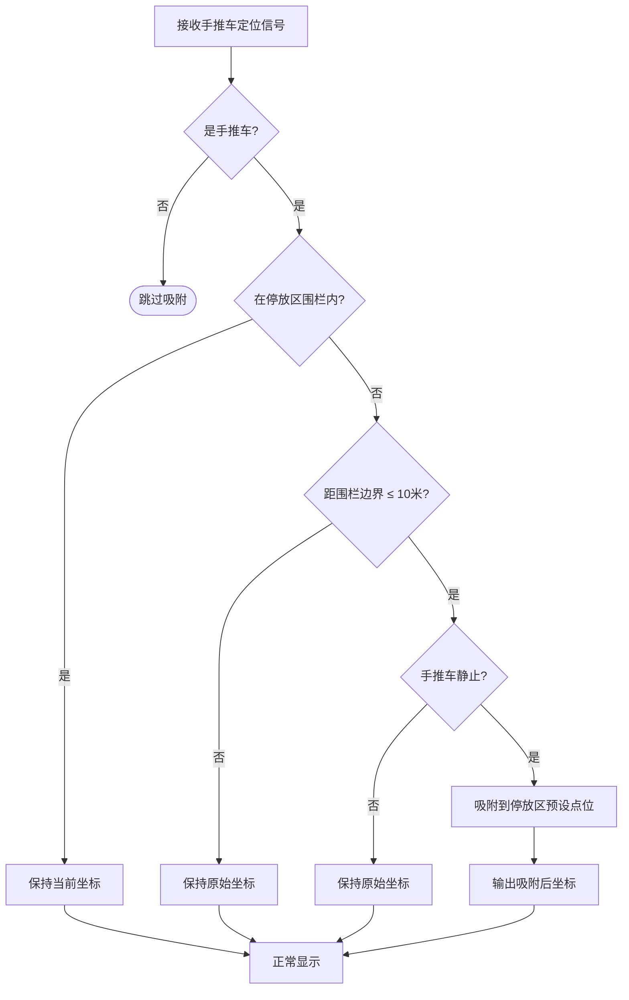
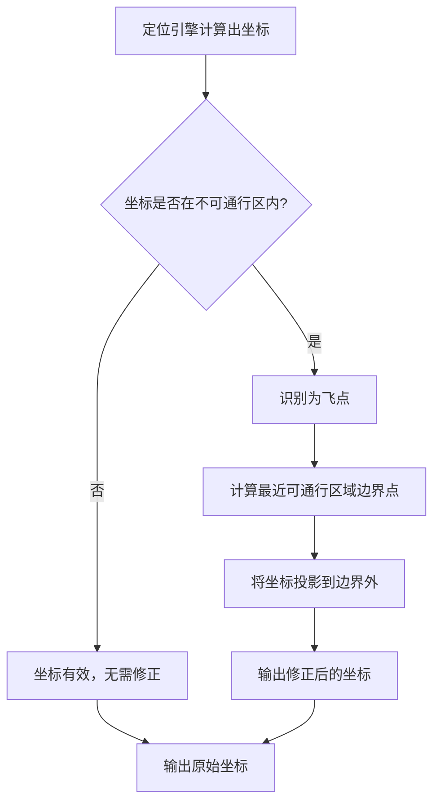
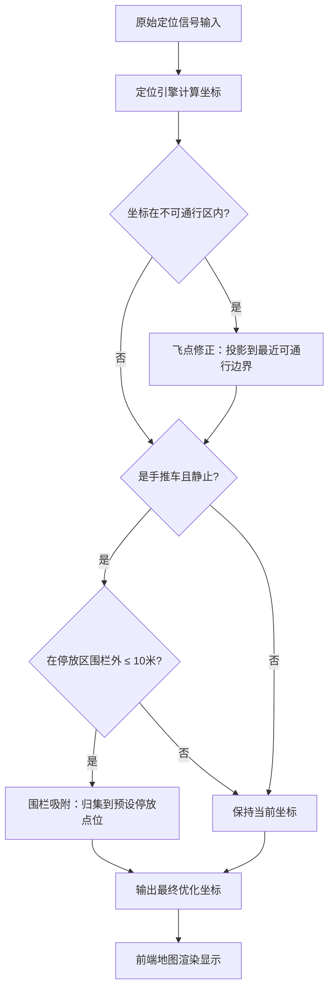

# 定位算法优化方案

通过定位算法优化，提升广州机场室内定位系统的呈现效果。主要解决两类场景问题：电子围栏吸附（手推车停放区信号散射）和不可通行区飞点过滤（值机岛、行李转盘等区域）。

---

## 1. 电子围栏吸附功能（手推车停放区）

### 问题分析

手推车停放区由于手推车遮挡，导致信号散射问题：

- 手推车金属结构对定位信号产生遮挡和反射
- 信号在停放区内呈现散射，定位点分布散乱
- 前端地图上手推车位置显示不集中，影响管理效果

### 解决办法

针对手推车和手推车停放区域，通过电子围栏吸附算法优化呈现效果：

1. 在系统中划定手推车停放区的电子围栏区域
2. 当手推车定位点在停放区围栏外、但距离围栏边界 10 米以内、且手推车处于静止状态时，触发吸附
3. 将手推车坐标吸附到停放区围栏内的预设停放点位
4. 前端呈现时，手推车图标整齐排列在停放区内，效果清晰直观

### 触发条件

需同时满足以下三个条件：

- 对象类型为手推车
- 定位点在停放区围栏外，但距围栏边界 ≤ 10 米
- 手推车处于静止状态（未移动）

### 流程图

---

## 2. 不可通行区不定位（飞点过滤）

### 问题分析

值机岛和行李转盘等不可通行区域容易出现飞点，影响呈现效果：

- 由于信号遮挡和多径效应，定位算法偶尔会计算出落在不可通行区域内的坐标（飞点）
- 值机岛、行李转盘等区域物理上不可能有人或设备通行
- 飞点出现在这些区域会导致前端显示异常，降低系统可信度

### 解决办法

将所有不可通行区域在系统里标注出来，通过算法将飞点优化到不可通行区外：

1. 在系统地图中标注所有不可通行区域（值机岛、行李转盘、墙体、柱子等）
2. 定位引擎计算出坐标后，检测该点是否落入不可通行区
3. 若检测到飞点，将其投影到最近的可通行区域边界上
4. 确保前端地图上不会出现不合理的定位显示

### 流程图

---

## 整体算法处理流程

---

## 效果对比

| 场景 | 优化前 | 优化后 |
|------|--------|--------|
| 手推车停放区 | 定位点散射分布，显示混乱 | 定位点归集到停放区内，整齐排列 |
| 值机岛/行李转盘 | 偶发飞点，显示在不可通行区域 | 飞点被修正到可通行区域，无异常显示 |
