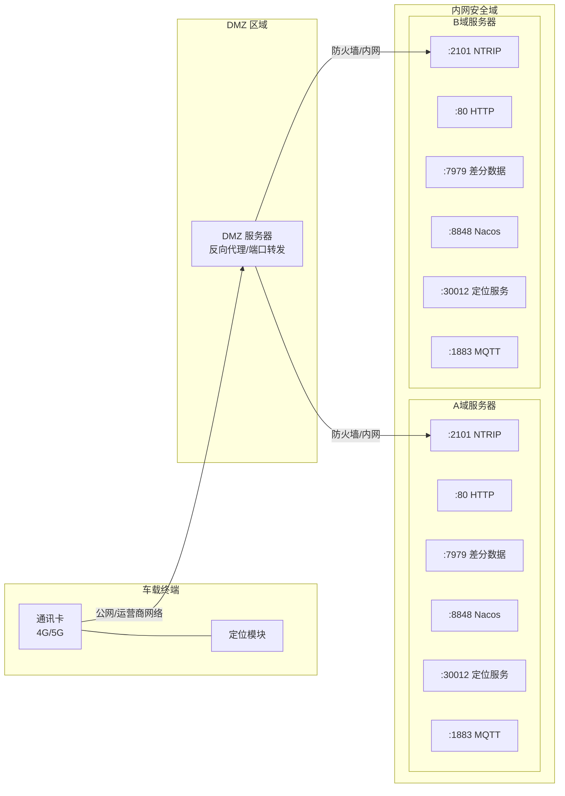
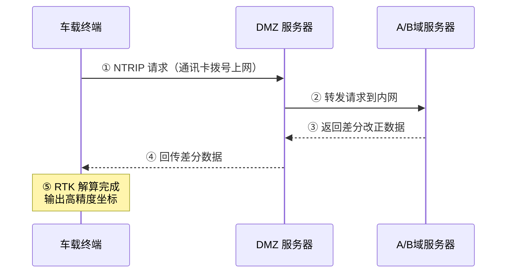
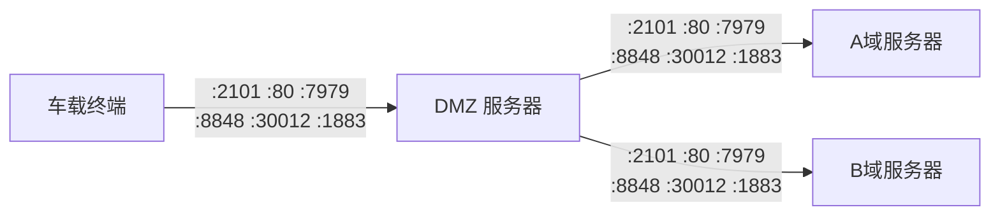

# 车载终端差分服务网络方案

## 1. 背景

广州机场车载终端需要接入差分定位服务（RTK/NTRIP），以获取高精度定位能力。车载终端通过自身通讯卡（4G/5G）接入网络，但差分服务部署在内网 A/B 域服务器上，无法直接访问。因此需要通过 DMZ 服务器作为中间代理，将车载终端的请求转发至内网差分服务。

## 2. 网络架构

### 2.1 整体拓扑

### 2.2 数据流向

流向说明：

1. 车载终端通过通讯卡拨号上网，向 DMZ 服务器发起 NTRIP 差分请求
2. DMZ 服务器将请求转发到内网 A/B 域差分服务器
3. A/B 域差分服务器返回差分改正数据
4. DMZ 服务器将差分数据回传给车载终端
5. 车载终端完成 RTK 解算，输出高精度坐标

## 3. 端口与服务说明

| 端口 | 协议 | 服务说明 | 用途 |
|------|------|---------|------|
| **2101** | TCP | NTRIP Caster 服务 | 差分数据播发，车载终端通过此端口获取 RTK 差分改正数据 |
| **80** | TCP | HTTP 服务 | 差分服务 Web 管理界面 / NTRIP 源列表获取 |
| **7979** | TCP | 差分数据服务 | 差分基站数据接收与分发服务 |
| **8848** | TCP | Nacos 配置中心 | 服务注册与配置管理（微服务架构） |
| **30012** | TCP | 定位数据服务 | 车载终端定位数据上报与下发 |
| **1883** | TCP | MQTT Broker | 车载终端消息通讯（物联网协议） |

## 4. 需要开通的访问策略

### 4.1 策略总览

### 4.2 防火墙策略明细

#### 策略一：公网 → DMZ（车载终端到 DMZ 服务器）

| 序号 | 源地址 | 目的地址 | 目的端口 | 协议 | 方向 | 说明 |
|------|--------|---------|---------|------|------|------|
| 1 | 车载终端 IP 段 | DMZ 服务器 IP | 2101 | TCP | 入站 | NTRIP 差分数据 |
| 2 | 车载终端 IP 段 | DMZ 服务器 IP | 80 | TCP | 入站 | HTTP 服务 |
| 3 | 车载终端 IP 段 | DMZ 服务器 IP | 7979 | TCP | 入站 | 差分数据服务 |
| 4 | 车载终端 IP 段 | DMZ 服务器 IP | 8848 | TCP | 入站 | Nacos 配置中心 |
| 5 | 车载终端 IP 段 | DMZ 服务器 IP | 30012 | TCP | 入站 | 定位数据服务 |
| 6 | 车载终端 IP 段 | DMZ 服务器 IP | 1883 | TCP | 入站 | MQTT 消息通讯 |

#### 策略二：DMZ → 内网 A 域（DMZ 服务器到 A 域服务器）

| 序号 | 源地址 | 目的地址 | 目的端口 | 协议 | 方向 | 说明 |
|------|--------|---------|---------|------|------|------|
| 1 | DMZ 服务器 IP | A域 服务器 IP | 2101 | TCP | 入站 | NTRIP 差分数据转发 |
| 2 | DMZ 服务器 IP | A域 服务器 IP | 80 | TCP | 入站 | HTTP 服务转发 |
| 3 | DMZ 服务器 IP | A域 服务器 IP | 7979 | TCP | 入站 | 差分数据服务转发 |
| 4 | DMZ 服务器 IP | A域 服务器 IP | 8848 | TCP | 入站 | Nacos 配置中心转发 |
| 5 | DMZ 服务器 IP | A域 服务器 IP | 30012 | TCP | 入站 | 定位数据服务转发 |
| 6 | DMZ 服务器 IP | A域 服务器 IP | 1883 | TCP | 入站 | MQTT 消息通讯转发 |

#### 策略三：DMZ → 内网 B 域（DMZ 服务器到 B 域服务器）

| 序号 | 源地址 | 目的地址 | 目的端口 | 协议 | 方向 | 说明 |
|------|--------|---------|---------|------|------|------|
| 1 | DMZ 服务器 IP | B域 服务器 IP | 2101 | TCP | 入站 | NTRIP 差分数据转发 |
| 2 | DMZ 服务器 IP | B域 服务器 IP | 80 | TCP | 入站 | HTTP 服务转发 |
| 3 | DMZ 服务器 IP | B域 服务器 IP | 7979 | TCP | 入站 | 差分数据服务转发 |
| 4 | DMZ 服务器 IP | B域 服务器 IP | 8848 | TCP | 入站 | Nacos 配置中心转发 |
| 5 | DMZ 服务器 IP | B域 服务器 IP | 30012 | TCP | 入站 | 定位数据服务转发 |
| 6 | DMZ 服务器 IP | B域 服务器 IP | 1883 | TCP | 入站 | MQTT 消息通讯转发 |

> **说明**：A 域和 B 域均需开通相同的 6 个端口访问策略，确保 DMZ 服务器可以将流量转发到任一域的服务器。

## 5. 实施步骤

| 步骤 | 内容 | 负责方 | 备注 |
|------|------|--------|------|
| 1 | 确认 DMZ 服务器 IP 及 A/B 域服务器 IP | 机场信息中心 | 提供具体 IP 地址 |
| 2 | 提交防火墙策略申请（公网→DMZ） | 我方 + 机场信息中心 | 按 4.2 策略一 |
| 3 | 提交防火墙策略申请（DMZ→A/B域） | 我方 + 机场信息中心 | 按 4.2 策略二 |
| 4 | DMZ 服务器部署端口转发服务 | 我方 | Nginx stream 或 iptables |
| 5 | 车载终端配置差分服务地址 | 我方 | 指向 DMZ 服务器 IP |
| 6 | 端到端联调测试 | 我方 | 验证各端口连通性及差分数据 |
| 7 | 验收确认 | 双方 | 确认高精度定位正常工作 |

## 6. 测试验证

联调时需逐一验证以下内容：

- [ ] 车载终端能通过通讯卡访问 DMZ 服务器各端口
- [ ] DMZ 服务器能正常转发流量到 A/B 域服务器
- [ ] 端口 2101：NTRIP 差分数据流正常，终端能获取 RTK 固定解
- [ ] 端口 80：HTTP 服务可访问，源列表可获取
- [ ] 端口 7979：差分数据服务连接正常
- [ ] 端口 8848：Nacos 服务注册与配置读取正常
- [ ] 端口 30012：定位数据上报与下发正常
- [ ] 端口 1883：MQTT 消息通讯连接正常
- [ ] 长时间运行稳定性测试（建议 ≥ 24 小时）
