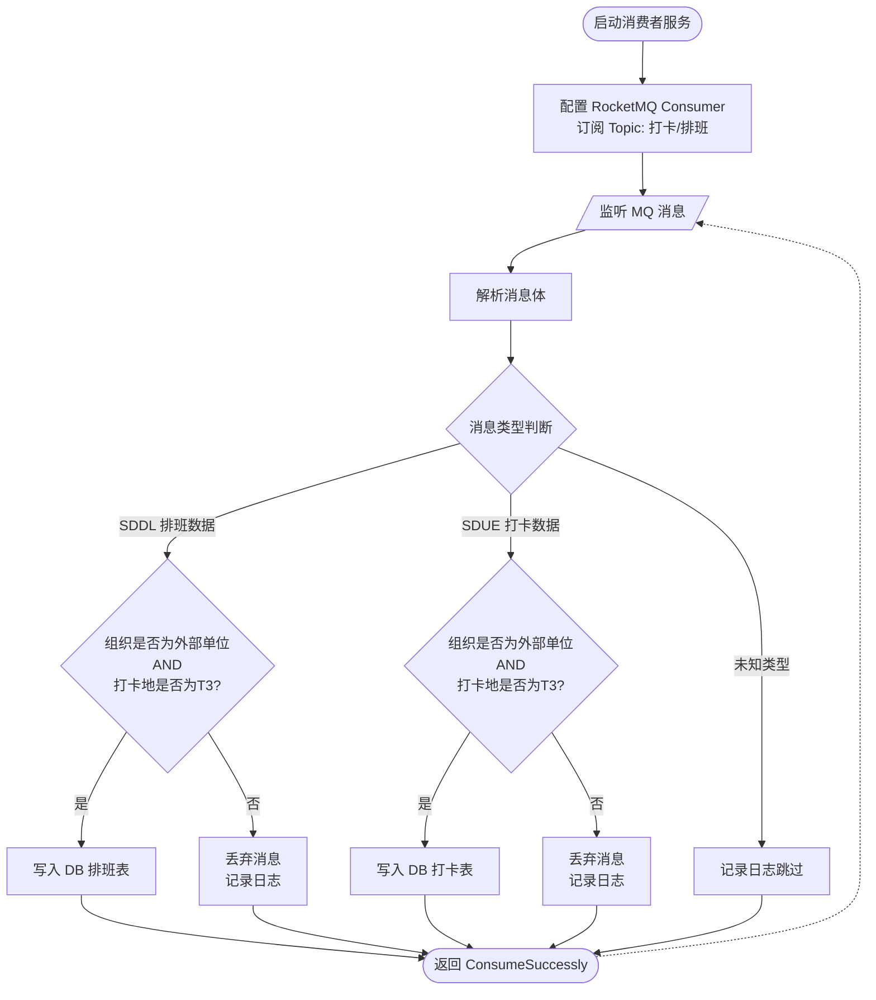
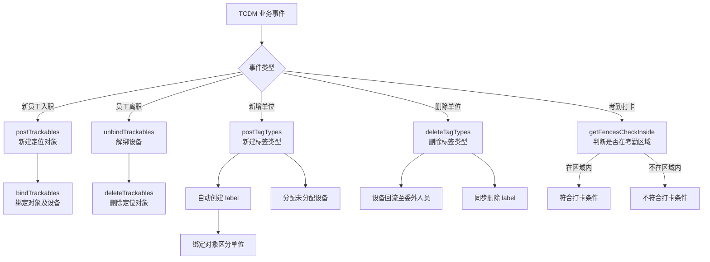

# 综合定位与 TCDM 对接流程图

## 流程说明

综合定位系统通过 RocketMQ 消费 TCDM 推送的排班（SDDL）和打卡（SDUE）数据，筛选外部单位 + T3 打卡地的有效数据写入数据库。

## 流程图

## 关键节点说明

| 节点 | 说明 |
|------|------|
| Topic | TCDM 通过 RocketMQ 推送排班和打卡两类消息 |
| SDDL | 排班数据消息类型标识 |
| SDUE | 打卡数据消息类型标识 |
| 外部单位过滤 | 只处理外部单位（非机场内部员工）的数据 |
| T3 打卡地过滤 | 只处理 T3 航站楼相关的打卡地点数据 |
| ConsumeSuccessly | 无论是否写入 DB，均返回消费成功，避免消息重复投递 |

---

## TCDM 调用综合定位接口

---

## 接口汇总

| 接口 | 方向 | 说明 |
|------|------|------|
| `/XIY/LBS/postTrackables` | TCDM → 综合定位 | 新建定位对象 |
| `/XIY/LBS/bindTrackables` | TCDM → 综合定位 | 批量绑定定位对象及设备 |
| `/XIY/LBS/deleteTrackables` | TCDM → 综合定位 | 删除定位对象 |
| `/XIY/LBS/postTagTypes` | TCDM → 综合定位 | 新建定位标签类型 |
| `/XIY/LBS/deleteTagTypes` | TCDM → 综合定位 | 删除定位标签类型 |
| `/XIY/LBS/getFencesCheckInside` | TCDM → 综合定位 | 判断人员是否在考勤区域内 |
| RocketMQ (SDDL/SDUE) | TCDM → 综合定位 | 推送排班及打卡数据 |
