**综合定位系统运维白皮书** {align="center"}

---

修订记录

<lark-table rows="5" cols="6" column-widths="115,115,115,115,115,115">

  <lark-tr>
    <lark-td>
      **版本号** {align="center"}
    </lark-td>
    <lark-td>
      **修订日期** {align="center"}
    </lark-td>
    <lark-td>
      **修订内容** {align="center"}
    </lark-td>
    <lark-td>
      **修订人** {align="center"}
    </lark-td>
    <lark-td>
      **审核人** {align="center"}
    </lark-td>
    <lark-td>
      **备注说明** {align="center"}
    </lark-td>
  </lark-tr>
  <lark-tr>
    <lark-td>
      V1.0
    </lark-td>
    <lark-td>
      2025.10.21
    </lark-td>
    <lark-td>
      设计文档格式，进行内容整合。
    </lark-td>
    <lark-td>
      石佳鑫、刘秉欣、陆东、黄家琪
    </lark-td>
    <lark-td>
    </lark-td>
    <lark-td>
    </lark-td>
  </lark-tr>
  <lark-tr>
    <lark-td>
    </lark-td>
    <lark-td>
    </lark-td>
    <lark-td>
    </lark-td>
    <lark-td>
    </lark-td>
    <lark-td>
    </lark-td>
    <lark-td>
    </lark-td>
  </lark-tr>
  <lark-tr>
    <lark-td>
    </lark-td>
    <lark-td>
    </lark-td>
    <lark-td>
    </lark-td>
    <lark-td>
    </lark-td>
    <lark-td>
    </lark-td>
    <lark-td>
    </lark-td>
  </lark-tr>
  <lark-tr>
    <lark-td>
    </lark-td>
    <lark-td>
    </lark-td>
    <lark-td>
    </lark-td>
    <lark-td>
    </lark-td>
    <lark-td>
    </lark-td>
    <lark-td>
    </lark-td>
  </lark-tr>
</lark-table>

---

目录 {align="center"}
一、 引言5
二、 系统总览6
（一） 系统简介6
（二） 技术栈6
（三） 设备清单7
（四） 设备拓扑8
（五） 逻辑架构8
（六） 数据流11
（七） 网络环境13
三、 系统功能14
（一） 功能说明14
（二） 用户单位19
（三） 用户手册20
（四） 业务规则20
（五） 组件运行机制25
四、 系统配置27
（一） 进程清单27
（二） 配置文档27
（三） 数据结构28
（四） 应用备份29
（五） 数据备份29
（六） 系统变更30
1、系统变更制度30
2、 变更前检查清单30
3、 业务全流程检查清单31
五、 运维规范33
（一） 系统巡检33
（二） 系统监控34
（三） 系统保养35
（四） 运维操作37
（五） 故障处置38
1、 故障处置手册38
2、 系统应急预案39
3、 维保信息清单39
六、 培训体系40
（一） 学习路径40
（二） 培训评估41
---

# 引言
本手册主要面向新入职员工、系统维护人员，提供一份**结构化、标准化、体系化**的系统学习与操作参考资料。本手册系统性的展示当前系统的架构设计、功能模块、配置规范、维护要求等各方面信息，帮助维护人员**全面、快速、清晰**地理解和掌握系统相关内容，确保知识易于查阅、方便维护、能够持续传承。
本手册的编制目标是成为系统各项知识的**统一入口**，无论是系统功能、操作方法、配置方式，还是运行机制、处理规则，都可以通过本手册快速定位查阅。在编制和维护过程中，如遇某些内容因篇幅、格式限制不便于写入正文，手册编写时可提供链接指向飞越文档中心上的其他相关文档，确保信息完整、可追溯。
本手册由系**统管理员负责维护**，原则上**每年**统一更新一次。如遇系统配置或规则变更，系统管理员应**及时**对文档进行同步更新，以保证内容的准确性和时效性。

# 系统总览
## 系统简介
综合定位系统对于广州白云机场“智慧机场”的建设意义重大，机场定位系统不但与旅客的登机体验、机场安全、设施资产的科学管理相关，而且与工作人员的服务管理、应急响应、突发事件处理也密切相关。机场的定位系统的应用主要涵盖以下三个方面：
（1）机场中的“人”定位：包括工作人员的定位、转场旅客的定位、以及其他人员的定位。
（2）机场中的“物”定位：包括设施的定位、登机口定位、运行设备的定位、以及其他相关物的定位。
（3）机场定位“数据”应用：定位的数据可以服务于旅客、服务于场内管理、服务于信息发布推广等其他方面。
综合定位系统在航站楼和GTC内为旅客提供高精度定位导航服务，并进一步对各层的出入口、电梯口、安检口、主要通道交叉口、工作区等核心区域内的工作人员、手推车等相关设备进行精准定位，收集人员和设备的位置数据，从而进行管理与监控，为不同用户和相关人员提供室内外一体的全新位置服务体验，为机场需要使用定位导航功能以及位置数据的系统提供位置服务支持。
## 技术栈

<lark-table rows="13" cols="4" column-widths="172,172,173,173">

  <lark-tr>
    <lark-td>
      **类别** {align="center"}
    </lark-td>
    <lark-td>
      **技术名称** {align="center"}
    </lark-td>
    <lark-td>
      **版本号** {align="center"}
    </lark-td>
    <lark-td>
      **用途说明** {align="center"}
    </lark-td>
  </lark-tr>
  <lark-tr>
    <lark-td>
      操作系统
    </lark-td>
    <lark-td>
      Kylin-Server-V10
    </lark-td>
    <lark-td>
      Sp3
    </lark-td>
    <lark-td>
      生产环境服务器
    </lark-td>
  </lark-tr>
  <lark-tr>
    <lark-td>
      数据库
    </lark-td>
    <lark-td>
      Postgresql
    </lark-td>
    <lark-td>
      14.2.0
    </lark-td>
    <lark-td>
      负责数据存储
    </lark-td>
  </lark-tr>
  <lark-tr>
    <lark-td>
      缓存
    </lark-td>
    <lark-td>
      Redis
    </lark-td>
    <lark-td>
      6.0
    </lark-td>
    <lark-td>
      负责应用缓存
    </lark-td>
  </lark-tr>
  <lark-tr>
    <lark-td>
      消息中间件
    </lark-td>
    <lark-td>
      RabbitMQ
    </lark-td>
    <lark-td>
      3.6.14
    </lark-td>
    <lark-td>
      通过消息队列实现应用进程之间的异步通讯
    </lark-td>
  </lark-tr>
  <lark-tr>
    <lark-td>
      代理
    </lark-td>
    <lark-td>
      Nginx
    </lark-td>
    <lark-td>
      1.12.2
    </lark-td>
    <lark-td>
      通过nginx和keepalived实现代理的高可用和负债均衡
    </lark-td>
  </lark-tr>
  <lark-tr>
    <lark-td>
      高可用
    </lark-td>
    <lark-td>
      Keepalived
    </lark-td>
    <lark-td>
      3.1.0
    </lark-td>
    <lark-td>
      通过nginx和keepalived实现代理的高可用和负债均衡
    </lark-td>
  </lark-tr>
  <lark-tr>
    <lark-td>
      操作系统
    </lark-td>
    <lark-td>
      Kylin-Server-V10
    </lark-td>
    <lark-td>
      Sp3
    </lark-td>
    <lark-td>
      生产环境服务器
    </lark-td>
  </lark-tr>
  <lark-tr>
    <lark-td>
      微服务架构
    </lark-td>
    <lark-td>
      spring cloud
    </lark-td>
    <lark-td>
      1.0.0
    </lark-td>
    <lark-td>
      通过注册中心和微服务架构实现整个系统的高可用和模块化进程
    </lark-td>
  </lark-tr>
  <lark-tr>
    <lark-td>
      部署和运维
    </lark-td>
    <lark-td>
      ansible
    </lark-td>
    <lark-td>
      2.4.2.0
    </lark-td>
    <lark-td>
      程序快速部署和更新
    </lark-td>
  </lark-tr>
  <lark-tr>
    <lark-td>
      基础架构
    </lark-td>
    <lark-td>
      VMware vCenter
    </lark-td>
    <lark-td>
      6.7
    </lark-td>
    <lark-td>
      生产服务器在云平台进行虚拟化部署
    </lark-td>
  </lark-tr>
  <lark-tr>
    <lark-td>
      基础架构
    </lark-td>
    <lark-td>
      H3C CAS
    </lark-td>
    <lark-td>
      3.0
    </lark-td>
    <lark-td>
      应急服务器在云平台进行虚拟化部署
    </lark-td>
  </lark-tr>
  <lark-tr>
    <lark-td>
      算法
    </lark-td>
    <lark-td>
      gurobi
    </lark-td>
    <lark-td>
    </lark-td>
    <lark-td>
      资源数据的分配计算程序
    </lark-td>
  </lark-tr>
</lark-table>

## 设备清单
综合定位系统在生产环境进行了部署，核心设备主要包括应用服务器、资源服务器、接口服务器、数据库服务器、代理服务器等。
生产环境部署于T3基础云平台，其中A/B域各包含10台虚拟机，A域主要支撑系统各核心功能模块的运行；B域用于系统故障时的快速切换与业务恢复；
详细设备清单如下：
A域名

<lark-table rows="9" cols="3" column-widths="117,475,121">

  <lark-tr>
    <lark-td>
      10.120.79.41
    </lark-td>
    <lark-td>
      综合定位服务器(T3YW-ZHDW-01)
    </lark-td>
    <lark-td>
      集群master
    </lark-td>
  </lark-tr>
  <lark-tr>
    <lark-td>
      10.120.78.44
    </lark-td>
    <lark-td>
      综合定位服务器(T3YW-ZHDW-02)
    </lark-td>
    <lark-td>
      集群worker
    </lark-td>
  </lark-tr>
  <lark-tr>
    <lark-td>
      10.120.20.67
    </lark-td>
    <lark-td>
      综合定位DMZ区应用服务器(T3YW-ZHDW-DMZ-01)
    </lark-td>
    <lark-td>
      集群业务应用worker
    </lark-td>
  </lark-tr>
  <lark-tr>
    <lark-td>
      10.120.20.68
    </lark-td>
    <lark-td>
      综合定位DMZ区应用服务器(T3YW-ZHDW-DMZ-02)
    </lark-td>
    <lark-td>
      集群业务应用worker
    </lark-td>
  </lark-tr>
  <lark-tr>
    <lark-td>
      10.120.79.152
    </lark-td>
    <lark-td>
      综合定位GNSS服务器(T3YW-ZHDW-GNSS-01)
    </lark-td>
    <lark-td>
      GNSS服务器1
    </lark-td>
  </lark-tr>
  <lark-tr>
    <lark-td>
      10.120.79.72
    </lark-td>
    <lark-td>
      综合定位GNSS服务器(T3YW-ZHDW-GNSS-02)
    </lark-td>
    <lark-td>
      GNSS服务器2
    </lark-td>
  </lark-tr>
  <lark-tr>
    <lark-td>
      10.120.80.106
    </lark-td>
    <lark-td>
      负载均衡集群系统-01 (T3YW-ZHDW-LinuxVirtualServer-01)
    </lark-td>
    <lark-td>
      集群master
      VIP入口
    </lark-td>
  </lark-tr>
  <lark-tr>
    <lark-td>
      10.120.79.4
    </lark-td>
    <lark-td>
      综合定位数据库服务器(T3YW-ZHDW-DATABASE-01)
    </lark-td>
    <lark-td>
      集群数据库
    </lark-td>
  </lark-tr>
  <lark-tr>
    <lark-td>
      10.120.79.102
    </lark-td>
    <lark-td>
      综合定位数据库服务器(T3YW-ZHDW-DATABASE-02)
    </lark-td>
    <lark-td>
      集群数据库
    </lark-td>
  </lark-tr>
</lark-table>

B域名

<lark-table rows="7" cols="3" column-widths="117,474,122">

  <lark-tr>
    <lark-td>
      10.120.78.199
    </lark-td>
    <lark-td>
      综合定位服务器(T3YW-ZHDW-01)
    </lark-td>
    <lark-td>
      集群master
    </lark-td>
  </lark-tr>
  <lark-tr>
    <lark-td>
      10.120.78.200
    </lark-td>
    <lark-td>
      综合定位服务器(T3YW-ZHDW-02)
    </lark-td>
    <lark-td>
      集群worker
    </lark-td>
  </lark-tr>
  <lark-tr>
    <lark-td>
      10.120.78.7
    </lark-td>
    <lark-td>
      综合定位GNSS服务器(T3YW-ZHDW-GNSS-01)
    </lark-td>
    <lark-td>
      GNSS服务器1
    </lark-td>
  </lark-tr>
  <lark-tr>
    <lark-td>
      10.120.79.128
    </lark-td>
    <lark-td>
      综合定位GNSS服务器(T3YW-ZHDW-GNSS-02)
    </lark-td>
    <lark-td>
      GNSS服务器2
    </lark-td>
  </lark-tr>
  <lark-tr>
    <lark-td>
      10.120.79.207
    </lark-td>
    <lark-td>
      负载均衡集群系统-02 (T3YW-ZHDW-LinuxVirtualServer-02)
    </lark-td>
    <lark-td>
      集群master
      VIP入口
    </lark-td>
  </lark-tr>
  <lark-tr>
    <lark-td>
      10.120.78.74
    </lark-td>
    <lark-td>
      综合定位数据库服务器(T3YW-ZHDW-DATABASE-01)
    </lark-td>
    <lark-td>
      集群数据库
    </lark-td>
  </lark-tr>
  <lark-tr>
    <lark-td>
      10.120.79.197
    </lark-td>
    <lark-td>
      综合定位数据库服务器(T3YW-ZHDW-DATABASE-02)
    </lark-td>
    <lark-td>
      集群数据库
    </lark-td>
  </lark-tr>
</lark-table>

VIP入口 10.120.78.131

<lark-table rows="2" cols="3" column-widths="114,483,114">

  <lark-tr>
    <lark-td>
      10.120.78.106
    </lark-td>
    <lark-td>
      负载均衡集群系统-01 (T3YW-ZHDW-LinuxVirtualServer-01)
    </lark-td>
    <lark-td>
      集群master 
      绑定VIP 10.120.78.131
    </lark-td>
  </lark-tr>
  <lark-tr>
    <lark-td>
      10.120.79.207
    </lark-td>
    <lark-td>
      负载均衡集群系统-02 (T3YW-ZHDW-LinuxVirtualServer-02)
    </lark-td>
    <lark-td>
      集群master 
      绑定VIP 10.120.78.131
    </lark-td>
  </lark-tr>
</lark-table>

## 设备拓扑

📊 **该系统的设备拓扑图如下：**
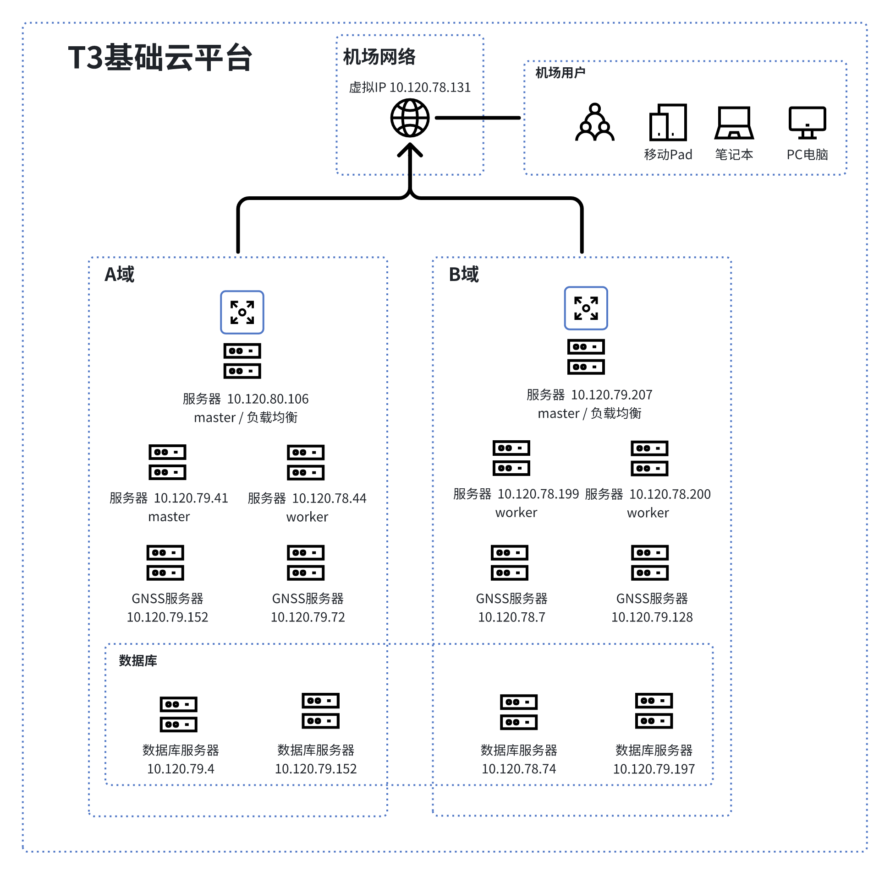

## 逻辑架构
综合定位系统基于 k3s 集群构建，由运维基础设施、业务服务层、中间件等多类程序组件组成，主要包括日志与监控系统、前后端服务、数据库、消息队列及各类功能程序组件。 
1. 运维基础设施： 
1. 日志系统 EFK：负责收集、存储、分析系统各组件的日志数据。 
2. 监控系统 Prometheus + Grafana：对系统各程序组件的性能、状态进行监控和可视化展示。 
2. 业务服务层（定位平台类）： 
- 前端 Frontend：
1. 管理平台 admin：提供系统管理、配置等功能的前端界面。 
2. 地图页面 map-mobile：实现地图相关业务展示的前端页面。 
3. 后端 Backend： 
1. 网关服务 gateway：提供统一的 API 入口，负责请求路由、身份认证、流量控制和安全校验。 
2. 位置服务 position：负责设备或人员的定位信息管理，包括位置上报、轨迹存储与查询、地理围栏等功能。 
3. 设备服务 device：管理设备的添加和修改、状态监控。 
4. 地图服务 map：提供地图数据渲染、POI、地理信息转换支持。 
5. 管理服务 management：实现系统配置、用户权限、组织架构及后台运营管理功能。 
6. 推送服务 notification：负责向前端或移动端推送实时消息。 
7. 接收服务 relay：负责接收外部系统或设备的数据上报，进行消息转发、协议解析及数据预处理。 3. 中间件
4. 数据库： 
1. 业务数据库 postgresql：存储系统核心业务数据，如位置数据、围栏数据、告警数据、设备数据等。 
2. 时序数据库 timescaledb：处理时序性数据存储与分析。 
3. 缓存数据库 redis：用于数据缓存，提升系统访问性能。 
5. 消息队列服务： 
（1）消息队列 rabbitmq：负责对各程序之间需要交互的消息进行传输，实现程序之间的解耦。例如，消息通过位置数据传输到综合定位系统系统后，由其进行中转，数据传输、消息推送、数据统计等交互的支持。
**📊 该系统的逻辑架构图如下：**
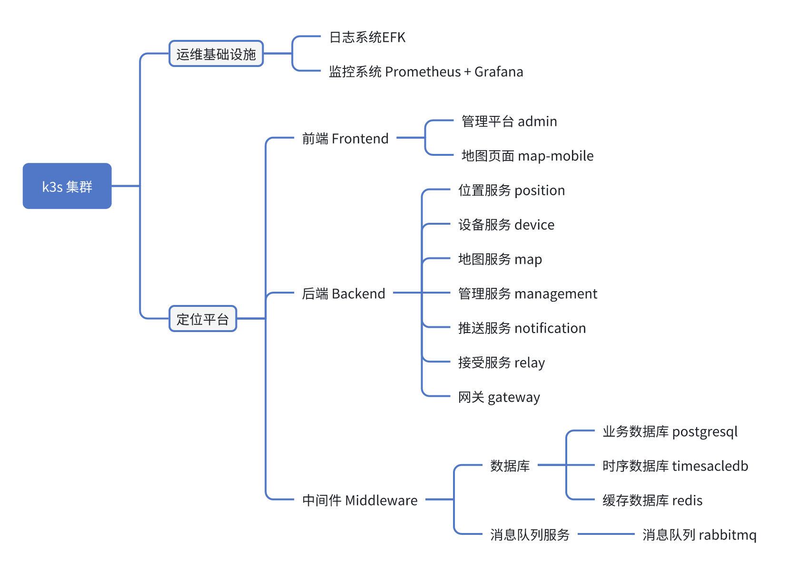

## 数据流
**1、接口程序说明**
（1）位置数据推送接口
- 对接的系统：AESB
- 通信方式：MQ
- 数据格式：XML
- 接口功能概述：数据接口程序通过AESB授予的API帐号acl-access-key和acl-access-secret，与AESB系统完成帐号密码认证并建立连接。接收消息：当接口认证完成后，位置接口程序会连接到AESB上的队列，并把位置数据发送至总线。

（2）告警数据推送接口
- 对接的系统：AESB
- 通信方式：MQ
- 数据格式：XML
- 接口功能概述：数据接口程序通过AESB授予的API帐号acl-access-key和acl-access-secret，与AESB系统完成帐号密码认证并建立连接。接收消息：当接口认证完成后，位置接口程序会连接到AESB上的队列，并把告警数据发送至总线。
**📊 该系统的数据流图如下：**
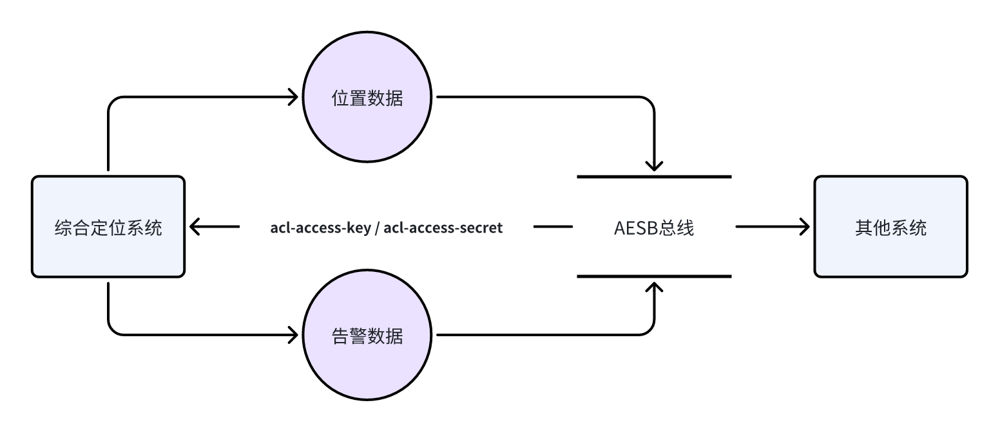

## 网络环境
1. 网络规划清单

<lark-table rows="7" cols="4" column-widths="176,119,198,198">

  <lark-tr>
    <lark-td>
      设备类别 {align="center"}
    </lark-td>
    <lark-td>
      所属网络 {align="center"}
    </lark-td>
    <lark-td>
      IP网段 {align="center"}
    </lark-td>
    <lark-td>
      备注说明 {align="center"}
    </lark-td>
  </lark-tr>
  <lark-tr>
    <lark-td>
      生产服务器 {align="center"}
    </lark-td>
    <lark-td>
      物联网 {align="center"}
    </lark-td>
    <lark-td>
      10.120.80.106 {align="center"}
      10.120.78.63 {align="center"}
      10.120.79.41 {align="center"}
      10.120.78.44 {align="center"}
      10.120.79.152 {align="center"}
      10.120.79.72 {align="center"}
      10.120.79.4 {align="center"}
      10.120.79.102 {align="center"}
      10.120.79.207 {align="center"}
      10.120.78.199 {align="center"}
      10.120.78.200 {align="center"}
      10.120.78.7 {align="center"}
      10.120.79.128 {align="center"}
      10.120.78.74 {align="center"}
      10.120.79.197 {align="center"}
    </lark-td>
    <lark-td>
      VIP：10.120.78.131 {align="center"}
    </lark-td>
  </lark-tr>
  <lark-tr>
    <lark-td>
      T2基础云平台 {align="center"}
    </lark-td>
    <lark-td>
      数据中心 {align="center"}
    </lark-td>
    <lark-td>
      10.128.10.99 {align="center"}
    </lark-td>
    <lark-td>
    </lark-td>
  </lark-tr>
  <lark-tr>
    <lark-td>
      股份云数据中心 {align="center"}
    </lark-td>
    <lark-td>
      物联网 {align="center"}
    </lark-td>
    <lark-td>
      10.128.250.21 {align="center"}
    </lark-td>
    <lark-td>
    </lark-td>
  </lark-tr>
  <lark-tr>
    <lark-td>
      标准AOA定位基站
      从基站
      长距离定位基站 {align="center"}
    </lark-td>
    <lark-td>
      物联网 {align="center"}
    </lark-td>
    <lark-td>
      10.173.240.0/24 {align="center"}
      10.173.241.0/24 {align="center"}
      10.173.242.0/24 {align="center"}
      10.173.243.0/24 {align="center"}
      10.173.244.0/24 {align="center"}
      10.173.245.0/24 {align="center"}
      10.173.246.0/24 {align="center"}
      10.173.247.0/24 {align="center"}
      10.173.248.0/24 {align="center"}
      10.173.249.0/24 {align="center"}
      10.173.250.0/24 {align="center"}
      10.173.251.0/24 {align="center"}
      10.174.7.0/24 {align="center"}
    </lark-td>
    <lark-td>
    </lark-td>
  </lark-tr>
  <lark-tr>
    <lark-td>
      DMZ服务器 {align="center"}
    </lark-td>
    <lark-td>
      DMZ区 {align="center"}
    </lark-td>
    <lark-td>
      10.120.20.67 {align="center"}
      10.120.20.68 {align="center"}
    </lark-td>
    <lark-td>
    </lark-td>
  </lark-tr>
  <lark-tr>
    <lark-td>
      互联网访问 {align="center"}
    </lark-td>
    <lark-td>
      无 {align="center"}
    </lark-td>
    <lark-td>
    </lark-td>
    <lark-td>
    </lark-td>
  </lark-tr>
</lark-table>

（二）网络策略清单
该系统目前涉及到的网络策略清单如下：

<lark-table rows="2" cols="6" column-widths="153,111,80,115,115,115">

  <lark-tr>
    <lark-td>
      策略用途说明 {align="center"}
    </lark-td>
    <lark-td>
      源地址 {align="center"}
    </lark-td>
    <lark-td>
      源端口 {align="center"}
    </lark-td>
    <lark-td>
      目的地址 {align="center"}
    </lark-td>
    <lark-td>
      目的端口 {align="center"}
    </lark-td>
    <lark-td>
      协议类型 {align="center"}
    </lark-td>
  </lark-tr>
  <lark-tr>
    <lark-td>
      终端访问综合定位系统页面
    </lark-td>
    <lark-td>
    </lark-td>
    <lark-td>
    </lark-td>
    <lark-td>
      10.120.78.131
    </lark-td>
    <lark-td>
      80
    </lark-td>
    <lark-td>
      TCP
    </lark-td>
  </lark-tr>
</lark-table>

详细策略请看《综合定位系统-网络策略》
# 系统功能
## 功能说明
综合定位系统是机场基础服务系统之一，通过卫星（GNSS）定位、蓝牙定位、WiFi定位、无线通信系统定位、5G定位等多类定位技术的集成和融合，为机场需要使用定位功能的系统提供可信、可靠的机场位置服务。。
**1.蓝牙信标设备管理**
支持在地图上添加，删除，修改、查看设备基础信息。可在地图上展示蓝牙信标部署位置，管理蓝牙信标在线状态及电量情况等。可获取蓝牙信标电量数据，当蓝牙信标电量达到阀值或蓝牙信标数据与监控数据不一致时，可根据设定状态以颜色区分不同级别的报警。
支持配置蓝牙信标用途（定位，营销，消费认证等）。提供获取特定用途/状态/范围的定位设备MAC地址的接口。
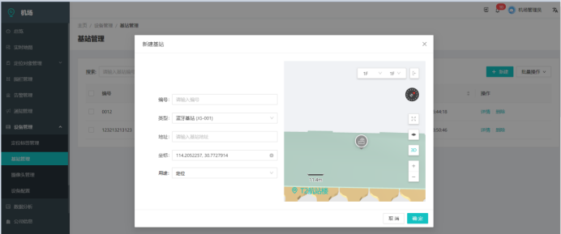

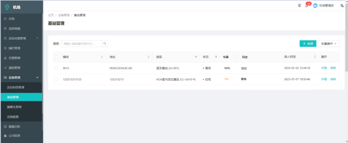

**2.AoA基站管理**
支持在地图上添加，删除，修改设备基础信息。 可在地图上展示AoA基站部署位置，管理AoA基站在线状态等。提供获取特定用途/状态/范围的定位设备MAC地址的接口。
<grid cols="2">
  <column width="50">
    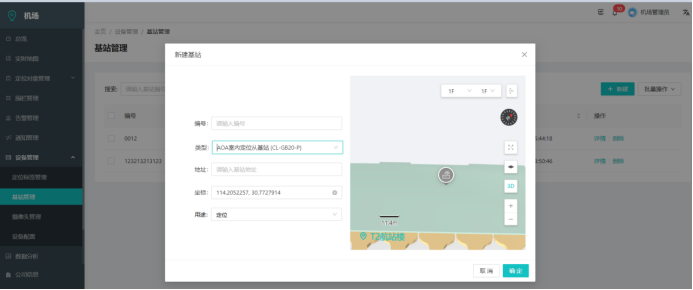

  </column>
  <column width="50">
     
  </column>
</grid>

**3.其他定位设备管理**
支持定位设备的注册、注销、状态监控、异常告警等管理功能。可在地图上展示定位设备的位置。
**4.设备分类**
系统能对接入的终端设备进行分类管理，能够实现终端设备注册、删除等操作，支持通过终端设备ID查询终端设备的注册信息。
**5.路径规划引擎**
进行多路径规划算法的有效结合（即混合算法）。本次基于机场工程地理信息系统的基础地图数据作为环境建模数据来源。路径搜索阶段是在环境模型的基础上应用相应算法寻找一条行走路径，使预定的性能函数获得最优值。
**6.热度统计**
系统通过蓝牙、无线wifi实现对旅客定位以及旅客所到区域的热度统计，并且结合GIS地图形成热度统计图。
<grid cols="2">
  <column width="50">
     
  </column>
  <column width="50">
    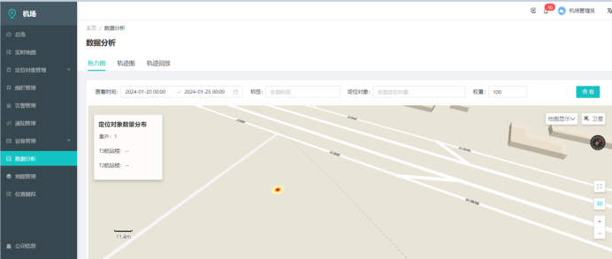

  </column>
</grid>

**7.智能预测**
系统支持对机场特殊区域，根据被动采集的wifi、蓝牙数据计算并预测该区域的旅客排队等待时间。
排队等待时间的统计方式为：
计算围栏（区域）内的总定位对象的数量S作为当前排队人数；
计算围栏栏（区域）内定位对象的平均排队时长T；
根据当前排队人数及平均排队时长计算用户的排队时长预测值；
**8.电子围栏**
系统支持新增、修改、删除电子围栏，围栏可以分为时间围栏、区域围栏、数量围栏，支持限制离开、限制进入、限时进入、限时离开、限制数额围栏。
<grid cols="2">
  <column width="50">
    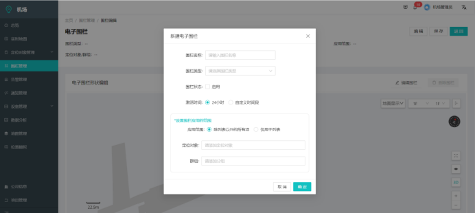

  </column>
  <column width="50">
     
  </column>
</grid>

**9.位置监控**
支持在线监控所定位车辆、终端设备、工作人员的位置，监管通过告警信息监管车辆、终端设备、工作人员。
<grid cols="2">
  <column width="50">
     
  </column>
  <column width="50">
    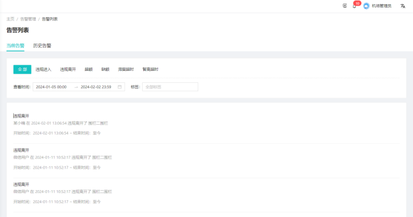

  </column>
</grid>

**10.轨迹回放**
系统支持所定位的旅客、工作人员/车辆的路程轨迹和行驶轨迹的查询和回放。可针对某一区域的用户进行密度分析、移动轨迹记录；
<grid cols="2">
  <column width="50">
    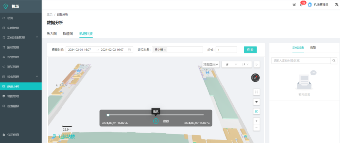

  </column>
  <column width="50">
     
  </column>
</grid>

**11.数据统计**
可按照时间段统计某区域的用户数量，可输入历史时间查询某处区域的用户密度，可按照日、周、月、年等不同时间进行用户的运动轨迹和停留时间查询。
<grid cols="2">
  <column width="50">
    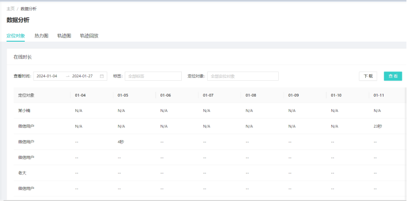

  </column>
  <column width="50">
     12.**系统管理**
  </column>
</grid>

系统可以实现对定位设备的配置管理、查询、统计、日志管理等日常操作维护功能。支持对操作日志、安全日志、系统日志的收集、保存、查询。
系统支持在管理层面对系统维护和管理人员进行用户账户管理及操作权限管理。
所有涉及综合定位系统的内部用户和外部系统用户必须经过正确认证才能够使用该系统。用户权限认证模块是进入系统的关键模块，其中包括了对用户身份的认证和根据用户权限加载系统，以及确定数据和服务管理、访问权限的功能。
**巡检APP**
**1.设备控制**
通过手持移动终端摄像头扫描需要识别的定位设备上的条码，查询该设备相关的信息，包括设备的配置以及位置信息等，也可以通过应用扫描周围定位设施后，依信号强弱展示设备列表。
**2.设备安装**
首次安装的设备，通过手持移动终端摄像头扫描设备上的标签，调取地图标记该设备所在位置，并更新该设备信息至后台数据库。对于需要更换的设备，可以通过系统找到需要更换的设备所在位置，用手持移动终端摄像头扫描新设备上的标签，并更新该设备信息至后台数据库。
**3.状态呈现**
管理每个接入设备连接状态，可以提供连接诊断、测试能力。支持基于终端设备的状态监控信息，判断终端设备的运行情况，当设备运行出现故障时，对故障进行问题分析，尝试确认故障位置。
**4.查询统计**
系统具有对所收集的数据进行统计，并能生成相应的统计报表：
本次扫描的设备列表及设备信号情况统计；
历史的设备巡检情况列表；
设备的连接状态、断线情况列表
**GNSS信号检测**
GNSS(全球导航卫星系统)信号监测可以对机场开展GNSS无线电信号的监测，对GNSS信号的用户接收性能、用户测距性能、用户授时性能等几方面开展监测评估。
1、 GNSS实时监测: 检测干扰信号
2、 GNSS性能分析: 可判断GNSS信号是否满足ICAO 附件十、DOC 8071的相关标准要求。
3、 电离层分析: 对GNSS信号的变化情况进行分析、预警等
4、数据记录分析: 对GNSS信号在时空上的分布进行分析
**手推车管理**
手推车管理和委外人员管理是一款根据人员、车辆定位信息为提供实时位置监控与作业轨迹分析的智能管理系统。通过蓝牙信标与UWB定位技术，精准识别手推车运行路径及委外人员活动范围，实现作业流程可视化、异常停留预警与合规操作审计，有效提升现场管理效率与安全管控水平。
**1.推车管理大屏**
可实时展示手推车位置分布、运行轨迹及状态信息。可链接到手推车本日轨迹页面。数据看板中可展示全部区域、指定区域的在线手推车数量、异常手推车数量、在线人数、异常人数；
在地图中，可切换展示展示手推车、人员、二者均展示。
可开启或关闭展示围栏，便于根据管理需求灵活调整地图信息密度。用不同的icon及颜色标识了不同类型的人员。当区域内手推车数量过多或过少时，系统将自动标红预警区域。
当有异常发生时，可点击左上角的红色铃铛标识，查看异常详情。可查看当日手推车的回收情况。
<grid cols="2">
  <column width="50">
    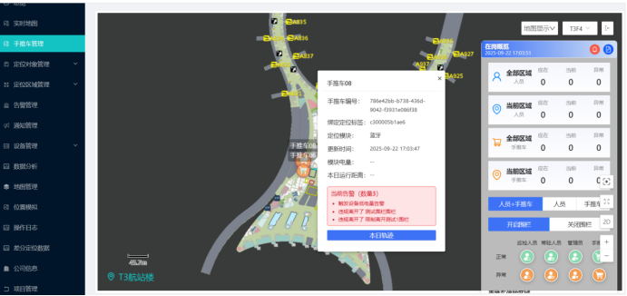

  </column>
  <column width="50">
     
  </column>
</grid>

**2.手推车回收任务的分发**
系统将定时查询当前已在非管理区停留超时的手推车，将待回收的手推车按照一定规则分配给管理员前去回收。系统将根据手推车附近区域内车辆的饱和情况，优先将手推车推荐回收至手推车过少的区域，以实现资源均衡。手推车回收任务的接收
管理员在手机内实时接收系统下发的手推车回收任务，任务内包含回收数量、本次回收的目的地。任务可【接收】即时执行，也可【关闭】后续执行。
<grid cols="2">
  <column width="50">
     
  </column>
  <column width="50">
    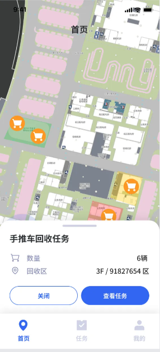

  </column>
</grid>

**3.手推车回收任务的执行**
手推车回收任务接收后，系统将根据管理员当前的定位，结合手推车的位置分布，为管理员推荐本次回收的最优路径，并动态规划途经的手推车回收顺序，提升作业效率。
管理员沿路径依次回收手推车，每完成一辆的归位，系统自动更新其状态为“已回收”，并同步至大屏与数据看板。移动端实时上传位置轨迹与操作记录，确保过程可追溯。
可收起手推车回收列表。
点击【开始回收】后，系统将自动更新本任务的执行状态。
任务已完成后，可手动点击【完成】结束任务。若执行任务中途被其他事务打算，可后续回来继续执行。任务中断期间，系统将持续监控已回收车辆状态。
<grid cols="3">
  <column width="33">
      
  </column>
  <column width="33">
    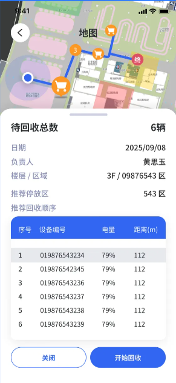

  </column>
  <column width="33">
    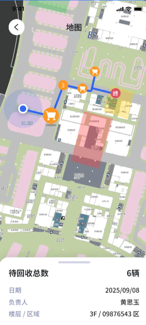

  </column>
</grid>

<grid cols="2">
  <column width="50">
    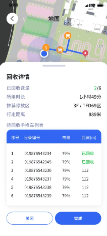

  </column>
  <column width="50">
    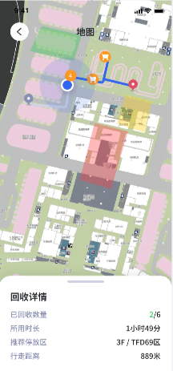

  </column>
</grid>

**4.手推车回收任务的管理**
手推车回收任务在手机端将通过任务列表的形式展示，可分类展示进行中的任务、等待执行的任务、已完成的任务。
可查看历史任务的执行详情、执行一半的任务、未来得及【接收】的任务，可点击【开始回收】继续执行。
<grid cols="3">
  <column width="33">
    

  </column>
  <column width="33">
    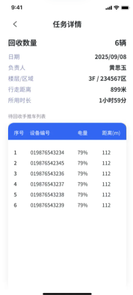

  </column>
  <column width="33">
    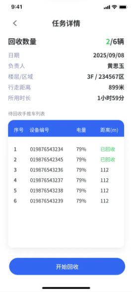

  </column>
</grid>

## 用户单位

<lark-table rows="3" cols="3" column-widths="230,230,230">

  <lark-tr>
    <lark-td>
      **使用单位** {align="center"}
    </lark-td>
    <lark-td>
      **涉及模块** {align="center"}
    </lark-td>
    <lark-td>
      **使用场景说明** {align="center"}
    </lark-td>
  </lark-tr>
  <lark-tr>
    <lark-td>
      物业调度部门
    </lark-td>
    <lark-td>
      手推车管理模块（web）
    </lark-td>
    <lark-td>
      负责手推车的绑定、停放区域的划分和位置监控等。
    </lark-td>
  </lark-tr>
  <lark-tr>
    <lark-td>
      新大正（手推车现场管理方）
    </lark-td>
    <lark-td>
      手推车APP
    </lark-td>
    <lark-td>
      负责手推车的回收及整理。
    </lark-td>
  </lark-tr>
</lark-table>

## 用户手册
用户操作手册作为独立文档进行维护，内容涵盖各业务功能模块的操作说明、注意事项等，主要是为了指导各用户单位人员规范使用系统，正确完成各项业务操作。
运维人员也可通过该手册深入了解系统功能逻辑，全面掌握前端操作与后台支撑之间的联动机制，从而提升故障处理效率与系统维护质量。操作手册访问入口如下：
[《综合定位平台操作手册》](https%3A%2F%2Fdoc.gdairport.com%3A8456%2Fweboffice%2Fl%2FsyatfZVpjkYHh)
[《手推车管理和委外人员管理操作手册》](https%3A%2F%2Fdoc.gdairport.com%3A8456%2Fweboffice%2Fl%2FssQABiQuyjTou)
<text color="blue">    </text>[《巡检APP操作手册》](https%3A%2F%2Fwww.kdocs.cn%2Fl%2FctEJ1szw8eIP)
## 业务规则
1. **综合定位系统规则**
支持时间围栏、区域围栏、数量围栏，支持限制离开、限制进入、限时进入、限时离开、限制数额围栏。
限制离开业务规则：若定位对象离开指定围栏，则记录数据，并告警；
限制进入业务规则：若定位对象进入指定围栏，则记录数据，并告警；
限时进入业务规则：若定位对象不在指定的时间段内进入指定围栏，则记录数据，并告警；
限时离开业务规则：若定位对象不在指定的时间段内离开指定围栏，则记录数据，并告警；
限制数额业务规则：若定位对象的进入或离开，导致指定围栏内的定位数量不足或超出一定数额，则记录数据，并告警。
多路径规划算法：即混合算法，本次基于机场工程地理信息系统的基础地图数据作为环境建模数据来源。路径搜索阶段是在环境模型的基础上应用相应算法寻找一条行走路径，使预定的性能函数获得最优值。
2. **手推车回收规则**
（1）手推车待回收状态的标记
①手推车的定位在非停放区停止移动X分钟后，将手推车的状态更新为“可回收”；
②若手推车发生了移动，判断手推车是否在管理员附近的2米处，否，说明手推车被旅客使用，则状态更新为“使用中”；是，说明手推车正在被管理员回收，当手推车跟随管理员移动5米时，将手推车状态更新为“已回收”；
（2）回收任务的创建
①系统每N分钟，创建一次回收任务：
A.找到当前状态为“可回收”的手推车；
B.再找到每个手推车X米范围内最近的“手推车数量不足的”管理区域：
若没有“手推车数量不足的”管理区域，则继续找X米范围内最近的“手推车数量正常“的管理区域；
若连“手推车数量正常“的区域也没有，则将X米放宽为X+100米，继续上面的逻辑寻找；直到找到1个区域。
②将每个手推车都对应到一个回收区域中，意味着该手推车要回收到这个区域里。
③将要被回收到同一个区域里的手推车们汇总，生成一条任务，将该任务推送给被回收区域的管理员们（可能共有多个管理员）；
数据举例：
手推车1，需要被回收到区域A；
手推车2，需要被回收到区域B；
手推车3，需要被回收到区域C；
手推车4，需要被回收到区域A；
手推车5，需要被回收到区域B；
手推车6，需要被回收到区域C；
手推车7，需要被回收到区域A；
手推车8，需要被回收到区域A；
手推车9，需要被回收到区域B；
区域A的管理员是张三；区域B的管理员是李四；区域C的管理员是王五，张三；
则生成3个任务：
任务1：被回收区域A，车辆1、4、7、8，任务接收人张三；
任务2：被回收区域B，车辆2、5、9，任务接收人李四；
任务3：被回收区域C，车辆3、6，任务接收人王五、张三；
 ④手推车的状态更新为“待回收”，任务的状态更新为“未执行”，更新任务创建时间、任务更新时间；
（3）回收任务定时关闭
①当日凌晨0:10，将昨日创建的状态为“未执行”、“执行中”的任务更新为“已关闭”状态；
巡检APP检测规则
（1）基础探测规则
①广播包监听（被动模式）：蓝牙基站通常会周期性发送广播包（Advertising Packet），包含设备ID、服务类型等信息。App启动后，通过BLE扫描监听周围广播。若在设定时间内（如30秒）持续收不到目标基站的广播包​（需匹配基站唯一标识，如MAC地址或设备名称），初步判定为离线。
②主动连接测试（主动模式）​​：对关键基站，App尝试发起GATT连接（BLE连接）。若连接成功且能读取/写入特征值（发送心跳指令并收到响应），则确认在线；若连接超时（5秒内无响应）或连接后立即断开，判定为离线。
（2）多条件综合验证规则：
①信号强度（RSSI）辅助判断​：
若广播包或连接的RSSI值持续低于阈值（如-90dBm），可能因信号遮挡（如金属机柜、墙体）导致，需结合历史数据对比：若同一位置历史RSSI均高于-85dBm，当前低于-90dBm可标记为“信号异常”，否则可能为离线。
②多次重试机制​：
单次探测失败不直接判定离线，需连续3次扫描/连接失败​（间隔5秒）才标记为离线，避免偶发干扰（如航班起降导致的无线信号波动）。
## 组件运行机制
对该系统使用的关键组件（如消息队列、集群软件等）的运行机制进行说明，重点描述其运行机制中非常规、特殊或容易被忽视但可能影响系统稳定性的重要逻辑，例如特别的主备切换机制、数据同步策略、组件依赖关系等。目的在于让运维人员提前了解这些关键运行特性，规避潜在操作风险。
1、RabbitMQ镜像队列机制
在综合定位系统中，部署了由三个节点组成的 RabbitMQ 集群。为确保消息队列的数据高可用性，每个队列都配置了两个镜像节点。
当新的消息写入队列或队列重启时，镜像队列会自动从主节点同步数据，从而保持数据一致性。若主节点发生故障，系统会从镜像队列中选举出运行时间最长的节点作为新的主节点，以保证消息服务的持续可用。
2、Keepalived+Haproxy高可用机制
在综合定位系统中，采用了双机部署的 Keepalived + Haproxy 方案。由 Keepalived 提供虚拟业务 IP（10.120.78.131），而 HAProxy 负责应用请求的负载均衡与反向代理。
当 Keepalived 监测到某一节点上的 Haproxy 服务发生故障时，会首先调用预设的脚本尝试重新启动 HAProxy；若重启仍失败，Keepalived 将主动停止该节点的自身服务，并将虚拟 IP 及访问流量自动切换至另一节点，确保系统业务的连续性与高可用性。
3. 数据库机制
在综合定位系统中，数据库集群由 4 台 PostgreSQL 服务节点组成，采用 Patroni + etcd 实现自动化主从切换与数据一致性管理。 Patroni 通过 etcd 分布式键值存储维护集群状态与主节点锁。当主库运行正常时，Patroni 持续向 etcd 更新“租约”信息，表示主节点仍有效；若主库失联或租约超时，集群会自动触发选主逻辑，由剩余节点通过 etcd 选举新的主节点。 在切换过程中，新主节点会从最新的同步节点中选出，确保数据一致性。旧主在重新上线时会自动降级为从库并通过 pg_basebackup 或流复制机制追平数据。
4. 集群高可用机制
综合定位系统的 Kubernetes 集群由 3 台 Master 节点 和多台 Worker 节点组成，Master 负责集群控制平面，Worker 承载实际业务容器。 与标准部署不同，本系统的 Kubernetes 未使用 etcd，而是通过外部数据库实现集群元数据存储与一致性管理。该数据库即前述由 Patroni+数据库集群 组成的高可用服务，用作 Kubernetes 的后端数据源，存放 Pod、Service、Config 等控制信息。 当任一 Master 节点故障时，其余 Master 节点会继续通过数据库访问集群状态，从而保持控制面的可用性。数据库层通过自身的主从切换（Patroni 机制）保证元数据的持续可访问性。

# 系统配置
## 进程清单
系统进程清单用于全面记录系统中各功能模块对应的运行服务信息，包括进程名称、部署服务器IP、监听端口、功能作用、启动与停止方式、日志路径等内容。该清单帮助运维人员在日常巡检、故障排查、系统部署等工作中快速定位问题，提高工作效率。
本清单结构一般较为复杂，作为独立的在线表格进行维护，请系统管理员确保信息实时更新。具体访问入口如下：
[《综合定位系统进程清单》](https%3A%2F%2Fdoc.gdairport.com%3A8456%2Fweboffice%2Fl%2FsuzcTpOhghSzk)

## 配置文档
系统配置说明用于全面记录系统各类基础组件的部署配置详情，涵盖**数据库、中间件、各类应用程序的端口号、配置文件路径、日志路径、个性化参数、各类计划任务配置、操作系统的防火墙配置、授权许可**等信息。
该文档帮助系统管理员在进行系统部署、配置核查、故障分析、参数调优等工作时，快速获取各组件的实际配置信息，从而提升问题处理效率，规避配置错误风险。
本文档结构一般较为复杂，作为独立的在线文档进行维护，请系统管理员确保信息实时更新。具体访问入口如下：
[《综合定位系统配置清单》](https%3A%2F%2Fdoc.gdairport.com%3A8456%2Fweboffice%2Fl%2Fsd17J1G44gNeQ)
## 数据结构
本章节用于说明系统数据库中各类业务数据表的结构设计，内容涵盖每张**数据表所存储的信息、字段定义及含义、字段约束条件、表与表之间的关联关系**，以及**数据表与系统业务功能之间的映射关系等**。通过对数据表结构的清晰梳理，帮助运维人员更好地理解系统的数据支撑逻辑，提升问题分析、数据管理的能力。
由于数据表结构信息通常较为复杂，本内容作为独立在线文档进行维护，由系统管理员负责定期更新与维护。具体访问入口如下：
[📄《数据库字典注释》](https%3A%2F%2Fdoc.gdairport.com%3A8456%2Fweboffice%2Fl%2FsOd4YELRWR7v0)
## 应用备份
定期执行脚本导出配置和镜像可一键备份
## 数据备份
定期执行脚本导出配置和镜像
## 系统变更
### 1、系统变更制度
综合定位系统遵循公司变更管理规定实施变更，[广东机场白云信息科技股份有限公司系统变更管理规定](https%3A%2F%2Fdoc.gdairport.com%3A8456%2Fweboffice%2Fl%2Fsuzckv3E5B06x)
### 变更前检查清单

<lark-table rows="11" cols="5" column-widths="178,142,172,128,88">

  <lark-tr>
    <lark-td>
      **检查项** {align="center"}
    </lark-td>
    <lark-td>
      **检查方法** {align="center"}
    </lark-td>
    <lark-td>
      **检查标准** {align="center"}
    </lark-td>
    <lark-td>
      **开始/结束时间** {align="center"}
    </lark-td>
    <lark-td>
      **检查结果** {align="center"}
    </lark-td>
  </lark-tr>
  <lark-tr>
    <lark-td>
      检查综合定位服务器资源使用情况 {align="center"}
    </lark-td>
    <lark-td>
      查看grafana监控平台
    </lark-td>
    <lark-td>
      Cpu、内存、磁盘使用情况趋势平稳 {align="center"}
    </lark-td>
    <lark-td>
    </lark-td>
    <lark-td>
    </lark-td>
  </lark-tr>
  <lark-tr>
    <lark-td>
      综合定位系统 {align="center"}
    </lark-td>
    <lark-td>
      总览 {align="center"}
    </lark-td>
    <lark-td>
      查看总览页面统计正确 {align="center"}
    </lark-td>
    <lark-td>
    </lark-td>
    <lark-td>
    </lark-td>
  </lark-tr>
  <lark-tr>
    <lark-td>
    </lark-td>
    <lark-td>
      实时地图 {align="center"}
    </lark-td>
    <lark-td>
      查看地图页面可以实时更新位置 {align="center"}
    </lark-td>
    <lark-td>
    </lark-td>
    <lark-td>
    </lark-td>
  </lark-tr>
  <lark-tr>
    <lark-td>
    </lark-td>
    <lark-td>
      手推车管理 {align="center"}
    </lark-td>
    <lark-td>
      可实时显示人员、手推车位置及告警，并可控制显示元素 {align="center"}
    </lark-td>
    <lark-td>
    </lark-td>
    <lark-td>
    </lark-td>
  </lark-tr>
  <lark-tr>
    <lark-td>
    </lark-td>
    <lark-td>
      定位对象管理 {align="center"}
    </lark-td>
    <lark-td>
      可删除、增加、修改、查看人员及手推车信息 {align="center"}
    </lark-td>
    <lark-td>
    </lark-td>
    <lark-td>
    </lark-td>
  </lark-tr>
  <lark-tr>
    <lark-td>
    </lark-td>
    <lark-td>
      定位区域管理 {align="center"}
    </lark-td>
    <lark-td>
      可对区域删除、增加、修改、查看、规划形状 {align="center"}
    </lark-td>
    <lark-td>
    </lark-td>
    <lark-td>
    </lark-td>
  </lark-tr>
  <lark-tr>
    <lark-td>
    </lark-td>
    <lark-td>
      告警管理 {align="center"}
    </lark-td>
    <lark-td>
      可查看当前告警、历史告警 {align="center"}
    </lark-td>
    <lark-td>
    </lark-td>
    <lark-td>
    </lark-td>
  </lark-tr>
  <lark-tr>
    <lark-td>
    </lark-td>
    <lark-td>
      设备管理 {align="center"}
    </lark-td>
    <lark-td>
      可管理定位标签及基站 {align="center"}
    </lark-td>
    <lark-td>
    </lark-td>
    <lark-td>
    </lark-td>
  </lark-tr>
  <lark-tr>
    <lark-td>
    </lark-td>
    <lark-td>
      数据分析 {align="center"}
    </lark-td>
    <lark-td>
      可查看定位对象在线时长、在线离线数量、围栏进出记录、告警触发统计，及热力图、轨迹图、轨迹回放 {align="center"}
    </lark-td>
    <lark-td>
    </lark-td>
    <lark-td>
    </lark-td>
  </lark-tr>
  <lark-tr>
    <lark-td>
    </lark-td>
    <lark-td>
      差分管理数据 {align="center"}
    </lark-td>
    <lark-td>
      可管理差分账号 {align="center"}
    </lark-td>
    <lark-td>
    </lark-td>
    <lark-td>
    </lark-td>
  </lark-tr>
</lark-table>

### 业务全流程检查清单
系统的业务全流程检查清单，应当包含检查项，检查方法，检查标准，开始和结束时间，检查结果。业务全流程检查清单旨在通过手动或者监控工具检查所有服务的运行状态的方法和流程，以及通过触发业务功能等方法检查系统业务的可用性，保证系统在变更后依然处于稳定状态。

<lark-table rows="14" cols="5" column-widths="178,142,172,128,88">

  <lark-tr>
    <lark-td>
      **检查项** {align="center"}
    </lark-td>
    <lark-td>
      **检查方法** {align="center"}
    </lark-td>
    <lark-td>
      **检查标准** {align="center"}
    </lark-td>
    <lark-td>
      **开始/结束时间** {align="center"}
    </lark-td>
    <lark-td>
      **检查结果** {align="center"}
    </lark-td>
  </lark-tr>
  <lark-tr>
    <lark-td>
      检查综合定位服务器资源使用情况 {align="center"}
    </lark-td>
    <lark-td>
      查看grafana监控平台
    </lark-td>
    <lark-td>
      Cpu、内存、磁盘使用情况趋势平稳 {align="center"}
    </lark-td>
    <lark-td>
    </lark-td>
    <lark-td>
    </lark-td>
  </lark-tr>
  <lark-tr>
    <lark-td>
      综合定位系统服务器 {align="center"}
      （10.126.134.198）
    </lark-td>
    <lark-td>
      查看服务器 {align="center"}
    </lark-td>
    <lark-td>
      使用kubectl get pod -A命令，查看集群微服务无报错 {align="center"}
    </lark-td>
    <lark-td>
    </lark-td>
    <lark-td>
    </lark-td>
  </lark-tr>
  <lark-tr>
    <lark-td>
      检查综合定位程序运行情况 {align="center"}
    </lark-td>
    <lark-td>
      查看kibana日志平台 {align="center"}
    </lark-td>
    <lark-td>
      查看各个微服务日志没有报错 {align="center"}
    </lark-td>
    <lark-td>
    </lark-td>
    <lark-td>
    </lark-td>
  </lark-tr>
  <lark-tr>
    <lark-td>
      综合定位系统 {align="center"}
    </lark-td>
    <lark-td>
      总览 {align="center"}
    </lark-td>
    <lark-td>
      查看总览页面统计正确 {align="center"}
    </lark-td>
    <lark-td>
    </lark-td>
    <lark-td>
    </lark-td>
  </lark-tr>
  <lark-tr>
    <lark-td>
    </lark-td>
    <lark-td>
      实时地图 {align="center"}
    </lark-td>
    <lark-td>
      查看地图页面可以实时更新位置 {align="center"}
    </lark-td>
    <lark-td>
    </lark-td>
    <lark-td>
    </lark-td>
  </lark-tr>
  <lark-tr>
    <lark-td>
    </lark-td>
    <lark-td>
      手推车管理 {align="center"}
    </lark-td>
    <lark-td>
      可实时显示人员、手推车位置及告警，并可控制显示元素 {align="center"}
    </lark-td>
    <lark-td>
    </lark-td>
    <lark-td>
    </lark-td>
  </lark-tr>
  <lark-tr>
    <lark-td>
    </lark-td>
    <lark-td>
      定位对象管理 {align="center"}
    </lark-td>
    <lark-td>
      可删除、增加、修改、查看人员及手推车信息 {align="center"}
    </lark-td>
    <lark-td>
    </lark-td>
    <lark-td>
    </lark-td>
  </lark-tr>
  <lark-tr>
    <lark-td>
    </lark-td>
    <lark-td>
      定位区域管理 {align="center"}
    </lark-td>
    <lark-td>
      可对区域删除、增加、修改、查看、规划形状 {align="center"}
    </lark-td>
    <lark-td>
    </lark-td>
    <lark-td>
    </lark-td>
  </lark-tr>
  <lark-tr>
    <lark-td>
    </lark-td>
    <lark-td>
      告警管理 {align="center"}
    </lark-td>
    <lark-td>
      可查看当前告警、历史告警 {align="center"}
    </lark-td>
    <lark-td>
    </lark-td>
    <lark-td>
    </lark-td>
  </lark-tr>
  <lark-tr>
    <lark-td>
    </lark-td>
    <lark-td>
      设备管理 {align="center"}
    </lark-td>
    <lark-td>
      可管理定位标签及基站 {align="center"}
    </lark-td>
    <lark-td>
    </lark-td>
    <lark-td>
    </lark-td>
  </lark-tr>
  <lark-tr>
    <lark-td>
    </lark-td>
    <lark-td>
      数据分析 {align="center"}
    </lark-td>
    <lark-td>
      可查看定位对象在线时长、在线离线数量、围栏进出记录、告警触发统计，及热力图、轨迹图、轨迹回放 {align="center"}
    </lark-td>
    <lark-td>
    </lark-td>
    <lark-td>
    </lark-td>
  </lark-tr>
  <lark-tr>
    <lark-td>
    </lark-td>
    <lark-td>
      差分管理数据 {align="center"}
    </lark-td>
    <lark-td>
      可管理差分账号 {align="center"}
    </lark-td>
    <lark-td>
    </lark-td>
    <lark-td>
    </lark-td>
  </lark-tr>
  <lark-tr>
    <lark-td>
      综合定位数据库 {align="center"}
      （10.126.134.4） {align="center"}
    </lark-td>
    <lark-td>
      查看数据库服务 {align="center"}
    </lark-td>
    <lark-td>
      是否正常运行 {align="center"}
    </lark-td>
    <lark-td>
    </lark-td>
    <lark-td>
    </lark-td>
  </lark-tr>
</lark-table>

# 运维规范
## 系统巡检
系统巡检是保障系统稳定运行的重要手段，是对监控告警机制的有力补充。通过对系统运行状态、核心服务组件、资源使用情况、异常日志等关键要素进行定期检查，能够及时发现潜在故障和隐患，有效防止问题升级为业务中断事件。本系统的巡检安排如下：

<lark-table rows="3" cols="6" column-widths="115,115,115,115,115,115">

  <lark-tr>
    <lark-td>
      **类型** {align="center"}
    </lark-td>
    <lark-td>
      **频率** {align="center"}
    </lark-td>
    <lark-td>
      **执行方** {align="center"}
    </lark-td>
    <lark-td>
      **主要巡检内容** {align="center"}
    </lark-td>
    <lark-td>
      **执行方式/执行平台** {align="center"}
    </lark-td>
    <lark-td>
      **巡检方案** {align="center"}
    </lark-td>
  </lark-tr>
  <lark-tr>
    <lark-td>
      日巡检
    </lark-td>
    <lark-td>
      每日2次
    </lark-td>
    <lark-td>
      值班人员
    </lark-td>
    <lark-td>
      对ORMS系统的各服务运行状态监控进行巡检，确保ORMS系统处于正常运行状态。
    </lark-td>
    <lark-td>
      ITSM
    </lark-td>
    <lark-td>
      包含在T2集成系统日巡检中。ITSM系统巡检模版《【系统室-集成组】集成系统日巡检》
    </lark-td>
  </lark-tr>
  <lark-tr>
    <lark-td>
      月巡检
    </lark-td>
    <lark-td>
      每月1次
    </lark-td>
    <lark-td>
      系统管理员
    </lark-td>
    <lark-td>
      对ORMS系统的数据库运行状态，服务器运行指标等进行巡检，确保ORMS系统没有存在隐患。
    </lark-td>
    <lark-td>
      ITSM
    </lark-td>
    <lark-td>
      包含在T2集成系统月巡检中。ITSM系统巡检模版《【系统室-集成组】集成系统月度巡检》
    </lark-td>
  </lark-tr>
</lark-table>

## 系统监控
针对个性化监控项，详细描述数据采集方式以及告警触发条件。

<lark-table rows="5" cols="4" column-widths="173,173,171,175">

  <lark-tr>
    <lark-td>
      监控类型 {align="center"}
    </lark-td>
    <lark-td>
      监控内容 {align="center"}
    </lark-td>
    <lark-td>
      实现原理 {align="center"}
    </lark-td>
    <lark-td>
      触发器 {align="center"}
    </lark-td>
  </lark-tr>
  <lark-tr>
    <lark-td>
      zabbix {align="center"}
    </lark-td>
    <lark-td>
      rabbitMQ的自动发现 {align="center"}
    </lark-td>
    <lark-td>
      通过RabbitMQ提供的API对接地址，获取MQ队列相关的信息报文（JSON格式），解析后自动生成队列名监控项和队列深度触发器
    </lark-td>
    <lark-td>
      队列深度达到阈值后告警 {align="center"}
    </lark-td>
  </lark-tr>
  <lark-tr>
    <lark-td>
      Orabbix {align="center"}
    </lark-td>
    <lark-td>
      每日动态航班数量 {align="center"}
    </lark-td>
    <lark-td>
      通过10.128.255.205上的orabbix插件，配置数据库连接串和查询SQL，定时进入ORMS数据库中查询当日航班动态数量。
    </lark-td>
    <lark-td>
      未配置触发器 {align="center"}
    </lark-td>
  </lark-tr>
  <lark-tr>
    <lark-td>
      Orabbix {align="center"}
    </lark-td>
    <lark-td>
      值机柜台存在空格值 {align="center"}
    </lark-td>
    <lark-td>
      通过10.128.255.205上的orabbix插件，配置数据库连接串和查询SQL，定时进入ORMS数据库中查值机柜台字段中出现空格的航班。
    </lark-td>
    <lark-td>
      推送存在问题的航班号 {align="center"}
    </lark-td>
  </lark-tr>
  <lark-tr>
    <lark-td>
      Orabbix {align="center"}
    </lark-td>
    <lark-td>
      TAG库未同步的动态航班 {align="center"}
    </lark-td>
    <lark-td>
      通过10.128.255.205上的orabbix插件，配置数据库连接串和查询SQL，定时进入ORMS数据库中查TAG库的航班数量。
    </lark-td>
    <lark-td>
      推送TAG库的航班动态数量 {align="center"}
    </lark-td>
  </lark-tr>
</lark-table>

## 系统保养
系统保养是保障系统长期稳定运行的重要措施，通常按季度、半年、年度开展。保养内容主要包括服务器重启、集群切换、冷备验证、日志清理等操作，旨在释放系统资源、提前发现潜在风险、验证系统的高可用能力。
系统保养一般由系统管理员组织实施，由于操作可能涉及业务中断，需提前制定《系统保养方案》，明确影响范围、用户通知、保养前检查、具体操作步骤及保养后的全流程验证要求。详细要求见《运维中心系统保养实施细则》。本系统的保养清单如下：
保养模板：[《系统保养模板》](https%3A%2F%2Fdoc.gdairport.com%3A8456%2Fweboffice%2Fl%2FsfjwrkC7F7vIZ)

<lark-table rows="9" cols="5" column-widths="138,138,138,138,138">

  <lark-tr>
    <lark-td>
      **保养项** {align="center"}
    </lark-td>
    <lark-td>
      **保养内容概述** {align="center"}
    </lark-td>
    <lark-td>
      **频次** {align="center"}
    </lark-td>
    <lark-td>
      **涉及服务器** {align="center"}
    </lark-td>
    <lark-td>
      **保养方案** {align="center"}
    </lark-td>
  </lark-tr>
  <lark-tr>
    <lark-td>
      ORMS代理服务器保养 {align="center"}
    </lark-td>
    <lark-td>
      代理服务器NGINX，KEEPALIVED集群验证和服务器重启
    </lark-td>
    <lark-td>
      半年1次 {align="center"}
    </lark-td>
    <lark-td>
      10.128.13.141 {align="center"}
      10.128.13.142 {align="center"}
    </lark-td>
    <lark-td>
      [https://doc.gdairport.com:8456/weboffice/l/sA5Q8BZXzBUHb](https%3A%2F%2Fdoc.gdairport.com%3A8456%2Fweboffice%2Fl%2FsA5Q8BZXzBUHb)
    </lark-td>
  </lark-tr>
  <lark-tr>
    <lark-td>
      ORMS基础组件服务器保养 {align="center"}
    </lark-td>
    <lark-td>
      对基础组件服务器的应用和REDIS进行负载均衡验证和服务器重启
    </lark-td>
    <lark-td>
      半年1次 {align="center"}
    </lark-td>
    <lark-td>
      10.128.13.124 {align="center"}
      10.128.13.125 {align="center"}
      10.128.13.126 {align="center"}
    </lark-td>
    <lark-td>
      [https://doc.gdairport.com:8456/weboffice/l/sSrCPkbExyzjD](https%3A%2F%2Fdoc.gdairport.com%3A8456%2Fweboffice%2Fl%2FsSrCPkbExyzjD)
    </lark-td>
  </lark-tr>
  <lark-tr>
    <lark-td>
      ORMS资源组件服务器保养 {align="center"}
    </lark-td>
    <lark-td>
      对资源组件服务器的应用进行负载均衡验证和服务器重启
    </lark-td>
    <lark-td>
      半年1次 {align="center"}
    </lark-td>
    <lark-td>
      10.128.13.131 {align="center"}
      10.128.13.132 {align="center"}
      10.128.13.133 {align="center"}
    </lark-td>
    <lark-td>
      [https://doc.gdairport.com:8456/weboffice/l/srtynWIDPFvml](https%3A%2F%2Fdoc.gdairport.com%3A8456%2Fweboffice%2Fl%2FsrtynWIDPFvml)
    </lark-td>
  </lark-tr>
  <lark-tr>
    <lark-td>
      ORMS算法服务器保养 {align="center"}
    </lark-td>
    <lark-td>
      对算法服务器进行冷备切换和服务器重启
    </lark-td>
    <lark-td>
      半年1次 {align="center"}
    </lark-td>
    <lark-td>
      10.128.13.135 {align="center"}
    </lark-td>
    <lark-td>
      [https://doc.gdairport.com:8456/weboffice/l/se8RhJCqXZ3z6](https%3A%2F%2Fdoc.gdairport.com%3A8456%2Fweboffice%2Fl%2Fse8RhJCqXZ3z6)
    </lark-td>
  </lark-tr>
  <lark-tr>
    <lark-td>
      ORMS RABBITMQ保养 {align="center"}
    </lark-td>
    <lark-td>
      对RABBITMQ进行负载均衡验证和服务器重启
    </lark-td>
    <lark-td>
      半年1次 {align="center"}
    </lark-td>
    <lark-td>
      10.128.13.124 {align="center"}
      10.128.13.125 {align="center"}
      10.128.13.126 {align="center"}
    </lark-td>
    <lark-td>
      [https://doc.gdairport.com:8456/weboffice/l/srtynWIDP30Ut](https%3A%2F%2Fdoc.gdairport.com%3A8456%2Fweboffice%2Fl%2FsrtynWIDP30Ut)
    </lark-td>
  </lark-tr>
  <lark-tr>
    <lark-td>
      ORMS接口服务器保养 {align="center"}
    </lark-td>
    <lark-td>
      对接口服务器进行冷备切换和服务器重启
    </lark-td>
    <lark-td>
      半年1次 {align="center"}
    </lark-td>
    <lark-td>
      10.128.13.136 {align="center"}
      10.128.13.137 {align="center"}
    </lark-td>
    <lark-td>
      [https://doc.gdairport.com:8456/weboffice/l/snZMRSAjo1Q7t](https%3A%2F%2Fdoc.gdairport.com%3A8456%2Fweboffice%2Fl%2FsnZMRSAjo1Q7t)
    </lark-td>
  </lark-tr>
  <lark-tr>
    <lark-td>
      ORMS数据库重启保养 {align="center"}
    </lark-td>
    <lark-td>
      对数据库服务器进行服务器重启
    </lark-td>
    <lark-td>
      半年1次 {align="center"}
    </lark-td>
    <lark-td>
      10.128.13.121 {align="center"}
    </lark-td>
    <lark-td>
      [https://doc.gdairport.com:8456/weboffice/l/stJafhFpHWNPe](https%3A%2F%2Fdoc.gdairport.com%3A8456%2Fweboffice%2Fl%2FstJafhFpHWNPe)
    </lark-td>
  </lark-tr>
  <lark-tr>
    <lark-td>
      ORMS数据库切换保养 {align="center"}
    </lark-td>
    <lark-td>
      对数据库服务器进行主从切换和服务器重启
    </lark-td>
    <lark-td>
      半年1次 {align="center"}
    </lark-td>
    <lark-td>
      10.128.13.121 {align="center"}
      10.128.13.122 {align="center"}
    </lark-td>
    <lark-td>
      [https://doc.gdairport.com:8456/weboffice/l/stJafhFpHgRko](https%3A%2F%2Fdoc.gdairport.com%3A8456%2Fweboffice%2Fl%2FstJafhFpHgRko)
    </lark-td>
  </lark-tr>
</lark-table>

## 运维操作
日常运维操作不同于故障处置或系统变更操作，指的是在系统正常运行状态下，运维人员需定期或按需执行的通用性、业务需求类任务，不属于应急响应或变更管理范畴。此类操作通常具有明确的目标、标准的执行步骤，例如：掌汇系统补全01饼图、航显系统更新天气云图、PISS系统新增商铺点位、堡垒机账号续期等。
该类操作一般由系统管理员负责编制，形成标准操作流程文档（SOP），用于指导值班人员高效、规范、准确地完成日常运维任务。由于操作类型多样、结构相对复杂，作为独立在线文档进行维护。
[《ORMS安装部署手册》](https%3A%2F%2Fdoc.gdairport.com%3A8456%2Fweboffice%2Fl%2FsKpkmauQUINrA)
[《ORMS运维操作手册》](https%3A%2F%2Fdoc.gdairport.com%3A8456%2Fweboffice%2Fl%2FsKpkmauQUINrA)
《模拟环境数据还原》
[《ORMS资源数据补发》](https%3A%2F%2Fdoc.gdairport.com%3A8456%2Fweboffice%2Fl%2FsZXbfJm0cviHk)

## 故障处置
本节包含故障处置手册与应急预案两部分内容。两者在适用范围、响应机制与组织级别上有所不同，共同构成了系统故障处置应对体系。
故障处置手册主要面向系统运行过程中常见的、可预期的局部性故障，通过标准化的排查与恢复流程，指导值班人员实现快速定位、及时修复，适用于日常运维级别的事件处置。而应急预案则面向突发性、影响范围广的重大异常事件，强调跨团队协同、快速决策和系统性恢复能力，确保关键业务在极端情况下的连续性。
### 故障处置手册
故障处置手册用于指导值班人员在系统遇到常见或可预期的故障场景时，按照既定流程进行快速排查与恢复。常见故障包括服务进程崩溃、接口响应异常、服务器资源耗尽等。
由系统管理员参照《系统业务快速恢复操作手册》要求统一编制，明确故障现象、排查步骤、详细处理步骤、恢复验证等内容，确保故障能在第一时间被解决。手册访问入口如下：
[《综合定位系统故障处理手册》](https%3A%2F%2Fdoc.gdairport.com%3A8456%2Fweboffice%2Fl%2FsomxmBIqQ8nO3)
故障案例、应急手册、快速恢复业务手册
### 系统应急预案
应急预案用于应对重大系统故障或突发事件，例如：数据库集群崩溃、双机切换失败、数据被误删、云平台故障等。
应急预案一般由公司或部门统一组织编制，一般涵盖预案启动条件、分级响应机制、技术处置流程、业务处置流程等。预案访问入口如下：
[📄《广东机场白云信息科技有限公司应急预案汇编》](https%3A%2F%2Fdoc.gdairport.com%3A8456%2Fweboffice%2Fl%2FsuzckVaNKZWNN)
### 维保信息清单

<lark-table rows="3" cols="6" column-widths="155,104,84,128,125,169">

  <lark-tr>
    <lark-td>
      维保内容 {align="center"}
    </lark-td>
    <lark-td>
      软硬件 {align="center"}
    </lark-td>
    <lark-td>
      数量 {align="center"}
    </lark-td>
    <lark-td>
      厂商 {align="center"}
    </lark-td>
    <lark-td>
      联系人 {align="center"}
    </lark-td>
    <lark-td>
      联系电话 {align="center"}
    </lark-td>
  </lark-tr>
  <lark-tr>
    <lark-td>
      综合定位系统软件
    </lark-td>
    <lark-td>
      软件
    </lark-td>
    <lark-td>
      1套
    </lark-td>
    <lark-td>
      位智
    </lark-td>
    <lark-td>
    </lark-td>
    <lark-td>
    </lark-td>
  </lark-tr>
  <lark-tr>
    <lark-td>
      综合定位系统硬件
    </lark-td>
    <lark-td>
      硬件
    </lark-td>
    <lark-td>
      若干
    </lark-td>
    <lark-td>
      位智
    </lark-td>
    <lark-td>
    </lark-td>
    <lark-td>
    </lark-td>
  </lark-tr>
</lark-table>

维保合同访问入口如下：
《白云机场二号航站楼集成系统和生产一体化系统技术支持服务合同》

# 培训体系
## 学习路径
学习路径是为新入职员工或新接触系统的人员设计的一套有层次、循序渐进的学习安排表，让他们知道应该先学什么、后学什么，以及每一阶段应达到的掌握程度。设计的主要目标一是建立系统学习体系，减少新人摸索时间；另一方面方便系统管理员对新员工进行有计划的培训指导，形成统一的学习标准路径，同时为后续的培训考核和试用期评估提供依据。学习卡访问入口如下：
[<text color="blue" underline="true">《综合定位系统学习卡片》</text>](https%3A%2F%2Fwww.kdocs.cn%2Fl%2FccRL1cQBdQF6)
## 培训评估
培训评估是用于衡量员工在系统学习过程中的知识掌握情况与实际应用能力的一项重要手段。通过设计覆盖系统基础认知、功能使用、运维操作、应急处置等多个方面的题目，系统管理员可以对新员工或指定岗位人员的学习效果进行有效评估。评估题库访问入口如下：
[《综合定位系统评估题库》](https%3A%2F%2Fwww.kdocs.cn%2Fl%2Fcpu2gYy4grHZ)
