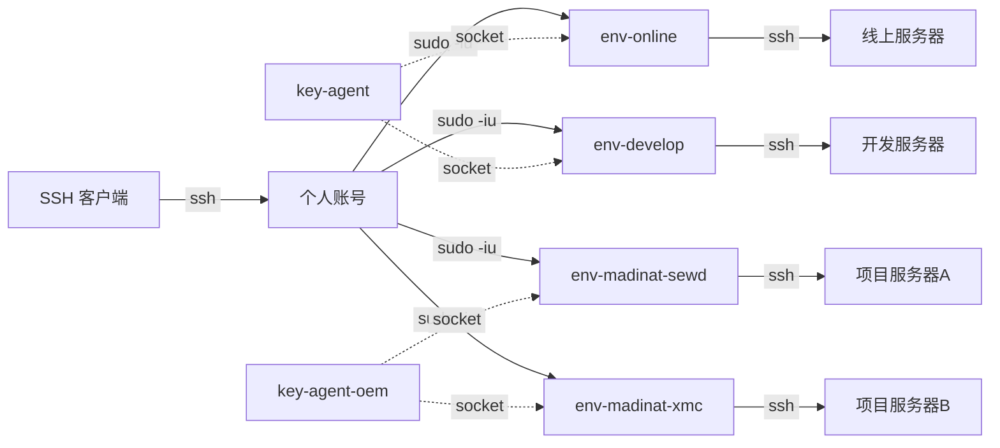

# 跳板机服务器访问控制方案

## 架构概览



流程说明（办公室 / 外网 统一）：

```
员工本机 ──ssh──→ 个人账号@workspace ──sudo -iu env-xxx──→ ssh 目标服务器
```

设计原则：
- 环境用户统一 `env-` 前缀，归入 `env-users` 用户组
- 环境用户禁止 SSH 直接登录，只能通过 sudo 切换
- 所有员工必须先登录个人账号，再切换到环境用户
- 私钥按业务线分离在 key-agent / key-agent-oem，环境用户通过 ssh-agent socket 使用 key，无法查看私钥

## 角色说明

| 角色 | 位置 | 说明 |
|------|------|------|
| 员工个人账号 | 跳板机 | firstname.lastname 格式，公网可登录 |
| 环境用户 | 跳板机 | env-* 前缀，属于 env-users 组，禁止 SSH 登录 |
| key-agent | 跳板机 | Cloud 密钥管理，持有 online/develop 私钥，禁止登录 |
| key-agent-oem | 跳板机 | OEM 密钥管理，持有 madinat 项目私钥，禁止登录 |
| 管理员 | 跳板机 | 管理 key-agent*、环境用户的 config 和 sudoers |
| 目标服务器账号 | 远程 | 客户/甲方提供的唯一账号，不受我们控制 |

## 环境用户命名规范

所有环境用户统一 `env-` 前缀，加入 `env-users` 用户组：

| 环境用户 | 说明 |
|----------|------|
| env-online | 线上生产环境 |
| env-develop | 开发测试环境 |
| env-madinat-sewd | 麦钉 SEWD 项目环境 |
| env-madinat-xmc | 麦钉 XMC 项目环境 |

```bash
# 创建环境用户组
groupadd env-users

# 创建环境用户并加入组
useradd -m -G env-users env-online
useradd -m -G env-users env-develop
useradd -m -G env-users env-madinat-sewd
useradd -m -G env-users env-madinat-xmc

# 后续新增环境用户，只需加入 env-users 组即可
useradd -m -G env-users env-xxx
```

## 员工账号

命名规范：`firstname.lastname`（拼音小写，点号分隔）

| 账号            | 姓名     | 部门    | 角色  |
| ------------- | ------ | ----- | --- |
| bingxin.liu   | [name] | 研发部   | 管理员 |
| zhibin.deng   | [name] | 后端研发部 | 运维  |
| wenling.yao   | [name] | 后端研发部 | 开发  |
| yunjiang.yan  | [name] | 前端研发部 | 开发  |
| dong.lu       | [name] | 测试部   | 测试  |
| shenwei.zhong | [name] | 运维部   | 运维  |
| rong.yang     | [name] | 产品部   | 设计  |

> 仅研发部相关同事需要跳板机账号，项目部、行政、财务、兼职人员不需要。

## 跳板机配置

### 1. sshd 配置

```bash
# /etc/ssh/sshd_config

# 全局设置
PermitRootLogin no
PasswordAuthentication no
PubkeyAuthentication yes
AllowTcpForwarding yes

# 环境用户组：完全禁止 SSH 登录，只能通过 sudo 切换
# 新增环境用户只需加入 env-users 组，无需改此配置
DenyGroups env-users
```

### 2. 密钥管理用户（按业务线分离）

创建两个专用用户分别管理不同业务线的私钥，环境用户本身不持有私钥，通过 ssh-agent socket 使用 key。

| 用户 | 负责环境 | 说明 |
|------|---------|------|
| key-agent | env-online、env-develop | Cloud 业务线（自有平台） |
| key-agent-oem | env-madinat-sewd、env-madinat-xmc | OEM 业务线（客户项目） |

```bash
# 创建密钥管理用户，禁止 SSH 登录
useradd -m -s /usr/sbin/nologin key-agent
useradd -m -s /usr/sbin/nologin key-agent-oem
usermod -aG env-users key-agent
usermod -aG env-users key-agent-oem
```

目录结构：

```
/home/key-agent/.ssh/
├── online_rsa               # 线上环境私钥
└── develop_rsa              # 开发环境私钥

/home/key-agent-oem/.ssh/
├── madinat_sewd_rsa         # 麦钉 SEWD 私钥
└── madinat_xmc_rsa          # 麦钉 XMC 私钥

/run/ssh-agent/
├── online.sock              # key-agent 运行
├── develop.sock             # key-agent 运行
├── madinat-sewd.sock        # key-agent-oem 运行
└── madinat-xmc.sock         # key-agent-oem 运行
```

权限设置：

```bash
chmod 700 /home/key-agent/.ssh /home/key-agent-oem/.ssh
chmod 600 /home/key-agent/.ssh/*_rsa /home/key-agent-oem/.ssh/*_rsa
```

### 3. ssh-agent 服务（每个环境一个）

为每个环境跑一个独立的 ssh-agent，由对应的密钥管理用户运行：

```ini
# /etc/systemd/system/ssh-agent-online.service
[Unit]
Description=SSH Agent for online environment

[Service]
Type=simple
User=key-agent
ExecStart=/usr/bin/ssh-agent -D -a /run/ssh-agent/online.sock
RuntimeDirectory=ssh-agent
RuntimeDirectoryMode=0750

[Install]
WantedBy=multi-user.target
```

```ini
# /etc/systemd/system/ssh-agent-madinat-sewd.service
[Unit]
Description=SSH Agent for madinat-sewd environment

[Service]
Type=simple
User=key-agent-oem
ExecStart=/usr/bin/ssh-agent -D -a /run/ssh-agent/madinat-sewd.sock
RuntimeDirectory=ssh-agent
RuntimeDirectoryMode=0750

[Install]
WantedBy=multi-user.target
```

其他环境同理：`ssh-agent-develop.service`（User=key-agent）、`ssh-agent-madinat-xmc.service`（User=key-agent-oem）。

启动并加载 key：

```bash
# 启动所有 agent 服务
systemctl enable --now ssh-agent-online ssh-agent-develop ssh-agent-madinat-sewd ssh-agent-madinat-xmc

# Cloud 业务线（key-agent）
sudo -u key-agent SSH_AUTH_SOCK=/run/ssh-agent/online.sock ssh-add /home/key-agent/.ssh/online_rsa
sudo -u key-agent SSH_AUTH_SOCK=/run/ssh-agent/develop.sock ssh-add /home/key-agent/.ssh/develop_rsa

# OEM 业务线（key-agent-oem）
sudo -u key-agent-oem SSH_AUTH_SOCK=/run/ssh-agent/madinat-sewd.sock ssh-add /home/key-agent-oem/.ssh/madinat_sewd_rsa
sudo -u key-agent-oem SSH_AUTH_SOCK=/run/ssh-agent/madinat-xmc.sock ssh-add /home/key-agent-oem/.ssh/madinat_xmc_rsa
```

设置 socket 权限，让环境用户组可以使用：

```bash
chown key-agent:env-users /run/ssh-agent/online.sock /run/ssh-agent/develop.sock
chown key-agent-oem:env-users /run/ssh-agent/madinat-sewd.sock /run/ssh-agent/madinat-xmc.sock
chmod 660 /run/ssh-agent/*.sock
```

### 4. 环境用户目录结构

环境用户只持有 SSH config（服务器列表），不持有私钥，通过 `.bashrc` 指向对应的 agent socket：

```
/home/env-online/.ssh/
└── config              # 线上环境服务器列表（无私钥）

/home/env-develop/.ssh/
└── config              # 开发环境服务器列表

/home/env-madinat-sewd/.ssh/
└── config              # 麦钉 SEWD 服务器列表

/home/env-madinat-xmc/.ssh/
└── config              # 麦钉 XMC 服务器列表
```

每个环境用户的 `.bashrc` 指向对应 socket：

```bash
# /home/env-online/.bashrc
export SSH_AUTH_SOCK=/run/ssh-agent/online.sock

# /home/env-develop/.bashrc
export SSH_AUTH_SOCK=/run/ssh-agent/develop.sock

# /home/env-madinat-sewd/.bashrc
export SSH_AUTH_SOCK=/run/ssh-agent/madinat-sewd.sock

# /home/env-madinat-xmc/.bashrc
export SSH_AUTH_SOCK=/run/ssh-agent/madinat-xmc.sock
```

### 5. 环境用户 SSH config 示例

```ssh-config
# /home/env-online/.ssh/config

Host online-web
    HostName 10.0.1.10
    User appuser

Host online-db
    HostName 10.0.1.11
    User appuser
```

```ssh-config
# /home/env-madinat-sewd/.ssh/config

Host sewd-server
    HostName 10.0.3.10
    User admin
```

### 6. sudoers 配置

按业务线拆分为两个文件，Cloud 由管理员维护，OEM 可由运维通过脚本管理。

```bash
# /etc/sudoers.d/cloud-access
# 由管理员（bingxin.liu）维护，其他人不可修改

# 密钥管理
bingxin.liu ALL=(key-agent,key-agent-oem) NOPASSWD: /bin/bash

# Cloud 环境用户访问
bingxin.liu ALL=(env-online,env-develop) NOPASSWD: /bin/bash
zhibin.deng ALL=(env-online,env-develop) NOPASSWD: /bin/bash
shenwei.zhong ALL=(env-online,env-develop) NOPASSWD: /bin/bash
wenling.yao ALL=(env-develop) NOPASSWD: /bin/bash
yunjiang.yan ALL=(env-develop) NOPASSWD: /bin/bash
dong.lu ALL=(env-develop) NOPASSWD: /bin/bash
```

```bash
# /etc/sudoers.d/oem-access
# 管理员维护，或由 shenwei.zhong 通过 env-grant/env-revoke 脚本管理

# OEM 密钥管理
shenwei.zhong ALL=(key-agent-oem) NOPASSWD: /bin/bash

# OEM 环境用户访问
bingxin.liu ALL=(env-madinat-sewd,env-madinat-xmc) NOPASSWD: /bin/bash
zhibin.deng ALL=(env-madinat-sewd,env-madinat-xmc) NOPASSWD: /bin/bash
shenwei.zhong ALL=(env-madinat-sewd,env-madinat-xmc) NOPASSWD: /bin/bash
wenling.yao ALL=(env-madinat-sewd,env-madinat-xmc) NOPASSWD: /bin/bash
```

```bash
# /etc/sudoers.d/env-tools
# 允许 shenwei.zhong 通过脚本管理 OEM 环境权限

shenwei.zhong ALL=(root) NOPASSWD: /usr/local/bin/env-grant, /usr/local/bin/env-revoke
```

效果：
- `sudo -iu env-online` ✅ 可以切换到环境用户
- `sudo apt install xxx` ❌ 无权限
- `sudo cat /etc/shadow` ❌ 无权限
- `sudo env-grant wenling.yao env-madinat-sewd` ✅ shenwei.zhong 可以管理 OEM 权限

### 7. OEM 权限管理脚本

允许 shenwei.zhong 通过脚本管理 OEM 环境的人员访问权限，无需 root 或 sudoers 写权限。

脚本限制：
- 只能操作 `env-madinat-*` 环境用户（不能碰 env-online、env-develop）
- 只能添加已存在的系统用户
- 自动校验 sudoers 语法（visudo -c）

#### env-grant — 授予访问权限

```bash
#!/bin/bash
# /usr/local/bin/env-grant
# 用法：sudo env-grant <用户名> <环境用户>
# 示例：sudo env-grant wenling.yao env-madinat-sewd

set -euo pipefail

SUDOERS_FILE="/etc/sudoers.d/oem-access"
USER="$1"
ENV_USER="$2"

# 校验参数
if [[ -z "$USER" || -z "$ENV_USER" ]]; then
    echo "用法：sudo env-grant <用户名> <环境用户>"
    exit 1
fi

# 只允许 env-madinat-* 环境
if [[ ! "$ENV_USER" =~ ^env-madinat- ]]; then
    echo "错误：只能管理 env-madinat-* 环境用户"
    exit 1
fi

# 检查系统用户是否存在
if ! id "$USER" &>/dev/null; then
    echo "错误：用户 $USER 不存在"
    exit 1
fi

# 检查环境用户是否存在
if ! id "$ENV_USER" &>/dev/null; then
    echo "错误：环境用户 $ENV_USER 不存在"
    exit 1
fi

# 检查是否已有该权限
RULE="$USER ALL=($ENV_USER) NOPASSWD: /bin/bash"
if grep -qF "$RULE" "$SUDOERS_FILE" 2>/dev/null; then
    echo "已存在：$USER → $ENV_USER"
    exit 0
fi

# 追加规则
echo "$RULE" >> "$SUDOERS_FILE"

# 校验 sudoers 语法
if ! visudo -c -f "$SUDOERS_FILE" &>/dev/null; then
    # 语法错误，回滚
    sed -i "\|^${RULE}$|d" "$SUDOERS_FILE"
    echo "错误：sudoers 语法校验失败，已回滚"
    exit 1
fi

echo "已授权：$USER → $ENV_USER"
```

#### env-revoke — 撤销访问权限

```bash
#!/bin/bash
# /usr/local/bin/env-revoke
# 用法：sudo env-revoke <用户名> <环境用户>
# 示例：sudo env-revoke wenling.yao env-madinat-sewd

set -euo pipefail

SUDOERS_FILE="/etc/sudoers.d/oem-access"
USER="$1"
ENV_USER="$2"

# 校验参数
if [[ -z "$USER" || -z "$ENV_USER" ]]; then
    echo "用法：sudo env-revoke <用户名> <环境用户>"
    exit 1
fi

# 只允许 env-madinat-* 环境
if [[ ! "$ENV_USER" =~ ^env-madinat- ]]; then
    echo "错误：只能管理 env-madinat-* 环境用户"
    exit 1
fi

# 删除匹配的规则
RULE="$USER ALL=($ENV_USER) NOPASSWD: /bin/bash"
if ! grep -qF "$RULE" "$SUDOERS_FILE" 2>/dev/null; then
    echo "未找到：$USER → $ENV_USER 的权限记录"
    exit 0
fi

sed -i "\|^${RULE}$|d" "$SUDOERS_FILE"

# 校验 sudoers 语法
if ! visudo -c -f "$SUDOERS_FILE" &>/dev/null; then
    echo "警告：sudoers 语法校验异常，请管理员检查 $SUDOERS_FILE"
    exit 1
fi

echo "已撤销：$USER → $ENV_USER"
```

#### 部署脚本

```bash
# 安装脚本
cp env-grant env-revoke /usr/local/bin/
chmod 755 /usr/local/bin/env-grant /usr/local/bin/env-revoke
chown root:root /usr/local/bin/env-grant /usr/local/bin/env-revoke
```

#### 使用示例（shenwei.zhong 操作）

```bash
# 给 wenling.yao 开通 madinat-sewd 环境
sudo env-grant wenling.yao env-madinat-sewd

# 撤销 dong.lu 的 madinat-xmc 权限
sudo env-revoke dong.lu env-madinat-xmc

# 以下操作会被拒绝
sudo env-grant wenling.yao env-online       # ❌ 只能管理 env-madinat-*
sudo env-grant nobody env-madinat-sewd       # ❌ 用户不存在
```

## 权限矩阵

```
员工                │ env-online │ env-develop │ env-madinat-sewd │ env-madinat-xmc
────────────────────┼───────────┼────────────┼─────────────────┼────────────────
bingxin.liu（管理员）│ ✅         │ ✅          │ ✅               │ ✅
zhibin.deng（运维）  │ ✅         │ ✅          │ ✅               │ ✅
shenwei.zhong（运维）│ ✅         │ ✅          │ ✅               │ ✅
wenling.yao（后端）  │ ❌         │ ✅          │ ✅               │ ✅
yunjiang.yan（前端）  │ ❌         │ ✅          │ ❌               │ ❌
dong.lu（测试）      │ ❌         │ ✅          │ ❌               │ ❌
```

权限控制点：
- `cloud-access` 控制 Cloud 业务线权限（仅管理员维护）
- `oem-access` 控制 OEM 业务线权限（管理员维护，或 shenwei.zhong 通过 env-grant/env-revoke 脚本管理）
- `env-tools` 允许 shenwei.zhong 执行权限管理脚本（脚本内限制只能操作 env-madinat-*）
- 环境用户通过 `env-users` 组统一禁止 SSH 登录（DenyGroups）
- 员工无其他 sudo 权限

## 员工使用指南

### 日常使用（办公室 / 外网 统一流程）

```bash
# 1. 登录跳板机个人账号
ssh bingxin.liu@workspace

# 2. 切换到环境用户（免密，无需输入密码）
sudo -iu env-online

# 3. 连接目标服务器
ssh online-web
```

员工本地 `~/.ssh/config`：

```ssh-config
Host workspace
    HostName 跳板机IP或域名
    User bingxin.liu
    IdentityFile ~/.ssh/id_rsa
```

文件传输（两段）：

```bash
# 第一段：本地 → 跳板机个人目录
scp file.txt workspace:/tmp/

# 第二段：登录跳板机，切到环境用户，传到目标
ssh workspace
sudo -iu env-online
scp /tmp/file.txt online-web:/data/
```

### 临时暴露内网服务（ssh -D SOCKS5 代理）

适用场景：在办公室临时让同事访问某个远程环境的 Web 服务。

```bash
# 在跳板机上开 SOCKS5 代理，监听所有网卡
sudo -iu env-online
ssh -D 0.0.0.0:1080 -N online-web
```

办公室其他同事浏览器配置 SOCKS5 代理：
- 代理地址：跳板机内网IP（如 192.168.1.100）
- 端口：1080
- 类型：SOCKS5

然后浏览器直接访问 `http://10.0.1.10:8080` 等内网地址即可。

用完关掉 SSH 连接，代理自动断开。

### 端口映射（两段）

```bash
# 第一段：跳板机上建隧道
ssh workspace
sudo -iu env-online
ssh -L 0.0.0.0:8306:localhost:3306 -N online-db &

# 第二段：本地连跳板机
ssh -L 3306:localhost:8306 -N workspace
# 本地 localhost:3306 → 跳板机 8306 → 目标数据库 3306
```

## 新增环境 checklist

新增一个环境只需：

1. 创建用户并加入 env-users 组：`useradd -m -G env-users env-xxx`
2. 配置 `.ssh/config`（服务器列表）
3. 在对应的 key-agent 或 key-agent-oem 下放入私钥，创建新的 ssh-agent 服务
4. 设置 `.bashrc` 指向新的 agent socket
5. 在对应的 sudoers 文件中添加权限：
   - Cloud 环境 → `/etc/sudoers.d/cloud-access`（管理员维护）
   - OEM 环境 → `/etc/sudoers.d/oem-access`（管理员维护，或运维通过 env-grant 脚本添加）

无需修改 sshd 配置（DenyGroups env-users 自动生效）。

## SSH 端口转发速查

| 参数 | 方向 | 用途 |
|------|------|------|
| `-L 本地端口:目标:远程端口` | 本地 → 远端 | 访问远端数据库、Web 服务 |
| `-R 远程端口:目标:本地端口` | 远端 → 本地 | 暴露本地服务给远端 |
| `-D 端口` | SOCKS5 代理 | 浏览器访问整个内网 |

## 安全注意事项

- 所有账号禁止密码登录，只允许 key 认证
- 环境用户通过 env-users 组统一禁止 SSH 登录
- 私钥按业务线分离：key-agent（Cloud）和 key-agent-oem（OEM），互不可见
- key-agent* 用户设为 nologin，只有管理员通过 sudo 操作
- sudoers 按业务线拆分：`cloud-access`（管理员独占）、`oem-access`（可通过脚本管理）、`env-tools`（脚本执行权限）
- shenwei.zhong 不授予 root、useradd、usermod、sudoers 直接写权限，只能通过 env-grant/env-revoke 脚本管理 OEM 环境权限
- env-grant/env-revoke 脚本由 root 持有（755），脚本内硬编码只允许 `env-madinat-*`，防止越权操作 Cloud 环境
- ssh -D 代理用完即关，不要长期开放
- 定期审查 sudoers 配置（三个文件：cloud-access、oem-access、env-tools）
- 员工离职时及时移除跳板机个人账号和所有 sudoers 文件中的权限
