# IELTS备考笔记

2016年IELTS备考期间的全部练习记录，包含听力、阅读、口语、写作、句型和翻译练习。
原始文件保留在 `4-Archives/Notes/Apple-Notes/2016-Archive/`。

---

## Listening

### Listening 1.md

#### IELST 7 	Test 1 - 40/40 (11:08 AM - 11:50 AM, March 3rd, 2016)

Section 1
1.cab	2. city centre	3.wait	4.door-to-door		5.reserve
6.17th October		7.12.30	8.Thomson	9.AC936	10.3303 8450 2045 6837

Section 2
11.B		12.A		13.B		14.C		15.C		16.A		17.C		18.A		19.C		20.B

Section 3
21.attitude	22.gender		23.creativity
24.A		25.B		26.A		27.B
28.culture		29.profit		30.stress

Section 4
31.April	32.children	33.repeated	34.human		35.magic
36.distance	37.culture		38.fire	39.touching	40.intact

#### IELST 7 	Test 2 - 33/40 (20:15 PM - 20:50 PM, March 9th, 2016)

Section 1
1.27 bank road	2. dentist		3.Sable	4.Northern Star		5.stolen
6.Paynter		7.brother in law		8.travel to work		9.Red Flag	10.450

Section 2
11.City Bridge		12.New Town\Newtown		13.6.30		14.garden		15.Tire Restaurant/Restaurant
16.view		17.history		18.7-screen		19.every 20 minutes		20.centre station

Section 3
21.B		22.A		23.C
24.B		25.A		26.B		27.1892/1882 1893/1883
28.signed		29.A		30.D

Section 4
31.B/C		32.B		33.A/C		34.A		35.B/A
36.two directions	37.confident		38.vision	39.corrections	40.balance

#### IELST 8 	Test 1 - 35/40 (9:17 AM - 9:55 AM, March 3rd, 2016)

Section 1
1.C	2.B	3.48 North Ave		4.WS6 2YH		5.01674 553242
6.drinks		7.pianist	8.10.50	9.4	10.50%

Section 2
11.1.30		12.December 25th		13.car park		14.45		15.tables		16.C		17.D/F		18.E/G		19.B		20.E

Section 3
21.A		22.C		23.A
24.B		25.B		26.C		27.F
28.12,000		29.horses		30.caves

Section 4
31.surface	32.environment		33.impact		34.urban		35.problems
36.images		37.patterns		38.disortion/distortion	39.trafic	40.weather

---

## Reading

### Reading 1.md

#### IELST 7 	General Test 1 - 27/40 (5:00 PM - 5:56 AM, March 7th, 2016)

Section 1
1.True/False	2. True	3.Not Given	4.Not Given/True		5.False
6.False		7.Not Given/True

8.v		9.vii		10.ix		11.ii		12.x		13.i		14.iii

Section 2
15.temptation/image	16.passing trade		17.parking/access
18.walls		19.landlord/contract		20.conservation area/housing

21.Their department		22.The supervisor	23.Exempt employees	24.Human Resources		25.A prorated system
26.'Leave Request' forms	27.A grace period

Section 3
28.B		29.B/D	30.B		31.C		32.A C
33.D		34.E		35.I		36.J/F
37.Not Given/False	38.True	39.False/Not Given	40.False

#### IELST 7 	General Test 1 - 33/40 (9:01 PM - 9:49 AM, March 9th, 2016)

Section 1
1.C		2.D		3.A		4.B		5.C
6.D		7.D/A

8.False		9.True		10.Not Given		11.Not Given		12.False		13.True		14.True

Section 2
15.family business	16.training		17.accommodation
18.gross pay/payroll		19.employer		20.pay records		21.three months

22.spam	23.message time	24.replying/prompt attention		25.reply immediately
26.brief acknowledgement	27.detail follow-up/date

Section 3
28.1638		29.1781		30.1934		31.2001
32.True		33.False		34.Not Given/False		35.Not Given		36.Not Given/True
37.D			38.E			39.C				40.H

#### IELST 8 	General Test 1 - 36/40 (23:23 PM - 00:42 AM, March 13th, 2016)

Section 1
1.C		2. B		3.A		4.May		5.canoeing and tennis
6.self-drive auto

7.A		8.B		9.D		10.D		11.C		12.C/B		13.D		14.C

Section 2
15.senior		16.search		17.disciplinary action
18.contractors	19.outsiders	20.private notes

21.2003	22.four weeks	23.one twelfth	24.counter-notice		25.shutdown
26.payment	27.a collective agreement

Section 3
28.v		29.vii		30.ix		31.x		32.iii		33.iv
34.False		35.True/Not Given		36.Not Given/True
37.False		38.Not Given/True		39.Not Given		40.True

---

## Speaking

### Speaking 1.md

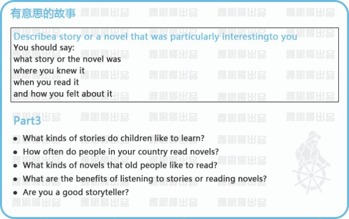

Well, talking about the interesting novels, I would like to talk about a quite popular series, Harry Potter. It is written by J.K Rowling. The novel is around  a young boy Harry Potter whose parents were kill by an evil and powerful wizard Lord Voldemort when he was still a baby.  And this story mainly about Harry's life in the Magical School and his fight against Voldemort.

I read this novels because of a number of recommendations from my friends, when I was still in middle school. At that time, the Harry Potter series were attractive to a lot of people over the world. I am one of them.

This series of  fictions is special and unforgettable because it offers us an opportunity to view a brand new world of magic. At the same, I was inspire by Harry. He was so smart that he is always able to overcome difficulty he faced. And he is so brave that he is not afraid to fight against the darkness. In general, this series of book is quite impressive and fantastic for me. I enjoy reading it very much.

* I think the children like to read the story base on the same age, but it should be a quite different story compare to their own life.
* It depends on different people. For some people which like reading may read every day as far as they have time, but for other people which don't like reading may never read a novel.
* The old people in my country always like to read the novel linked to our country's history like the Romance of the Three Kingdoms which describe the history about the late Eastern Han period.
* Reading story can let you feel every detail of story the author want to express and also can inspire your imagination, while listen to story can save your time and you can also do something else in the same time.
* I don't think I am a good story teller, since I will easily forget the the content of what I read.

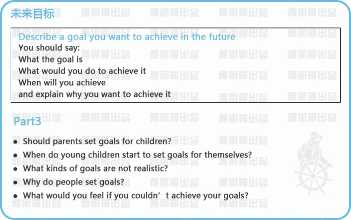

My goal is to finish my indoor positioning system. I am used to be a master student major in electrical engineering and I have been working on the research about indoor positioning for some time. It is a new kind of GPS technology for indoor environment. Many university and IT company has been working on this for years. however there is still no perfect solution for this system.

In order to achieve this goal, I should keep doing research on this topic, trying to develop a more efficient and more accurate algorithm to implement this system. At the same time, I should improve my programming skill which is a necessary tool for building these system. Also I will try to looking for some friends which also have interest on this topic to help me.

I am not sure when I can achieve this goal. But I will work hard everyday to try my best to approach it. Hopefully I can have some achievement in this year.

I want to achieve it because I can see the potential that I can success. Everyday, there are number of new technology appear. It is the age fill with opportunities. Alter 20 years of studying, I think it is time for me to achieve something and contribute my knowledge to the world.

* I don't think the parent should set any goal for children. They should let their children to do it on their own which can help them to start thinking about their future.
* I think young children should start to set their goal after primary school. I think it is the time when they should be able to start to think on their own and try to it is the time they should know what they are interested in.
* I think any goal which is not base on your own condition or situation is not realistic. For example, if you are still a student and you want to earn one million dollars in one year. It is just ridiculous.
* I believe people set goals not just for fun, they hope the goal can remind them and inspire them to work hard everyday to approach the goal.
* I think I will feel disappoint to myself for a while. But I will not keep upset all the day. I will try to find the reason why I can finish my goal and set another goal to keep working.

### Speaking 2.md

I would like to talk about a trip I took in Unite State in August last year . The primary reason I go to Unite State is to attend a conference held in Colorado. But I found some wonderful places in the western Unite Status were very attractive for me. So I decided to have a short vocation before I go to the conference. And I also invite my girl friend to come with me.

We start our trip from Las Vegas which is known as the entertainment capital of the world. We rent a car there. After having a relax in Las Vegas, we started our long car trip by entering to Arizona. The magnificent scene of Grand Canyon and Horseshoe Bend really impressive us. We then continued our trip to Utah. We drove on the Highway 12 which is known as one of the most beautiful highway in Unit State. While we were driving, we also visited some famous national park along the road.

With three days driving, we finally reached our destination in Colorado. It is really an impressive vocation for us. We drove more than 2000 kilometres and went across three states. It is the longest car journey I ever took. I'd always liked the idea of travelling by car. Having a car lets you explore freely and allowing you to stop and take pictures whenever you want.

### Speaking 3.md

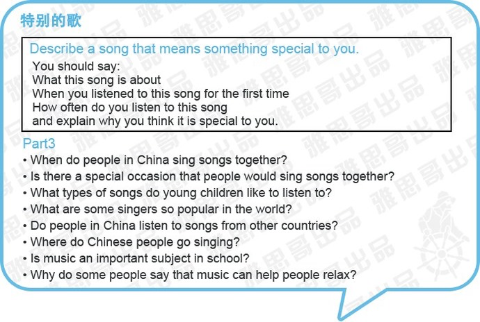

The song I would like to talk about is called "Heal the World". It was written and sang by Michael Jackson, who I believed is the greatest singer and performer of all time in the whole world.

I still remember that the first time I heard this song was in a music class in my middle school. The teacher play the music video to us. It showed the children who are living in countrysides suffering from hunger, wars and diseases, especially in Africa. At that time I still couldn't understand the meaning of the song. The teacher tells us that the song concern of new generations and suggested we should make a better place for our children.  I was deeply attractted by this song. Although I can't understand the meaning at that time, I still can feel what Michael Jackson want to express.

Since that time, this song always stay in my playlist. I like this song not only because of its beautiful melody but also it is a song ask people to protect and cherish our environment, to stay away from war, to let the world peace.

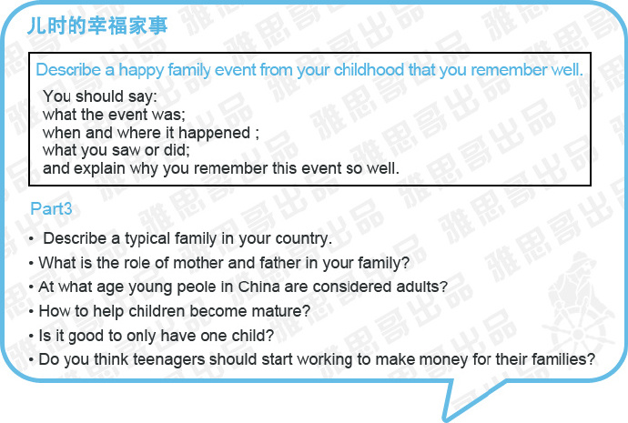

The event I want to talk about is our traditional Spring Festival. It is the most important event for Chinese people. It is just like the Christmas day in the western countries. It is on the first day of the lunar calendar.

Before the festival, there is an tradition to cleaning the indoor and outdoors of our house, in order to sweep any unfortunate stuff. In the evening before the Chinese new year, all the relative would get together to have an annual reunion dinner. When I was still a child, I always think that it is the happiest moment in the year. It is the time I  can meet and play with my cousins. My parent will always prepare new clothes and shoes for me. And also I can collect a lot of lucky money from my relatives. I really enjoy this event.

But after I came to Canada, I have not celebrated for this festival with my family for years. But when the date of festival comes around, it always remind me of the happy moments of the event. I think this festival is very import not just because it is a traditional festival in our country but also it is the time we can gather the whole family to have a chat with each other to share our feeling.

* In China, a typical family usually consist of one father and one mother with one child.
* In my family, my mother has retired, so she is responsible for the house work, while my father still have to work everyday, he is responsible for earning money.
* When the young people reach the age of 18, they are consider as adult in China.
* I think the parents can stop provide daily money for their Children and let them try to earn money by theirselves.
* It is hard to give a definition if it is good or bad to have one child. It may be easier for the parent to raise one Child and the Child can always get the best in everything but in contrast, the child may grow up lonely and the parent of an only child tend to be overprotect.
* Yes, I think teenager should start working, some people may think that work affects students' education and social life. However, work teaches teens to be more responsive, and they can learn many general skills which are useful for the future jobs.

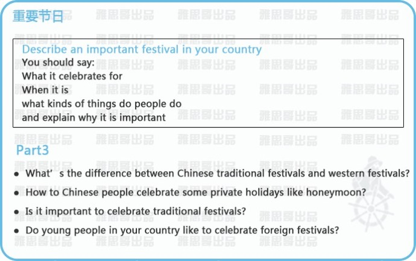

* Chinese traditional festival have a much longer history than western festivals.
* For honeymoon, I think most of the couple will have a short vocation to travel to some romantic place to enjoy the moment with each other.
* Yes,  I think it's very important to keep these traditional festivals going as they are an important part of Chinese culture and remind us to think about our families at a time when more and more people may live a long way from home.
* Yes, In our country the foreign festivals like Christmas day and Valentine's day become more and more popular during the young people.

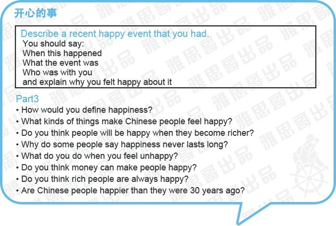

### Speaking 4.md

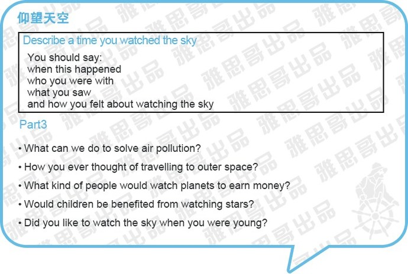

I remember when I was a child, I always like to watch the sky in my hometown. The sky is very clean and very blue. And I can see many stars at night. But the sky turn into grey when I was going to university. It was always cloudy at that time.

And a few month ago when I go back to my hometown. The sky I saw really shock me. Although I did already do some research before I went back to China. I know that smog is a very serious problem in China now. It is cause by the  increasing number of car and factory pollution. But the time when I arrived to China, I can really experience how serious it is. The whole city was covered by the flog. The sun is hardly shine on the ground. You can only saw thing in a very short distance. As there are no dryer in China, it will take you few days to dry you clothes. An the smog will not disappear until the wind blow it away.

After I see the environment in China, I think that smog is really a serous problem in China, the government should really do something to solve it. Since China quite rely on its industry, it would not be easy problem to solve.

### Speaking 5 (Part 1).md

Do you work or are you a student?
Actually I am just graduate from University of Windsor and I am looking for job in Toronto now.

What subject are you studying?
I major in electrical engineering. Actually I am a master student. And my research area is about network security and cryptography system.

Why did you choose to study that subject? Do you think your subject will be useful in the future?
Nowadays, there is no deny that we can not live without Internet. In the same time, computer and communication security also become more and more important in our daily life. I see a bright future in my study area. It should have a high demand in job market.

Do you like your subject?
Yes, I like my subject. In the beginning I don't like my subject quite much, cryptography always basis on some hard problem in math. I find it very difficult and boring for me. It is interesting to encrypt a message that no one can understand without my decryption.

What do you do with your classmate after classes?
After class, we always like to relax from the heavy workload. we would like to go to play some sports, like soccer or basketball. And sometimes we may play some video games.

What would you like to do after graduation?
After I graduate, it is perfect if I can find a job relating to my research area, but it is also OK to find a job in some IT companies. Because I am also quite good at programming.

Do you prefer to study in the morning or in the afternoon?
I prefer to study in the morning, because I can focus more and remember most stuff in the morning.

### Speaking 6.md

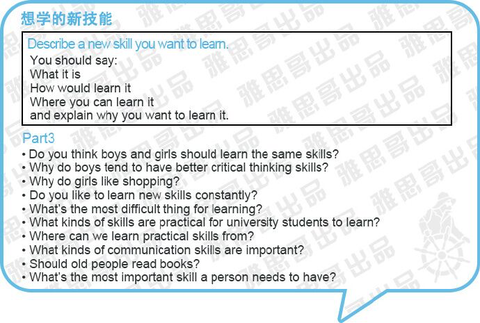

The new skill I want to learn is programming. As we know, nowadays, we can not live without Internet. When we open a phone, you can find numbers of application which allow to do any kind of things. You can play games, you can watch the latest news or you can have a chat with you friend.

I think it would be very useful if I can learn how to develop an application. I only want to have class in part-time. So I think I will learn this skill from a website call Udacity.  It is a website provide numbers of different kinds of online courses. It is very suitable for me, because I can take the class according my schedule. I will start my lesson as soon as possible. It may take me at least one year to learn this skill.

The reason why I want to learn this skill is that I have an idea with my father. He is a manger in a factory. He think that he can reach many information by phone, but the information of his factory can be only reach by coming back to the factory in person. So we want to develop an application which can collect the data from the factory and display on the phone. I think it would be very useful.

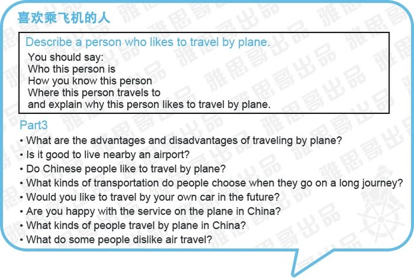

I would like to talk about my Uncle. He is the person I very respect, because he is a very successful business man. He has a shoe's commerce company in China. He buy shoes from the factory in China and sales them to all over the world. So he usually has to travel to different place in China such as Shanghai, Beijing and Henan to purchase shoes from different factory. Also he has to travel internally to find client all over the world to sale his shoes. He usually has to travel to Japan, some Europe countries and Unite State. Also few years ago, his family just immigrated to Unite State in order to provide a better education to his child.  So he has to go to Unite State more often.

To travel so often in so many different place, my uncle believe plane is always the most efficient way for travel. In order to save money, he always keep a frequent flier card to accumulate air miles. It can help him to get a free flight ticket in every few months. And my uncle think that it is not tired for him to travel by plane, it is a great opportunity for him to have a rest when he is travelling by plane.

### Speaking 7.md

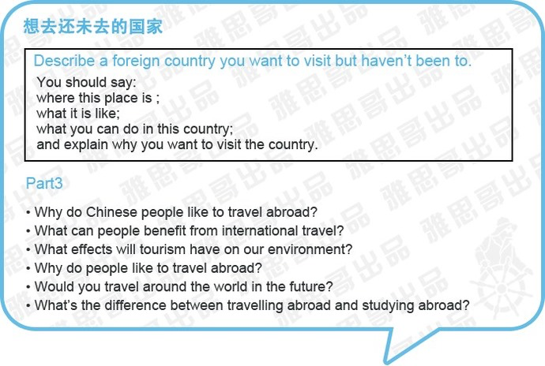

The country that I want to visit but haven't been to is Unite State. Although, I have been living in Canada for some times, until now I have not been to Unite State which is just next to Canada.

Unite State is known as the most developed country in the world. Also there are many famous places worth seeing in Unite State. Such as the city of Las Vegas, which is known as the capital of entertainment. Another well known place is the Grand Canyon which is one of the most remarkable natural wonders in the world. Also there are many beautiful national park in Utah. And the Yellowstone national park is the place you can't miss. It will take me few months if I want to visit all these place.

Another reason I want to visit Unite State is that my uncle's family are living in Boston. I haven't seen them for many years. I want to have an opportunity to visit them to see how's life with them.

### Speaking 8.md

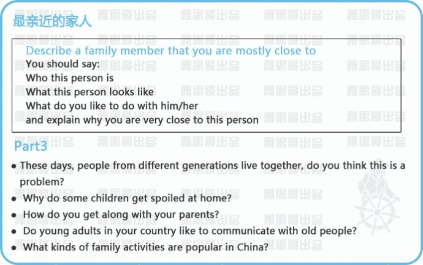

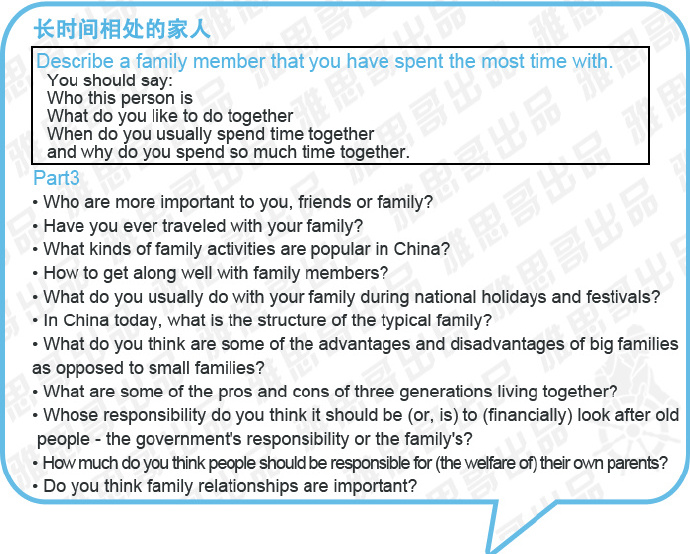

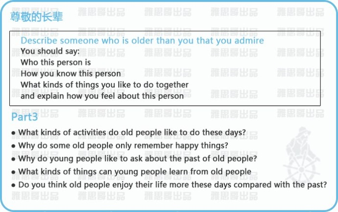

My father, father, 60, manager, for 40, Actually we have an idea to develop a system, which can help the managers of factory monitor the status of factory and assign task remotely. I think the rich experience he has as a manager and the knowledge on Computer Scientist I have can really make it happen.

impressive, not much education, start his career as an ordinary worker, he works very hard everyday, and always keep study new thing,With countless effort, he was finally promote as the Manger of his company. That experience very inspire me

His my father, but he and I are more like good friends. I feel that we can speak openly with one another and we share many similar opinions.

### Speaking 9.md

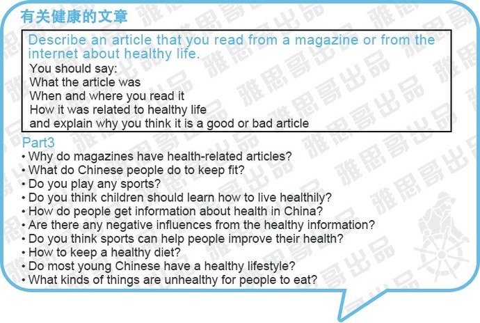

I didn't read much article about healthy. But I did read a magazine about health and life a long time ago in a library. I was impressed by an article about regulating eat habbit.

It mentions that food is the primary necessity of human beings and it offers the energy everyone needs for the day. The regular meals provide us sufficient energy for our study or work, which also ensures the efficiency of work. Irregular meals and unhealthy food is the main cause of gastric cancer. Therefore, regulating the kind of food we eat is the most important way to maintain health.

I don't think the regular meals is so important before. I often skipped the breakfast so that I can get up a little late. But I found that it always make me feel tire and easily out of energy. After reading this article, I always remind myself to have breakfast on time everyday. I can see that I study much more efficient than before. I think it is a good article for me.

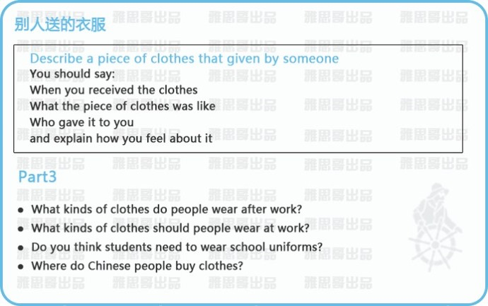

The clothes I want to talk about is a sweater I received from my girl friend.  It is in three month ago when I go back to China. We have not been seeing each other for about two years. She came to my house the next day after I come back. And she gave me a sweater. That remind me a chat we have before, about my old sweater which have been wore for a very long time. I think that's why she buy the clothes for me.

The clothes was much different from the normal sweater I wear before. The sweater was in grey and in a very fashionable style. I like it very much. Ever since I get this gift, I have wore it every time I go out. It always makes me feel very warm.

I was quite surprise to receive that gift. Because I just had a little comment on my old sweater, I don't believe that she can still remember what I have say and really bought me an sweater. I was touch. In return, I give her an ice wine I bought from Canada.

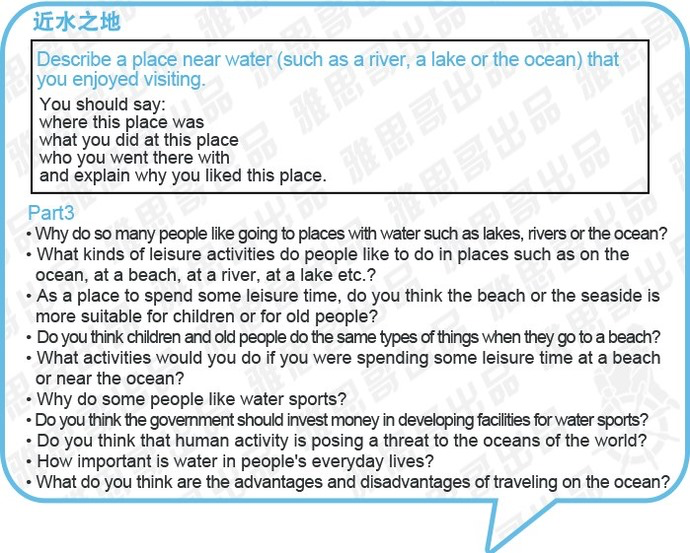

The place I want to talk about is the windsor sculpture park. It is located on the shore of the Detroit River.  And I used to live near this park.

There are not much entertainment in Windsor. At that time, the most usual activity for me and my roommates is to take a walk alone this park. You can see the city of Detroit on the other side of the river. And there is an bridge connecting the Canada and Unite State. In the park, you can see many interesting large scale sculpture, I heard that they all works by world renowned artist. In the park, you can see many people doing different kinds of activity. Some people were running, some people were playing skating and some people were just sitting on the chair have a chat with friends, and there are always many people were fishing on the riverside.

I like this place. Windsor is the first city I arrived in Canada. And this place is the place I spent most of my time with my friends and my roommate. It remind me a lot of happy moments. If I have time, I am sure I will go back to see this place again.

---

## Writing

### Writing 1 Task 2.md

#### IELTS 7 Test 1	Writing task 2

- It is generally believed that some people are born with certain talents, for instance for sport or music, and others are not,. However, it is sometimes claimed that any child can be taught to become a good sports person or musician.
- Discuss both views and give your own opinion.

**Original Answer**

When people talk about the famous sport person or musician, it is generally acknowledge that they are born with some kind of gifts which support them to become a good sport player or musician. While others think that a good training can also develop a child to succeed. Let us discuss it.

It is no doubt that some people born with certain gifts. For example, Messi, which is known as one of the best soccer players in the world, win almost every title and every reward he can reach. The perfect body control and excellent feeling to soccer which embed in his DNA is the reason why he can succeed. Most of the people think that he is born to be a soccer player, no one can reach his level only through hard training.

On the other hand, in other people's opinion, people can also develop other ability after taking some courses or training. Another athlete I want to talk about is Steve Curry. He is known to be a fantasy player in today's NBA and He is one the most competitive MVP candidates. But when he first came to NBA, no one thought that he would succeed in NBA. People thought that his shoot was easily blocked since he is not tall enough and his body is not able to suffer the high physical level in NBA since he is not strong enough. However, with his hard working day and night and the support from his coach and his team, he proved himself in the NBA and shocked everyone by breaking more and more record in NBA.

In my own opinion, talent is an important factor to succeed while a good training is also indispensable. An excellent gift can make you different from others, but when you have some kind of talent, it is useless if no one find it out and no one conduct you by training.

**Revised Answer**

When people talk about the famous sport person or musician, it is generally acknowledged that they were born with various gifts which support them to become an extraordinary sport player or musician. While others believe that talents can also be developed with the help of proper training and guidance.

There is no doubt that some people were born with certain gifts. For example, Messi, who is known as one of the best soccer players in the world, has won almost every title and every reward he can reach. The perfect body control and excellent feeling to soccer which embed in his DNA is the reason why he can succeed. The majority of people believe that he is born to be a soccer player and it is very difficult to reach his level only through diligent training.

On the other hand, in other people's opinion, people can also enhance their abilities after taking relevant courses or training.  Another athlete I want to mention is Steve Curry. He is known to be a fantasy player in NBA recently and is considered to be one of the most competitive MVP candidates. But when he first joined NBA, no one thought that he would succeed in NBA. People thought that his shoot was easily blocked since he was not tall enough and his body was not able to suffer the high physical level in NBA since he was not strong enough. However, with his constant hard work day and night and the support from his coach as well as his team, he proved himself in the NBA and shocked everyone by breaking increasing numbers of record in NBA.

In my own opinion, talent is an important factor to succeed while proper training is also indispensable. An excellent gift can make you different from others. However, it can only be cultivated and strengthened through correct cognition of the gift as well as appropriate guidance.

**Model Answer**

The relative importance of natural talent and training is a frequent topic of discussion when people try to explain different levels of ability in, for example, sport, art or music.

Obviously, education systems are based on the belief that all children can effectively be taught to acquire different  skills, including those associated with sport, art or music. So from our own school experience, we can find plenty of evidence to support the view that a child can acquire these skills with continued teaching and guided practice.

However, some people believe that innate talent is what differentiates a person who has been trained to play a sport or an instrument, from those who become good players. In other words, there is more to the skill than a learned technique, and this extra talent cannot be taught, no matter how good the teacher or how frequently a child practices.

I personally think that some people do have talents that are probably inherited via their genes. Such talents can give individuals a facility for certain skills that allow them to excel, while more hard-working students never manages to reach a comparable level. But, as with all questions of nature versus nurture, that are not mutually exclusive. Good musicians or artists and exceptional sports stars have probably succeeded because of both good training and natural talent. Without the natural talent, continuous training would be neither attractive nor productive, and without the training, the child would not learn how to exploit and develop their talent.

In conclusion, I agree that any child can be taught particular skills, but to be really good in areas such as music, art or sport, then some natural talent is required.

常用短语摘录：
- The advantage and disadvantage of living in a house or an apartment is a frequent topic of discussion when people try to explain they prefer to living in a house or living in an apartment.
- associated with
- People, who prefer to live in a house, are based on the belief that ……
- Some people believe that …. is what differentiates
- In conclusion, I prefer to live in a house.
- On the other hand, living in an apartment do have some advantages compare to living in a house.
- not mutually exclusive

### Writing 2 Task 2.md

#### IELTS 7 General Test 1	Writing Task 2

- Some people prefer to live in a house,  while others feel that there are more advantage to living in an apartment. Are there more advantage than disadvantage of living in a house compared with living in an apartment?

**Original Answer 1**

When it comes to choose to live in a house or an apartment, people always have different opinions.

Some people believe that it is better to live in a house than live in an apartment. There are three reasons. First of all, house,  has at least two floors, usually has much larger place than apartment, which only has one floor. Secondly, house usually attached with a backyard where you can do some exercise, plant some flowers as you want and playing with you kids there. Lastly, house usually has many rooms, you can rent part of your house to someone else. It will be a decent income for you and your family.

On the other hand, also quite a few people think that apartment is better for them. In the first place, apartment is usually managed by some property management company, they help you to shovel the snow and protect the environment from harmful effect to your apartment. Furthermore, apartment usually has smaller size that it is much easier to clean it up than house. Last but not least, apartment usually has much cheaper price that even a new graduate is able to afford the mortgage after working for one or two years.

After all, both house and apartment have their advantages. In my opinion, I prefer to live in a house, which has more spacious size,so that I can invite my friends to have dinner and play in my house. And although the price of a house usually more expensive than apartment, but I think house is more investable than an apartment. When you take into account the investment issue, people point out that house can always sale a much more valuable price than apartment.

**Original Answer 2**

The advantage and disadvantage of living in a house or an apartment is a frequent topic of discussion when people try to explain which do they prefer, living in a house or living in an apartment.

In my opinion, I prefer to live in a house. First of all, house,  which usually has at least two floors, has more spacious size than apartment, which only has one floor. I can invite large number of friends to have party in my house.  Secondly, backyard is what differentiates a person who would like to live in a house from those who prefer to live in an apartment.  It is great to have a backyard that you can do some exercise, plant some flowers and playing with your friends there. Lastly, house usually has many rooms, you can rent part of your house to someone else. It will be a decent income for you and your family.

However, living in a house do have some disadvantages compare to living in an apartment.  For example, you have to deal with everything happen to your house from inside to outside, while apartment is usually maintained by some property management company, which can help protect your place from harmful effect of unknown factor.  Moreover, unlike an apartment, which is affordable even for new graduate after working for one or two years, house is usually require much more cash.

In conclusion, living in a house is still my first choice. Because there are more advantage associate with living in the house compare to living in an apartment. Also some people seems to fail to take into account that house is more investable than an apartment. When you consider the investment issue, many surveys point out that house can always sale a much more valuable price than apartment.

**Revised Answer**

The advantage and disadvantage of living in a house or an apartment is a frequent topic of discussion when people try to explain whether they prefer to live / living in a house or an apartment.  In my opinion, I prefer to live in a house. First of all, houses are usually more spacious than apartments. Houses are often contained of two or three stories while there is only one floor in apartments. Hence, I can invite more friends to have party in my house.  Secondly, house usually include a backyard. It is great to have a backyard where you can do some exercise, plant some flowers or hang out with your friends. Lastly, there are usually a number of rooms in a house, which enables, you to rent part of your house to someone else. It will be a decent income for you and your family.   However, living in a house does have some disadvantages compared to living in an apartment.  For example, you have to deal with everything happened to your house from inside to outside, while apartment is usually maintained by property management companies, which can help protect your place from harmful effects of unknown factor.  Moreover, unlike an apartment, which is affordable even for new graduate after working for one or two years, a houses are considered to be a much heavier economic burden for people.  In conclusion, living in a house is still my first choice, considering that there are more advantage associate with living in the house compared to living in an apartment. Also some people seems to fail to take into account that a house is more investable than an apartment. When you consider the investment issue, many surveys point out that houses can always be sold at a much more valuable price than apartments.

**Model Answer （Band 7）**

In big business cities there are two options available for the type accommodation: house and apartments. Some people prefer to live in apartments and some like to live in houses.

In big business cities, where almost everyone is going out daily for work or study, apartments provide a much more comfortable and safe way of living. The advantages include the fact that there is one key and lock they have to take care of, and also the sense of being a part of a big family. Usually a guard sits at the main gate, so children can play around in the compound with their next door friends. In addition, not much daily cleaning is required in apartments as no staircase has to be clean, which is a difficult task - all house wives know it very well. But a key advantage is that it is safe to go on vocation for a long trip.

On the other hand, house have their own attraction for its inhabitants. Garden lovers usually prefer houses as they can have their own garden. It is also easy to keep a pet, especially ad dog in a house because dog can play around the garden. If someone is interested in maintaining cars himself, it can only be possible in houses where one can have his own garage.

Where people are sometimes much more concerned about their privacy, living in apartments can be a  very difficult for them. It may also be the case that someone is not able to deal with other people , for insurance next door neighbours, and than house can be a best choice for such people.

However, sometimes houses van be abad choice for low income people. Maintaining a big house and running it properly can be a problem for such cases.

At the end I must say both option can be good or bad, depending on the personal considerations. But form my point of view, I must say apartments seem  a gift of modern way of life with is not common in my home town.

### Writing 3 Task 1.md

#### IELTS 7 General Test 1	Writing Task 1

- You have recently started work in a new company. Write a letter to an English-speaking friend. In your letter explain why you changed jobs, describe your new jobs and tell him/her your other news.

**Original Answer**

It is a long time since we had a wonderful dinner last time in Canada. I write to you to tell you an exciting news of mine. I just changed my job, now I am working  as a program manager in Alibaba, one of the most competitive IT company in China.

It is a difficult decision to quite my previous job. As I tell you before, I love that job. I have been working there for two years since I graduated. However, It a small company I think not much new skills I can learn from there. Moreover I going to bought an apartment, I don't think I can suffer the the high finance burden if I stay in that company.  On the other hand, I believe it is time for me to pursue a higher position. I have been working as a programmer for two years, I think I have accumulated enough working experience so that I could manage a project by myself. So I commit a job application to Alibaba to apply for the program manager, with several time of interviews, I finally get the job.

I like my new job here in Alibaba, which is a well known IT company in China. Working in this company, I can touch the most advance technology and idea. And the stuff I working with are very experienced and intelligent engineers, I like the atmosphere here.

I just want to share my new job to you, I am looking forward to hear  your latest news as well.

**Revised Answer**

It is a long time since we had a wonderful dinner last time in Canada. I write to you to tell you an exciting news of mine. I just changed my job, and now I am working  as a program manager in Alibaba, one of the most competitive InformationTechnology company in China.

It is a difficult decision to quite my previous job. As I told you before, I love that job. I have been working there for two years since I graduated. However, It was a small company where I could not learn adequate useful skills. Moreover I am going to bought an apartment, and I don't think I can afford the the high finance burden if I stay in that company.  On the other hand, I believe it is time for me to pursue a higher position and career goal. I have been working as a programmer for two years, which has enabled me to accumulate enough working experience. Therefore, I am confident that I am able to manage a project by myself and do it well. So I commit a job application to Alibaba to apply for the program manager. With several time of interviews, I finally get the job.

I enjoy my new job here in Alibaba, which is a well known IT company in China. Working in this company, I can get in touch with the most advanced technology and ideas. And the staffs I am working with are all very experienced and intelligent engineers and I like the working atmosphere here, which is enjoyable and energetic.

I just want to share my new job to you and I am looking forward to hear  your latest news as well.

英语不同于中文较松散的语法架构。英文中，只要句子意思完整（即主谓宾齐全），句子结束后使用的标点符合应是句号。句与句之间不应直接使用逗号连接。如要使用逗号，请在第二句之前加上and或其他连词。

### Writing 4 Task 1.md

书信写作模板汇总（感谢信、道歉信、投诉信、邀请信、建议信、咨询求助信）

**感谢信**
1. 书信结构：第一部分自我介绍表示谢意；第二部分详细说明帮助过程；第三部分提出回报建议再次感谢。
2. 常用句型
　1) I take this opportunity to express to you my deep appreciation for the kind assistance you rendered me.
　2) I wish there were a better word than "thanks" to express my appreciation for your generous help.
　3) My appreciation to you for your generous help is beyond words. I wish I could repay it one day.
　4) Please accept my most cordial thanks for your timely help, which I will always remember.
　5) Thank you from the bottom of my heart for your kind help.
　6) I hope to have an opportunity to reciprocate your generosity.
　7) I appreciate the support you have provided and your assistance has been invaluable to me.

**道歉信**
1. 书信结构：第一部分自我介绍表示歉意；第二部分说明情况解释原因；第三部分提出补救方案再次道歉。
2. 常用句型
　1) I just wanted to write you a quick note to apologize for not being able to keep our appointment tomorrow.
　2) In deference to your valuable time，I would like to get straight to the point and admit that I was wrong.
　3) I really hope that you will be able to accept my apology.
　4) Please accept my apologies for…
　5) Please accept my sincere apology for missing the interview scheduled for…
　6) Please accept my apology for the delay and thank you for your understanding.

**投诉信**
1. 书信结构：第一部分自我介绍投诉事项；第二部分投诉事实与理由；第三部分提出要求或建议。
2. 常用句型
　1) I am writing to express my dissatisfaction with .
　2) There are some problems with that I wish to bring to your attention.
　3) I regret to inform you that .
　4) You can imagine my disappointment when I discovered that _.
　5) I hope that the authorities concerned will consider my suggestions and improve the situation as best as they can.
　6) We will appreciate your willingness to make up for the loss.

**邀请信**
1. 书信结构：第一部分自我介绍描述活动；第二部分指定日期地址时间；第三部分设定回复日期表达感谢。
2. 常用句型
　1) I would like to invite you to dinner and be our guest.
　2) I would like to invite you to join us and attend this meeting.
　3) I am glad to invite you to participate in my graduation ceremony.
　4) I am honoured to invite you to our wedding, as I understand that you only come to visit on special occasions.
　5) Your presence is immediately requested.

**建议信**
1. 书信结构：第一部分自我介绍指出问题；第二部分分析原因提出建议；第三部分期望重视表达帮助意愿。
2. 常用句型
　1) If I can be of any assistance in any way，please do not hesitate to call me.
　2) I am happy to supply any further information you may require and I look forward to hearing from you shortly.
　3) Please contact me if I can be of any assistance.

**咨询求助信**
1. 书信结构：第一部分自我介绍说明目的；第二部分指出需要信息的原因和时间；第三部分表达感谢希望早日答复。
2. 常用句型
　1) I would be much obliged to you if you could let me know the procedures I have to go through.
　2) Your prompt and favourable attention to my inquiry would be highly appreciated.
　3) I am looking forward to a favourable reply/response at your earliest convenience.
　4) Would you provide me with some valuable advice?
　5) Your kind reply will be highly appreciated.
　6) I am writing to enquire whether I may become a member of your club.
　7) Please let me know as soon as possible how you propose to settle this matter.

### Writing 5 Task 1.md

#### IELTS 7 General Test 2	Writing Task 1

- Last month you had a holiday overseas where you stayed with some friends. They have just sent you some photos of your holiday.
- Write a letter to your friends. In your letter
- thank them for the photos and for the holiday
- explain why you did't write earlier
- invite them to come and stay with you

**Original Answer**

Dear friends,

It is nearly a month since I come back from Canada. I have just received the photos from you. They all look pretty good and really remind me the wonderful moment stay with you. I write this letter to appreciate the well treat from you for the holiday. I am very enjoy the trip to beautiful places in Canada  and the first time experience of skiing in Blue Mountain.

I should write to you much earlier. However, I was so busy before. A large number of documents were required me to deal with since the absent for the holiday.  I did not have time to write to you until now. Otherwise, I would like to invite you to come to my place and stay with me when you have time. I will bring you to see the beautiful view in my hometown and let you taste the famous food here. I am looking forward to hear  from you soon.

**Revised Answer**

Dear friends,

It is nearly a month since I come back from Canada. I really appreciate you for sending the wonderful photos for our holiday. They all look pretty good and really remind me of the wonderful moments that I stay with you. I really enjoy the trip to beautiful places in Canada  and my first experience of skiing in Blue Mountain.

I should have written to you much earlier. However, on returning from the holiday I have been busy dealing with a large number of documents from work. I did not have time to write to you until now. In the same time, I would like to invite you to come to my place and stay with me when you have time. I will bring you to see the beautiful view in my hometown and let you taste the famous food here. I am looking forward to hear from you soon.

### Writing 6 Task 2.md

#### IELTS 7 General Test 2	Writing Task 2

- Some people feel that entertainment (e.g. film stars, pop musicians or sports) are pay too much money.
- Do you agree or disagree? Which other types of job should be highly paid?

**Original Answer**

There is no denying the fact that the star of film, pop music and sport can earn much more money than other occupies. This situation is now being questioned by more and more people. I disagree with the opinion that entertainment earn unreasonable money.

I think there are some reasons why people believe that entertainment earn too much money. First of all, these stars can only be seen on the TV or on the stage. It looks like they do not need to work too much to earn that money while other people have to work all day long everyday. Moreover, the job they do looks not that hard. A film star just need to play a role in front of a camera. A singer simply sings few songs on the stage, and a sport just plays the game they like and very good at. That is why the majority of people feel very unfair that they only have few thousand salary each month while a film stars, musician or sport can easily get the payment for few hundred thousands.

People seem to fail to take into account that works are not always presented on the stage. For example, the movie, usually have 2 to 3 hours, takes about 1 to 2 years to film and publish. The film stars have to work in a high pressure environment everyday during the filming period. They do not have time to rest even they have a sick and they have to perform many dangerous action themselves to present the highest quality to the audiences. And if you a pop musician, you have to spent much more time under stage to prepare for your concert. You have to practice everyday to insure you can bring the best performance on the stage. And sport players usually start their training from when they are still a child. They have made uncountable efforts in the age when we are still play video game so that they can now present in front of you. I believe they all deserve what they earn.

In my opinion, we should give more credit to scientist. They devote their whole life in the lab with just a not much salary, but only few of them, who make significant, achievement, can be recognized by people. They should get a higher salary not only because they  they deserve it for working so hard behind people, but also what they do can contribute the most to our world.

**Revised Answer**

There is no denying the fact that the star of film, pop music and sport can earn much more money than other occupations. This situation is now being questioned by more and more people. I disagree with the opinion that people of entertainment career earn unreasonable money.

I think there are certain reasons why people believe that people conducting entertainment business earn too much money. First of all, these stars can only be seen on the TV or on the stage. It looks like they do not need to work too much to earn that money while other people have to work all day long every day. Moreover, their work appears to be easy. In a great number of people's opinion,  a film star just need to play a role in front of a camera, and a singer simply sings a few songs on the stage, while a sport player just requires to play the game which he or she does well in and enjoys very much. That is why the majority of people feel very unfair that they only have a few thousand salary each month while film stars, musicians or sport's men can easily obtain much more considerable payment.

From my points view, people seem to fail to take into account that work is not always presented on the stage. For example, a movie of 2 to 3 hours usually takes about 1 to 2 years to film and publish. The film stars have to work in a high pressure environment every day during the filming period. Moreover, they do not have time to rest even when they are sick and meanwhile many of them have to perform many dangerous action themselves to present the highest quality to the audiences. And if you are a pop musician, you have to spent much more time under stage to prepare for your concert. In addition, you should practice every day to insure that you can bring the best performance on the stage. As for sport players, they usually start their training since they are still a child. They have made continuous efforts at the age when we are still playing video game so that they can now present in front of people. I believe they all deserve what they earn.

In my opinion, we should give more credit to scientists. They devote their whole life in the lab with just not much salary, but only few of them, who make significant achievement, can be recognized by people. They should acquire a higher salary not only because they deserve it for working so hard, but also in that what they do can contribute the most to our world.

### Writing 7 Task 1.md

#### IELTS 8 General Test 1	Writing Task 1

- You have recently moved to a different house.
- Write a letter to an English-speaking friend. In your letter
- explain why have moved
- describe the new house
- invite your friend to come and visit

（仅有题目，未作答）

### Writing 8 Task 2.md

#### IELTS 8 General Test 1	Writing Task 2

- Today more people are travelling than ever before.
- Why is this the case
- What are the benefits of travelling for the traveller?

（仅有题目，未作答）

---

## 句型与翻译

### Sentence 1.md

[200句雅思写作经典句型背诵-新东方网](http://ielts.xdf.cn/201403/9934130.html)

**Section 2**

There is no denying the fact that air pollution is an extremely serious problem: the city authorities should take strong measures to deal with it.
无可否认，空气污染是一个极其严重的问题：城市当局应该采取有力措施来解决它。

An investigation shows that female workers tend to have a favourable attitude toward retirement.
一项调查显示妇女欢迎退休。

A proper part-time job does not occupy students' too much time. In fact, it is unhealthy for them to spend all of time on their study. As an old saying goes: All work and no play makes Jack a dull boy.
一份适当的业余工作并不会占用学生太多的时间，事实上，把全部的时间都用到学习上并不健康，正如那句老话：只工作，不玩耍，聪明的孩子会变傻。

Any government, which is blind to this point, may pay a heavy price.
任何政府忽视这一点都将付出巨大的代价。

Nowadays, many students always go into raptures at the mere mention of the coming life of high school or college they will begin. Unfortunately, for most young people, it is not pleasant experience on their first day on campus.
当前，一提到即将开始的学校生活，许多学生都会兴高采烈。然而，对多数年轻人来说，校园刚开始的日子并不是什么愉快的经历。

In view of the seriousness of this problem, effective measures should be taken before things get worse.
考虑到问题的严重性，在事态进一步恶化之前，必须采取有效的措施。

The majority of students believe that part-time job will provide them with more opportunities to develop their interpersonal skills, which may put them in a favourable position in the future job markets.
大部分学生相信业余工作会使他们有更多机会发展人际交往能力，而这对他们未来找工作是非常有好处的。

It is indisputable that there are millions of people who still have a miserable life and have to face the dangers of starvation and exposure.
无可争辩，现在有成千上万的人仍过着挨饿受冻的痛苦生活。

Although this view is wildly held, this is little evidence that education can be obtained at any age and at any place.
尽管这一观点被广泛接受，很少有证据表明教育能够在任何地点、任何年龄进行。

No one can deny the fact that a person's education is the most important aspect of his life.
没有人能否认：教育是人生最重要的一方面。

**Section 1**

According to a recent survey, four million people die each year form diseases linked to smoking.
依照最近的一项调查，每年有4，000，000人死于与吸烟有关的疾病。

The latest surveys show that quite a few children have unpleasant associations with homework.
最近的调查显示相当多的孩子对家庭作业没什么好感。

No invention has received more praise and abuse than Internet.
没有一项发明像互联网一样同时受到如此多的赞扬和批评。

People seem to fail to take into account that education does not end with graduation.
人们似乎忽视了教育不应该随着毕业而结束这一事实。

An increasing number of people are beginning to realize that education is not complete with graduation.
越来越多的人开始意识到教育不能随着毕业而结束。

When it comes to education, the majority of people believe that education is a lifetime study.
说到教育，大部分人认为其是一个终生的学习。

Many experts point out that physical exercise contributes directly to a person's physical fitness.
许多专家指出体育锻炼直接有助于身体健康。

Proper measures must be taken to limit the number of foreign tourists and the great efforts should be made to protect local environment and history from the harmful effects of international tourism.
应该采取适当的措施限制外国旅游者的数量，努力保护当地环境和历史不受国际旅游业的不利影响。

An increasing number of experts believe that migrants will exert positive effects on construction of city. However, this opinion is now being questioned by more and more city residents, who complain that the migrants have brought many serious problems like crime and prostitution.
越来越多的专家相信移民对城市的建设起到积极作用。然而，越来越多的城市居民却怀疑这种说法，他们抱怨民工给城市带来了许多严重的问题，像犯罪和卖淫。

Many city residents complain that it is so few buses in their city that they have to spend more time waiting for a bus, which is usually crowded with a large number of passengers.
许多市民抱怨城市的公交车太少，以至于他们要花很长时间等一辆公交车，而车上可能已满载乘客。

### Translating 翻译.md

**10/29/2016**

1. 人们现在喜欢用东西时只用一次，而不是使用很长的时间。
People prefer using things for once over utilizing them for a long time.

2. 技术的革新和产品的批量生产降低了成本，也提高了人们的生产力。
Revolution of technology and mass  production decrease the cost，also improve the productivity.
改：Revolution of technology and mass  production decrease the cost，and also improve the people's productivity.

3. 一些电子产品，如手机和电脑，现在很低的价格就可以买到，所以，当这些产品坏了的时候，人们很少去修理它们。
Some of electricity products, such as mobile phones and computers can be bought at a very low price. As a result, people seldom want to fix them when they are broken.

4. 特别是年轻人，他们喜欢购买带有新功能的最新的手机，同时扔掉旧的。
改：Young people in particular prefer to buy the latest mobile phones with new features and throw the new ones away.

5. 人们缺乏环境意识也是另外一个原因。
改：Another reason is that people lack of environmental awareness.

6. 很多人意识到他们的消费习惯会导致能够消耗，产生垃圾和污染。
改：Many people realize that their way of consumption will lead to exhaustion of energy and cause waste as well as pollution.

7. 他们不知道家用电器最终会成为垃圾（end up in landfill sites），而这些电器很难分解，对环境会有很大的伤害。
They don't realize that household applicant will finally end up in landfill sites, however these applicants, which are very difficult to dissolve, cause a serious harm to our environment.

8. 他们不知道回收利用这些产品可以让我们的生活方式更加环保。
They don't know the reuse of these product can make our life more environment protection.

9. 因为产品的过度消费很普遍，采取一些措施去减少污染是很重要的。
Because of these over consumption behaviour is so common, it is important to take some measures to reduce pollution.

10. 首先，我们需要提高人们的环保意识，因为这会改变人们使用和处理产品的方式。
In the first place, we should raise people's environment protection awareness, because it can change people's behaviour to use and manage these productions.

**10/24/2016**

1.尽管现在很多电视节目都具有教育价值，但是我不赞同学生多看电视。
改：Despite some of the TV program are educated, I am not in favour of the idea that children should watch TV for longer.

2.看电视会影响孩子的学习，还有参加其他有益于他们成长的活动。
改：Watching TV can lead an adverse affect on children's study, and interfere with their participation in other beneficial activities.

3.看电视会分散注意力，尤其是大人不在身边监督的话。
改：Children can be easily distracted by TV, especially when their parents is not with them.

4.经常看电视的学生可能不能够专注于学习任务，这回导致他们的考试成绩下降。
改：The student who watches TV quite often may not be able to focus on his learning tasks, which may results in dropping on his exam grades.

5.而且小孩子很难进行哪些促进大脑发育的互动式活动，例如阅读、唱歌和交流。
改：In addition, it is difficult for children to attend certain interactive activities like reading, singing and communicating which can improve their brain development.

6.此外，小孩子看电视的时间加长会影响他们的身体健康。
改：Otherwise, it may have bad influence on children's health if they spend too much time watching TV.

7.他们会每天坐在电视机前几个小时，而不去和小伙伴玩游戏、运动。
改：Instead of playing game or doing some exercise with their friends, they will sit in front of TV for a few hours.

8.他们会有肥胖的问题，视力也会下降，并觉得疲劳。
改：Children may have problems on weight management and sight and they might also suffer from fatigue.

9.结果导致他们没有足够的精力去应付学习，慢慢失去信心。
改：As a result, they would not have enough energy to study and thus tend to lose their confidence gradually.

10.在另外一方面，我也知道电视可以让小孩子接触知识的世界。
改：On the other hand, watchingTV can help children get in touch with the world of knowledge.

11.很多教育类的电视节目都是专门面向小孩子的，帮助他们增加对不同科目的了解。
改：Many education TV programs which are specially designed for children can help them to enhance their understanding on different subjects.

**10/23/2016**

1.严格的管教有时可能很重要，但是我认为有时候可能会影响小孩子处理问题的能力。
改：Strict discipline is sometimes important, but it would have an adverse impact on children's problem-solving abilities.

2.规则的主要功能是让小孩子对他们的行为负责，从小塑造好的行为。
改: The main function of rules is to teach children to be responsible for their behaviour so as to help them to develop good behaviour patterns from a young age.

3.小孩子不像成年人知道自己行为产生的后果，而通过规则，小孩子会逐渐意识到如何成为一个被社会所接受的人。
改：Unlike adults, children may not be aware of the consequences of their behaviour. With the help of rules, they will gradually realize how to behave in a socially acceptable way.

4.譬如，小孩子会学习怎样展示礼貌，怎样对别人展示友好，这些对于以后的成年生活都是重要的。
改: For instance, children can learn how to be polite and how to be friendly to people which is significant to their future adult life.

5.如果没有规则去禁止小孩子说脏话或者禁止欺负别的孩子，他们就不懂得如何应对成年人的社会关系。
改：If there are no rules to forbid children to use bad language or bulling others, they may not be able to deal with the relationship with others when they grow up.

6.有些时候，规则未必对小孩子的成长有好的影响，如果那些制定严格规则的父母强调小孩子的顺从的话。
改：Sometimes rules might not have a positive impact on children if the parents who set strict rules give priority to obedience.

7.小孩子如此地依赖规则来做决定，以至于他们自己没有独立解决问题的能力。
改：Children rely so heavily on rules to make decisions that they will lack of abilities of solving problems independently.

8.管得太严导致小孩子不会自己支配时间，没有家长的安排便不知道在工作中要做什么。
改：Strict rules may have an adverse impact on children's capability on time management. In this case, they will not be clear about what to do at work without their parents' arrangement.

9.小孩子很难在职场中获得成功。
改: They are unlikely to achieve success in their career.

10.遵守规则会限制小孩子的想象力，他们不能用各种方法解决问题。
改：Complying with regulations will limit the imagination of children, which deters them from solving problems in different ways.
