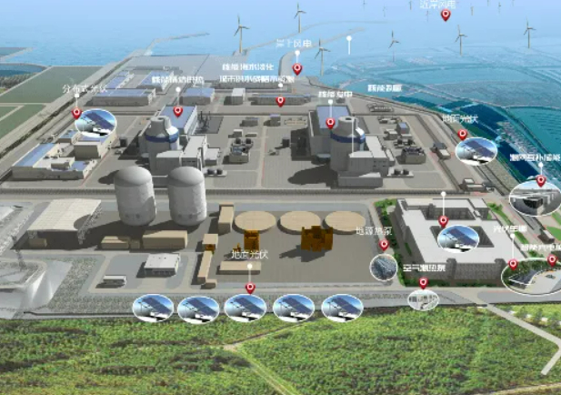

<grid cols="2">
  <column width="50">
    

  </column>
  <column width="50">
    

  </column>
</grid>

施工区域约100余个室内房间的定位设备安装，其中1#机组、2#机组共有高精度需求定位房间约18个。

<lark-table rows="126" cols="11" column-widths="100,100,100,100,100,100,100,100,100,100,100">

  <lark-tr>
    <lark-td>
      序号
    </lark-td>
    <lark-td>
      机组
    </lark-td>
    <lark-td>
      厂房
    </lark-td>
    <lark-td>
      房间号
    </lark-td>
    <lark-td colspan="2">
      长
    </lark-td>
    <lark-td>
      宽
    </lark-td>
    <lark-td>
      高度
    </lark-td>
    <lark-td>
      出入口数量
    </lark-td>
    <lark-td>
      基站类型
    </lark-td>
    <lark-td>
      基站数量
    </lark-td>
  </lark-tr>
  <lark-tr>
    <lark-td>
      1
    </lark-td>
    <lark-td>
      1号
    </lark-td>
    <lark-td rowspan="8">
      11厂房
    </lark-td>
    <lark-td>
      11201
    </lark-td>
    <lark-td colspan="2">
    </lark-td>
    <lark-td>
    </lark-td>
    <lark-td>
    </lark-td>
    <lark-td>
      1
    </lark-td>
    <lark-td>
      0/1维基站
    </lark-td>
    <lark-td>
      1
    </lark-td>
  </lark-tr>
  <lark-tr>
    <lark-td>
      2
    </lark-td>
    <lark-td>
      1号
    </lark-td>
    <lark-td>
      11202
    </lark-td>
    <lark-td colspan="2">
    </lark-td>
    <lark-td>
    </lark-td>
    <lark-td>
    </lark-td>
    <lark-td>
      1
    </lark-td>
    <lark-td>
      0/1维基站
    </lark-td>
    <lark-td>
      1
    </lark-td>
  </lark-tr>
  <lark-tr>
    <lark-td>
      3
    </lark-td>
    <lark-td>
      1号
    </lark-td>
    <lark-td>
      11206
    </lark-td>
    <lark-td colspan="2">
    </lark-td>
    <lark-td>
    </lark-td>
    <lark-td>
    </lark-td>
    <lark-td>
      1
    </lark-td>
    <lark-td>
      0/1维基站
    </lark-td>
    <lark-td>
      1
    </lark-td>
  </lark-tr>
  <lark-tr>
    <lark-td>
      4
    </lark-td>
    <lark-td>
      1号
    </lark-td>
    <lark-td>
      11207
    </lark-td>
    <lark-td colspan="2">
    </lark-td>
    <lark-td>
    </lark-td>
    <lark-td>
    </lark-td>
    <lark-td>
      1
    </lark-td>
    <lark-td>
      0/1维基站
    </lark-td>
    <lark-td>
      1
    </lark-td>
  </lark-tr>
  <lark-tr>
    <lark-td>
      5
    </lark-td>
    <lark-td>
      <text bgcolor="yellow">1号</text>
    </lark-td>
    <lark-td>
      <text bgcolor="yellow">11300</text>
    </lark-td>
    <lark-td colspan="3">
      <text bgcolor="yellow">不规则房间</text>
    </lark-td>
    <lark-td>
      <text bgcolor="yellow">2.8</text>
    </lark-td>
    <lark-td>
      <text bgcolor="yellow">NA</text>
    </lark-td>
    <lark-td>
      <text bgcolor="yellow">二维基站</text>
    </lark-td>
    <lark-td>
      <text bgcolor="yellow">20</text>
    </lark-td>
  </lark-tr>
  <lark-tr>
    <lark-td>
      6
    </lark-td>
    <lark-td>
      1号
    </lark-td>
    <lark-td>
      11303
    </lark-td>
    <lark-td colspan="2">
    </lark-td>
    <lark-td>
    </lark-td>
    <lark-td>
    </lark-td>
    <lark-td>
      1
    </lark-td>
    <lark-td>
      0/1维基站
    </lark-td>
    <lark-td>
      1
    </lark-td>
  </lark-tr>
  <lark-tr>
    <lark-td>
      7
    </lark-td>
    <lark-td>
      <text bgcolor="yellow">1号</text>
    </lark-td>
    <lark-td>
      <text bgcolor="yellow">11400</text>
    </lark-td>
    <lark-td colspan="3">
      <text bgcolor="yellow">不规则房间</text>
    </lark-td>
    <lark-td>
      <text bgcolor="yellow">4</text>
    </lark-td>
    <lark-td>
      <text bgcolor="yellow">NA</text>
    </lark-td>
    <lark-td>
      <text bgcolor="yellow">二维基站</text>
    </lark-td>
    <lark-td>
      <text bgcolor="yellow">22</text>
    </lark-td>
  </lark-tr>
  <lark-tr>
    <lark-td>
      8
    </lark-td>
    <lark-td>
      <text bgcolor="yellow">1号</text>
    </lark-td>
    <lark-td>
      <text bgcolor="yellow">11500</text>
    </lark-td>
    <lark-td colspan="3">
      <text bgcolor="yellow">不规则房间</text>
    </lark-td>
    <lark-td>
      <text bgcolor="yellow">22</text>
    </lark-td>
    <lark-td>
      <text bgcolor="yellow">NA</text>
    </lark-td>
    <lark-td>
      <text bgcolor="yellow">长距离基站</text>
    </lark-td>
    <lark-td>
      <text bgcolor="yellow">4</text>
    </lark-td>
  </lark-tr>
  <lark-tr>
    <lark-td>
      9
    </lark-td>
    <lark-td>
      1号
    </lark-td>
    <lark-td rowspan="13">
      12厂房
    </lark-td>
    <lark-td>
      12161
    </lark-td>
    <lark-td colspan="2">
    </lark-td>
    <lark-td>
    </lark-td>
    <lark-td>
    </lark-td>
    <lark-td>
      1
    </lark-td>
    <lark-td>
      0/1维基站
    </lark-td>
    <lark-td>
      1
    </lark-td>
  </lark-tr>
  <lark-tr>
    <lark-td>
      10
    </lark-td>
    <lark-td>
      1号
    </lark-td>
    <lark-td>
      12155
    </lark-td>
    <lark-td colspan="2">
    </lark-td>
    <lark-td>
    </lark-td>
    <lark-td>
    </lark-td>
    <lark-td>
      1
    </lark-td>
    <lark-td>
      0/1维基站
    </lark-td>
    <lark-td>
      1
    </lark-td>
  </lark-tr>
  <lark-tr>
    <lark-td>
      11
    </lark-td>
    <lark-td>
      1号
    </lark-td>
    <lark-td>
      12255
    </lark-td>
    <lark-td colspan="2">
    </lark-td>
    <lark-td>
    </lark-td>
    <lark-td>
    </lark-td>
    <lark-td>
      1
    </lark-td>
    <lark-td>
      0/1维基站
    </lark-td>
    <lark-td>
      1
    </lark-td>
  </lark-tr>
  <lark-tr>
    <lark-td>
      12
    </lark-td>
    <lark-td>
      1号
    </lark-td>
    <lark-td>
      12272
    </lark-td>
    <lark-td colspan="2">
    </lark-td>
    <lark-td>
    </lark-td>
    <lark-td>
    </lark-td>
    <lark-td>
      1
    </lark-td>
    <lark-td>
      0/1维基站
    </lark-td>
    <lark-td>
      1
    </lark-td>
  </lark-tr>
  <lark-tr>
    <lark-td>
      13
    </lark-td>
    <lark-td>
      1号
    </lark-td>
    <lark-td>
      12300
    </lark-td>
    <lark-td colspan="2">
    </lark-td>
    <lark-td>
    </lark-td>
    <lark-td>
    </lark-td>
    <lark-td>
      2
    </lark-td>
    <lark-td>
      0/1维基站
    </lark-td>
    <lark-td>
      2
    </lark-td>
  </lark-tr>
  <lark-tr>
    <lark-td>
      14
    </lark-td>
    <lark-td>
      1号
    </lark-td>
    <lark-td>
      12306
    </lark-td>
    <lark-td colspan="2">
    </lark-td>
    <lark-td>
    </lark-td>
    <lark-td>
    </lark-td>
    <lark-td>
      1
    </lark-td>
    <lark-td>
      0/1维基站
    </lark-td>
    <lark-td>
      1
    </lark-td>
  </lark-tr>
  <lark-tr>
    <lark-td>
      15
    </lark-td>
    <lark-td>
      1号
    </lark-td>
    <lark-td>
      12361
    </lark-td>
    <lark-td colspan="2">
    </lark-td>
    <lark-td>
    </lark-td>
    <lark-td>
    </lark-td>
    <lark-td>
      1
    </lark-td>
    <lark-td>
      0/1维基站
    </lark-td>
    <lark-td>
      1
    </lark-td>
  </lark-tr>
  <lark-tr>
    <lark-td>
      16
    </lark-td>
    <lark-td>
      <text bgcolor="yellow">1号</text>
    </lark-td>
    <lark-td>
      <text bgcolor="yellow">12401</text>
    </lark-td>
    <lark-td colspan="2">
      <text bgcolor="yellow">13</text>
    </lark-td>
    <lark-td>
      <text bgcolor="yellow">13.5</text>
    </lark-td>
    <lark-td>
      <text bgcolor="yellow">3.3</text>
    </lark-td>
    <lark-td>
      <text bgcolor="yellow">NA</text>
    </lark-td>
    <lark-td>
      <text bgcolor="yellow">二维基站</text>
    </lark-td>
    <lark-td>
      <text bgcolor="yellow">12</text>
    </lark-td>
  </lark-tr>
  <lark-tr>
    <lark-td>
      17
    </lark-td>
    <lark-td>
      1号
    </lark-td>
    <lark-td>
      12562
    </lark-td>
    <lark-td colspan="2">
    </lark-td>
    <lark-td>
    </lark-td>
    <lark-td>
    </lark-td>
    <lark-td>
      1
    </lark-td>
    <lark-td>
      0/1维基站
    </lark-td>
    <lark-td>
      1
    </lark-td>
  </lark-tr>
  <lark-tr>
    <lark-td>
      18
    </lark-td>
    <lark-td>
      1号
    </lark-td>
    <lark-td>
      12701
    </lark-td>
    <lark-td colspan="2">
    </lark-td>
    <lark-td>
    </lark-td>
    <lark-td>
    </lark-td>
    <lark-td>
      2
    </lark-td>
    <lark-td>
      0/1维基站
    </lark-td>
    <lark-td>
      2
    </lark-td>
  </lark-tr>
  <lark-tr>
    <lark-td>
      19
    </lark-td>
    <lark-td>
      <text bgcolor="yellow">1号</text>
    </lark-td>
    <lark-td>
      <text bgcolor="yellow">12351</text>
    </lark-td>
    <lark-td colspan="2">
      <text bgcolor="yellow">18</text>
    </lark-td>
    <lark-td>
      <text bgcolor="yellow">14</text>
    </lark-td>
    <lark-td>
      <text bgcolor="yellow">4.5</text>
    </lark-td>
    <lark-td>
      <text bgcolor="yellow">NA</text>
    </lark-td>
    <lark-td>
      <text bgcolor="yellow">二维基站</text>
    </lark-td>
    <lark-td>
      4
    </lark-td>
  </lark-tr>
  <lark-tr>
    <lark-td>
      20
    </lark-td>
    <lark-td>
      <text bgcolor="yellow">1号</text>
    </lark-td>
    <lark-td>
      <text bgcolor="yellow">12650</text>
    </lark-td>
    <lark-td colspan="2">
      <text bgcolor="yellow">13</text>
    </lark-td>
    <lark-td>
      <text bgcolor="yellow">9</text>
    </lark-td>
    <lark-td>
      <text bgcolor="yellow">3.5</text>
    </lark-td>
    <lark-td>
      <text bgcolor="yellow">NA</text>
    </lark-td>
    <lark-td>
      <text bgcolor="yellow">二维基站</text>
    </lark-td>
    <lark-td>
      16
    </lark-td>
  </lark-tr>
  <lark-tr>
    <lark-td>
      21
    </lark-td>
    <lark-td>
      <text bgcolor="yellow">1号</text>
    </lark-td>
    <lark-td>
      <text bgcolor="yellow">12556</text>
    </lark-td>
    <lark-td colspan="2">
      <text bgcolor="yellow">9</text>
    </lark-td>
    <lark-td>
      <text bgcolor="yellow">9</text>
    </lark-td>
    <lark-td>
      <text bgcolor="yellow">6</text>
    </lark-td>
    <lark-td>
      <text bgcolor="yellow">NA</text>
    </lark-td>
    <lark-td>
      <text bgcolor="yellow">二维基站</text>
    </lark-td>
    <lark-td>
      2
    </lark-td>
  </lark-tr>
  <lark-tr>
    <lark-td>
      22
    </lark-td>
    <lark-td>
      1号
    </lark-td>
    <lark-td rowspan="13">
      40厂房
    </lark-td>
    <lark-td>
      40321
    </lark-td>
    <lark-td colspan="2">
    </lark-td>
    <lark-td>
    </lark-td>
    <lark-td>
    </lark-td>
    <lark-td>
      2
    </lark-td>
    <lark-td>
      0/1维基站
    </lark-td>
    <lark-td>
      2
    </lark-td>
  </lark-tr>
  <lark-tr>
    <lark-td>
      23
    </lark-td>
    <lark-td>
      1号
    </lark-td>
    <lark-td>
      40405
    </lark-td>
    <lark-td colspan="2">
    </lark-td>
    <lark-td>
    </lark-td>
    <lark-td>
    </lark-td>
    <lark-td>
      1
    </lark-td>
    <lark-td>
      0/1维基站
    </lark-td>
    <lark-td>
      1
    </lark-td>
  </lark-tr>
  <lark-tr>
    <lark-td>
      24
    </lark-td>
    <lark-td>
      1号
    </lark-td>
    <lark-td>
      40406
    </lark-td>
    <lark-td colspan="2">
    </lark-td>
    <lark-td>
    </lark-td>
    <lark-td>
    </lark-td>
    <lark-td>
      1
    </lark-td>
    <lark-td>
      0/1维基站
    </lark-td>
    <lark-td>
      1
    </lark-td>
  </lark-tr>
  <lark-tr>
    <lark-td>
      25
    </lark-td>
    <lark-td>
      1号
    </lark-td>
    <lark-td>
      40408
    </lark-td>
    <lark-td colspan="2">
    </lark-td>
    <lark-td>
    </lark-td>
    <lark-td>
    </lark-td>
    <lark-td>
      2
    </lark-td>
    <lark-td>
      0/1维基站
    </lark-td>
    <lark-td>
      2
    </lark-td>
  </lark-tr>
  <lark-tr>
    <lark-td>
      26
    </lark-td>
    <lark-td>
      1号
    </lark-td>
    <lark-td>
      40323
    </lark-td>
    <lark-td colspan="2">
    </lark-td>
    <lark-td>
    </lark-td>
    <lark-td>
    </lark-td>
    <lark-td>
      2
    </lark-td>
    <lark-td>
      0/1维基站
    </lark-td>
    <lark-td>
      2
    </lark-td>
  </lark-tr>
  <lark-tr>
    <lark-td>
      27
    </lark-td>
    <lark-td>
      1号
    </lark-td>
    <lark-td>
      40410
    </lark-td>
    <lark-td colspan="2">
      18.6
    </lark-td>
    <lark-td>
      25.5
    </lark-td>
    <lark-td>
      2
    </lark-td>
    <lark-td>
      NA
    </lark-td>
    <lark-td>
      0/1维基站
    </lark-td>
    <lark-td>
      18
    </lark-td>
  </lark-tr>
  <lark-tr>
    <lark-td>
      28
    </lark-td>
    <lark-td>
      1号
    </lark-td>
    <lark-td>
      40411
    </lark-td>
    <lark-td colspan="2">
      18.5
    </lark-td>
    <lark-td>
      25.5
    </lark-td>
    <lark-td>
      2
    </lark-td>
    <lark-td>
      NA
    </lark-td>
    <lark-td>
      0/1维基站
    </lark-td>
    <lark-td>
      18
    </lark-td>
  </lark-tr>
  <lark-tr>
    <lark-td>
      29
    </lark-td>
    <lark-td>
      1号
    </lark-td>
    <lark-td>
      40324
    </lark-td>
    <lark-td colspan="2">
    </lark-td>
    <lark-td>
    </lark-td>
    <lark-td>
    </lark-td>
    <lark-td>
      3
    </lark-td>
    <lark-td>
      0/1维基站
    </lark-td>
    <lark-td>
      3
    </lark-td>
  </lark-tr>
  <lark-tr>
    <lark-td>
      30
    </lark-td>
    <lark-td>
      1号
    </lark-td>
    <lark-td>
      40350
    </lark-td>
    <lark-td colspan="2">
    </lark-td>
    <lark-td>
    </lark-td>
    <lark-td>
    </lark-td>
    <lark-td>
      2
    </lark-td>
    <lark-td>
      0/1维基站
    </lark-td>
    <lark-td>
      2
    </lark-td>
  </lark-tr>
  <lark-tr>
    <lark-td>
      31
    </lark-td>
    <lark-td>
      1号
    </lark-td>
    <lark-td>
      40400
    </lark-td>
    <lark-td colspan="2">
      28
    </lark-td>
    <lark-td>
      3
    </lark-td>
    <lark-td>
      4
    </lark-td>
    <lark-td>
      NA
    </lark-td>
    <lark-td>
      0/1维基站
    </lark-td>
    <lark-td>
      19
    </lark-td>
  </lark-tr>
  <lark-tr>
    <lark-td>
      32
    </lark-td>
    <lark-td>
      1号
    </lark-td>
    <lark-td>
      40353
    </lark-td>
    <lark-td colspan="2">
    </lark-td>
    <lark-td>
    </lark-td>
    <lark-td>
    </lark-td>
    <lark-td>
      6
    </lark-td>
    <lark-td>
      0/1维基站
    </lark-td>
    <lark-td>
      6
    </lark-td>
  </lark-tr>
  <lark-tr>
    <lark-td>
      33
    </lark-td>
    <lark-td>
      1号
    </lark-td>
    <lark-td>
      40309
    </lark-td>
    <lark-td colspan="2">
    </lark-td>
    <lark-td>
    </lark-td>
    <lark-td>
    </lark-td>
    <lark-td>
      5
    </lark-td>
    <lark-td>
      0/1维基站
    </lark-td>
    <lark-td>
      5
    </lark-td>
  </lark-tr>
  <lark-tr>
    <lark-td>
      34
    </lark-td>
    <lark-td>
      1号
    </lark-td>
    <lark-td>
      40300
    </lark-td>
    <lark-td colspan="2">
      49
    </lark-td>
    <lark-td>
      3
    </lark-td>
    <lark-td>
      4
    </lark-td>
    <lark-td>
      NA
    </lark-td>
    <lark-td>
      0/1维基站
    </lark-td>
    <lark-td>
      25
    </lark-td>
  </lark-tr>
  <lark-tr>
    <lark-td>
      35
    </lark-td>
    <lark-td>
      <text bgcolor="yellow">1号</text>
    </lark-td>
    <lark-td rowspan="4">
      <text bgcolor="yellow">50厂房</text>
    </lark-td>
    <lark-td>
      <text bgcolor="yellow">50300</text>
    </lark-td>
    <lark-td colspan="2">
      <text bgcolor="yellow">11.7</text>
    </lark-td>
    <lark-td>
      <text bgcolor="yellow">10.7</text>
    </lark-td>
    <lark-td>
      <text bgcolor="yellow">8</text>
    </lark-td>
    <lark-td>
      <text bgcolor="yellow">NA</text>
    </lark-td>
    <lark-td>
      <text bgcolor="yellow">二维基站</text>
    </lark-td>
    <lark-td>
      1
    </lark-td>
  </lark-tr>
  <lark-tr>
    <lark-td>
      36
    </lark-td>
    <lark-td>
      1号
    </lark-td>
    <lark-td>
      50353
    </lark-td>
    <lark-td colspan="2">
    </lark-td>
    <lark-td>
    </lark-td>
    <lark-td>
    </lark-td>
    <lark-td>
      2
    </lark-td>
    <lark-td>
      0/1维基站
    </lark-td>
    <lark-td>
      2
    </lark-td>
  </lark-tr>
  <lark-tr>
    <lark-td>
      37
    </lark-td>
    <lark-td>
      1号
    </lark-td>
    <lark-td>
      50354
    </lark-td>
    <lark-td colspan="2">
    </lark-td>
    <lark-td>
    </lark-td>
    <lark-td>
    </lark-td>
    <lark-td>
      4
    </lark-td>
    <lark-td>
      0/1维基站
    </lark-td>
    <lark-td>
      4
    </lark-td>
  </lark-tr>
  <lark-tr>
    <lark-td>
      38
    </lark-td>
    <lark-td>
      1号
    </lark-td>
    <lark-td>
      50355
    </lark-td>
    <lark-td colspan="2">
    </lark-td>
    <lark-td>
    </lark-td>
    <lark-td>
    </lark-td>
    <lark-td>
      1
    </lark-td>
    <lark-td>
      0/1维基站
    </lark-td>
    <lark-td>
      1
    </lark-td>
  </lark-tr>
  <lark-tr>
    <lark-td>
      39
    </lark-td>
    <lark-td>
      1号
    </lark-td>
    <lark-td rowspan="2">
      60厂房
    </lark-td>
    <lark-td>
      60212
    </lark-td>
    <lark-td colspan="2">
    </lark-td>
    <lark-td>
    </lark-td>
    <lark-td>
    </lark-td>
    <lark-td>
      1
    </lark-td>
    <lark-td>
      0/1维基站
    </lark-td>
    <lark-td>
      1
    </lark-td>
  </lark-tr>
  <lark-tr>
    <lark-td>
      40
    </lark-td>
    <lark-td>
      1号
    </lark-td>
    <lark-td>
      60310
    </lark-td>
    <lark-td colspan="2">
    </lark-td>
    <lark-td>
    </lark-td>
    <lark-td>
    </lark-td>
    <lark-td>
      7
    </lark-td>
    <lark-td>
      0/1维基站
    </lark-td>
    <lark-td>
      7
    </lark-td>
  </lark-tr>
  <lark-tr>
    <lark-td>
      41
    </lark-td>
    <lark-td>
      1号
    </lark-td>
    <lark-td rowspan="10">
      20汽机厂房
    </lark-td>
    <lark-td>
      20406
    </lark-td>
    <lark-td colspan="2">
    </lark-td>
    <lark-td>
    </lark-td>
    <lark-td>
    </lark-td>
    <lark-td>
      2
    </lark-td>
    <lark-td>
      0/1维基站
    </lark-td>
    <lark-td>
      2
    </lark-td>
  </lark-tr>
  <lark-tr>
    <lark-td>
      42
    </lark-td>
    <lark-td>
      1号
    </lark-td>
    <lark-td>
      20412
    </lark-td>
    <lark-td colspan="2">
    </lark-td>
    <lark-td>
    </lark-td>
    <lark-td>
    </lark-td>
    <lark-td>
      2
    </lark-td>
    <lark-td>
      0/1维基站
    </lark-td>
    <lark-td>
      2
    </lark-td>
  </lark-tr>
  <lark-tr>
    <lark-td>
      43
    </lark-td>
    <lark-td>
      1号
    </lark-td>
    <lark-td>
      20505
    </lark-td>
    <lark-td colspan="2">
    </lark-td>
    <lark-td>
    </lark-td>
    <lark-td>
    </lark-td>
    <lark-td>
      2
    </lark-td>
    <lark-td>
      0/1维基站
    </lark-td>
    <lark-td>
      2
    </lark-td>
  </lark-tr>
  <lark-tr>
    <lark-td>
      44
    </lark-td>
    <lark-td>
      1号
    </lark-td>
    <lark-td>
      20506
    </lark-td>
    <lark-td colspan="2">
    </lark-td>
    <lark-td>
    </lark-td>
    <lark-td>
    </lark-td>
    <lark-td>
      3
    </lark-td>
    <lark-td>
      0/1维基站
    </lark-td>
    <lark-td>
      3
    </lark-td>
  </lark-tr>
  <lark-tr>
    <lark-td>
      45
    </lark-td>
    <lark-td>
      1号
    </lark-td>
    <lark-td>
      20507
    </lark-td>
    <lark-td colspan="2">
    </lark-td>
    <lark-td>
    </lark-td>
    <lark-td>
    </lark-td>
    <lark-td>
      1
    </lark-td>
    <lark-td>
      0/1维基站
    </lark-td>
    <lark-td>
      1
    </lark-td>
  </lark-tr>
  <lark-tr>
    <lark-td>
      46
    </lark-td>
    <lark-td>
      1号
    </lark-td>
    <lark-td>
      20302~305
    </lark-td>
    <lark-td colspan="2">
    </lark-td>
    <lark-td>
    </lark-td>
    <lark-td>
    </lark-td>
    <lark-td>
      4
    </lark-td>
    <lark-td>
      0/1维基站
    </lark-td>
    <lark-td>
      4
    </lark-td>
  </lark-tr>
  <lark-tr>
    <lark-td>
      47
    </lark-td>
    <lark-td>
      1号
    </lark-td>
    <lark-td>
      20402~404
    </lark-td>
    <lark-td colspan="2">
    </lark-td>
    <lark-td>
    </lark-td>
    <lark-td>
    </lark-td>
    <lark-td>
      3
    </lark-td>
    <lark-td>
      0/1维基站
    </lark-td>
    <lark-td>
      3
    </lark-td>
  </lark-tr>
  <lark-tr>
    <lark-td>
      48
    </lark-td>
    <lark-td>
      1号
    </lark-td>
    <lark-td>
      0m配电间
    </lark-td>
    <lark-td colspan="2">
    </lark-td>
    <lark-td>
    </lark-td>
    <lark-td>
    </lark-td>
    <lark-td>
      4
    </lark-td>
    <lark-td>
      0/1维基站
    </lark-td>
    <lark-td>
      4
    </lark-td>
  </lark-tr>
  <lark-tr>
    <lark-td>
      49
    </lark-td>
    <lark-td>
      1号
    </lark-td>
    <lark-td>
      5m配电间
    </lark-td>
    <lark-td colspan="2">
    </lark-td>
    <lark-td>
    </lark-td>
    <lark-td>
    </lark-td>
    <lark-td>
      2
    </lark-td>
    <lark-td>
      0/1维基站
    </lark-td>
    <lark-td>
      2
    </lark-td>
  </lark-tr>
  <lark-tr>
    <lark-td>
      50
    </lark-td>
    <lark-td>
      <text bgcolor="yellow">1号</text>
    </lark-td>
    <lark-td>
      <text bgcolor="yellow">10米平台</text>
    </lark-td>
    <lark-td colspan="2">
      <text bgcolor="yellow">125</text>
    </lark-td>
    <lark-td>
      <text bgcolor="yellow">55</text>
    </lark-td>
    <lark-td>
      <text bgcolor="yellow">25</text>
    </lark-td>
    <lark-td>
      <text bgcolor="yellow">NA</text>
    </lark-td>
    <lark-td>
      <text bgcolor="yellow">长距离基站</text>
    </lark-td>
    <lark-td>
      <text bgcolor="yellow">12</text>
    </lark-td>
  </lark-tr>
  <lark-tr>
    <lark-td>
      51
    </lark-td>
    <lark-td>
      1号
    </lark-td>
    <lark-td rowspan="2">
      21厂房
    </lark-td>
    <lark-td>
      21311
    </lark-td>
    <lark-td colspan="2">
    </lark-td>
    <lark-td>
    </lark-td>
    <lark-td>
    </lark-td>
    <lark-td>
      2
    </lark-td>
    <lark-td>
      0/1维基站
    </lark-td>
    <lark-td>
      2
    </lark-td>
  </lark-tr>
  <lark-tr>
    <lark-td>
      52
    </lark-td>
    <lark-td>
      1号
    </lark-td>
    <lark-td>
      21607
    </lark-td>
    <lark-td colspan="2">
    </lark-td>
    <lark-td>
    </lark-td>
    <lark-td>
    </lark-td>
    <lark-td>
      2
    </lark-td>
    <lark-td>
      0/1维基站
    </lark-td>
    <lark-td>
      2
    </lark-td>
  </lark-tr>
  <lark-tr>
    <lark-td>
      53
    </lark-td>
    <lark-td>
      1号
    </lark-td>
    <lark-td rowspan="3">
      循环水泵房
    </lark-td>
    <lark-td>
      地下室
    </lark-td>
    <lark-td colspan="2">
    </lark-td>
    <lark-td>
    </lark-td>
    <lark-td>
    </lark-td>
    <lark-td>
      2
    </lark-td>
    <lark-td>
      0/1维基站
    </lark-td>
    <lark-td>
      2
    </lark-td>
  </lark-tr>
  <lark-tr>
    <lark-td>
      54
    </lark-td>
    <lark-td>
      1号
    </lark-td>
    <lark-td>
      配电室
    </lark-td>
    <lark-td colspan="2">
    </lark-td>
    <lark-td>
    </lark-td>
    <lark-td>
    </lark-td>
    <lark-td>
      2
    </lark-td>
    <lark-td>
      0/1维基站
    </lark-td>
    <lark-td>
      2
    </lark-td>
  </lark-tr>
  <lark-tr>
    <lark-td>
      55
    </lark-td>
    <lark-td>
      1号
    </lark-td>
    <lark-td>
      0米层
    </lark-td>
    <lark-td colspan="2">
    </lark-td>
    <lark-td>
    </lark-td>
    <lark-td>
    </lark-td>
    <lark-td>
      4
    </lark-td>
    <lark-td>
      0/1维基站
    </lark-td>
    <lark-td>
      4
    </lark-td>
  </lark-tr>
  <lark-tr>
    <lark-td>
      56
    </lark-td>
    <lark-td>
      2号
    </lark-td>
    <lark-td rowspan="8">
      11厂房
    </lark-td>
    <lark-td>
      11201
    </lark-td>
    <lark-td colspan="2">
    </lark-td>
    <lark-td>
    </lark-td>
    <lark-td>
    </lark-td>
    <lark-td>
      1
    </lark-td>
    <lark-td>
      0/1维基站
    </lark-td>
    <lark-td>
      1
    </lark-td>
  </lark-tr>
  <lark-tr>
    <lark-td>
      57
    </lark-td>
    <lark-td>
      2号
    </lark-td>
    <lark-td>
      11202
    </lark-td>
    <lark-td colspan="2">
    </lark-td>
    <lark-td>
    </lark-td>
    <lark-td>
    </lark-td>
    <lark-td>
      1
    </lark-td>
    <lark-td>
      0/1维基站
    </lark-td>
    <lark-td>
      1
    </lark-td>
  </lark-tr>
  <lark-tr>
    <lark-td>
      58
    </lark-td>
    <lark-td>
      2号
    </lark-td>
    <lark-td>
      11206
    </lark-td>
    <lark-td colspan="2">
    </lark-td>
    <lark-td>
    </lark-td>
    <lark-td>
    </lark-td>
    <lark-td>
      1
    </lark-td>
    <lark-td>
      0/1维基站
    </lark-td>
    <lark-td>
      1
    </lark-td>
  </lark-tr>
  <lark-tr>
    <lark-td>
      59
    </lark-td>
    <lark-td>
      2号
    </lark-td>
    <lark-td>
      11207
    </lark-td>
    <lark-td colspan="2">
    </lark-td>
    <lark-td>
    </lark-td>
    <lark-td>
    </lark-td>
    <lark-td>
      1
    </lark-td>
    <lark-td>
      0/1维基站
    </lark-td>
    <lark-td>
      1
    </lark-td>
  </lark-tr>
  <lark-tr>
    <lark-td>
      60
    </lark-td>
    <lark-td>
      2号
    </lark-td>
    <lark-td>
      11300
    </lark-td>
    <lark-td colspan="3">
      不规则房间
    </lark-td>
    <lark-td>
      2.8
    </lark-td>
    <lark-td>
      NA
    </lark-td>
    <lark-td>
      二维基站
    </lark-td>
    <lark-td>
      20
    </lark-td>
  </lark-tr>
  <lark-tr>
    <lark-td>
      61
    </lark-td>
    <lark-td>
      2号
    </lark-td>
    <lark-td>
      11303
    </lark-td>
    <lark-td colspan="2">
    </lark-td>
    <lark-td>
    </lark-td>
    <lark-td>
    </lark-td>
    <lark-td>
      1
    </lark-td>
    <lark-td>
      0/1维基站
    </lark-td>
    <lark-td>
      1
    </lark-td>
  </lark-tr>
  <lark-tr>
    <lark-td>
      <text bgcolor="yellow">62</text>
    </lark-td>
    <lark-td>
      <text bgcolor="yellow">2号</text>
    </lark-td>
    <lark-td>
      <text bgcolor="yellow">11400</text>
    </lark-td>
    <lark-td colspan="3">
      <text bgcolor="yellow">不规则房间</text>
    </lark-td>
    <lark-td>
      <text bgcolor="yellow">4</text>
    </lark-td>
    <lark-td>
      <text bgcolor="yellow">NA</text>
    </lark-td>
    <lark-td>
      <text bgcolor="yellow">二维基站</text>
    </lark-td>
    <lark-td>
      <text bgcolor="yellow">22</text>
    </lark-td>
  </lark-tr>
  <lark-tr>
    <lark-td>
      63
    </lark-td>
    <lark-td>
      <text bgcolor="yellow">2号</text>
    </lark-td>
    <lark-td>
      <text bgcolor="yellow">11500</text>
    </lark-td>
    <lark-td colspan="3">
      <text bgcolor="yellow">不规则房间</text>
    </lark-td>
    <lark-td>
      <text bgcolor="yellow">22</text>
    </lark-td>
    <lark-td>
      <text bgcolor="yellow">NA</text>
    </lark-td>
    <lark-td>
      <text bgcolor="yellow">长距离基站</text>
    </lark-td>
    <lark-td>
      <text bgcolor="yellow">4</text>
    </lark-td>
  </lark-tr>
  <lark-tr>
    <lark-td>
      64
    </lark-td>
    <lark-td>
      2号
    </lark-td>
    <lark-td rowspan="13">
      12厂房
    </lark-td>
    <lark-td>
      12161
    </lark-td>
    <lark-td colspan="2">
    </lark-td>
    <lark-td>
    </lark-td>
    <lark-td>
    </lark-td>
    <lark-td>
      1
    </lark-td>
    <lark-td>
      0/1维基站
    </lark-td>
    <lark-td>
      1
    </lark-td>
  </lark-tr>
  <lark-tr>
    <lark-td>
      65
    </lark-td>
    <lark-td>
      2号
    </lark-td>
    <lark-td>
      12155
    </lark-td>
    <lark-td colspan="2">
    </lark-td>
    <lark-td>
    </lark-td>
    <lark-td>
    </lark-td>
    <lark-td>
      1
    </lark-td>
    <lark-td>
      0/1维基站
    </lark-td>
    <lark-td>
      1
    </lark-td>
  </lark-tr>
  <lark-tr>
    <lark-td>
      66
    </lark-td>
    <lark-td>
      2号
    </lark-td>
    <lark-td>
      12255
    </lark-td>
    <lark-td colspan="2">
    </lark-td>
    <lark-td>
    </lark-td>
    <lark-td>
    </lark-td>
    <lark-td>
      1
    </lark-td>
    <lark-td>
      0/1维基站
    </lark-td>
    <lark-td>
      1
    </lark-td>
  </lark-tr>
  <lark-tr>
    <lark-td>
      67
    </lark-td>
    <lark-td>
      2号
    </lark-td>
    <lark-td>
      12272
    </lark-td>
    <lark-td colspan="2">
    </lark-td>
    <lark-td>
    </lark-td>
    <lark-td>
    </lark-td>
    <lark-td>
      1
    </lark-td>
    <lark-td>
      0/1维基站
    </lark-td>
    <lark-td>
      1
    </lark-td>
  </lark-tr>
  <lark-tr>
    <lark-td>
      68
    </lark-td>
    <lark-td>
      2号
    </lark-td>
    <lark-td>
      12300
    </lark-td>
    <lark-td colspan="2">
    </lark-td>
    <lark-td>
    </lark-td>
    <lark-td>
    </lark-td>
    <lark-td>
      2
    </lark-td>
    <lark-td>
      0/1维基站
    </lark-td>
    <lark-td>
      2
    </lark-td>
  </lark-tr>
  <lark-tr>
    <lark-td>
      69
    </lark-td>
    <lark-td>
      2号
    </lark-td>
    <lark-td>
      12306
    </lark-td>
    <lark-td colspan="2">
    </lark-td>
    <lark-td>
    </lark-td>
    <lark-td>
    </lark-td>
    <lark-td>
      1
    </lark-td>
    <lark-td>
      0/1维基站
    </lark-td>
    <lark-td>
      1
    </lark-td>
  </lark-tr>
  <lark-tr>
    <lark-td>
      70
    </lark-td>
    <lark-td>
      2号
    </lark-td>
    <lark-td>
      12361
    </lark-td>
    <lark-td colspan="2">
    </lark-td>
    <lark-td>
    </lark-td>
    <lark-td>
    </lark-td>
    <lark-td>
      1
    </lark-td>
    <lark-td>
      0/1维基站
    </lark-td>
    <lark-td>
      1
    </lark-td>
  </lark-tr>
  <lark-tr>
    <lark-td>
      71
    </lark-td>
    <lark-td>
      2号
    </lark-td>
    <lark-td>
      12401
    </lark-td>
    <lark-td colspan="2">
      13
    </lark-td>
    <lark-td>
      13.5
    </lark-td>
    <lark-td>
      3.3
    </lark-td>
    <lark-td>
      NA
    </lark-td>
    <lark-td>
      二维基站
    </lark-td>
    <lark-td>
      12
    </lark-td>
  </lark-tr>
  <lark-tr>
    <lark-td>
      72
    </lark-td>
    <lark-td>
      2号
    </lark-td>
    <lark-td>
      12562
    </lark-td>
    <lark-td colspan="2">
    </lark-td>
    <lark-td>
    </lark-td>
    <lark-td>
    </lark-td>
    <lark-td>
      1
    </lark-td>
    <lark-td>
      0/1维基站
    </lark-td>
    <lark-td>
      1
    </lark-td>
  </lark-tr>
  <lark-tr>
    <lark-td>
      73
    </lark-td>
    <lark-td>
      2号
    </lark-td>
    <lark-td>
      12701
    </lark-td>
    <lark-td colspan="2">
    </lark-td>
    <lark-td>
    </lark-td>
    <lark-td>
    </lark-td>
    <lark-td>
      2
    </lark-td>
    <lark-td>
      0/1维基站
    </lark-td>
    <lark-td>
      2
    </lark-td>
  </lark-tr>
  <lark-tr>
    <lark-td>
      74
    </lark-td>
    <lark-td>
      <text bgcolor="yellow">2号</text>
    </lark-td>
    <lark-td>
      <text bgcolor="yellow">12351</text>
    </lark-td>
    <lark-td colspan="2">
      <text bgcolor="yellow">18</text>
    </lark-td>
    <lark-td>
      <text bgcolor="yellow">14</text>
    </lark-td>
    <lark-td>
      <text bgcolor="yellow">4.5</text>
    </lark-td>
    <lark-td>
      <text bgcolor="yellow">NA</text>
    </lark-td>
    <lark-td>
      <text bgcolor="yellow">二维基站</text>
    </lark-td>
    <lark-td>
      <text bgcolor="yellow">4</text>
    </lark-td>
  </lark-tr>
  <lark-tr>
    <lark-td>
      75
    </lark-td>
    <lark-td>
      <text bgcolor="yellow">2号</text>
    </lark-td>
    <lark-td>
      <text bgcolor="yellow">12650</text>
    </lark-td>
    <lark-td colspan="2">
      <text bgcolor="yellow">13</text>
    </lark-td>
    <lark-td>
      <text bgcolor="yellow">9</text>
    </lark-td>
    <lark-td>
      <text bgcolor="yellow">3.5</text>
    </lark-td>
    <lark-td>
      <text bgcolor="yellow">NA</text>
    </lark-td>
    <lark-td>
      <text bgcolor="yellow">二维基站</text>
    </lark-td>
    <lark-td>
      <text bgcolor="yellow">16</text>
    </lark-td>
  </lark-tr>
  <lark-tr>
    <lark-td>
      76
    </lark-td>
    <lark-td>
      <text bgcolor="yellow">2号</text>
    </lark-td>
    <lark-td>
      <text bgcolor="yellow">12556</text>
    </lark-td>
    <lark-td colspan="2">
      <text bgcolor="yellow">9</text>
    </lark-td>
    <lark-td>
      <text bgcolor="yellow">9</text>
    </lark-td>
    <lark-td>
      <text bgcolor="yellow">6</text>
    </lark-td>
    <lark-td>
      <text bgcolor="yellow">NA</text>
    </lark-td>
    <lark-td>
      <text bgcolor="yellow">二维基站</text>
    </lark-td>
    <lark-td>
      <text bgcolor="yellow">2</text>
    </lark-td>
  </lark-tr>
  <lark-tr>
    <lark-td>
      77
    </lark-td>
    <lark-td>
      2号
    </lark-td>
    <lark-td rowspan="13">
      40厂房
    </lark-td>
    <lark-td>
      40321
    </lark-td>
    <lark-td colspan="2">
    </lark-td>
    <lark-td>
    </lark-td>
    <lark-td>
    </lark-td>
    <lark-td>
      2
    </lark-td>
    <lark-td>
      0/1维基站
    </lark-td>
    <lark-td>
      2
    </lark-td>
  </lark-tr>
  <lark-tr>
    <lark-td>
      78
    </lark-td>
    <lark-td>
      2号
    </lark-td>
    <lark-td>
      40405
    </lark-td>
    <lark-td colspan="2">
    </lark-td>
    <lark-td>
    </lark-td>
    <lark-td>
    </lark-td>
    <lark-td>
      1
    </lark-td>
    <lark-td>
      0/1维基站
    </lark-td>
    <lark-td>
      1
    </lark-td>
  </lark-tr>
  <lark-tr>
    <lark-td>
      79
    </lark-td>
    <lark-td>
      2号
    </lark-td>
    <lark-td>
      40406
    </lark-td>
    <lark-td colspan="2">
    </lark-td>
    <lark-td>
    </lark-td>
    <lark-td>
    </lark-td>
    <lark-td>
      1
    </lark-td>
    <lark-td>
      0/1维基站
    </lark-td>
    <lark-td>
      1
    </lark-td>
  </lark-tr>
  <lark-tr>
    <lark-td>
      80
    </lark-td>
    <lark-td>
      2号
    </lark-td>
    <lark-td>
      40408
    </lark-td>
    <lark-td colspan="2">
    </lark-td>
    <lark-td>
    </lark-td>
    <lark-td>
    </lark-td>
    <lark-td>
      2
    </lark-td>
    <lark-td>
      0/1维基站
    </lark-td>
    <lark-td>
      2
    </lark-td>
  </lark-tr>
  <lark-tr>
    <lark-td>
      81
    </lark-td>
    <lark-td>
      2号
    </lark-td>
    <lark-td>
      40323
    </lark-td>
    <lark-td colspan="2">
    </lark-td>
    <lark-td>
    </lark-td>
    <lark-td>
    </lark-td>
    <lark-td>
      2
    </lark-td>
    <lark-td>
      0/1维基站
    </lark-td>
    <lark-td>
      2
    </lark-td>
  </lark-tr>
  <lark-tr>
    <lark-td>
      82
    </lark-td>
    <lark-td>
      2号
    </lark-td>
    <lark-td>
      40410
    </lark-td>
    <lark-td colspan="2">
      18.6
    </lark-td>
    <lark-td>
      25.5
    </lark-td>
    <lark-td>
      2
    </lark-td>
    <lark-td>
      NA
    </lark-td>
    <lark-td>
      0/1维基站
    </lark-td>
    <lark-td>
      18
    </lark-td>
  </lark-tr>
  <lark-tr>
    <lark-td>
      83
    </lark-td>
    <lark-td>
      2号
    </lark-td>
    <lark-td>
      40411
    </lark-td>
    <lark-td colspan="2">
      18.5
    </lark-td>
    <lark-td>
      25.5
    </lark-td>
    <lark-td>
      2
    </lark-td>
    <lark-td>
      NA
    </lark-td>
    <lark-td>
      0/1维基站
    </lark-td>
    <lark-td>
      18
    </lark-td>
  </lark-tr>
  <lark-tr>
    <lark-td>
      84
    </lark-td>
    <lark-td>
      2号
    </lark-td>
    <lark-td>
      40324
    </lark-td>
    <lark-td colspan="2">
    </lark-td>
    <lark-td>
    </lark-td>
    <lark-td>
    </lark-td>
    <lark-td>
      3
    </lark-td>
    <lark-td>
      0/1维基站
    </lark-td>
    <lark-td>
      3
    </lark-td>
  </lark-tr>
  <lark-tr>
    <lark-td>
      85
    </lark-td>
    <lark-td>
      2号
    </lark-td>
    <lark-td>
      40350
    </lark-td>
    <lark-td colspan="2">
    </lark-td>
    <lark-td>
    </lark-td>
    <lark-td>
    </lark-td>
    <lark-td>
      2
    </lark-td>
    <lark-td>
      0/1维基站
    </lark-td>
    <lark-td>
      2
    </lark-td>
  </lark-tr>
  <lark-tr>
    <lark-td>
      86
    </lark-td>
    <lark-td>
      2号
    </lark-td>
    <lark-td>
      40400
    </lark-td>
    <lark-td colspan="2">
      28
    </lark-td>
    <lark-td>
      3
    </lark-td>
    <lark-td>
      4
    </lark-td>
    <lark-td>
      NA
    </lark-td>
    <lark-td>
      0/1维基站
    </lark-td>
    <lark-td>
      19
    </lark-td>
  </lark-tr>
  <lark-tr>
    <lark-td>
      87
    </lark-td>
    <lark-td>
      2号
    </lark-td>
    <lark-td>
      40353
    </lark-td>
    <lark-td colspan="2">
    </lark-td>
    <lark-td>
    </lark-td>
    <lark-td>
    </lark-td>
    <lark-td>
      6
    </lark-td>
    <lark-td>
      0/1维基站
    </lark-td>
    <lark-td>
      6
    </lark-td>
  </lark-tr>
  <lark-tr>
    <lark-td>
      88
    </lark-td>
    <lark-td>
      2号
    </lark-td>
    <lark-td>
      40309
    </lark-td>
    <lark-td colspan="2">
    </lark-td>
    <lark-td>
    </lark-td>
    <lark-td>
    </lark-td>
    <lark-td>
      5
    </lark-td>
    <lark-td>
      0/1维基站
    </lark-td>
    <lark-td>
      5
    </lark-td>
  </lark-tr>
  <lark-tr>
    <lark-td>
      89
    </lark-td>
    <lark-td>
      2号
    </lark-td>
    <lark-td>
      40300
    </lark-td>
    <lark-td colspan="2">
      49
    </lark-td>
    <lark-td>
      3
    </lark-td>
    <lark-td>
      4
    </lark-td>
    <lark-td>
      NA
    </lark-td>
    <lark-td>
      0/1维基站
    </lark-td>
    <lark-td>
      25
    </lark-td>
  </lark-tr>
  <lark-tr>
    <lark-td>
      90
    </lark-td>
    <lark-td>
      <text bgcolor="yellow">2号</text>
    </lark-td>
    <lark-td rowspan="4">
      <text bgcolor="yellow">50厂房</text>
    </lark-td>
    <lark-td>
      <text bgcolor="yellow">50300</text>
    </lark-td>
    <lark-td colspan="2">
      <text bgcolor="yellow">11.7</text>
    </lark-td>
    <lark-td>
      <text bgcolor="yellow">10.7</text>
    </lark-td>
    <lark-td>
      <text bgcolor="yellow">8</text>
    </lark-td>
    <lark-td>
      <text bgcolor="yellow">NA</text>
    </lark-td>
    <lark-td>
      <text bgcolor="yellow">二维基站</text>
    </lark-td>
    <lark-td>
      <text bgcolor="yellow">1</text>
    </lark-td>
  </lark-tr>
  <lark-tr>
    <lark-td>
      91
    </lark-td>
    <lark-td>
      2号
    </lark-td>
    <lark-td>
      50353
    </lark-td>
    <lark-td colspan="2">
    </lark-td>
    <lark-td>
    </lark-td>
    <lark-td>
    </lark-td>
    <lark-td>
      2
    </lark-td>
    <lark-td>
      0/1维基站
    </lark-td>
    <lark-td>
      2
    </lark-td>
  </lark-tr>
  <lark-tr>
    <lark-td>
      92
    </lark-td>
    <lark-td>
      2号
    </lark-td>
    <lark-td>
      50354
    </lark-td>
    <lark-td colspan="2">
    </lark-td>
    <lark-td>
    </lark-td>
    <lark-td>
    </lark-td>
    <lark-td>
      4
    </lark-td>
    <lark-td>
      0/1维基站
    </lark-td>
    <lark-td>
      4
    </lark-td>
  </lark-tr>
  <lark-tr>
    <lark-td>
      93
    </lark-td>
    <lark-td>
      2号
    </lark-td>
    <lark-td>
      50355
    </lark-td>
    <lark-td colspan="2">
    </lark-td>
    <lark-td>
    </lark-td>
    <lark-td>
    </lark-td>
    <lark-td>
      1
    </lark-td>
    <lark-td>
      0/1维基站
    </lark-td>
    <lark-td>
      1
    </lark-td>
  </lark-tr>
  <lark-tr>
    <lark-td>
      94
    </lark-td>
    <lark-td>
      2号
    </lark-td>
    <lark-td rowspan="2">
      60厂房
    </lark-td>
    <lark-td>
      60212
    </lark-td>
    <lark-td colspan="2">
    </lark-td>
    <lark-td>
    </lark-td>
    <lark-td>
    </lark-td>
    <lark-td>
      1
    </lark-td>
    <lark-td>
      0/1维基站
    </lark-td>
    <lark-td>
      1
    </lark-td>
  </lark-tr>
  <lark-tr>
    <lark-td>
      95
    </lark-td>
    <lark-td>
      2号
    </lark-td>
    <lark-td>
      60310
    </lark-td>
    <lark-td colspan="2">
    </lark-td>
    <lark-td>
    </lark-td>
    <lark-td>
    </lark-td>
    <lark-td>
      7
    </lark-td>
    <lark-td>
      0/1维基站
    </lark-td>
    <lark-td>
      7
    </lark-td>
  </lark-tr>
  <lark-tr>
    <lark-td>
      96
    </lark-td>
    <lark-td>
      2号
    </lark-td>
    <lark-td rowspan="10">
      20汽机厂房
    </lark-td>
    <lark-td>
      20406
    </lark-td>
    <lark-td colspan="2">
    </lark-td>
    <lark-td>
    </lark-td>
    <lark-td>
    </lark-td>
    <lark-td>
      2
    </lark-td>
    <lark-td>
      0/1维基站
    </lark-td>
    <lark-td>
      2
    </lark-td>
  </lark-tr>
  <lark-tr>
    <lark-td>
      97
    </lark-td>
    <lark-td>
      2号
    </lark-td>
    <lark-td>
      20412
    </lark-td>
    <lark-td colspan="2">
    </lark-td>
    <lark-td>
    </lark-td>
    <lark-td>
    </lark-td>
    <lark-td>
      2
    </lark-td>
    <lark-td>
      0/1维基站
    </lark-td>
    <lark-td>
      2
    </lark-td>
  </lark-tr>
  <lark-tr>
    <lark-td>
      98
    </lark-td>
    <lark-td>
      2号
    </lark-td>
    <lark-td>
      20505
    </lark-td>
    <lark-td colspan="2">
    </lark-td>
    <lark-td>
    </lark-td>
    <lark-td>
    </lark-td>
    <lark-td>
      2
    </lark-td>
    <lark-td>
      0/1维基站
    </lark-td>
    <lark-td>
      2
    </lark-td>
  </lark-tr>
  <lark-tr>
    <lark-td>
      99
    </lark-td>
    <lark-td>
      2号
    </lark-td>
    <lark-td>
      20506
    </lark-td>
    <lark-td colspan="2">
    </lark-td>
    <lark-td>
    </lark-td>
    <lark-td>
    </lark-td>
    <lark-td>
      3
    </lark-td>
    <lark-td>
      0/1维基站
    </lark-td>
    <lark-td>
      3
    </lark-td>
  </lark-tr>
  <lark-tr>
    <lark-td>
      100
    </lark-td>
    <lark-td>
      2号
    </lark-td>
    <lark-td>
      20507
    </lark-td>
    <lark-td colspan="2">
    </lark-td>
    <lark-td>
    </lark-td>
    <lark-td>
    </lark-td>
    <lark-td>
      1
    </lark-td>
    <lark-td>
      0/1维基站
    </lark-td>
    <lark-td>
      1
    </lark-td>
  </lark-tr>
  <lark-tr>
    <lark-td>
      101
    </lark-td>
    <lark-td>
      2号
    </lark-td>
    <lark-td>
      20302~305
    </lark-td>
    <lark-td colspan="2">
    </lark-td>
    <lark-td>
    </lark-td>
    <lark-td>
    </lark-td>
    <lark-td>
      4
    </lark-td>
    <lark-td>
      0/1维基站
    </lark-td>
    <lark-td>
      4
    </lark-td>
  </lark-tr>
  <lark-tr>
    <lark-td>
      102
    </lark-td>
    <lark-td>
      2号
    </lark-td>
    <lark-td>
      20402~404
    </lark-td>
    <lark-td colspan="2">
    </lark-td>
    <lark-td>
    </lark-td>
    <lark-td>
    </lark-td>
    <lark-td>
      3
    </lark-td>
    <lark-td>
      0/1维基站
    </lark-td>
    <lark-td>
      3
    </lark-td>
  </lark-tr>
  <lark-tr>
    <lark-td>
      103
    </lark-td>
    <lark-td>
      2号
    </lark-td>
    <lark-td>
      0m配电间
    </lark-td>
    <lark-td colspan="2">
    </lark-td>
    <lark-td>
    </lark-td>
    <lark-td>
    </lark-td>
    <lark-td>
      4
    </lark-td>
    <lark-td>
      0/1维基站
    </lark-td>
    <lark-td>
      4
    </lark-td>
  </lark-tr>
  <lark-tr>
    <lark-td>
      104
    </lark-td>
    <lark-td>
      2号
    </lark-td>
    <lark-td>
      5m配电间
    </lark-td>
    <lark-td colspan="2">
    </lark-td>
    <lark-td>
    </lark-td>
    <lark-td>
    </lark-td>
    <lark-td>
      2
    </lark-td>
    <lark-td>
      0/1维基站
    </lark-td>
    <lark-td>
      2
    </lark-td>
  </lark-tr>
  <lark-tr>
    <lark-td>
      105
    </lark-td>
    <lark-td>
      <text bgcolor="yellow">2号</text>
    </lark-td>
    <lark-td>
      <text bgcolor="yellow">10米平台</text>
    </lark-td>
    <lark-td colspan="2">
      <text bgcolor="yellow">125</text>
    </lark-td>
    <lark-td>
      <text bgcolor="yellow">55</text>
    </lark-td>
    <lark-td>
      <text bgcolor="yellow">25</text>
    </lark-td>
    <lark-td>
      <text bgcolor="yellow">NA</text>
    </lark-td>
    <lark-td>
      <text bgcolor="yellow">长距离基站</text>
    </lark-td>
    <lark-td>
      <text bgcolor="yellow">12</text>
    </lark-td>
  </lark-tr>
  <lark-tr>
    <lark-td>
      106
    </lark-td>
    <lark-td>
      2号
    </lark-td>
    <lark-td rowspan="2">
      21厂房
    </lark-td>
    <lark-td>
      21311
    </lark-td>
    <lark-td colspan="2">
    </lark-td>
    <lark-td>
    </lark-td>
    <lark-td>
    </lark-td>
    <lark-td>
      2
    </lark-td>
    <lark-td>
      0/1维基站
    </lark-td>
    <lark-td>
      2
    </lark-td>
  </lark-tr>
  <lark-tr>
    <lark-td>
      107
    </lark-td>
    <lark-td>
      2号
    </lark-td>
    <lark-td>
      21607
    </lark-td>
    <lark-td colspan="2">
    </lark-td>
    <lark-td>
    </lark-td>
    <lark-td>
    </lark-td>
    <lark-td>
      2
    </lark-td>
    <lark-td>
      0/1维基站
    </lark-td>
    <lark-td>
      2
    </lark-td>
  </lark-tr>
  <lark-tr>
    <lark-td>
      108
    </lark-td>
    <lark-td>
      2号
    </lark-td>
    <lark-td rowspan="3">
      循环水泵房
    </lark-td>
    <lark-td>
      地下室
    </lark-td>
    <lark-td colspan="2">
    </lark-td>
    <lark-td>
    </lark-td>
    <lark-td>
    </lark-td>
    <lark-td>
      2
    </lark-td>
    <lark-td>
      0/1维基站
    </lark-td>
    <lark-td>
      2
    </lark-td>
  </lark-tr>
  <lark-tr>
    <lark-td>
      109
    </lark-td>
    <lark-td>
      2号
    </lark-td>
    <lark-td>
      配电室
    </lark-td>
    <lark-td colspan="2">
    </lark-td>
    <lark-td>
    </lark-td>
    <lark-td>
    </lark-td>
    <lark-td>
      2
    </lark-td>
    <lark-td>
      0/1维基站
    </lark-td>
    <lark-td>
      2
    </lark-td>
  </lark-tr>
  <lark-tr>
    <lark-td>
      110
    </lark-td>
    <lark-td>
      2号
    </lark-td>
    <lark-td>
      0米层
    </lark-td>
    <lark-td colspan="2">
    </lark-td>
    <lark-td>
    </lark-td>
    <lark-td>
    </lark-td>
    <lark-td>
      4
    </lark-td>
    <lark-td>
      0/1维基站
    </lark-td>
    <lark-td>
      4
    </lark-td>
  </lark-tr>
  <lark-tr>
    <lark-td>
      111
    </lark-td>
    <lark-td>
      NA
    </lark-td>
    <lark-td>
      非放射性废物处理厂房
    </lark-td>
    <lark-td>
      102
    </lark-td>
    <lark-td colspan="2">
    </lark-td>
    <lark-td>
    </lark-td>
    <lark-td>
    </lark-td>
    <lark-td>
      2
    </lark-td>
    <lark-td>
      0/1维基站
    </lark-td>
    <lark-td>
      2
    </lark-td>
  </lark-tr>
  <lark-tr>
    <lark-td>
      112
    </lark-td>
    <lark-td>
      NA
    </lark-td>
    <lark-td rowspan="2">
      海水淡化及除盐水厂房
    </lark-td>
    <lark-td>
      31202
    </lark-td>
    <lark-td colspan="2">
    </lark-td>
    <lark-td>
    </lark-td>
    <lark-td>
    </lark-td>
    <lark-td>
      2
    </lark-td>
    <lark-td>
      0/1维基站
    </lark-td>
    <lark-td>
      2
    </lark-td>
  </lark-tr>
  <lark-tr>
    <lark-td>
      113
    </lark-td>
    <lark-td>
      NA
    </lark-td>
    <lark-td>
      31203
    </lark-td>
    <lark-td colspan="2">
    </lark-td>
    <lark-td>
    </lark-td>
    <lark-td>
    </lark-td>
    <lark-td>
      2
    </lark-td>
    <lark-td>
      0/1维基站
    </lark-td>
    <lark-td>
      2
    </lark-td>
  </lark-tr>
  <lark-tr>
    <lark-td>
      114
    </lark-td>
    <lark-td>
      NA
    </lark-td>
    <lark-td rowspan="4">
      网控楼
    </lark-td>
    <lark-td>
      1404
    </lark-td>
    <lark-td colspan="2">
    </lark-td>
    <lark-td>
    </lark-td>
    <lark-td>
    </lark-td>
    <lark-td>
      1
    </lark-td>
    <lark-td>
      0/1维基站
    </lark-td>
    <lark-td>
      1
    </lark-td>
  </lark-tr>
  <lark-tr>
    <lark-td>
      115
    </lark-td>
    <lark-td>
      NA
    </lark-td>
    <lark-td>
      1415
    </lark-td>
    <lark-td colspan="2">
    </lark-td>
    <lark-td>
    </lark-td>
    <lark-td>
    </lark-td>
    <lark-td>
      1
    </lark-td>
    <lark-td>
      0/1维基站
    </lark-td>
    <lark-td>
      1
    </lark-td>
  </lark-tr>
  <lark-tr>
    <lark-td>
      116
    </lark-td>
    <lark-td>
      NA
    </lark-td>
    <lark-td>
      1405
    </lark-td>
    <lark-td colspan="2">
    </lark-td>
    <lark-td>
    </lark-td>
    <lark-td>
    </lark-td>
    <lark-td>
      1
    </lark-td>
    <lark-td>
      0/1维基站
    </lark-td>
    <lark-td>
      1
    </lark-td>
  </lark-tr>
  <lark-tr>
    <lark-td>
      117
    </lark-td>
    <lark-td>
      NA
    </lark-td>
    <lark-td>
      1416
    </lark-td>
    <lark-td colspan="2">
    </lark-td>
    <lark-td>
    </lark-td>
    <lark-td>
    </lark-td>
    <lark-td>
      1
    </lark-td>
    <lark-td>
      0/1维基站
    </lark-td>
    <lark-td>
      1
    </lark-td>
  </lark-tr>
  <lark-tr>
    <lark-td>
      118
    </lark-td>
    <lark-td>
      NA
    </lark-td>
    <lark-td>
      220KV GIS厂房
    </lark-td>
    <lark-td>
    </lark-td>
    <lark-td colspan="2">
    </lark-td>
    <lark-td>
    </lark-td>
    <lark-td>
    </lark-td>
    <lark-td>
      1
    </lark-td>
    <lark-td>
      0/1维基站
    </lark-td>
    <lark-td>
      1
    </lark-td>
  </lark-tr>
  <lark-tr>
    <lark-td>
      119
    </lark-td>
    <lark-td>
      NA
    </lark-td>
    <lark-td>
      500kVGIS厂房
    </lark-td>
    <lark-td>
    </lark-td>
    <lark-td colspan="2">
    </lark-td>
    <lark-td>
    </lark-td>
    <lark-td>
    </lark-td>
    <lark-td>
      2
    </lark-td>
    <lark-td>
      0/1维基站
    </lark-td>
    <lark-td>
      2
    </lark-td>
  </lark-tr>
  <lark-tr>
    <lark-td>
      120
    </lark-td>
    <lark-td>
      NA
    </lark-td>
    <lark-td>
      综合水泵房
    </lark-td>
    <lark-td>
      配电室
    </lark-td>
    <lark-td colspan="2">
    </lark-td>
    <lark-td>
    </lark-td>
    <lark-td>
    </lark-td>
    <lark-td>
      2
    </lark-td>
    <lark-td>
      0/1维基站
    </lark-td>
    <lark-td>
      2
    </lark-td>
  </lark-tr>
  <lark-tr>
    <lark-td>
      121
    </lark-td>
    <lark-td>
      NA
    </lark-td>
    <lark-td>
      海水加药厂房
    </lark-td>
    <lark-td>
      配电室
    </lark-td>
    <lark-td colspan="2">
    </lark-td>
    <lark-td>
    </lark-td>
    <lark-td>
    </lark-td>
    <lark-td>
      2
    </lark-td>
    <lark-td>
      0/1维基站
    </lark-td>
    <lark-td>
      2
    </lark-td>
  </lark-tr>
  <lark-tr>
    <lark-td>
      122
    </lark-td>
    <lark-td>
      NA
    </lark-td>
    <lark-td rowspan="3">
      三废区域
    </lark-td>
    <lark-td>
      洗衣房地下室060
    </lark-td>
    <lark-td colspan="2">
    </lark-td>
    <lark-td>
    </lark-td>
    <lark-td>
    </lark-td>
    <lark-td>
      2
    </lark-td>
    <lark-td>
      0/1维基站
    </lark-td>
    <lark-td>
      2
    </lark-td>
  </lark-tr>
  <lark-tr>
    <lark-td>
      123
    </lark-td>
    <lark-td>
      NA
    </lark-td>
    <lark-td>
      废物处理厂房地下室003
    </lark-td>
    <lark-td colspan="2">
    </lark-td>
    <lark-td>
    </lark-td>
    <lark-td>
    </lark-td>
    <lark-td>
      1
    </lark-td>
    <lark-td>
      0/1维基站
    </lark-td>
    <lark-td>
      1
    </lark-td>
  </lark-tr>
  <lark-tr>
    <lark-td>
      124
    </lark-td>
    <lark-td>
      NA
    </lark-td>
    <lark-td>
      废物处理厂房102
    </lark-td>
    <lark-td colspan="2">
    </lark-td>
    <lark-td>
    </lark-td>
    <lark-td>
    </lark-td>
    <lark-td>
      7
    </lark-td>
    <lark-td>
      0/1维基站
    </lark-td>
    <lark-td>
      7
    </lark-td>
  </lark-tr>
  <lark-tr>
    <lark-td colspan="5">
      0/1维基站: 367台（出入口202台）
      长距离基站：32台
      二维基站：154台
    </lark-td>
    <lark-td>
    </lark-td>
    <lark-td>
    </lark-td>
    <lark-td>
    </lark-td>
    <lark-td>
    </lark-td>
    <lark-td>
    </lark-td>
    <lark-td>
    </lark-td>
  </lark-tr>
</lark-table>

