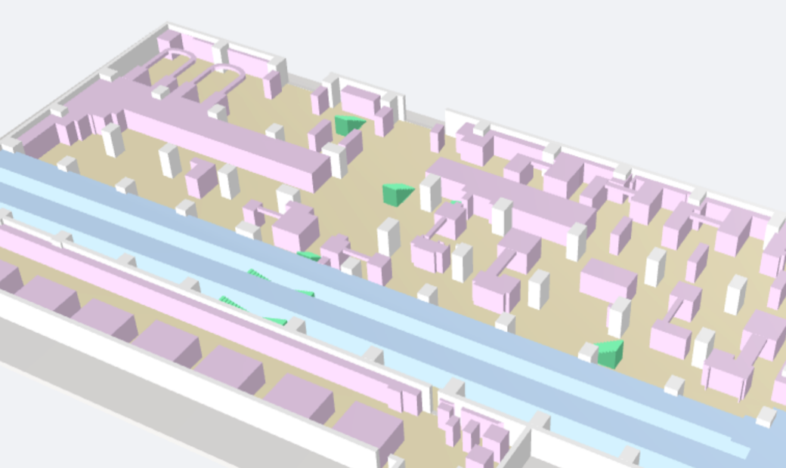
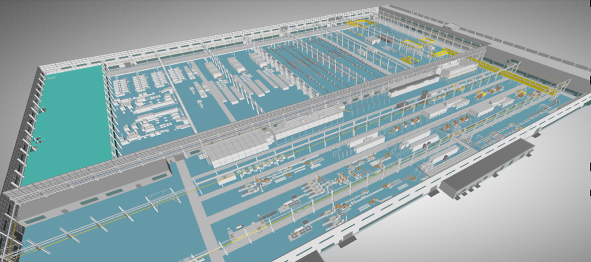
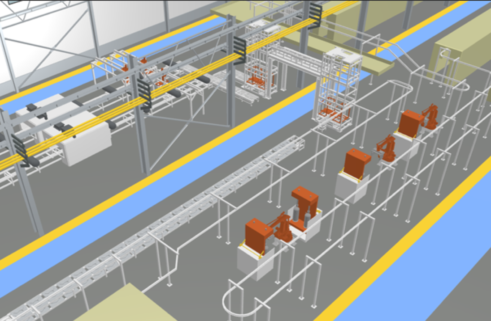

1. 概述
三维地图通过数据可视化、空间分析、数据管理三个部分，可提供各种复杂场景智能精细化管理，大大减少管理成本及各种不必要的人为失误。而5G时代的到来，也为三维GIS地图服务提供了更好的平台来实现个性化、创新性的地理信息服务。
- 对场景描绘更真实、精细：在地图上，查看人员、车辆的实时导航路线更清楚、直接；
- 是复杂场景管理的利器：管控作业车辆的违规行为，防范碰撞等危险事件，保障员工生命安全；
- 实现生产作业的精细化过程管理，收集作业过程的各种位置数据，精准分析，降本增效；
- 未来可升级为无人自动智能作业，具备时空大数据分析能力。
1. 扫图类型

<lark-table rows="3" cols="7" column-widths="104,104,104,104,104,104,104">

  <lark-tr>
    <lark-td>
      地图类型
    </lark-td>
    <lark-td>
      展示效果
    </lark-td>
    <lark-td>
      制作成本
    </lark-td>
    <lark-td>
      制作时间
    </lark-td>
    <lark-td>
      数据整合处理能力
    </lark-td>
    <lark-td>
      后期编辑修改难度
    </lark-td>
    <lark-td>
      支持跨平台运行
    </lark-td>
  </lark-tr>
  <lark-tr>
    <lark-td>
      精细3D
    </lark-td>
    <lark-td>
      最优
    </lark-td>
    <lark-td>
      高
    </lark-td>
    <lark-td>
      长
    </lark-td>
    <lark-td>
      一般
    </lark-td>
    <lark-td>
      难
    </lark-td>
    <lark-td>
      支持（设备要求较高）
    </lark-td>
  </lark-tr>
  <lark-tr>
    <lark-td>
      轻量化3D
    </lark-td>
    <lark-td>
      优
    </lark-td>
    <lark-td>
      低
    </lark-td>
    <lark-td>
      短
    </lark-td>
    <lark-td>
      强
    </lark-td>
    <lark-td>
      容易
    </lark-td>
    <lark-td>
      支持
    </lark-td>
  </lark-tr>
</lark-table>

## 模型精度要求
    项目方案按照甲方提供的效果图，平面CAD图纸制作，根据建模类型需求与提供采集材料保持一致。
**轻量化建模 **配色自定义，可以根据需求定制。扫描和建模精度平面误差需小于等于0.3m，高度精度误差小于等于0.5m。
**精细建模 **扫描和建模精度平面误差需小于等于0.1m，高度精度误差小于等于0.1m.
1. 模型精细度呈现
**轻量化模型：** 

**精细模型：**贴图纹理与效果图保持一致。
<grid cols="2">
  <column width="50">
    

  </column>
  <column width="50">
    

  </column>
</grid>

 
## 建模指标要求
模型构造要求（室内模型结构）
①  建筑物模型要求真实反映建模物体的外观细节，包括裙房底部结构符合现实建筑特征，在沿建模物体漫游时，能清晰观察到建模物体的结构特征，纹理保持建筑原有外观的完整性、美观性、统一性（不考虑因个人原因改装，随意搭建，封闭阳台而对建筑物造成的不统一）模型观感与原物体保持一致。
②  建筑立面重要的装饰（墙线）凹凸结构尺度依据标准规范指标按要求建模表现，突出门厅、进出口大门、门廊、建筑重要面室外扶梯、接地台阶依据标准规范指标按要求表现出结构，下穿结构需要建模表现。例如建筑的外观转角变化、阳台、门窗框架样式等造型。

