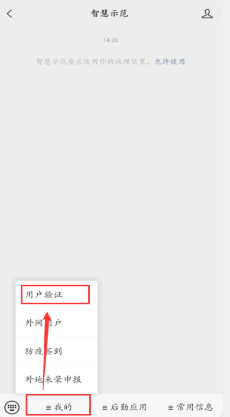
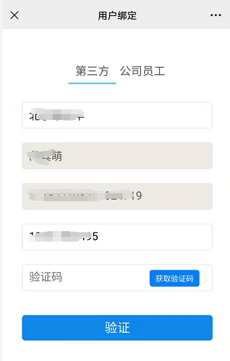
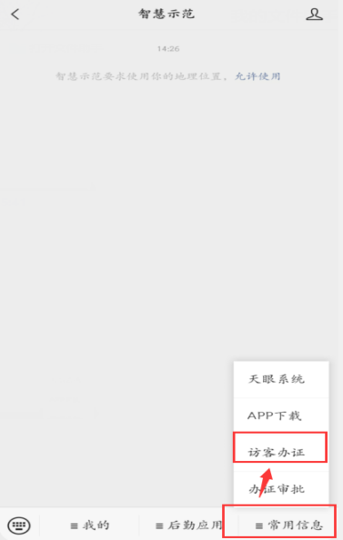
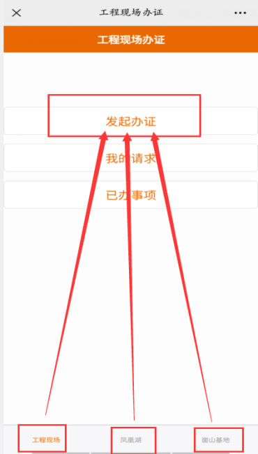
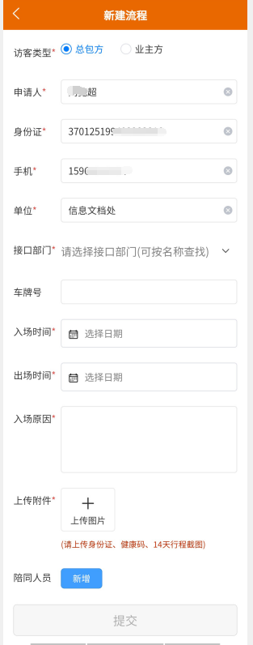
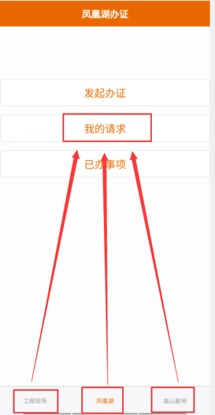
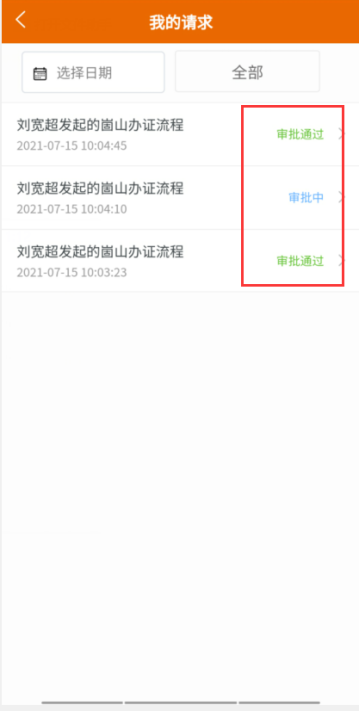
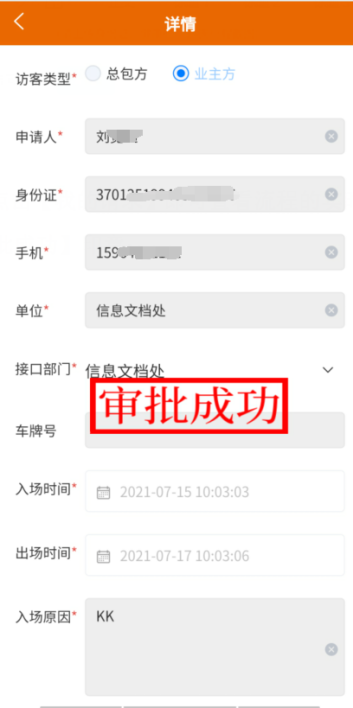
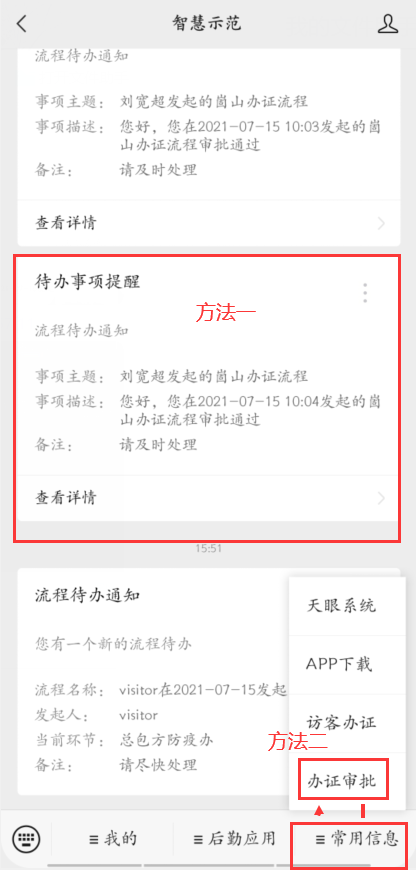
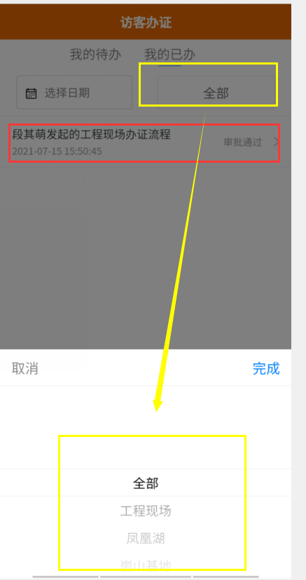

访客办证系统 {align="center"}
操作手册 {align="center"}

2021年7月 {align="center"}

1. **基本说明**
1. 流程发起主体为访客人员，可访客本人填写，也可一人填写多名陪同人员；
1. 流程发起后审批流程为:发起流程——接口处室联络员审核——处室负责人审批——安防处审批——生成审批戳印——访客持审批成功页面至门岗（1号岗：66847，6号岗：66846），接领人<text color="red">（所有正式员工都可执行接领人角色）</text>电话确认后通行；
1. 流程到达审批节点后，微信会收到提示（参照会议通知）；
1. 为避免恶意发送流程，每个微信账号24小时内最多发起<text color="red">3次</text>申请流程；
1. 该流程仅替换疫情访客申请纸质流程，进入工程现场访客仍然执行微信流程后截屏发送内网工程现场通行证申请流程；

1. **关注微信公众号“智慧示范”**
1. 搜索微信公众号【智慧示范】，关注后点击【我的】，选择【用户验证】；

1. 填写相关信息后，进行手机验证，<text color="red">选择“第三方”</text>；

1. **访客办证申请**
1. 打开微信公众号【智慧示范】，点击【常用信息】，选择【访客办证】；

1. 根据实际情况选择【工程现场】【凤凰湖】【崮山基地】所需要进入的区域，点击【发起办证】；

1. 按实际情况填写相关信息点击【提交】即可；
1. 访客类型：总包方(<text color="red">选此项</text>)、业主方；
1. 申请人、身份证号、手机号、单位为自动获取；
1. 接口部门根据实际情况进行选择(<text color="red">接口部门上海院，接口人郑姗姗</text>)；
1. 填写入场时间、出场时间、入场原因、<text bgcolor="yellow">车牌号（车入场需填写）、</text>上传图片(1、身份证正反面；2、健康码；3、近14天行程截图；<text color="red">4、荣成2次核酸报告，间隔24小时</text>)；
1. 如有陪同人员，点击【陪同人员】进行信息的填写；

1. 已提交的流程，点击【我的请求】即可查看流程的实时状态；审批通过的申请详情，会有【审批成功】印章；
<grid cols="3">
  <column width="33">
    

  </column>
  <column width="33">
    

  </column>
  <column width="33">
    

  </column>
</grid>

1. **办证审批**
1. 打开微信公众号【智慧示范】，点击【常用信息】，选择【办证审批】； 也可以通过微信公众号推送的待办，直接打开待审批的申请单；

1.  方法二会默认打开全部现场的申请单，可通过点击【全部】按钮，进行现场的选择审批；

1.  【我的待办】展示当前用户需要审批的所有申请单；
1.  【我的已办】展示当前用户审批过的所有申请单。
