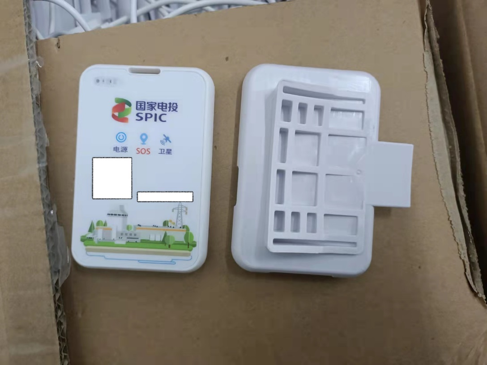
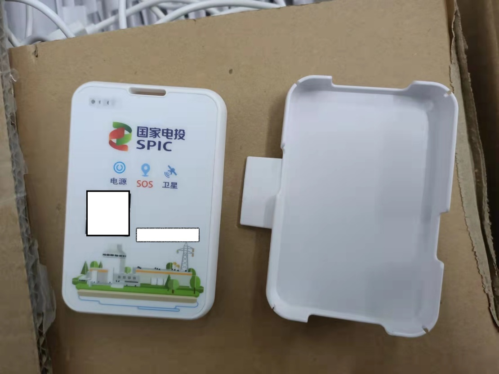

**定位卡技术要求**

定位卡技术要求

+:------------:+:----------------------------------------------------------------------------:+:--------:+
| **项目名称** | **具体配置信息**                                                             | **数量** |
+--------------+------------------------------------------------------------------------------+----------+
| 有源定位卡   | 支持协议：Bluetooth BLE 4.2或以上，苹果公司标准iBeacon协议，Ble私有协议；    | 1000     |
|              |                                                                              |          |
|              | 供电方式：3000mAh 防爆可充电锂电池；                                         |          |
|              |                                                                              |          |
|              | 充电方式：Type-c充电；充电规格5V/1A                                          |          |
|              | ；充电时间\<=2.5小时，内置过压(电压范围5\~24V)、过流、过温、防反接保护电路； |          |
|              |                                                                              |          |
|              | 外形尺寸:\<= 96mmx63mmx10mm (LxWxH)                                          |          |
|              |                                                                              |          |
|              | 重量:\<=80克                                                                 |          |
|              |                                                                              |          |
|              | 版本升级：OTA升级， JLink升级                                                |          |
|              |                                                                              |          |
|              | 通信距离:\>=300m;                                                            |          |
|              |                                                                              |          |
|              | 运动检测：内置运动传感器，支持动静判断、静止告警（可配置）;                  |          |
|              |                                                                              |          |
|              | 卫星:采用支持北斗 B1、GPS L1多频多模芯片;                                    |          |
|              |                                                                              |          |
|              | 连续工作时长:\>=80h;                                                         |          |
|              |                                                                              |          |
|              | 通讯技术:LPWAN技术， LoraWAN（470频段）;                                     |          |
|              |                                                                              |          |
|              | 佩戴方式：与现有安全帽有机结合，不易脱落，且不改变现有安全帽结构；           |          |
|              |                                                                              |          |
|              | 主要功能:远距离通信，低功耗等。                                              |          |
+--------------+------------------------------------------------------------------------------+----------+

前期产品样式：

