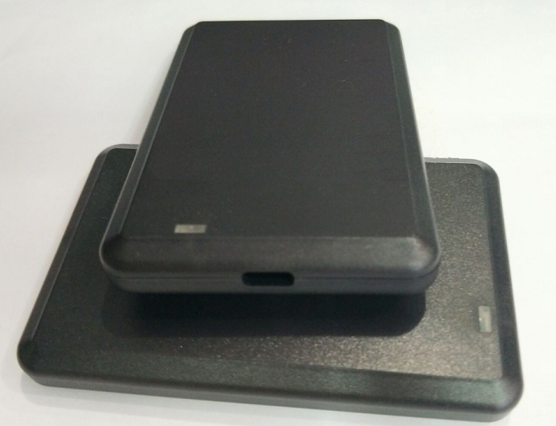

**定位卡设计方案** {align="center"}

**设计公司：**<text underline="true">**          **</text> {align="center"}
<text underline="true">**   2022   **</text>**年**<text underline="true">**   05   **</text>**月**<text underline="true">**   15   **</text>**日**

# 目录 {align="center"}
一、系统介绍4
二、需求4
三、系统框图5
四、硬件选型和嵌入式开发5
1.蓝牙芯片选型（泰凌微电子8258）5
2.LORA芯片选型（SX1268）6
3.GNSS芯片选型（L76K）6
4.外壳（尺寸96*61*10mm）6
5.嵌入式开发7
五、项目开发计划7

#  {align="center"}
##### 版本历史

<lark-table rows="7" cols="4" column-widths="182,182,182,182">

  <lark-tr>
    <lark-td>
      **版本号** {align="center"}
    </lark-td>
    <lark-td>
      **时间** {align="center"}
    </lark-td>
    <lark-td>
      **负责人** {align="center"}
    </lark-td>
    <lark-td>
      **修改内容** {align="center"}
    </lark-td>
  </lark-tr>
  <lark-tr>
    <lark-td>
      1.0 {align="center"}
    </lark-td>
    <lark-td>
      2022.05.01 {align="center"}
    </lark-td>
    <lark-td>
      伍峥 {align="center"}
    </lark-td>
    <lark-td>
      初版方案设计 {align="center"}
    </lark-td>
  </lark-tr>
  <lark-tr>
    <lark-td>
      1.1 {align="center"}
    </lark-td>
    <lark-td>
      2022.05.15 {align="center"}
    </lark-td>
    <lark-td>
      伍峥 {align="center"}
    </lark-td>
    <lark-td>
      添加芯片选型 {align="center"}
    </lark-td>
  </lark-tr>
  <lark-tr>
    <lark-td>
      1.2 {align="center"}
    </lark-td>
    <lark-td>
      2022.05.31 {align="center"}
    </lark-td>
    <lark-td>
      伍峥 {align="center"}
    </lark-td>
    <lark-td>
      添加基础功能 {align="center"}
    </lark-td>
  </lark-tr>
  <lark-tr>
    <lark-td>
    </lark-td>
    <lark-td>
    </lark-td>
    <lark-td>
    </lark-td>
    <lark-td>
    </lark-td>
  </lark-tr>
  <lark-tr>
    <lark-td>
    </lark-td>
    <lark-td>
    </lark-td>
    <lark-td>
    </lark-td>
    <lark-td>
    </lark-td>
  </lark-tr>
  <lark-tr>
    <lark-td>
    </lark-td>
    <lark-td>
    </lark-td>
    <lark-td>
    </lark-td>
    <lark-td>
    </lark-td>
  </lark-tr>
</lark-table>

# 系统介绍 {align="center"}
本系统以蓝牙芯片为主控，包含Lora模块与天线，GPS/北斗模块与天线，USB-C充电模块，运动传感器，3000mah电池，led灯，外壳。
# 需求 {align="center"}

<lark-table rows="1" cols="1" column-widths="730">

  <lark-tr>
    <lark-td>
      - 支持协议：Bluetooth BLE 4.2或以上，苹果公司标准iBeacon协议，Ble私有协议；
      - 供电方式：3000mAh 防爆可充电锂电池；
      - 充电方式：Type-c充电；充电规格5V/1A ；充电时间<=2.5小时，内置过压(电压范围5~24V)、过流、过温、防反接保护电路；
      - 外形尺寸:<= 96mmx63mmx10mm (LxWxH)
      - 重量:<=80克
      - 版本升级：OTA升级， JLink升级
      - 通信距离:>=300m;
      - 运动检测：内置运动传感器，支持动静判断、静止告警（可配置）;
      - 卫星:采用支持北斗 B1、GPS L1多频多模芯片;
      - 连续工作时长:>=80h;
      - 通讯技术:LPWAN技术， LoraWAN（470频段）;
      - 佩戴方式：与现有安全帽有机结合，不易脱落，且不改变现有安全帽结构；
      - 主要功能:远距离通信，低功耗等;
    </lark-td>
  </lark-tr>
</lark-table>

1. 支持蓝牙AoA高精度定位
1. 支持苹果iBeacon格式
1. 支持北斗B1，GPSL1
1. 外形尺寸:<= 96mmx63mmx10mm (LxWxH)
1. 供电USB-C
1. 支持OTA升级，JLink升级
1. 充电时间小于2.5h，内置过压(电压范围5~24V)、过流、过温、防反接保护电路
1. 连续工作时长:>=80h;
1. 通讯技术:LPWAN技术， LoraWAN（470频段）;
1. 佩戴方式：与现有安全帽有机结合，不易脱落，且不改变现有安全帽结构；
1. 主要功能:远距离通信，低功耗

# 系统框图 {align="center"}

Lora模组 {align="center"}
蓝牙主控 {align="center"}
北斗/GPS模组 {align="center"}
LED灯，按键外设
运动监测 {align="center"}

# 硬件选型和嵌入式开发 {align="center"}
## 蓝牙芯片选型（泰凌微电子8258）
1. Nordic nrf52832
- 优点：国际一线大厂，生态完善，性能稳定强大。
- 缺点：近期供货难度增大，价格相较以前翻了3倍。
1. 泰凌微电子
- 优点：国产芯片，价格实惠，供货稳定，功能强大
- 选择泰凌微电子8258系列芯片与开发套件
- 支持标准：BLE 5.0, multi-antenna AoA/AoD, BLE Mesh, 802.15.4, Zigbee 3.0, RF4CE, HomeKit, Dual-Mode, 2.4G Proprietary
## LORA芯片选型（SX1268）
1. 基于SX1268的模组
- 优点：国产模组，SPI接口，LORA扩频，远距离，低功耗，高灵敏度，贴片型
## GNSS芯片选型（L76K）
1. L76K
- 支持多卫星系统（北斗，GPS，GLONASS，QZSS），支持AGPS，超小尺寸
- 国产，供货充足
## 外壳（尺寸96*61*10mm）

## 嵌入式开发
1. 通过主控芯片，从蓝牙扫描iBeacon并通过Lora上传结果。
1. 通过主控芯片，广播蓝牙AoA定位帧。
1. 通过主控芯片，读取GNSS定位结果，并通过Lora回传系统。
1. 通过主控芯片，读取按键状态、电池状态，并通过Lora回传系统
# 项目开发计划 {align="center"}
针对本次技术服务项目，在合同签订后，我方计划在3个月内完成相应工作。实行分阶段进度控制，加强软件质量管理，保障项目按时完成。项目计划如下图所示：

<lark-table rows="6" cols="4" column-widths="182,182,182,182">

  <lark-tr>
    <lark-td>
      计划安排
    </lark-td>
    <lark-td>
      第1个月
    </lark-td>
    <lark-td>
      第2个月
    </lark-td>
    <lark-td>
      第3个月
    </lark-td>
  </lark-tr>
  <lark-tr>
    <lark-td>
      需求分析
    </lark-td>
    <lark-td>
    </lark-td>
    <lark-td>
    </lark-td>
    <lark-td>
    </lark-td>
  </lark-tr>
  <lark-tr>
    <lark-td>
      产品设计
    </lark-td>
    <lark-td>
    </lark-td>
    <lark-td>
    </lark-td>
    <lark-td>
    </lark-td>
  </lark-tr>
  <lark-tr>
    <lark-td>
      产品开发
    </lark-td>
    <lark-td>
    </lark-td>
    <lark-td>
    </lark-td>
    <lark-td>
    </lark-td>
  </lark-tr>
  <lark-tr>
    <lark-td>
      测试
    </lark-td>
    <lark-td>
    </lark-td>
    <lark-td>
    </lark-td>
    <lark-td>
    </lark-td>
  </lark-tr>
  <lark-tr>
    <lark-td>
      验收
    </lark-td>
    <lark-td>
    </lark-td>
    <lark-td>
    </lark-td>
    <lark-td>
    </lark-td>
  </lark-tr>
</lark-table>

