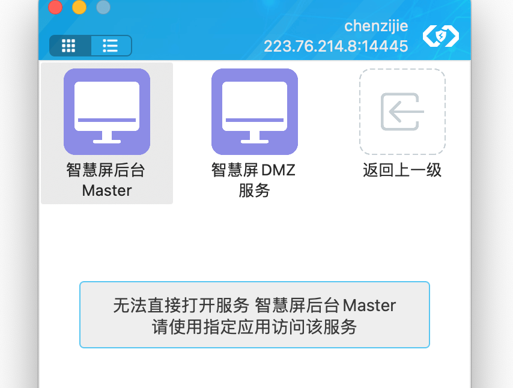
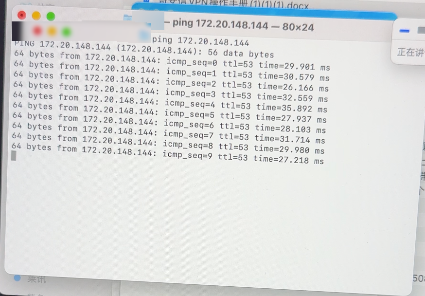
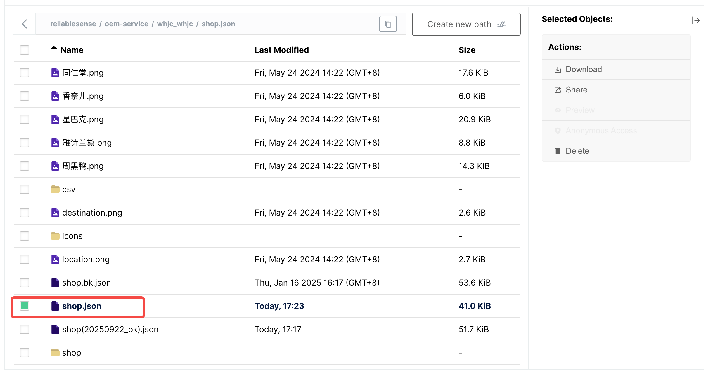

# **安装VPN软件：**
- 填写端口（按手册填写）
- 账户密码：chenzijie/Czj@123456
<view type="2">

  <file token="HFNsbWmcBo1IUGx39Aycrjy3nJc" name="奇安信VPN操作手册.docx"/>

</view>

# **测试是否收到数据**


- 截图属于正常情况
- 打开终端（Mac系统）：输入
```plaintext
ping 172.20.148.144
```

- 如显示如下图，说明已经收到数据


# **开始连接**
在终端输入
```plaintext {wrap}
ssh root@172.20.148.144 -L 0.0.0.0:80:localhost:80 -L 0.0.0.0:32010:localhost:32010 -L 0.0.0.0:32310:localhost:32310 -L 0.0.0.0:31020:localhost:31020 -L 0.0.0.0:32380:localhost:32380 -L 0.0.0.0:31030:localhost:31030
```

输入密码：
```plaintext {wrap}
ybygxmp199945@A
```

# **从浏览器登录前端**
## 综合平台地址:http://localhost/
          账户/密码：testa/123456
## 大屏地址：http://localhost/information
# **修改商铺json**
## json地址：minio→reliablesense / oem-service / whjc_whjc / shop.json
minio
[*localhost:32380*](http%3A%2F%2Flocalhost%3A32380%2F)
admin
GYrJQmzm0Z9FFNEVBKWJ
## json文件


<text color="red">*注意：备份文件，再更新.</text>

