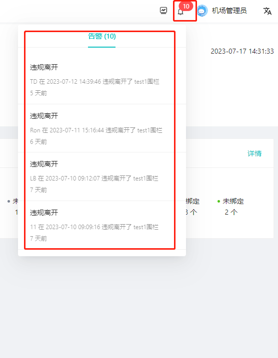
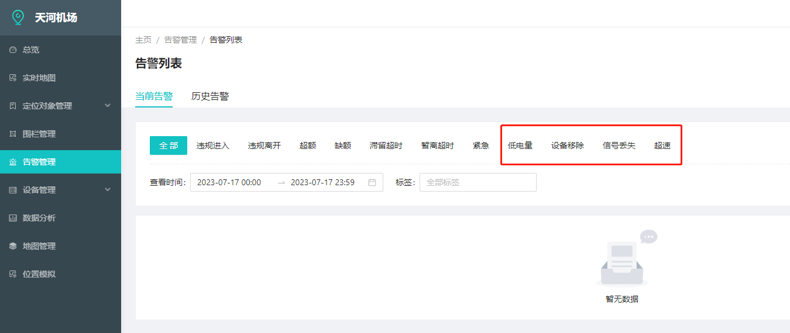
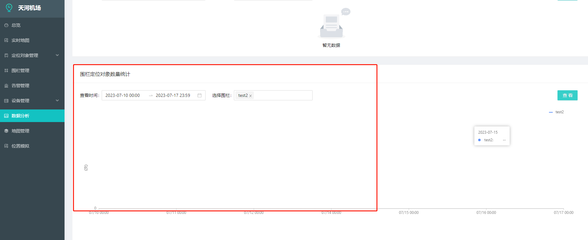

1、消息告警提醒，如何关闭，例如：已读或已处理

2、告警列表：部分用不到的字段隐藏

3、围栏定位对象数量统计无数据

4、盈商云服对接：
1）蓝牙信标增删改查接口
2）蓝牙信标总数接口
3）巡检记录查询接口
4）蓝牙类别增删改查接口
5）图片查询的接口
6）根据信标信号强度排序
7）图纸发给盈商添加
5、集成对接航班数据
6、人脸、身份证、登机牌登录验证，刘工在沟通。
7、客服
语音客服正在对接测试
文字客服目前用微信的，后面需要和业主沟通对接公众号客服
8、WiFi
后面集成会提供多个WiFi账号密码，随机在智慧屏显示
9、gis对接
可以拿到模型，需要对接我们系统
10、对接信标
t2凌久高科
t3信标
11、智慧屏二维码
安卓可以扫出来小程序，iOS扫不出来。
12、智慧屏输入法样式美化一下

