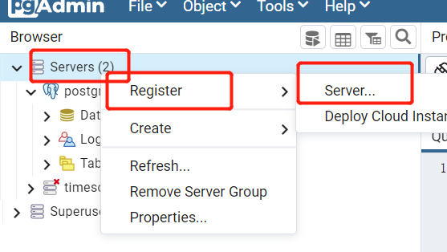
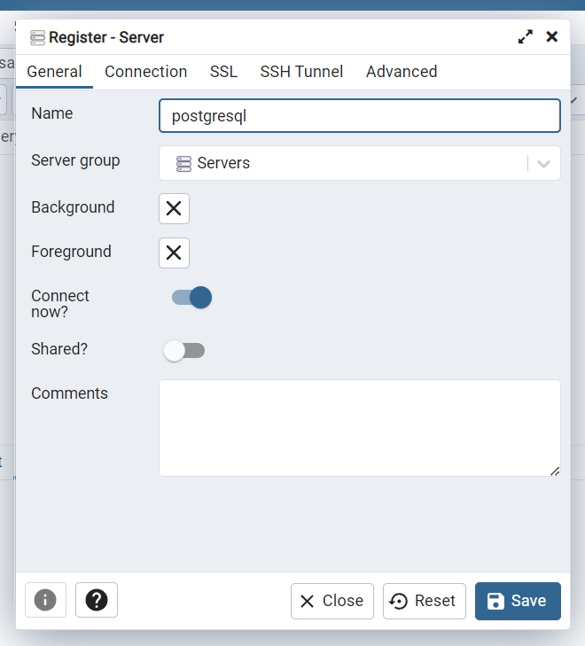
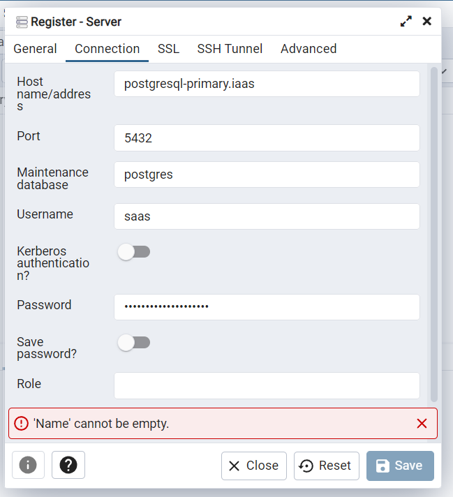
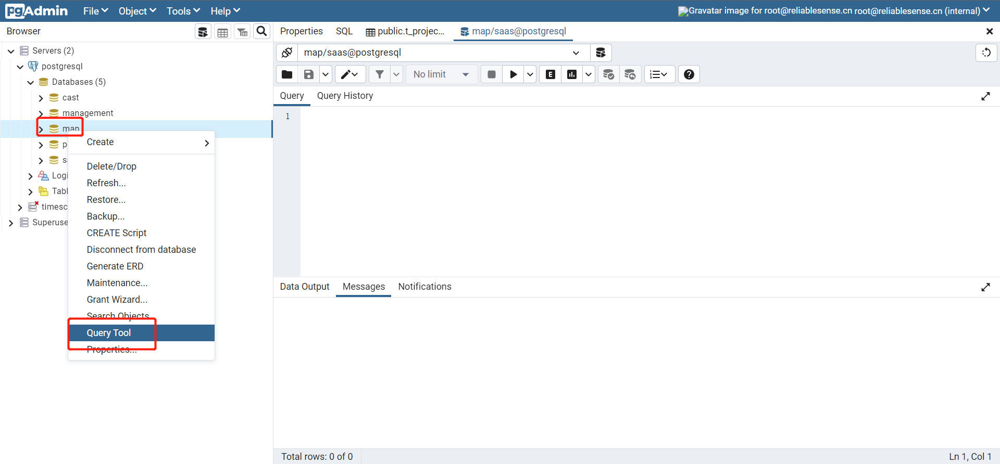
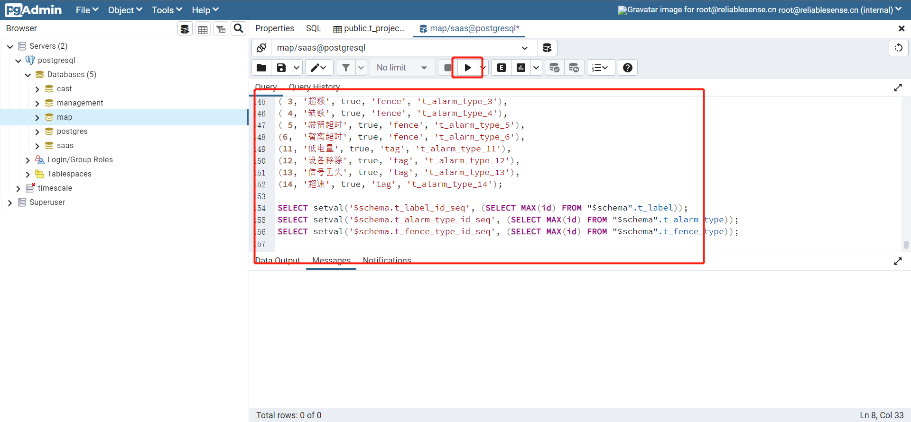

# 通过 堡垒机 和 xftp 远程连接导航服务器sftp服务，传输文件
1. 在浏览器上打开堡垒机页面 `10.16.68.92`
1. 输入堡垒机IP地址 `10.16.68.92` 并连接
1. 输入用户名及密码，二次验证密码：用户密码+空格+手机APP中6位随机码
1. 页面里找到 `10.16.15.243` 导航服务器，选中xftp图标，右键选择登录用户 `any`
1. 弹出的输入框内输入账号 `root` 和密码 `QS@2022@cnnp`
1. 等待连接成功，这里要稍微等一段时间
1. 连接成功后，左边为本机目录接口，右边为服务器接口
1. 左边目录找到更新文件 `platform-update.tar`，拖拽到右边 `/root` 目录下，等待传输完成

# 使用堡垒机 和  putty 远程登录导航服务器
1. 启动 putty 软件
1. 输入堡垒机IP地址 `10.16.68.92` 并连接
1. 输入用户名及密码，密码用户密码+空格+6位随机码
1. 登录导航服务器
```shell
ssh root@10.16.15.243
（当前本机为10.16.15.243，若需要使用本机作为跳板则需要输入
ssh root@10.16.15.XXX）
回车后输入以下密码 QS@2022@cnnp (输入内容不会显示出来)
```

1. 输入以下指令，更新程序
```shell
cd /root
tar xvf platform-update.tar
cd platform-update
chmod 744 script.sh
./script.sh
```

1. 更新完毕，可以截图进行确认
# 更新数据库
1. 通过浏览器打开[http://10.16.15.243:32010](http%3A%2F%2F10.16.15.243%3A32010) pgadmin数据库登录页面
1. 登录账号 [root@example.com](mailto%3Aroot%40example.com) / 81yJBSYXOvJwpeZanbRa
1. 查看是否有“postgresql”。如没有：则右键点击Servers--Register--server，弹出新建页


在General页输入name：postgresql，Server group选择servers


在Connection页输入
Host name/address：postgresql-primary.iaas
Port：5432
Username：saas
Password：9XAdNt6DPZ2Rn1dMNaeV


1. 通过右键点击数据库的查询工具。例：右键点击map--Query Tool


1. 打开查询工具后复制sql文件夹内 .sql 的内容到右侧工具内，点击执行。


1. 更新sql完毕，可以每次执行后截图进行确认
