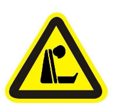
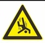
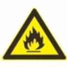
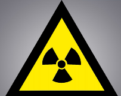

<lark-table rows="9" cols="3" column-widths="243,243,243">

  <lark-tr>
    <lark-td>
      **风险类型清单** {align="center"}
    </lark-td>
    <lark-td>
      **图标** {align="center"}
    </lark-td>
    <lark-td>
      **相关设备示例** {align="center"}
    </lark-td>
  </lark-tr>
  <lark-tr>
    <lark-td>
      SPV相关 {align="center"}
    </lark-td>
    <lark-td>
    </lark-td>
    <lark-td>
      1-5434-MCC30-2RM（2#生活水泵 （1-7151-PM4002））
      1-7151-P4002（2#生活水泵（生产用））
    </lark-td>
  </lark-tr>
  <lark-tr>
    <lark-td>
      环保敏感 {align="center"}
    </lark-td>
    <lark-td>
      
    </lark-td>
    <lark-td>
      1-67166-PSV6131（1#反渗透酸泵安全阀）
      1-7164-V6784（PH调整酸泵入口母管疏液阀）
    </lark-td>
  </lark-tr>
  <lark-tr>
    <lark-td>
      危化品风险 {align="center"}
    </lark-td>
    <lark-td>
    </lark-td>
    <lark-td>
      1-7164-P6021（1#PH调整酸泵）
      1-7162-V8005（1#混床再生进酸管放空阀）
      1-67166-PSV6131（1#反渗透酸泵安全阀）
      **注：PSV6131既是环保敏感又是危化品，测试多重标签图标并列**
    </lark-td>
  </lark-tr>
  <lark-tr>
    <lark-td>
      中毒和窒息 {align="center"}
    </lark-td>
    <lark-td>
      
    </lark-td>
    <lark-td>
      1-7164-V6732（2#除氨碱泵入口阀）
      1-7161-P6005（2#污泥循环泵）
    </lark-td>
  </lark-tr>
  <lark-tr>
    <lark-td>
      高空 {align="center"}
    </lark-td>
    <lark-td>
      
    </lark-td>
    <lark-td>
      1-7161-MX6029（1#澄清池搅拌机）
      1-7161-V4625（1#生活水箱放空阀）
      1-7166-V6709（清洗液输送出口阀）
    </lark-td>
  </lark-tr>
  <lark-tr>
    <lark-td>
      火灾 {align="center"}
    </lark-td>
    <lark-td>
      
    </lark-td>
    <lark-td>
      1-7161-BM6019（过滤器擦洗风机电机）
      1-71510-PI-4302（2# 生活水泵出口压力表）
    </lark-td>
  </lark-tr>
  <lark-tr>
    <lark-td>
      1级辐射工作 {align="center"}
    </lark-td>
    <lark-td>
      
    </lark-td>
    <lark-td>
      1-7151-P8005（5#生活水泵）
      示例说明文字：工单2020060001：5#生活水泵1-7151-P8005解体检修，存在高辐射风险，无关人员请勿靠近。
    </lark-td>
  </lark-tr>
  <lark-tr>
    <lark-td>
      工业安全二级工作 {align="center"}
    </lark-td>
    <lark-td>
    </lark-td>
    <lark-td>
      1-7164-P6010(2#除铁碱泵)
      示例说明文字：工单2020060002：1-7164-P60102#除铁碱泵更换填料密封，存在高空坠落风险，请严格遵守工业安全规定。
    </lark-td>
  </lark-tr>
</lark-table>

<text color="gray">**SPV**</text> {align="center"}
<text color="gray">**ISP2**</text> {align="center"}
