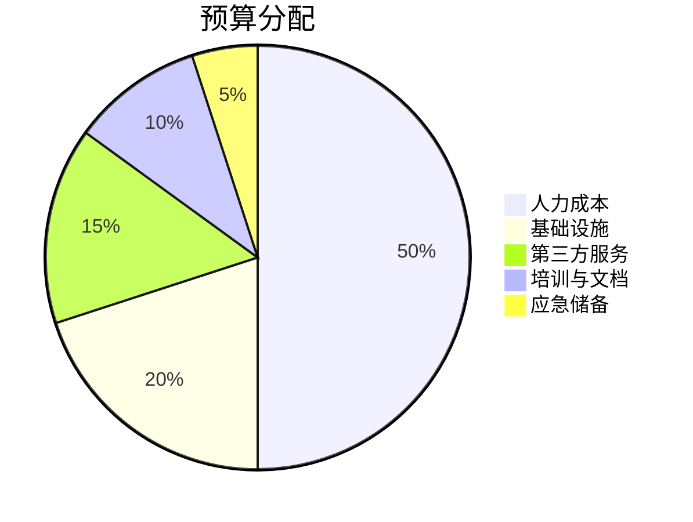
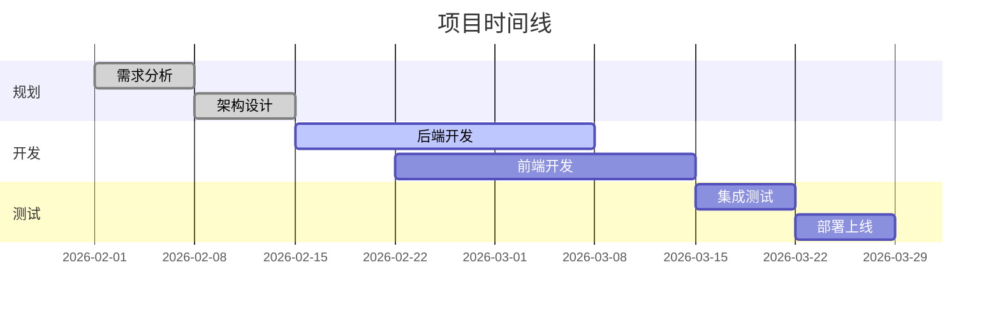

# 项目计划

## 项目概述

本项目旨在开发一个创新的解决方案，提升团队工作效率。

> [!important] 重要里程碑
> 第一阶段交付日期：==2026-03-15==

## 项目目标

- 提高工作效率 30%
- 降低运营成本
- 改善用户体验
- 建立可扩展的架构

## 任务清单

### 第一阶段：规划与设计

- [x] 需求分析
- [x] 技术选型
- [x] 架构设计
- [ ] 原型设计
  - [x] 低保真原型
  - [ ] 高保真原型
- [ ] 设计评审

### 第二阶段：开发实施

- [ ] 后端开发
  - [ ] API 设计
  - [ ] 数据库设计
  - [ ] 核心功能实现
- [ ] 前端开发
  - [ ] UI 组件开发
  - [ ] 页面集成
  - [ ] 响应式适配
- [ ] 集成测试

### 第三阶段：测试与部署

- [ ] 功能测试
- [ ] 性能测试
- [ ] 安全审计
- [ ] 生产环境部署
- [ ] 用户培训

## 团队成员

| 角色 | 姓名 | 职责 |
|------|------|------|
| 项目经理 | [[张三]] | 整体协调与进度管理 |
| 技术负责人 | [[李四]] | 技术架构与代码审查 |
| 前端开发 | [[王五]] | 前端功能实现 |
| 后端开发 | [[赵六]] | 后端服务开发 |
| 测试工程师 | [[钱七]] | 质量保证与测试 |

## 技术栈

> [!note] 技术选型
> 基于团队技能和项目需求，我们选择了以下技术栈。

- **前端**: React + TypeScript
- **后端**: Node.js + Express
- **数据库**: PostgreSQL
- **部署**: Docker + Kubernetes
- **CI/CD**: GitHub Actions

## 风险管理

> [!warning] 潜在风险
> 以下是识别出的主要风险点，需要持续关注。

1. **技术风险**
   - 新技术学习曲线
   - 第三方依赖稳定性
   
2. **进度风险**
   - 需求变更可能导致延期
   - 资源不足影响交付

3. **质量风险**
   - 测试覆盖不足
   - 性能瓶颈

## 预算分配

## 时间线

## 会议记录

- [[会议记录 2026-02-10|项目启动会]]
- [[会议记录 2026-02-17|技术评审会]]
- [[会议记录 2026-02-24|周例会]]

## 相关文档

- ![[技术架构文档#系统架构]]
- [[需求规格说明书]]
- [[API 接口文档]]
- [[部署指南]]

## 关键指标 (KPI)

| 指标 | 目标值 | 当前值 | 状态 |
|------|--------|--------|------|
| 任务完成率 | 100% | 45% | 🟡 进行中 |
| 代码覆盖率 | >80% | 65% | 🟡 待提升 |
| 性能响应时间 | <200ms | - | ⚪ 未测试 |
| 用户满意度 | >4.5/5 | - | ⚪ 未评估 |

## 下一步行动

> [!todo] 本周待办
> - [ ] 完成高保真原型设计
> - [ ] 搭建开发环境
> - [ ] 编写 API 接口文档
> - [ ] 组织技术分享会

## 参考资料

查看项目管理最佳实践[^1]和敏捷开发方法论[^2]。

[^1]: 项目管理协会 (PMI) 指南
[^2]: Scrum 敏捷开发框架

## 备注

%%
内部笔记：
- 需要与客户确认最终需求
- 考虑增加自动化测试覆盖
- 预留时间处理技术债务
%%

---

**最后更新**: 2026-02-24  
**下次评审**: 2026-03-01
